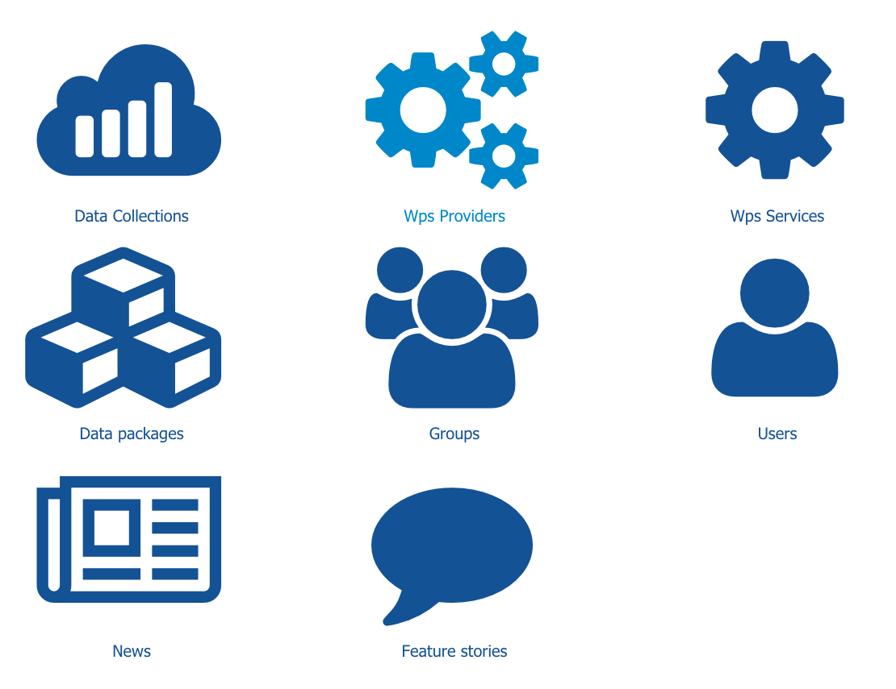

Control Panel
=============

| Access to the control panel is done by clicking on |settings| on the homepage (close to the user name).
| This is visible and accessible only to a user with administrator privileges.

The control panel gives access to the administrator to the following pages:

- :doc:`Data Collections management <data>`
- :doc:`Wps Providers management <wps_provider>`
- :doc:`Wps Services management <wps_service>`
- :doc:`Feature Stories management <feature>`
- :doc:`Groups management <group>`
- :doc:`Users management <user>`

