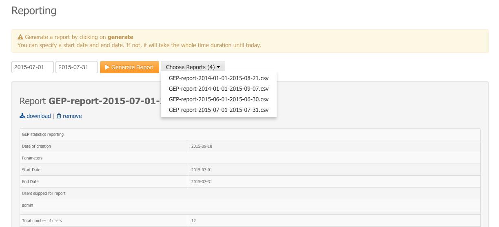

Reporting
=========

| The Reporting page gives the possibility to the Administrator to create a new report file about the platform usage or to access existing ones.
| The Administrator can select a Start date and a End date. Thus, statistics present in the report will be only concerning usage between these dates.

Create a new report
-------------------

To create a new report:

1. Select a start date (e.g 2015-06-01).
2. Select a end date (e.g 2015-06-30).
3. Click on *Generate Report*.
4. A report named **GEP-report-<start date>-<end date>.csv** is created and saved on the server.
5. The report is displayed on the page and added to the list of existing reports.

.. note:: If you don't select any date, it will create a report from 2014-01-01 until the current date.

.. warning:: If you select dates corresponding to an existing report, the older one will be replaced.

Select an existing report
-------------------------

To select an existing report:

1. Click on **Choose Report (x)** to display the drop-down list of existing reports (x being the number of existing reports).
2. Click on a report name.
3. The report is displayed on the page.

Download a report
-----------------

To download an existing report (csv format):

1. Load the report ( see `Create a new report`_ or `Select an existing report`_).
2. Click on **download**.
3. The report will be downloaded to your workspace (csv format).

Remove a report
---------------

To remove an existing report from the server:

1. Load the report ( see `Create a new report`_ or `Select an existing report`_).
2. Click on **remove**.
3. The report will be deleted from the server and removed from the list of existing reports.

Information present in the report
---------------------------------

The following information are present on the *Usage analytics* report:

- Main parameters of the report
    - Date of creation
    - Start date | End date
    - List of users not used for the statistics (e.g administrator users).

.. note:: *This list is configurable by a database administrator only directly on the database for now.*

- Usage analytics (between <start date> and <end date>)
    - Total number of users of the platform
    - Users who signed in for the first time, with:
        - Username
        - Organization
        - First login date
        - Has already cloud access or not
    - Active users (logged more than once), with:
        - Username
        - Number of logins
    - Wps jobs created **ordered by user name**, with:
        - Username
        - Wpsjob name
        - Wpsjob creation date
        - Process name
        - Has been shared or not
    - Wps jobs created **ordered by date**, with:
        - Username
        - Wpsjob name
        - Wpsjob creation date
        - Process name
        - Has been shared or not
    - Number of wpsjob created per user
    - Number of wpsjob created per group
    - Number of wpsjob created per service
    - Data packages created, with:
        - Username
        - Data package name
        - Data package creation date
        - Has been shared or not
    - Number of Data packages created per user
    - Number of Data packages created per group

