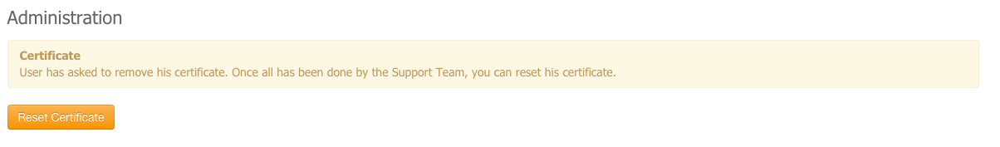

Users management
================

| The users management page contains a list of all users with main information on each user.
| More details about the users can be accessed by cliking on the username of the user.

User detailed view contains two parts:

- generic information about the user
- administrator information about the user (mainly list of task that the administrator can do for this user)

Certificate removal
-------------------

| When a user has done a certificate removal request, the *Terradue Support Team* needs to perform some manual tasks.
| Once they are done, an administrator should reset the user certificate and warn the user.
| This is done from this page, by clicking on **Reset Certificate**. An email will be automatically sent to the user.

