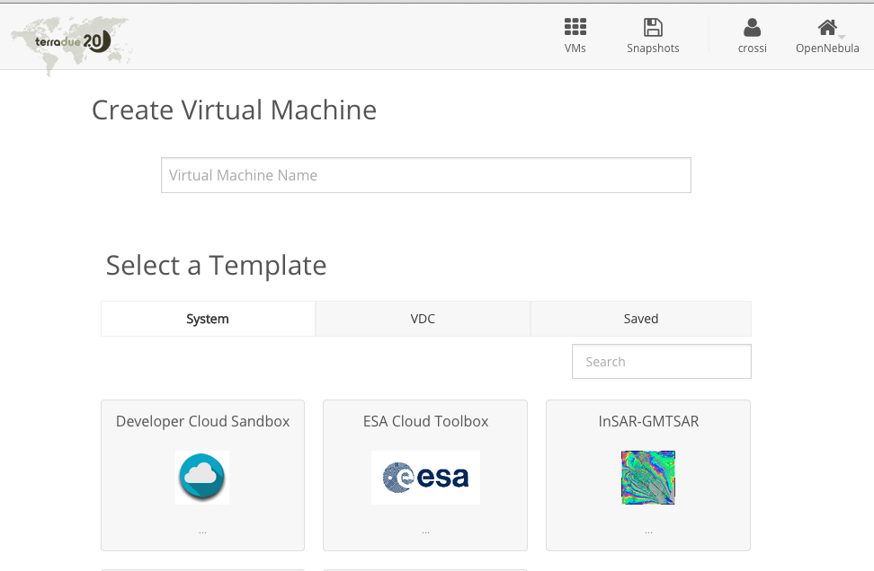

Start working with Developer Cloud Sandbox
------------------------------------------

The Developer Cloud Sandbox is a Virtual Machine (VM) that provides scientific developers with an Exploitation Platform-as-a-Service (PaaS). It consists of a development environment for processor integration and testing, and a framework for Cloud provisioning.
The Developer Cloud Sandbox PaaS allows you to plug scientific applications written in a variety of languages (e.g. Java, C++, IDL, Python, R), then deploy, automate, manage and scale them in a very modular way. The algorithm integration is performed from within a dedicated Virtual Machine, running initially as a simulation environment (sandbox mode) that can readily scale to production (cluster mode). Accessed from an harmonized Shell environment, support tools also facilitate the data access and workflow management tasks.

The `Getting Started Guide <http://docs.terradue.com/developer-sandbox/start/index.html>`_ will drive you step by step through the use of your Sandbox from access to a Laboratory to the Sandbox remote use.

Create a Developer Cloud Sandbox
^^^^^^^^^^^^^^^^^^^^^^^^^^^^^^^^

.. warning:: 

  Be sure to have perfomed the previous steps of this guide to provision properly your sandbox.

To create your own Developer Cloud Toolbox:

- Access the Cloud Dashboard at `https://cloud.terradue.com <https://cloud.terradue.com>`_.`
- Click on |plus.png| to create a new Developer Cloud Sandbox
- Type the Developer Cloud Sandbox name
- Select the **Developer Cloud Sandbox** template

- Click on **Create**
- Wait for the Developer Cloud Sandbox to be deployed

.. figure:: assets/sandbox_deploy.png
	:figclass: align-center
        :width: 600px
        :align: center
        :alt: alternate text

- Annotate the *<sandbox ip>* value:

.. figure:: assets/sandbox_ip.png
	:figclass: align-center
        :align: center
        :alt: alternate text

Integrate your processor
^^^^^^^^^^^^^^^^^^^^^^^^

For this part, you will use the `Developer Cloud Sandbox’s documentation <http://docs.terradue.com/developer-sandbox/>`_.
We encourage you to follow the different guides, especially the **Getting Started Guide** and the **Developer’s Quick start** of this documentation to have a comprehensive understanding of the development environement

.. note:: 

  Please discard the prerequisites listed in the `Developer Cloud Sandbox’s documentation <http://docs.terradue.com/developer-sandbox/>`_. If you achieved the previous steps of this guide sucessfully, you have all the elements to move forwrd with your sandbox and you processor integration.

