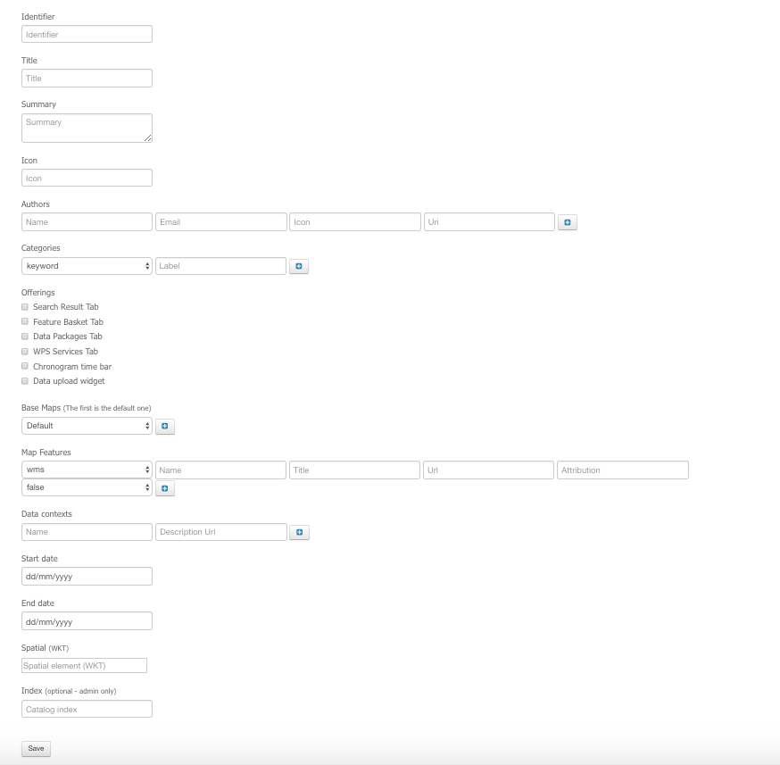

.. _mydata_app:

My Thematic Apps
----------------

From the thematic app page, the user (specific users only) has also the ability to create its own Thematic App, clicking on **+ Create new** on the top right of the applications list.

The user can:
	
	- load an existing thematic app, providing his url (in atom format)
	- create a new thematic app from scratch

Finally the user can save this thematic application in his private catalogue index.

.. NOTE: 
	Administrator can select the index in which to save the application.

If there is already an entry with the same identifier in the index, the entry will be overwritten with the new one.
Once created, the application is accessible from the Thematic app discovery page.



The following information define a Thematic Application:

Identifier
~~~~~~~~~~

Identifier of the Thematic application.

Title
~~~~~

Title of the Thematic application. Shown in the Thematic application discovery page.


Summary
~~~~~~~

Description of the Thematic application.

Icon
~~~~

Url pointing to the icon of the Thematic application.

Authors
~~~~~~~

List of authors of the application. For each author, it is possible to provide:
	
	- Name
	- Email
	- Icon url
	- Url link

Categories
~~~~~~~~~~

It is possible to define some keywords associated to the Thematic application, as well as the application type ("products", "services", ...) or application status ("prototype", "under development", ...).

Offerings
~~~~~~~~~
		
search result tab
`````````````````

Enable the Search result tab in the application. It is where the items results are listed. 

feature basket tab
``````````````````

Enable the Feature basket tab in the application. Used to allow user to create his own data packages.

data package tab
````````````````

Enable the data package tab. Used to allow user to load existing data packages.

wps services tab
````````````````

Enable the wps services tab. Used to list available wps services and process wps jobs.
It is possible to define the domain or tags to which wps services should be associated to appear.

chronogram time bar
```````````````````

Enable the chronogram on the time bar, which describe where one can find most data on the searched time period.

data upload widget
``````````````````

Enable the widget allowing a user to upload data in Terradue store.
	
Base Maps
~~~~~~~~~

List the base maps available in the application.

Layers
~~~~~~

WMS layers available in the application. For which layer, it is possible to set:

	- type (for now only wms available)
	- name
	- title
	- url
	- attribution
	- default (true/false)

Data contexts
~~~~~~~~~~~~~

List of data contexts available in the application. For each context, the user must set:

	- name (e.g Eo Data/Sentinel 1)
	- description url (opensearch description url, e.g https://catalog.terradue.com/sentinel1/description)

Dates
~~~~~

Start / End dates associated to the application

Spatial
~~~~~~~

Spatial area in WKT format associated to the application.

.. req:: HEP-TS-FUN-015
	:show:

	This section describes how a user can create its own thematic application.