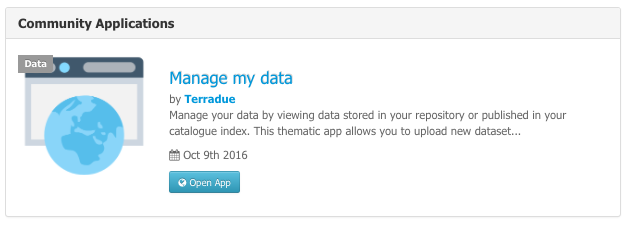
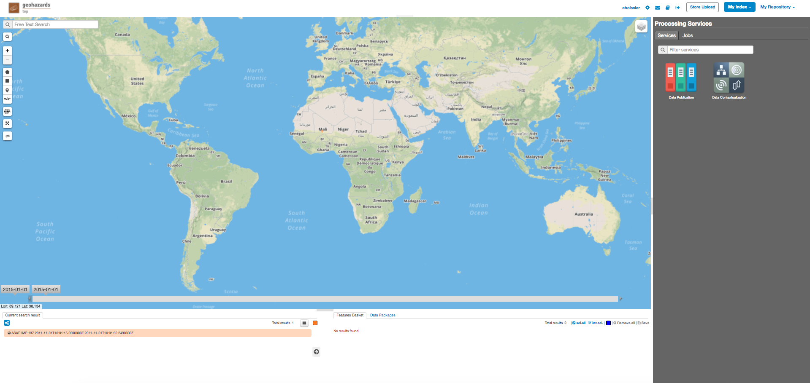
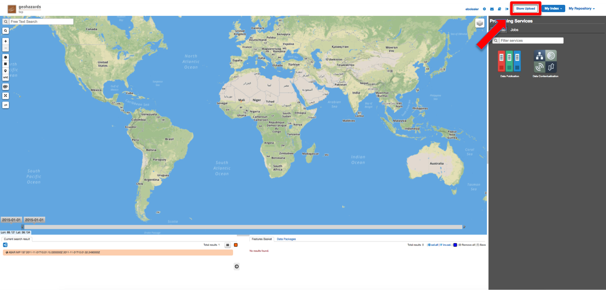
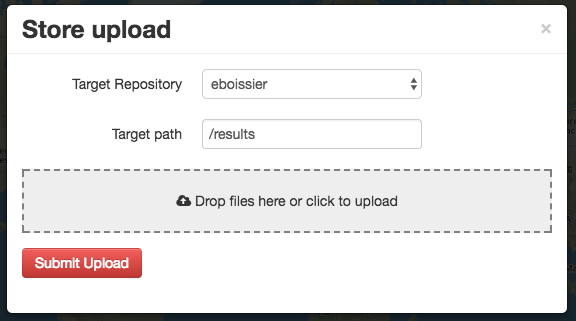
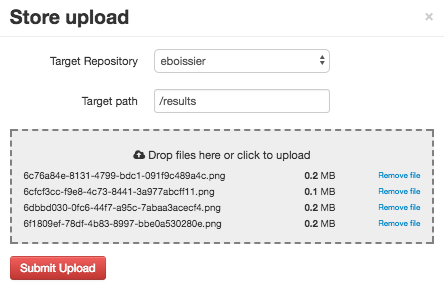
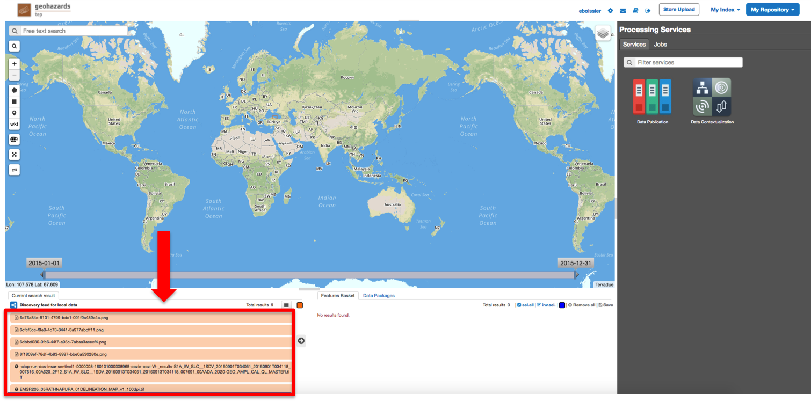
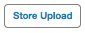
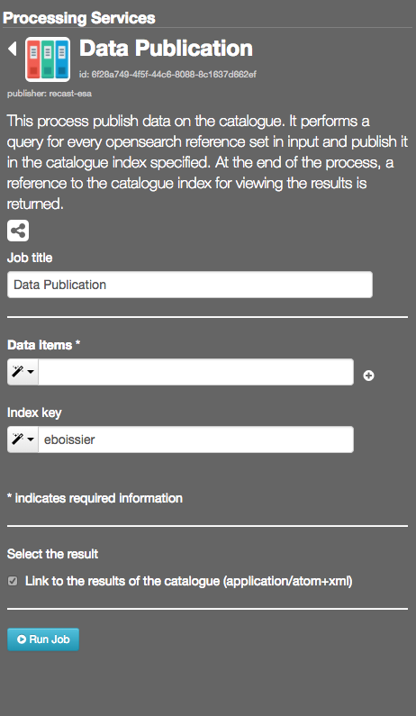

Manage my data
--------------

Each thematic application of the Geohazards TEP platform makes available for users the following functionalities:

- access to his private catalog index - using the **My Index** context,
- access to his private storage - using the **My Repository** context,
- data packages,
- access to a service to upload local data into his private storage - using the **Store Upload** button,
- access to a service to publish data results as atom feeds to the catalogue - using the **Data publication** processing service

.. _dataupload:

Data Upload
~~~~~~~~~~~

Allow the user to drag and drop local files and upload them to his private store repository (or to any accessible repository, using custom path eventually).

- Click on |storeupload|

- Select a **Target Repository** and a **Target Path** (you can use your private repository or a repository shared with your community, e.g **gep-community**)

- Drag and drop files

- Click on **Submit Upload**

.. figure:: ../includes/apps_mydata_dataupload_popup3.png
	:figclass: img-border

- Wait for upload to finish

.. figure:: ../includes/apps_mydata_dataupload_popup4.png
	:figclass: img-border

- Click on **Close and update context**, a search query is performed on the defined context (user's private context)

.. _datapublish:

Data Publication
~~~~~~~~~~~~~~~~

This process publish data on the catalogue. It performs a query for every opensearch reference set in input and publish it in the catalogue index specified. At the end of the process, a reference to the catalogue index for viewing the results is returned.

- Open the service **Data Publication** in the WPS Service tab
- Select the context **My Repository**
- Drag and drop items from the search result tab into the field **Data items**
- Set the **Index** (you can use your private index or an index shared with your community, e.g **gep-community**)
- Click on **Run job**
- Click on **Show results**, the published items are available in the search result

Data Contextualization
~~~~~~~~~~~~~~~~~~~~~~

.. figure:: ../includes/apps_mydata_datacontext.png
	:figclass: img-border

This process contextualize data. It performs a geospatial analysis of the files in a specific repository for a given directory of the Data Gateway. At the end of the process, an OWS context with all the possible offerings of the analyzed files is returned.

- Open the service **Data Publication** in the WPS Service tab
- Select the **Folder path** (custom path under the Repository key, e.g results/test-data)
- Set the **Repository key** (usually, the Terradue username)
- Set other options if necessary
- Click on **Run job**
- Click on **Show results**, the contextualized items are available in the search result

For example, setting the **Folder path** to "results/test-data" and the **Repository Key** to "eboissier" will recast files you can see in the search https://recast.terradue.com/t2api/search/eboissier/results/test-data.
