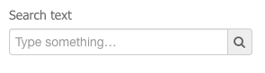
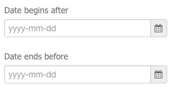
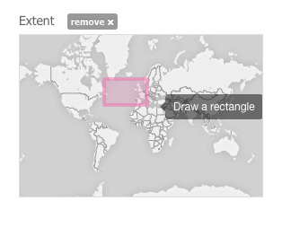

Overview
========

A *Thematic App* is a specific version of the geobrowser, in which specific parameters are pre-defined, in order to serve a specific thematic.
It is defined by a list of services offerings, such as:

	- web widget,
	- map layer,
	- map background,
	- data series,
	- wps services

.. req:: GEP-TS-DES-002
	:show:

	This section describes how a user can create its own thematic application.

.. req:: GEP-TS-DES-002
	:show:

	This section describes the data flow of thematic apps.

Find a Thematic App
-------------------

Thematic apps can be searched from the **Thematic app webpage**. The search uses filters defined by the user, such as:

	- Keywords: search within title and description of the thematic app

	- Start date: search for apps created or updated after a given date
	- End date: search for apps created or updated before a given date

	- AOI: search for apps related to a certain area

The search is performed amongst thematic apps which are public or privates for the current user.

All users also have an application dedicated to the management of all items they owns (see :ref:`app_workspace`).
It is call **My worskpace** and will give to the user the ability to manage (edit / share / delete) all items he owns amongst WPS services, data collections, data packages, WPS jobs.

From this "workspace", users can also manage (create / edit / delete) their own *Thematic App* (see :ref:`app_workspace`).

