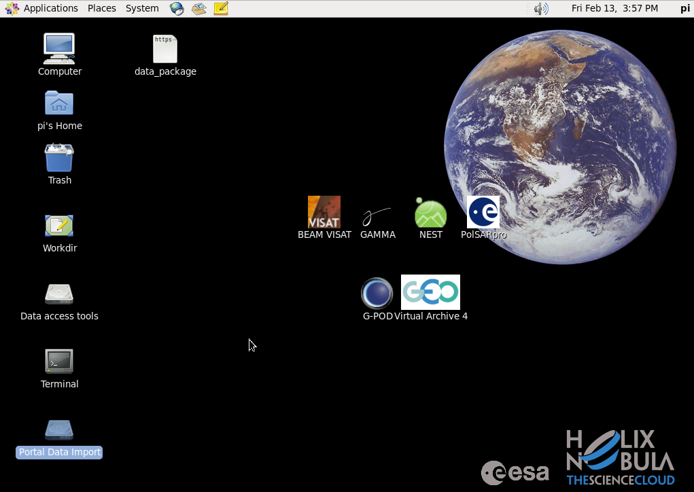
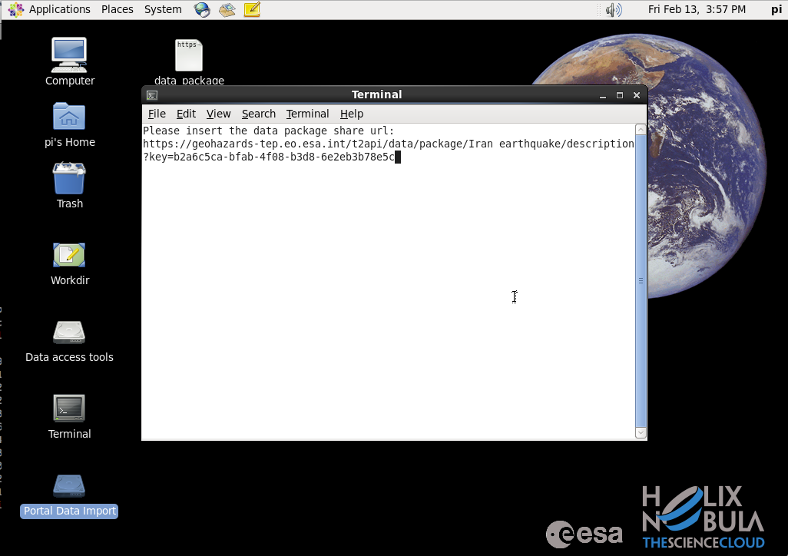
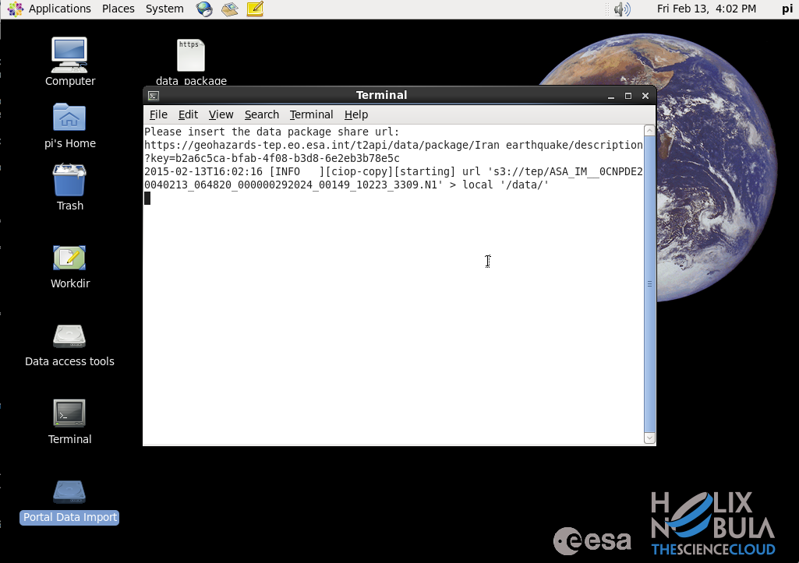

Portal Data Import within ESA CloudToolbox
~~~~~~~~~~~~~~~~~~~~~~~~~~~~~~~~~~~~~~~~~~

* Access the CloudToolbox to be configured with a datapackage 
(for access guidance, see :doc:`ESA Toolbox Guide <../community-guide/cloud/esa_toolbox>` section)

* From the CloudToolbox desktop, click on the *Portal Data Import* icon:

* Type a datapackage URL when prompted, use the following datapackage example URL to test the import:

.. code-block:: url
  
  https://geohazards-tep.eo.esa.int/t2api/data/package/Iran%20earthquake/description?key=b2a6c5ca-bfab-4f08-b3d8-6e2eb3b78e5c

* Check the downloading process:

.. WARNING::
 You need to have specific Portal credentials configured, in order to be able to download data from the Portal. 
 Contact the Operations Support team at Terradue to proceed https://support.terradue.com 
