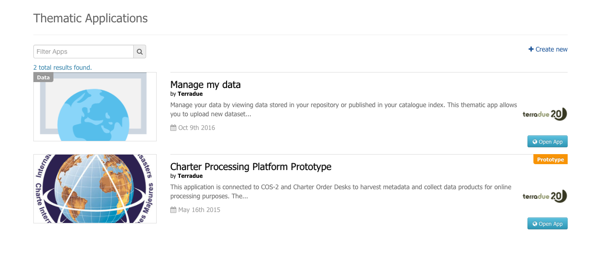

Thematic Applications
---------------------

Overview
========

A *Thematic App* is a specific version of the geobrowser, in which specific parameters are pre-defined, in order to serve a specific thematic.
It is defined by a list of services offerings, such as:

	- web widget,
	- map layer,
	- map background,
	- data series,
	- wps services

.. req:: GEP-TS-DES-002
:show:

This section describes how a user can create its own thematic application.

.. req:: GEP-TS-DES-002
:show:

This section describes the data flow of thematic apps.

Discovery
=========
A discovery page, dedicated to the search of existing/accessible Thematic apps can be accessed from the home page.

:align: center
:scale: 75%
:figclass: img-border

Thematic apps can be searched using filters defined by the user, such as:

- **Free text**: search within title and description of the thematic app

The search is performed amongst thematic apps which are accessible to the current user.

The existing thematic applications are described :doc:`here <../apps/index>`.

The search is performed amongst thematic apps which are accessible to the current user.

The existing thematic applications are described :doc:`here <../apps/index>`. 

