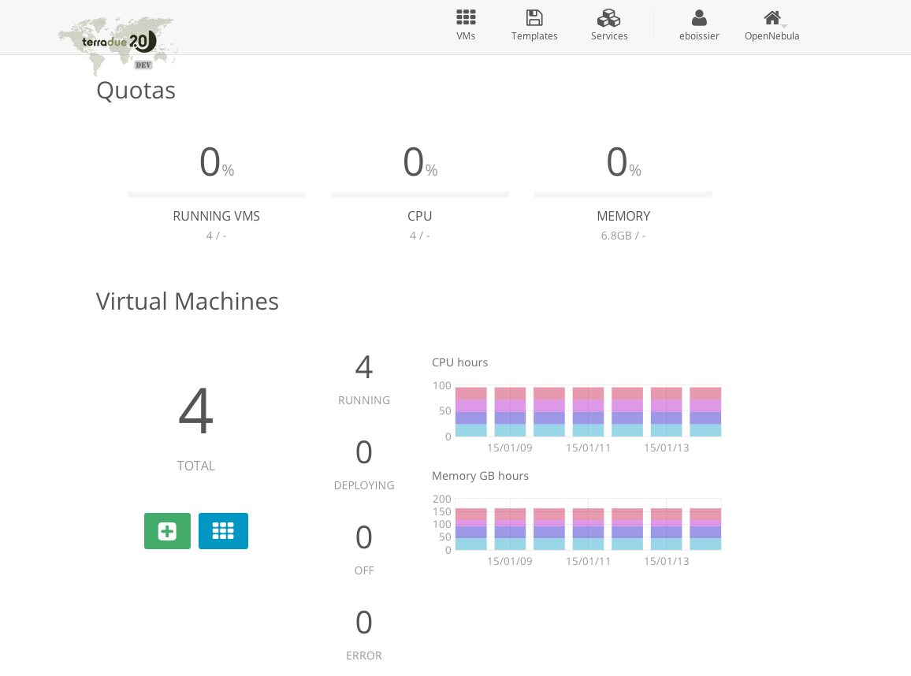

.. _dashboard:

Cloud Dashboard
================

The Cloud platform is powered by OpenNebula, and gives to the user the possibility to create and manage Processing Services.

It is accessible by clicking on the Sunstone logo |sunstone_logo| from the **Cloud Dashboard** page.

.. |sunstone_logo| image:: ../../includes/sunstone_logo-small.png

Certificate must be registered in the browser to access the Cloud dashboard.

From the cloud dashboard, user can:

-  |cloud_dahsboard_plus.png| Create a new Virtual Machine
-  |cloud_dahsboard_list.png| List all Virtual Machines

.. |cloud_dahsboard_plus.png| image:: ../../includes/cloud_dahsboard_plus.png
.. |cloud_dahsboard_list.png| image:: ../../includes/cloud_dahsboard_list.png
