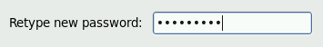
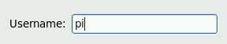

ESA Cloud Toolbox
=================

Create an ESA Cloud Toolbox
---------------------------

To create your own ESA Cloud Toolbox:

- Access the cloud dashboard (see :ref:`dashboard`)
- Click on |cloud_dahsboard_plus.png| to create a new Virtual Machine
- Set the Virtual Machine name (e.g 'my esa toolbox')
- Select the **ESA Cloud Toolbox** template
- Click on **Create**
- Wait for the VM to be deployed.

.. figure:: ../../includes/cloud_esatoolbox_create.png
        :figclass: align-center

Access an ESA Cloud Toolbox
---------------------------

Prerequisites
^^^^^^^^^^^^^

- You are connected to the GEP Laboratory (see :ref:`laboratory`).

Procedure
^^^^^^^^^

To access your ESA Cloud Toolbox:

- Access the Cloud Dashboard (see :ref:`dashboard`)
- Click on *details* button of the Virtual Machine corresponding to your Esa Cloud Toolbox 

.. figure:: assets/esa_toolbox_1.png
        :figclass: align-center
        :align: center
        :alt: alternate text

- Click on the *VNC* button, as shown in the following picture:

.. figure:: assets/esa_toolbox_2.png
        :figclass: align-center
        :width: 600px
        :align: center
        :alt: alternate text

- See the VNC screen: 

.. figure:: assets/esa_toolbox_3.png
        :figclass: align-center
        :width: 600px
        :align: center
        :alt: alternate text

|bulb| *You may have to allow your browser to open new pop-ups and allow unsafe script load.*

- Enter your username: **pi** |cloud_esatoolbox_username|
- Enter your password: **piuser2014**
- *(Only for the first connection)* Now to set a new password, re-enter the password: **piuser2014**

.. figure:: ../../includes/cloud_esatoolbox_pwd2.png
        :figclass: align-center

- *(Only for the first connection)* And finally enter (twice) your new password:

.. |bulb| image:: ../../includes/bulb.png
.. |cloud_dahsboard_plus.png| image:: ../../includes/cloud_dahsboard_plus.png

.. |cloud_esatoolbox_pwd1| figure:: ../../includes/cloud_esatoolbox_pwd1.png
