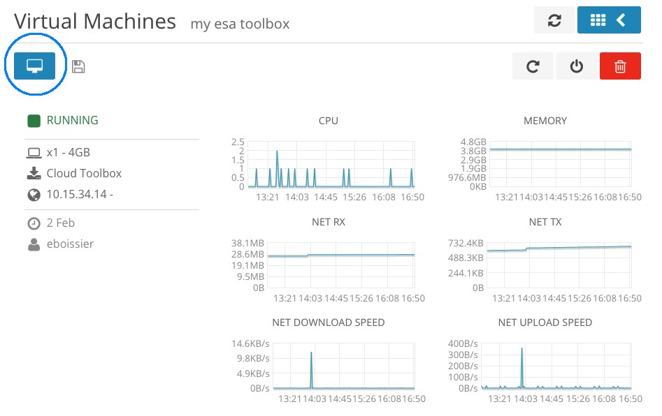
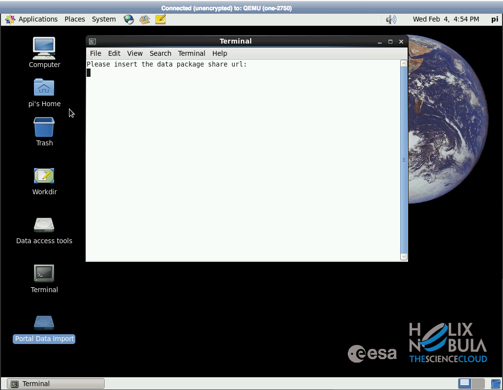
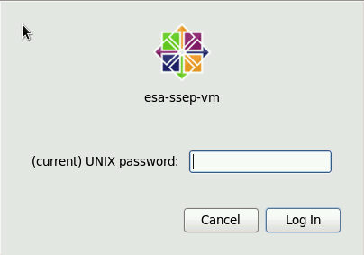
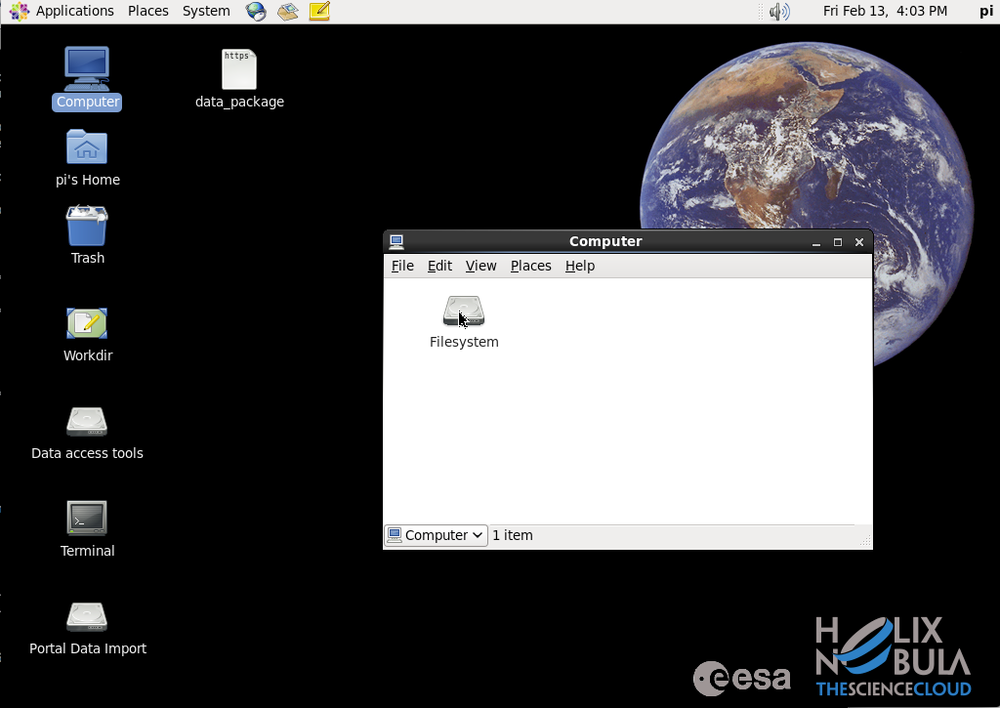
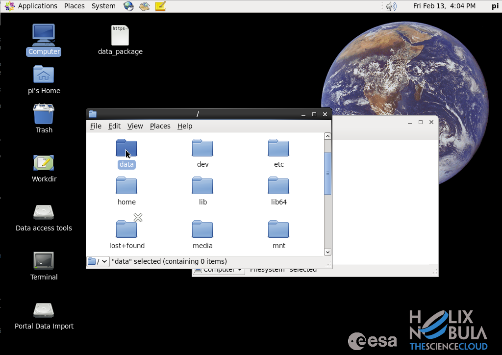

.. _esatoolbox:

ESA CloudToolbox
=================

The ESA CloudToolbox is a Virtual Machine (VM) that offers a flexible amount of CPUs, RAM and dedicated storage, tailored to user needs and type of machine required. When needed, users can request upgrades of the configuration (for example, asking more processing power) at any time, compatibly with the Cloud infrastructure constraints.
A pre-built VM template offers ready-to-use machines for SAR Interferometric processing or generic EO data processing. However, besides free and licensed software tools (e.g. Sentinel-1 toolbox, NEST, GAMMA, Matlab, etc) that can be installed on the machines, users may request installation of additional tools.

Create a CloudToolbox
----------------------

To create your own CloudToolbox:

- Access the cloud dashboard (see :ref:`dashboard`)
- Click on |cloud_dahsboard_plus.png| to create a new Virtual Machine
- Set the Virtual Machine name (e.g 'my esa toolbox')
- Select the **ESA CloudToolbox** template
- Click on **Create**
- Wait for the VM to be deployed
- Get the <ESA CloudToolbox IP>.

.. figure:: ../../includes/cloud_esatoolbox_create.png
        :figclass: align-center

Access the CloudToolbox
------------------------

Prerequisites
^^^^^^^^^^^^^

- You are connected to the GEP Virtual Private Network (see :ref:`laboratory`).

Procedure
^^^^^^^^^

VNC Connection
++++++++++++++

*(Option 1 - using a browser)*

- Access the Cloud Dashboard (see :ref:`dashboard`)
- Click on *details* button of the Virtual Machine corresponding to your CloudToolbox 

.. figure:: assets/esa_toolbox_1.png
        :figclass: align-center
        :align: center
        :alt: alternate text

- Click on the *VNC* button, as shown in the following picture:

.. NOTE::
        You may have to allow your browser to open new pop-ups and allow unsafe script load.

.. NOTE::
        Firefox (> 3.5) and Chrome browsers are supported. Internet Explorer, Opera and others are not supported and may not work well. The option 2 is recommended in this case.

*(Option 2 - using a VNC client)*

- Download and install a VNC client (e.g., `UltraVNC <http://www.uvnc.com/downloads/ultravnc.html>`_ or `RealVNC <https://www.realvnc.com/>`_ or `TightVNC <http://www.tightvnc.com/>`_)

- Open the VNC client and connect to:

.. code-block:: info

  <ESA CloudToolbox IP>:5902

Further references: http://wiki.services.eoportal.org/tiki-index.php?page=CloudToolbox+FAQ

User Login
++++++++++

- See the VNC screen: 

- Enter your username: **pi**
- Enter your password: **piuser2014**
- *(Only for the first connection)* Now to set a new password, re-enter the password: **piuser2014**

|bulb| *Before performing this step, be sure to see a screen similar to the image below, 
that is, without any other text (e.g. "You are required to change your password immediately (root enforced)")*

- *(Only for the first connection)* And finally enter (twice) your new password:

Access the datapackages retrieved from the GEP Portal
-----------------------------------------------------

To access the GEP Portal data that was made available locally to the CloudToolbox by an administrator, 
just follow this procedure:

- Click on the *Computer* icon, then on *Filesystem* icon:

- Click on the *data* icon:

- Check the available data:

.. figure:: assets/esa_toolbox_data_3.png
        :figclass: align-center
        :width: 750px

.. |bulb| image:: ../../includes/bulb.png
.. |cloud_dahsboard_plus.png| image:: ../../includes/cloud_dahsboard_plus.png

.. WARNING::
  To request the configuration of your CloudToolbox with a datapackage previously defined on the GEP Portal, 
  contact the support via email to tep-geohazards at esa.int , providing the Portal URL of the requested datapackage.
