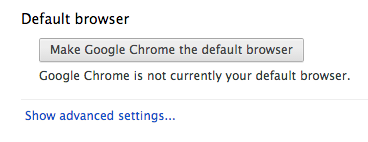
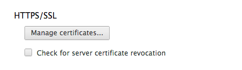

.. _laboratory:

Join the GEP Laboratory
########################

A GEP Laboratory is a virtual network on the Terradue's Cloud Platform dedicated to the hosting of your Cloud services.
A GEP laboratory and its services are secured by user authentication (using SSL / X.509 certificates) and VPN access.
The following sections will guide you through the procedures related to the Certificate download and VPN Setup.

.. _laboratory-prerequisites:

Prerequisites
-------------

- You are registered to the Geohazards Exploitation Platform https://geohazards-tep.eo.esa.int/.
- You requested a Terradue's Certificate from the User Profile section of the Platform (see :ref:`user-profile`).
- Your certificate was approved, and you received an e-mail from ca@terradue.com with subject "Your Terradue certificate is ready to download".

Import Terradue's CA certificate in a Browser
---------------------------------------------

Terradue's X.509 Certification Authority (CA) is used to sign the Platform's server certificates. You should have downloaded this file from the registration confirmation email.

Otherwise, to get the CA's X.509 certificate, you only need to click here:
https://ca.terradue.com/gpodcs/certs/cacert.pem. 

Terradue's "CA cert" must be shows up under the "Authorities" label of your Browser's security tab.

Chrome makes use of the trust store of the operating system.
Firefox maintains all its CAs.

Download your SSL Certificate in PFX format
-------------------------------------------

The SSL (Secure Socket Layer) is the most widely deployed security protocol used today. It is essentially a protocol that provides a secure channel between two machines operating over the Internet or an internal network.

The SSL Certificate issued by the CA should be imported into a browser in order to use it. This section describes the certificate import procedures for different browsers and platforms.

- Go to *https://ca.terradue.com/gpodcs/cgi/certdown.cgi?U=<your_registration_email@organization.com>&F=Kpfx* (**replace by your registration e-mail**)
- Type the certificate password that you chose during the registration.

Import your PFX Certificate in a Browser
----------------------------------------

The certificate in PFX format (Personal Information Exchange) is used to authorise your access to some Platform's services like the Support site.

Google Chrome
^^^^^^^^^^^^^

- Open the Google Chrome browser.

- Choose **Preferences** from the **Chrome** menu.

- Click the **Show advanced settings...** link:

- Open the **Manage Certificates** button under the **HTTPS/SSL** section:

- Open the Import window, browse to your downloaded certificate file.

- Enter your certificate passphrase when prompted.

Mozilla Firefox
^^^^^^^^^^^^^^^

- Open the Firefox browser.

- Open the Preferences / Options: 

  - *(Linux)* choose **Preferences** from the **Edit** menu,
  - *(Windows)* choose **Options** from the **Tools** menu,
  - *(Mac)* choose **Preferences** from the **Firefox** menu.

- Click the **Advanced** button.

- Open the Certificate pane:

  - *(Linux)* select the **Security** pane,
  - *(Windows)* select the **Encryption** (or **Security**) pane,
  - *(Mac)* select the **Certificates** pane.

- Click the **View Certificates** button.

- Click the **Authorities** tab.

- Click the **Import** button at the bottom of the screen.

- Browse to your downloaded certificate file.

- Enter your certificate passphrase when prompted.

Internet Explorer
^^^^^^^^^^^^^^^^^

- Open the Internet Explorer browser.

- Choose **Internet Options** from the **Tools** menu.

- Click the **Content** tab.

- Open the **Certificate** pane.

- Click the **Certificates** (or **Personal**) button.

- Browse to your downloaded certificate file.

- Enter your certificate passphrase when prompted.

Safari
^^^^^^

- Double-click the downloaded certificate file to launch the Keychain Access application.

- Enter your certificate passphrase when prompted.

Install your OpenVPN Client
---------------------------

Now you can download and install your OpenVPN Client, in order to establish a connection with Terradue's VPN server.

.. important::

  if you have a previously installed VPN client (e.g. Tunnelblick) on your system, such **previously installed client must be disconnected and then be disabled** (we recommend uninstalling it).

- Go to https://access.terradue.com
- Type as Username the email used during your registration.
- Type as Password the passphrase that you chose during the registration.
- Once logged, all the connection setup is automatic, you must only approve the access by the new client.

.. _run-your-vpn-connection:

Run your VPN Connection
-----------------------

- In your desktop tray, click on the "OpenVPN Connect" icon.
- From the dropdown menu, select the entry "Connect to access.terradue.com".
- Provide your username and password to approve the access, if required.
- Check that the "OpenVPN Connect" icon in your desktop tray is now featuring a green symbol.
- That's all :-)

.. admonition:: Congrats

  You have now completed your setup for accessing your GEP laboratory. 
  You shall be able to access your user dashboard here: http://<sandbox_ip>/dashboard. 
  **So, let's try a first** :doc:`Connect to your Sandbox <../sandbox>` **now !**

Known caveats
-------------

DNS issues
^^^^^^^^^^^

When the OpenVPN client is installed on a Linux/Unix OS, the OpenVPN Server is unable to alter the DNS settings on the client in question. 
A typical behaviour in such cases is that you are able to ping your Sandbox through its IPv4 address, but not through the hostname. 
To solve this kind of issue, add manually Terradue's DNS server as a new line in your */etc/resolv.conf* file:

.. code-block:: bash

  nameserver 10.16.20.14

If you are using the NetworkManager tool (e.g. in the GNOME desktop environment), you should instead statically add the nameserver address 10.16.20.14 through the GUI. 

Going further
-------------

How to use the OpenVPN Command Line Interface
^^^^^^^^^^^^^^^^^^^^^^^^^^^^^^^^^^^^^^^^^^^^^

If the system you are using has not a Graphical User Interface for OpenVPN, you have to use the OpenVPN's command line. 
Also, in some scenarios you need to use the OpenVPN's command line interface, for example in a script to automatically start the VPN connection. 
It can also be useful when you want to automatically start the VPN from a startup script.

So you can execute the OpenVPN client through the "openvpn" command by using the prompt (Unix Shell or Windows Prompt). 

The CLI parameters are listed and described in the manual page of OpenVPN.
You can check them by typing the command:

.. code-block:: bash

  man openvpn

from a Unix shell, the OpenVPN's manual page will be displayed. 
A great number of parameters are available to directly use in the command line prefixed by two consecutive hyphens (--). 
The same parameters (not prefixed by --) can also be specified in the configuration file.

.. NOTE::
  Except for a few cases, it is better to specify the parameters in a configuration file rather than having them in a too long and heavy to read command line.

How to manually setup OpenVPN on other Platforms
^^^^^^^^^^^^^^^^^^^^^^^^^^^^^^^^^^^^^^^^^^^^^^^^^

To download the "OpenVPN Connect" client for installation on another computer, you can access installation material and configuration templates from here:

https://access.terradue.com/?src=connect

You can establish a VPN connexion with Terradue's OpenVPN server by using the command line.

- Go to https://access.terradue.com/?src=login,
- Type as Username the email used during the registration,
- Type as Password the passphrase that you chose during the registration,
- Download the client.ovpn configuration file from the link "Yourself (user-locked profile)",
- Download the cacert.pem from https://ca.terradue.com/gpodcs/certs/cacert.pem
- Put the files client.ovpn and cacert.pem in a same directory (suppose /etc/openvpn/). 
- Change the current directory to /etc/openvpn/ and exec (with root privileges) the command:

.. code-block:: bash

  openvpn --config client.ovpn

- You are requested for the Username and the Password,
- If the client is authenticated against the server, the VPN connection is established.

How to build and install OpenVPN
^^^^^^^^^^^^^^^^^^^^^^^^^^^^^^^^

For the most operating system in which OpenVPN works, binary packages already compiled exist. 
Anyway, sometimes, above all for some Linux Distributions, you could need to build OpenVPN by starting with the source code.

- Download the OpenVPN's source code from the site http://openvpn.net. Pick the latest stable release that is available (*suppose the release 2.0.9 in the rest of this document*);
- Extract the files which are stored in the zipped archive that you have downloaded by using the tar command in the following manner:

.. code-block:: bash

    tar xvfz openvpn-2.0.9.tar.gz

- Change the current directory to openvpn-2.0.9 with the command:

.. code-block:: bash

        cd openvpn-2.0.9

- Check the system and produce the Makefiles by using the following command:

.. code-block:: bash

        ./configure --prefix=/usr
        make
        make install

If the ./configure procedure claims that the lzo libraries and headers are not found in the system, install the lzo compression software as follows below:

- Download the source package of LZO from the site http://www.oberhumer.com/ and extract its content with the command:

.. code-block:: bash

        tar xvfz lzo-2.02.tar.gz

- Change the current directory to lzo-2.02 and install the LZO software with the commands:

.. code-block:: bash

        ./configure --prefix=/usr
        make
        make install
        
.. WARNING::
  Because the files will be written below the system directory /usr, the *make install* command must be executed with root privileges.
