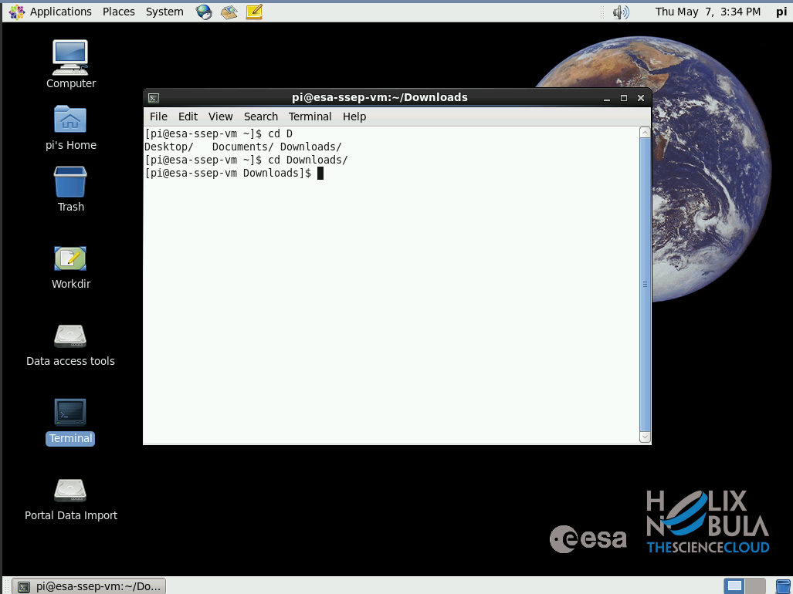
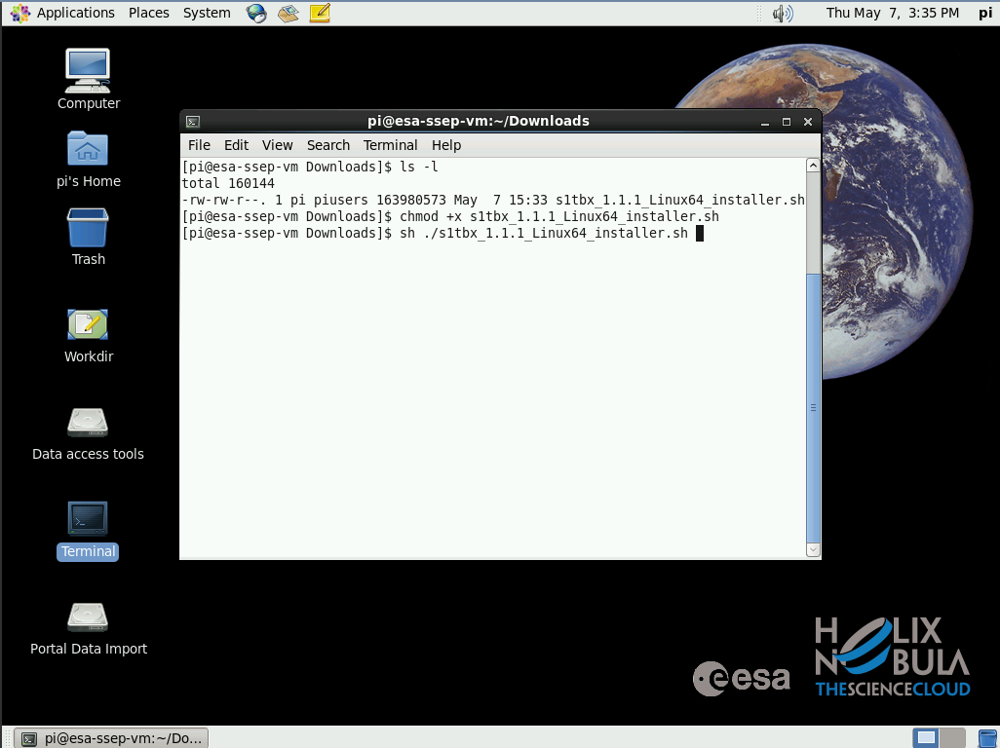
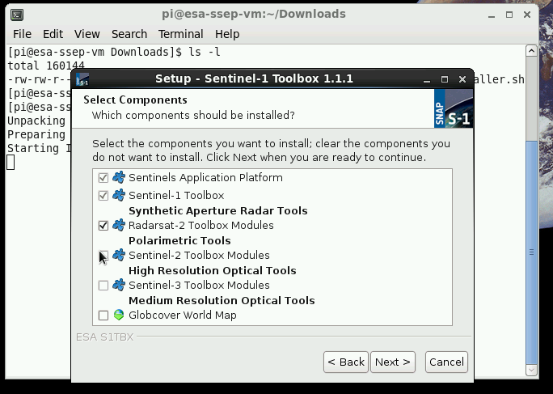
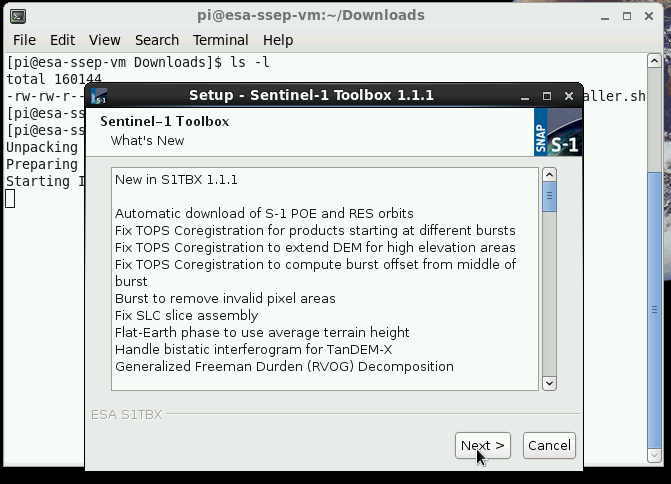
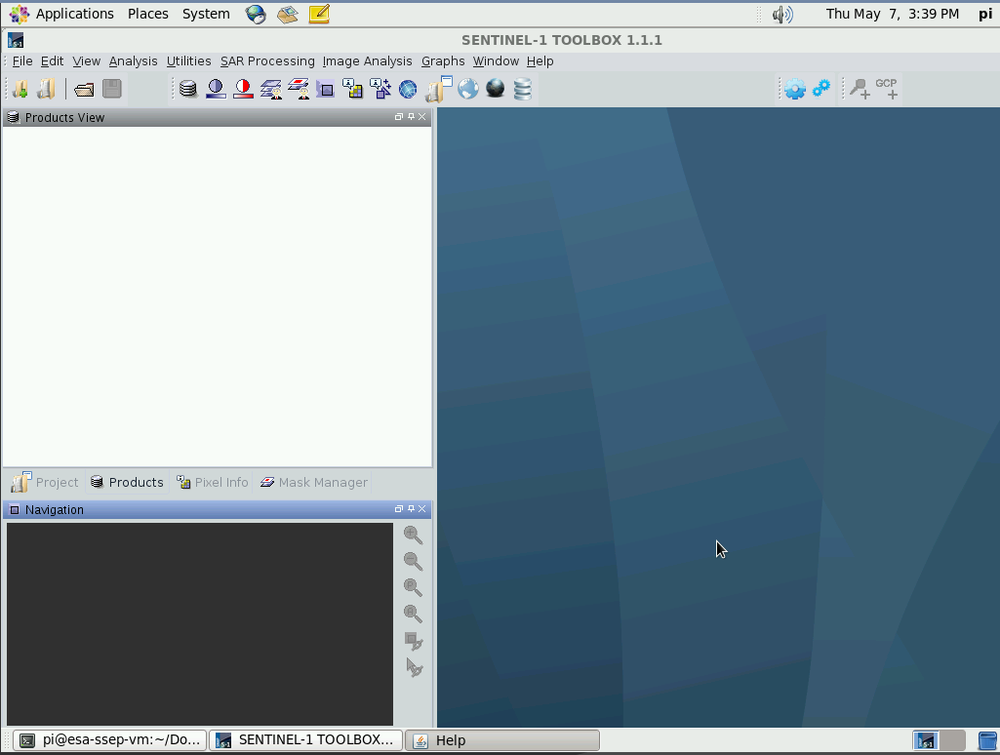

SENTINEL-1 Toolbox Installation
===============================

The SENTINEL-1 Toolbox (S1TBX) consists of a collection of processing tools, data product readers and writers and a display and analysis application to support the large archive of data from ESA SAR missions including SENTINEL-1, ERS-1 & 2 and ENVISAT, as well as third party SAR data from ALOS PALSAR, TerraSAR-X, COSMO-SkyMed and RADARSAT-2. The various processing tools could be run independently from the command-line and also integrated within the graphical user interface. The Toolbox includes tools for calibration, speckle filtering, coregistration, orthorectification, mosaicking, data conversion, polarimetry and interferometry.

Installation on a CloudToolbox
-------------------------------

Prerequisites
^^^^^^^^^^^^^

- You have created and accessed a CloudToolbox (see :ref:`esatoolbox`).

Procedure
^^^^^^^^^

- Access the CloudToolbox
- Open the browser and visit the website https://sentinel.esa.int/web/sentinel/toolboxes/sentinel-1
- Download the *Linux 64-bit* version

.. figure:: assets/s1toolbox_1.png
        :figclass: align-center
        :align: center
        :width: 600px
        :alt: alternate text

- Open a Terminal and type:

.. code-block:: bash

  cd Downloads

- Type:

.. code-block:: bash

  chmod +x s1tbx_1.1.1_Linux64_installer.sh
  sh ./s1tbx_1.1.1_Linux64_installer.sh
 
- See the Setup Wizard window and click on the *Next* button:

- Click on the *Next* button:

.. figure:: assets/s1toolbox_4.png
        :figclass: align-center
        :align: center
        :alt: alternate text

- Click on the *Next* button: 

.. figure:: assets/s1toolbox_5.png
        :figclass: align-center
        :align: center
        :alt: alternate text

- Click on the *Next* button:

- Click on the *Next* button:

.. figure:: assets/s1toolbox_7.png
        :figclass: align-center
        :align: center
        :alt: alternate text

- Click on the *Next* button:

- Click on the *Finish* button:

.. figure:: assets/s1toolbox_9.png
        :figclass: align-center
        :align: center
        :alt: alternate text

- See the SENTINEL-1 TOOLBOX 1.1.1 GUI:

