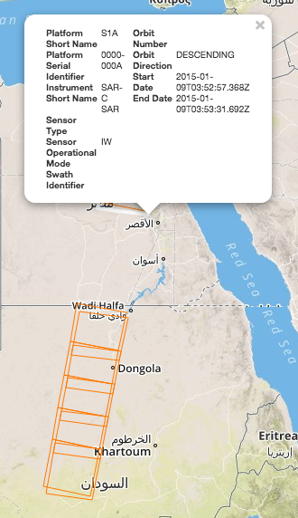
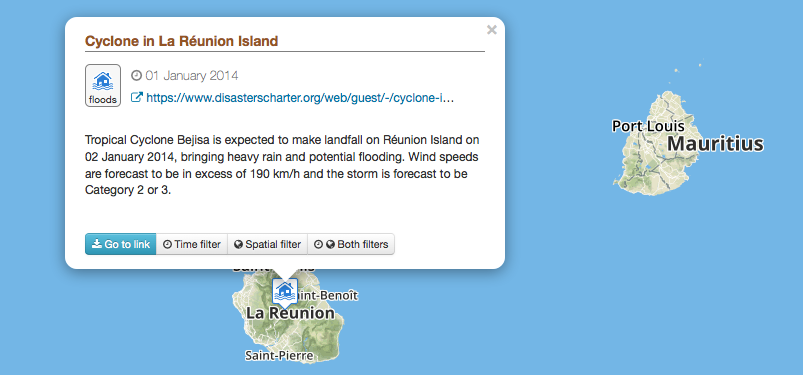
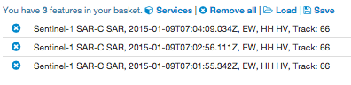
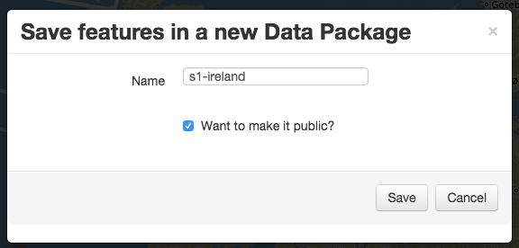
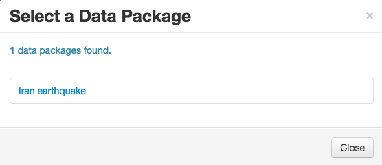

Data
====

.. figure:: ../includes/data.png
	:scale: 30%
	:align: center
	:figclass: img-container-border

Discovery of data is made through the :doc:`geobrowser <platform/geobrowser>`. 

You can search for specific data by creating a query to a catalogue, look for specific events or simply see amongst the contextualized results what can be interesting for you.

Put data in your basket and save it for later, or simply drag and drop data as a parameter of a process.

Discover data
-------------

Data discovery is made through the map. To get specific data:

1. Focus on an area of the geobrowser.
2. Select a time period on the time slider.
3. Click on |search| to open the query tab.
4. Fill in specific parameters.
5. Click on **Search**.
6. Results appear on the map and the **Results Table**.
7. Click on a result (directly on the map or in the Results table) to get more info about this result.

.. tip:: in the *Search Term* field supported wildcards are '*', which matches any character sequence (including the empty one), and '?', which matches any single character.

.. |search| image:: ../includes/geobrowser_button_query.png

Discover contextualized data
----------------------------

Data related to a specific context can be accessed by clicking on one of the available context on the top-right of the browser.

Currently existing contexts are:

- EO data
- EO processing
- Publications
- Community

Once clicked on a context, data automatically appear on the map.

Discover data related to a specific event
-----------------------------------------

To access data related to a specific event:

1. Access the geobrowser, by default, data related to specific geohazards events (provided by the disaster charter) are displayed on the map.
2. Focus on one event.
3. Click on **Search data for event**.
4. Data related to this event is automatically added to the result tab and displayed on the map.

Select data in your basket
--------------------------

Data can be selected on the map as well as on the result tab.

1. Click on data on the map to make it appear on the **Results Table**.
2. Drag data from the **Results Table** to the **Features Basket**.
3. Data appears on the **Features Basket**.

Save basket as data package
---------------------------

To create a new data package:

1. Add all data you want in the **Features Basket**.
2. Click on **Save**.
3. Choose a name for the data package.
4. Tick the box if you want to make it public (means that everybody can access it).
5. Click on **Save**.
6. The data package is saved on the platform, you can re-access it later.

Load an existing data package
-----------------------------

To access a previously saved data package:

1. Click on the **Data Packages** tab.
2. Select a data package on the list.
3. To add all the items from the data package into the current basket, click on *load*.
4. To use the data package as the current search, click on *set as current search*.

Clear the basket
----------------

To clear your current basket:

1. Click on **Remove all** on the basket tab.
2. Your basket is now empty.

Use data in a process
---------------------

1. Select a WPS and open it.
2. The list of parameters is visible.
3. Drag data from the **Results Table** and drop it over the selected parameter (only selected items are added).
4. **OR** drag data from the **Features Basket** and drop it over the selected parameter (all items from the basket are added).
5. In case of several items, it creates one occurence of the parameter per item.
6. Data are ready to be used in the process. Click on **Run process* to actually run the process.
