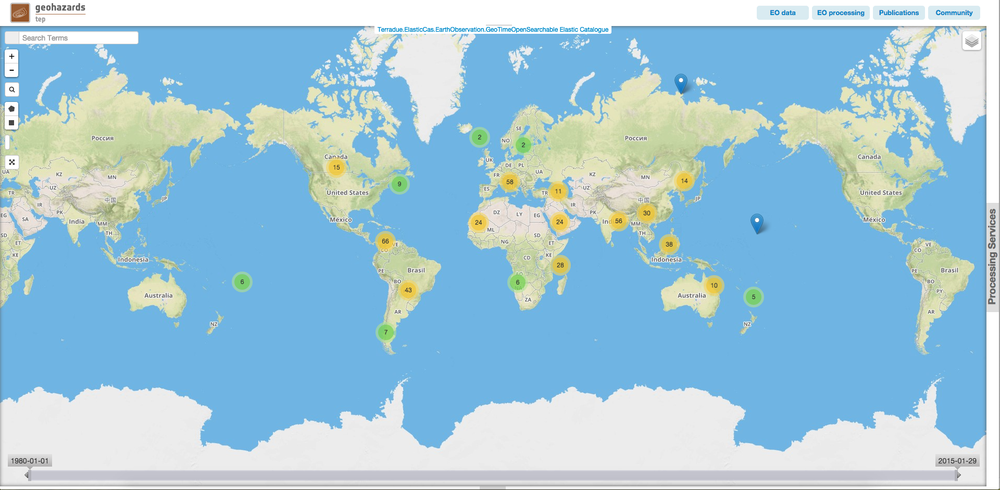

GeoBrowser area for data and Cloud processing services
======================================================

GeoBrowser
----------

The GeoBrowser is composed of:
	- a `Map`_, where the user can make search query and see results
	- `Contexts`_ links
	- `Results tab`_ (initialy hidden)
	- `Processing services tab`_ (initialy hidden)

Map
~~~

The map is just a simple map, on which you can zoom in, zoom out and navigate.
Some buttons maybe used to interact with the map:

-  |geobrowser_button_search.png| search area
-  |geobrowser_button_plus.png| Zoom in
-  |geobrowser_button_minus.png| Zoom out
-  |geobrowser_button_query.png| Open query search tab
-  |geobrowser_button_polygon.png| Edit the search bbox by drawing a polygon on the map
-  |geobrowser_button_recbox.png| Edit the search bbox by drawing a rectangle on the map
-  |geobrowser_button_dynamicsearch.png| Enable/Disable dynamic search (the search bbox is the current view on the map)
-  |geobrowser_button_fullscreen.png| Put the map in full screen
-  |geobrowser_button_layers.png| Change the background of the map | Select layers to be displayed.

It is also possible to directly select on the map the temporal parameter of the search by moving the temporal bar.

.. image:: ../includes/geobrowser_timebar.png
	:align: center

Once all parameters are set, bbox chosen

Contexts
~~~~~~~~

. image:: ../includes/geobrowser_contexts.png
	:align: center

Some pre-defined context are accessible on the top of the map.
One context is the result of a query on a specific catalog with pre-defined search parameters.
The existing pre-defined contexts are:
- EO data
- EO results (standard)
- EO results (advanced)
- Publications
- Community

Results tab
~~~~~~~~~~~

.. image:: ../includes/geobrowser_resulttab.png
	:align: center

The result tab is divided in two parts.
On the left, the list of current results displayed on the map.
On the right, the features from the current basket.
Results can be dragged fron the left table to the basket. Then the basket can be saved as a new data package (clicking on the *Save* button) and shared with other users (by ticking the *Want to make it public?* box).
Saved Data packages can then be loaded (by clicking on the *Load* button).

Processing services tab
~~~~~~~~~~~~~~~~~~~~~~~

Processing services tab can be expanded by clicking on *Processing Services* on the right on the map.
It is composed of two sub tabs:
- *Services*, displaying the list of available Processing Services
- *Jobs*, displaying the list of available jobs for the current users

.. |geobrowser_button_minus.png| image:: ../includes/geobrowser_button_minus.png

.. |geobrowser_button_recbox.png| image:: ../includes/geobrowser_button_recbox.png

