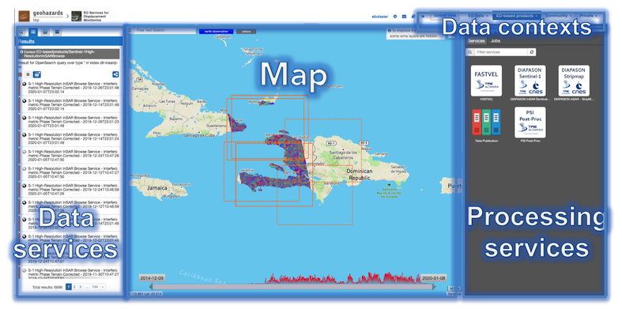
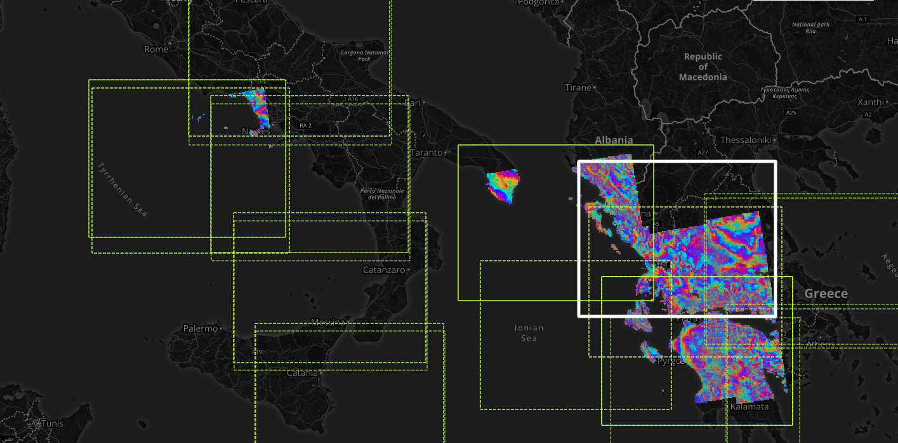

GeoBrowser
======================================================

.. figure:: ../../includes/geobrowser-geobrowser.png
	:figclass: img-border img-max-width

Intro
----------

The geobrowser is a map-based web application, allowing users to perform data exploration, data visualization, data analysis and data processing.

The application spreads on the common OGC standards:
- Opensearch, to have a standard and dynamic way to search data;
- OWS context, to manage a search results;
- WPS, to perform data processing.

The geobrowser is based on a "current search" concept. The "current search" is an entity representing the data of the catalog we are currently navigating. It is defined on the couple **{current opensearch description, current search parameters}**:

- The opensearch description is a document (retrieved by and opensearch description url) describing the data we are exploring in a given moment including how we can search the data, what are the search parameters and how each parameter works. From the opensearch description the geobrowser creates a search engine and populates a dynamic search form.
- The current search parameters is a set of parameters values and filters, from which we can have a search results to show on the geobrowser.

On the geobrowser users can change and manipulate the current search in 2 ways:

- **By changing the current opensearch description**: a thematic app offers a list of defined Opensearch Descriptor in a tree menu called Contexts Menu. Morehover, you can also change the current search by showing a result of a processing job, or by switching on a correlated search.

- **By applying some filters changing parameters values**: all parameters are included in the Search Panel form, but for some predefinite parameters there is also an utility widget on the map, to make more intuitive the interaction to change the values. For example the search terms, the spatial query buttons and the date are represented as widget inside the map.

A current search always involves a current search result, which is the search result on the catalog with a specific opensearch description and a specific parameters values set. That result is on OWS context standard, encoded in geoJSON format, and contains a list of results entries called Features. Each feature is shown on the Results Panel, and a details view for a selected feature is offered to show all the features info. Morehover, the features containing geographic information (like bounding box, map image, WMS service) are also visible and represented on the Navigation Map.

Let's see in the details each component of the geobrowser.

Geobrowser Layout
-----------------

The Geobrowser is composed of:

- **Navigation map**, the map area;
- **Contexts menu**, a menu used to switch among predefinite search;
- **Catalog panel**, a panel showing all info about the current search and the saved results. This panel is splitted in more sub panels, shown only one at a time to improve focus and usability: (TODO)
   - **Search Panel**
   - **Results Panel**
   - **Features Basket panel (or saved results)**
   - **Data packages panel**
   - **Details panel**
- **Processing panel**

TODO: talk about the layout

Navigation map
--------------

The navigation map is a simple geographic map, on which you can zoom in, zoom out, pan and see all the geographic features of the current results. The Navigation Map can show on the map features as:
- Geometries (or footprints), like polygons or rectangles or points;
- Spatial image, like a jpg or png inside a defined bounding box;
- WMS layers.

Contexts menu
-------------
The Contexts menu is a menu placed on the top, representing a result of a query on a specific catalog with pre-defined search parameters. By choosing a context the Current search will switch with the relative Opensearch Description and optionally with the relative search parameters.

.. figure:: ../../includes/geobrowser-contexts-menu.png

The existing pre-defined contexts are:

- EO data
- EO processing
- Publications
- Community

Catalog Panel
-------------
The Catalog Panel is a panel showing all infrmation about the current search and the saved results. This panel implements three of the "Information Seeking Mantra" interactions (search, list results, details on demand). These three interation are represented in three different views and panels: the search panel, the results panel and the details panel, plus two extra panels: the Saved Results panel and the Data Packages panel. To improve focus and usability, one subpanel is visible at a time, by a tab switcher.
Users can open or close the Catalog Panel by the Tools button.

Search panel
^^^^^^^^^^^^
The search panel is a view containing all search parameters associated to the current catalogue on which the search will be performed. The search panel is showed as a form, and, depending by the opensearch descriptor document, some parameters are just free text, some of them have type restrictions, others can be chosen from a list.
Some predefinite parameters, if present on the opensearch descriptor, are also visible as an external widget on the map, like the Time slider, the Search terms and the Geo Filters. The startIndex standard parameters is also shown as a pagination widget inside the results panel.

Results panel
^^^^^^^^^^^^^
This panel shows the result of the current search as a list of features. Some search results information are also visible on the panel header.
When a search is done this panel automatically is activated showing the results.
From the results panel users can do different interactions and operations:
- see all results in a scrollable list
- check the type of feature
- select one or more features
- open the details panel for a feature (double click)
- highlight a feature on the map (if the feature has geospatial information)

TODO talk about the icons
TODO talk about features buttons

Features Basket panel (or saved results)
^^^^^^^^^^^^^^^^^^^^^^^^^^^^^^^^^^^^^^^^

Users can save the features from the results panel into a personal user space called Features Basket (or saved results). This panel is similar to the results panel, since has a list of the features saved by user and those features are visible in the map and on the details panel, but it could contain features from different catalogs.
To put features into the features basket users can simply drag one or more features on the features basket icon.
Users can navigate among the features (like on the results panel), remove one or more feature or clean all the features basket.
Moreover users can save and export the features basket in a Data Package, allowing users to share results.

Data packages panel
^^^^^^^^^^^^^^^^^^^

A data package is a saved collection of features. The Data Packages panel shows all data packages visible to users. A data package can be opened by replacing it to the Current Search.

Details panel
^^^^^^^^^^^^^

The details panel is a "floating panel", that is, is a panel not visible as a tab. Users can also see this panel from a specific feature, by double click on it, or by opening the details from the popup. This action shows in a vertical scrollable layout page all description information of the feature, including summary, images, key-value information, Also, from the details panel user can perform some actions, like filter the current search by the feature spatial information, or check out some feature correlated results.

Processing Panel
----------------

While the Catalog Panel allow users to navigate and retrieve information on the data, the Processing Panel allow users to perform operation on the data. The Geobrowser uses WPS standard to provide rules for standardizing inputs and outputs for invoking processing services. From the processing panel users can:
- navigate among available processing services;
- see a processing service in the details;
- execute a processing service (job);
- search for executed jobs;
- show details for a selected job;
- show results on the navigation map and catalog panel.

To do this there are 4 views: Services tab, Service Details, Jobs tab, Job Details. For no logged users is only possible to view the jobs information and results.

Services Tab
^^^^^^^^^^^^
This tab contains the list of available Processing Services. Users can apply some filters to looking for a specific service. Choosing a service the relative details are shown.

Service Details
^^^^^^^^^^^^^^^
This view includes a description of the selected service (title, version, description, and so on), followed by a form of all service inputs. Users can fill the form manually, by features dragging (if available for the input) or by the geobrowser clipboard. Is also possible to import and export parameters set in a json format.

Jobs tab
^^^^^^^^
This tab contains the list of available jobs associated to the user or thematic app. Users can filter the job for job title or job type (mine, thematic, all). Details on jobs can be accessed by clicking on the title of the job.
For running jobs it's possible to view the running percentage status.

Job Details
^^^^^^^^^^^
The job details view contains all job information, like some service info, job time, job author, job status (running, succeded, failed) and job results. A job result can be represented as a Opensearch Description element, so users can see the results of a job on the Navigation Map and on the Catalogue control by changing the Geobrowser Current Search with the job result. It's also possible to resubmit the job with the same parameters.

