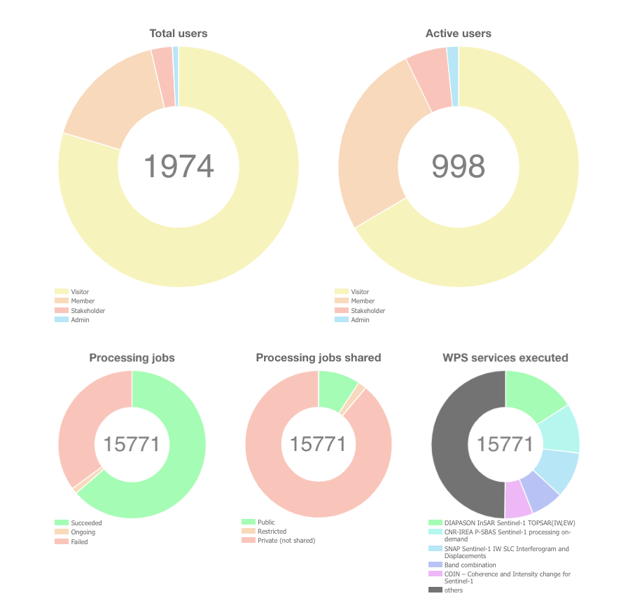

Analytics area
==============

The portal gives the user a quick view of analytics on the platform:

- Total number of users registered
- Total number of active users
- WPS jobs analytics (total number, succeeded vs failed, shared vs privates)
- WPS processing analytics (which are the most used WPS services)
- Available EO Data collections and EO-based products

This page is accessible from the home page, by clicking on **Analytics**.

