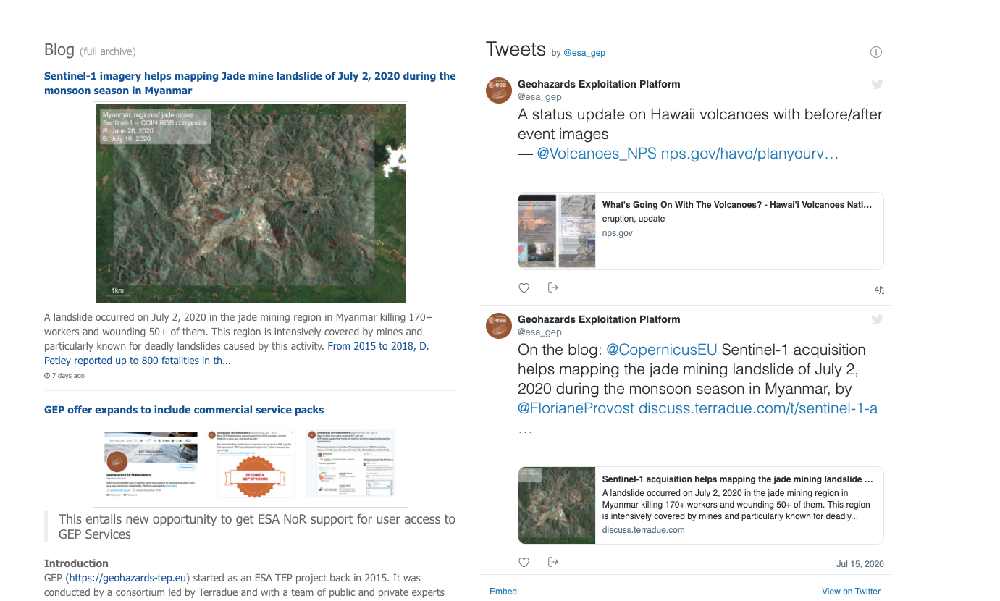

Information areas (Blog, News, ...)
===================================
The portal gives the user a quick access to the most recent news from the community.
Directly on the homepage, the user can find:

- a list of featured stories that may have an interest for him (more details about the story can be found by simply clicking on the provided link)

.. figure:: ../../includes/news_features.png
	:figclass: img-border
	:width: 600px

- a list of the most recent twitter feeds from the @esa_gep account

- a list of the most recent posts from the tep geohazards `Discuss blog <http://discuss.terradue.com/c/gep-blog>`_.

