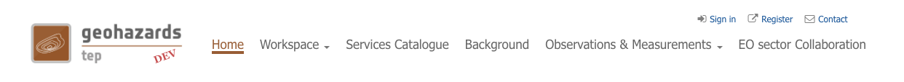

Menu bar
========

The menu bar is always visible, apart from the geobrowser page. It contains the following links:

- `Home`_,
- `Workspace`_,
_ `Services Catalogue`_,
_ `Background`_,
- `Observations & Measurements`_,
- `EO sector Collaboration`_

Home
----

A simple way to go back to the home page of the portal.

Workspace
---------

A direct access to the Thematic applications and Users Communities.

Services Catalogue
------------------

Description of the Processing services and Service Packs available on the platform.

Background
----------

What is Geohazards TEP, from what initiative was it created and what is it's purpose.

Observations & Measurements
---------------------------

A quick access to
	- Satellite Acquisitions (list of EO missions providing data contributions to the CEOS Seismic Hazards and Volcano Pilots),
	- EO based Measurements (definition of EO base measurements),
	- Other Data (definition of Other Data),
	- Featured Products (definition of Featured Products),
	- Publications (definition of Publications)

EO sector Collaboration
-----------------------

Description of partners and actors of the Geohazards initiative.
