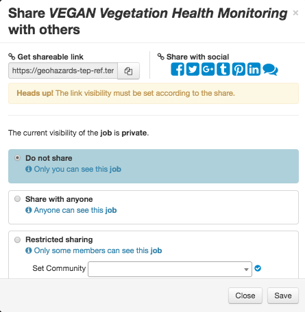
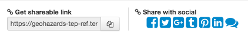
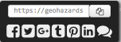
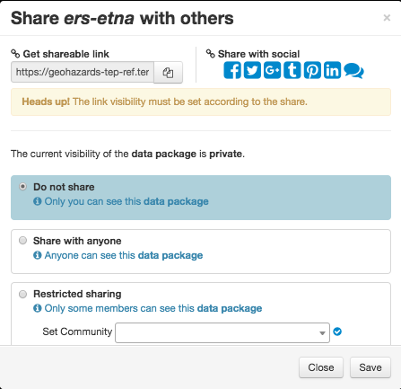

.. _community-guide-sharing-label:

Sharing
=======

.. figure:: ../includes/sharing.png
	:align: center
	:scale: 50%
	:figclass: img-container-border

Share your processing jobs and results with the community and allow other users to reproduce or modify your processes.
You can even share your favorite Processing Service or a data package you created.

Share with users
----------------

Whenever you want to share an object with users, you will see the following panel:

It will allow you to:

- make the object public (Share with anyone)
- make the object private (Do not share)
- make the object restricted to users and communities (Restricted sharing)

See below how `Sharing a wps job`_ or how `Sharing a data package`_ with users can be done.

Sharing a wps job
-----------------

On the geobrowser of your thematic application, go to the wps services panel and find the wps job you want to share.

If you are the owner of the data wps job, click on the Manage permissions button |manage| to open the permissions windows of the wps job.

You can set the permissions in the following way:

- Do not share *-- only you can access*
- Share with anyone *-- all users of the platform can access*
- Restricted sharing *-- only you and a set of users can access*
	- community *-- all users part of the community can access (only one community can be selected)*
	- users *-- all selected users can access*

Once the permissions set, users able to view the wps job can access it by:

- searching for it on the wps services panel of their thematic application
- directly via the shareable link (on the top of the permissions window)

You can also share the link directly on your favorite social network using the associated icon or on the discuss category of a community, using the button |discuss| (see `Sharing on the community blog`_).

If you are not the owner of the wps job, you can also share the link directly on your favorite social network using the associated icon or on the discuss category of a community, using the button |discuss| (see `Sharing on the community blog`_).

.. WARNING::
	 If you share the link with someone who has no permission to view this job, he will not be able to access it

Sharing a Processing Service
----------------------------

To share your favorite Processing Service:

1. Access the :doc:`Processing Service <platform/geobrowser>`.
2. Click on **Share** |share| to get the share link.
3. Copy the link in your clipboard and share it to members of the groups

.. WARNING::
	 If you share the link with someone not from one of the groups allowed to see this Processing Service, he will not be able to access it

4. Other users will now be able to access this Processing Service just by clicking on the link you will have share with them. The Processing Service will also appear in their list of available Processing Services.

Sharing a Data Package
----------------------

On the geobrowser of your thematic application, go to the Data package panel and find the data package you want to share.

Click on the Manage permissions button |manage| to open the permissions windows of the data package.

You can set the permissions in the following way:

- Do not share *-- only you can access*
- Share with anyone *-- all users of the platform can access*
- Restricted sharing *-- only you and a set of users can access*
	- community *-- all users part of the community can access (only one community can be selected)*
	- users *-- all selected users can access*

Once the permissions set, users able to view the data package can access it by:

- searching for it on the data package panel of their thematic application
- directly via the shareable link (on the top of the permissions window)

You can also share the link directly on your favorite social network using the associated icon or on the discuss category of a community, using the button |discuss| (see `Sharing on the community blog`_).

If you are not the owner of the wps job, you can also share the link directly on your favorite social network using the associated icon or on the discuss category of a community, using the button |discuss| (see `Sharing on the community blog`_).

.. WARNING::
	 If you share the link with someone not from one of the groups allowed to see this job, he will not be able to access it

.. req:: HEP-TS-DES-014
	:show:

	This section describes how a user can share a data package.

Sharing a Data Search
---------------------

To share a Data search you just performed:

1. Access the :doc:`Geobrowser <platform/geobrowser>`.
2. Perform a query (see :doc: `Discover Data<community-guide/data>`).
3. Click on **Share** |share|, just on the top of the list of results.
4. Copy the link in your clipboard and share it with your friends or share the link directly on your favorite social network
5. Other users will now be able to reproduce this search just by clicking on the link you will have share with them.

Sharing on the community blog
-----------------------------

You can share any object directly on your favorite social network using the associated icon or on the discuss category of a community, using the button |discuss|.

1. Select |discuss|
2. Some default values (including the link to the shared url in the current Thematic Application) are proposed for Title and description of the new posts. You can edit them if needed.
3. Select the community to which you want to share.
4. Click on **Share**, the post is automatically created on https://discuss.terradue.com under the category associated to the community you selected.

.. WARNING::
	 You will be set as author of the created post. Thus, you need to have an account on https://discuss.terradue.com.

.. |share| image:: ../includes/share_button.png

