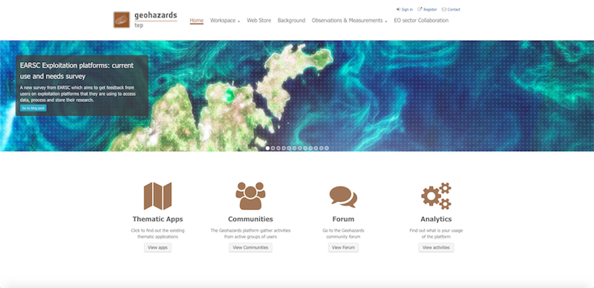
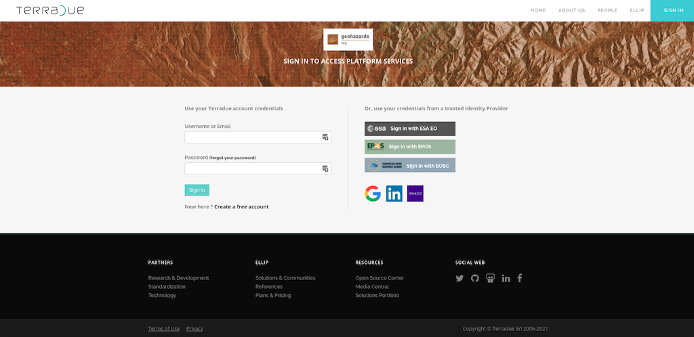
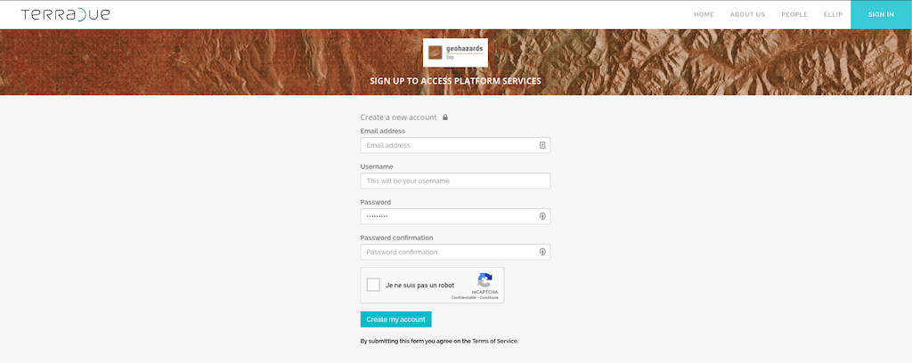
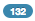
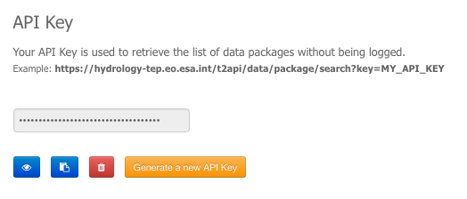
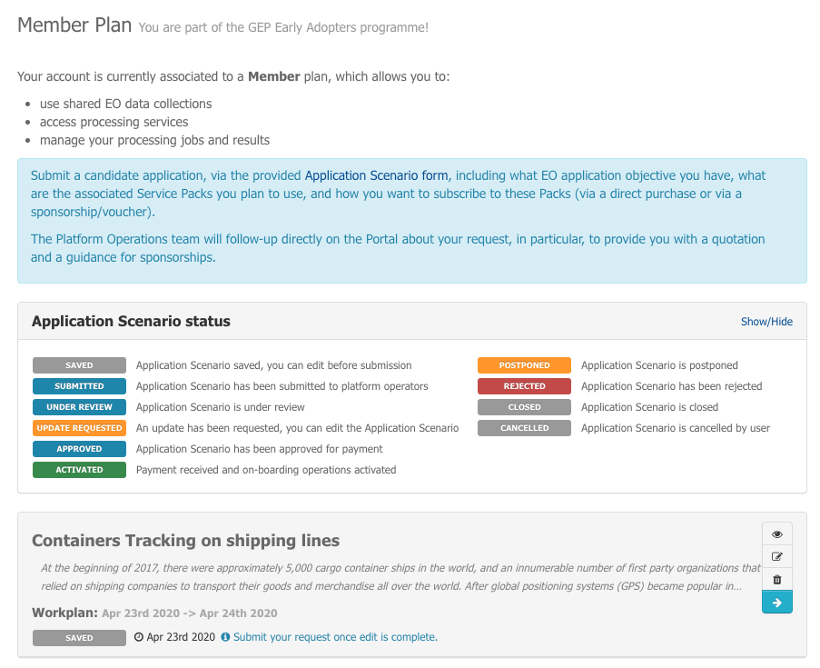
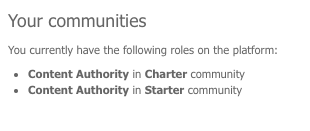
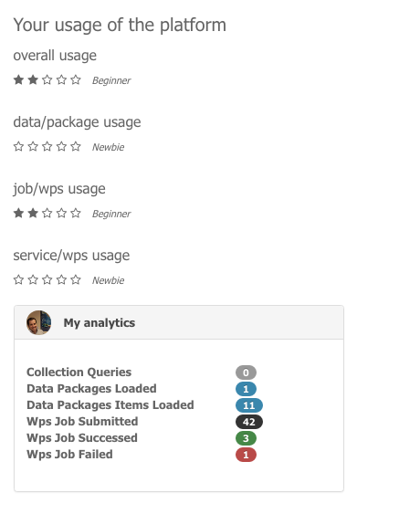

.. _user-profile:

User Profile
============

This sections provides a detailed description on how to sign-in on the Geohazards TEP platform and access your user profile.

Sign-in
-------

To sign-in on GEP, you need to have an account created on the Terradue platform.

	- `Have already an account on Terradue platform?`_
	- `Don't have yet an account on Terradue platform?`_
    
	    - `Create a new account from scratch`_
	    - `Create a new account from a trusted Identity Provider`_

Have already an account on Terradue platform?
~~~~~~~~~~~~~~~~~~~~~~~~~~~~~~~~~~~~~~~~~~~~~

1. Access the GEP Community Portal through the following URL: https://geohazards-tep.eu/#!. 



	Figure 1: The Geohazards TEP portal

2. Click on **Sign-in**, you are automatically redirected to the Terradue platform signin page.



	Figure 1: The Terradue platform signin page

3. Log in using your Terradue credentials or, use your credentials from a trusted Identity Provider (EO-IAM, EPOS, EOSC, google, linkedin, yahoo).

4. You are logged in on GEP

5. If not done, you can configure your account.

Don't have yet an account on Terradue platform?
~~~~~~~~~~~~~~~~~~~~~~~~~~~~~~~~~~~~~~~~~~~~~~~

Create a new account from scratch
`````````````````````````````````

1. Access the GEP Community Portal through the following URL: https://geohazards-tep.eu/#!. 


	Figure 1: The Geohazards TEP portal

2. Click on **Register**, you are automatically redirected to the Terradue platform registration page. 



	Figure 1: The Geohazards TEP portal

3. Fill in all required information and click on **Create my account**. An email is sent, asking to confirm your email address.

.. NOTE::
	Password must contain at least 8 characters, with at least one upper case lettre, one lower case letter, one integer and a special character (!, @, ?, ...).

4. Click on the link on the email to validate your account.

5. In a new tab, access again https://geohazards-tep.eu/#!

6. Click on **Sign-in**, you are automatically redirected to the Terradue platform signin page.


	Figure 1: The Terradue platform signin page

7. Log in using your Terradue credentials.

8. You are logged in on GEP

9. If not done, you can configure your account.

Create a new account from a trusted Identity Provider
`````````````````````````````````````````````````````
1. Access the GEP Community Portal through the following URL: https://geohazards-tep.eu/#!. 


	Figure 1: The Geohazards TEP portal

2. Click on **Sign-in**, you are automatically redirected to the Terradue platform signin page.


	Figure 1: The Terradue platform signin page

3. Click on the button corresponding to your external Identity Provider (EO-IAM, EPOS, EOSC, google, linkedin, yahoo).
4. Your account is automatically created on the Terradue platform.
5. You are logged in on GEP
6. If not done, you can configure your account.

Profile pages
-------------

Once logged in, your username will be displayed on the login menu (top right of the screen).

By clicking on your username, you will access your profile page.
The other icons give the following functionalities:

..
   - |user_signin_balance.png| Your current accounting balance (if greater than 0)

- |user_signin_settings.png| Access to administration settings (for users with special privileges)
- |user_signin_contactus.png| Link to contact the Geohazards Tep support team
- |user_signin_documentation.png| Link to the Geohazards Tep documentation
- |user_signin_logout.png| Log out from the portal


.. |user_signin_documentation.png| image:: ../includes/user_signin_documentation.png



Edit your profile
~~~~~~~~~~~~~~~~~

.. figure:: ../includes/user_profile.png
	:figclass: img-border
	:scale: 80%
	
Fill in your profile:

1. Edit information such as firstname and lastname, organization (username and email can not be modified).
2. Once you are done, just click on **Submit** to save your changes.

Data package Api key
~~~~~~~~~~~~~~~~~~~~

You can get a private API key associated to your account.
Currently this key can be used only to get access to your data packages without being logged in on the portal:
e.g: https://geohazards-tep.eu/t2api/data/package/search?key=MY_API_KEY



Application Scenario
~~~~~~~~~~~~~~~~~~~~

You can submit from here a new candidate application and follow it's progress and status.
A dedicated Application Scenario form will guide you in the process of defining your application.
Once submitted, the Platform Operations team will follow-up directly on the Portal about your request, in particular, to provide you with a quotation and a guidance for sponsorships.



Github account
~~~~~~~~~~~~~~

.. figure:: ../includes/user_github.png
	:figclass: img-border
	:scale: 70%

Linking your Github account to your profile will allow you to use Github as your Software repository for your developments on a Cloud  resource of the Platform, such as a Developer Cloud Sandbox virtual machine. You can also release and share your code on GitHub.

..note:: Link your github account is not mandatory but highly recommanded.

To link your Github account:

1. Fill in your Github name and validate by clicking on |user_github_edit.png|.
2. You should add a SSH public key to your Github account, click on **Add your public key** and finally accept the request on your Github account.

.. |user_github_edit.png| image:: ../includes/user_github_edit.png

My granted roles
~~~~~~~~~~~~~~~~

To find out which roles have been assigned to you in your communities, just go to the **My granted roles** tab on your profile page.
The communities for which you are a member are listed here, along with your role in it.



My notebooks
~~~~~~~~~~~~

Direct access to your Jupyter notebooks are provided from the **My notebooks** tab, according to your subscription plan.

Usage
~~~~~

To find out how you are using the platform, just go to the **Usage** tab on your profile page.
You will see what is your level for each type of usage of the platform.




To find out more precisely the number of data packages you loaded, the number of jobs you created, how many failed or were successful, ... Just go the **Analytics** page from the portal homepage.
You will see:

- how many data collection you loaded
- how many data packages and items you loaded
- how many wps jobs you created and how many failed or succeeded

.. req:: GEP-TS-ICD-010
    :show:

    This section shows that the platform has an analytics web widget.
