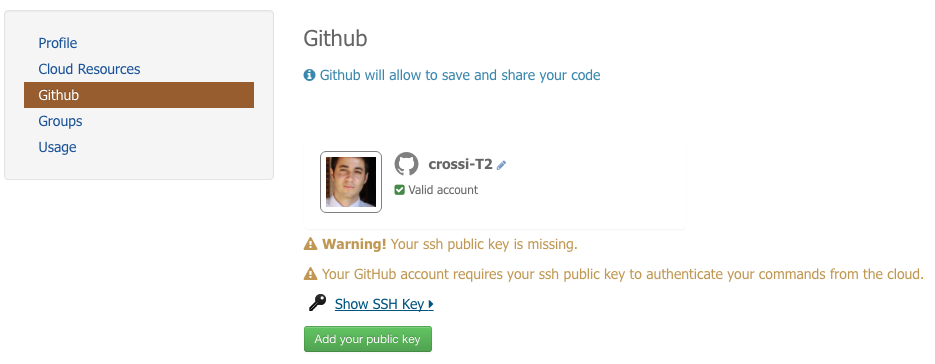

.. _user-profile:

User Profile
============

.. figure:: ../includes/user.png
	:align: center
	:width: 30%
	:figclass: img-container-border

Find out how to sign-in using **EO-SSO**, access your **Cloud** resources or even link your profile with your **Github** account.

Sign-in
-------

Once registered on ESA EO Single Sign On (EO-SSO), you can simply sign-in using the username and password provided by ESA and you will be automatically redirected to the platform homepage.
At the first access, you may be asked to check your inbox in order to confirm your address

.. figure:: ../includes/email_confirmation1.png
	:figclass: img-border
	:scale: 80%

If you never received the confirmation email, you can ask the system to send it again by clicking on the link **send again the confirmation email**:

.. figure:: ../includes/email_confirmation2.png
	:figclass: img-border
	:scale: 80%

After clicked the link received by email, you'll be able to see your profile page of the portal.

Edit your profile
-----------------

.. figure:: ../includes/user_profile.png
	:figclass: img-border
	:scale: 80%
	
Fill in your profile:

1. Edit information such as first and last names, email, ... (username can not be modified though).
2. Once you are done, just click on **Submit** to save your changes.

.. NOTE::
		Direct access to your EO-SSO account is provided by clicking on *EO-SSO account*.

Change your password
--------------------

To change your EO-SSO password:

1. On your profile page, click on **EO-SSO account**.
2. On the EO-SSO account page, click on **Change user password**.
3. Write your old password, and your new password (twice).
4. Click on **Submit**.
5. Your password is updated.

.. NOTE::
    If your EO-SSO password is different from the one recorded in your profile, a message will appear in your profile (see image below).

.. figure:: ../includes/user_profile_email_change.png
	:figclass: img-border

Access the Cloud Resources
--------------------------

To access the Cloud resources, you will need to have an account on the Terradue Cloud Platform. To create an account:

1. On your profile page, click on **Cloud Resources**
2. Click on **Create**

3. Follow the instructions and see the Terradue Cloud Platform logo:

Just click on it to be redirected to the Cloud Dashboard, see :doc:`Cloud Dashboard <cloud/dashboard>`).

Link your Github account
------------------------

Link your Github account to your profile will allow you to use Github as Software repository for the developments on your Developer Cloud Sandboxes. You can also release and share your code there.

..note:: Link your github account is not mandatory but highly recommanded.

To link your Github account:

1. Fill in your Github name and validate by clicking on |user_github_edit.png|.
2. You should add a SSH public key to your Github account and finally click on **Add your public key** and accept the request on your Github account.

.. |user_github_edit.png| image:: ../includes/user_github_edit.png

See your groups
---------------

To find out to which groups you belong, just go to the **Groups** tab on your profile page.
The groups in which you are a member are listed here.

See your usage
--------------

To find out how you are using the platform, just go to the **Usage** tab on your profile page.
You will see what is your level for each type of usage of the platform.
