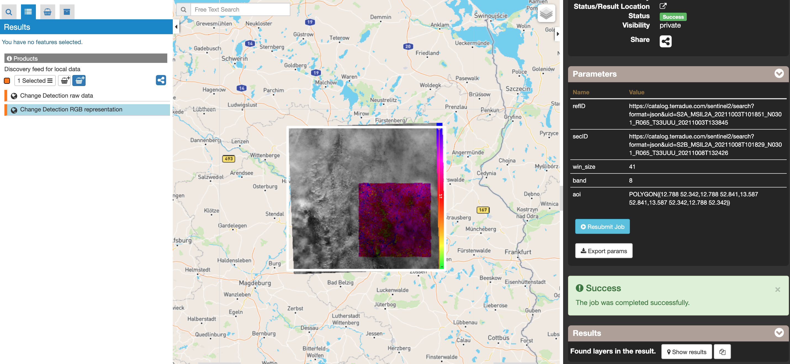

Change Detection Analysis
~~~~~~~~~~~~~~~~~~~~~~~~~~~~~~~~~~~~~~~~~~~

The *Change Detection Analysis* is a processing service developed and maintained by NHAZCA S.r.l. (https://www.nhazca.it/en/). The service allows the processing of optical image pairs for the monitoring of Earth surface changes using the Structural Similarity Index Measure (SSIM), providing geocoded change map from a pair of Sentinel-2 images. 

**EO sources supported**

- Sentinel-2 MSI L1C
- Sentinel-2 MSI L2A

**Output specifications**

The service provides the following output products:

- Change Detection RGB map: it consists of a RGB GeoTIFF image in which the change values (ranging from 0 to 1, i.e. from highest change to no change) are converted to a coloured overlay map which is superimposed to the reference image to create an easily and immediately understandable product. A colorbar is also attached to the right side of the image.

- Change Detection RAW map: it consists of a single-band GeoTIFF image containing the raw value of the change value (SSIM) for each pixel of the analysed area.

This tutorial describes the processing of a pair of Sentinel-2 MSI images to generate a Change Detection map.
The service calculates the changes occurred in the secondary image with respect to the reference image using the SSIM which is defined as:
   
.. figure:: assets/iris_formula.png
	:figclass: align-center
        :width: 350px
        :align: center
   
where μx (μy), σx (σy) and σxy are, respectively, the average (weighted with a Gaussian filter), standard deviation and cross-covariance for x (y) image patch, C1 and C2 are variables which depends on the dynamic range of the pixels.
The SSIM is computed on a sliding window (patch) of fixed size and the value is assigned to the central pixel of the window resulting in a map with a SSIM value for each pixel in the range from 0 (maximum change) to 1 (no change detected). The overall analysed area is the intersection between the AOI that can be optionally specified in the parameters, the reference and the secondary Sentinel-2 images chosen as input products. 

The SSIM is computed on a sliding window (patch) of fixed size and the value is assigned to the central pixel of the window resulting in a map with a SSIM value for each pixel in the range from 0 (maximum change) to 1 (no change detected). The overall analysed area is the intersection between the AOI that can be optionally specified in the parameters, the reference and the secondary Sentinel-2 images chosen as input products. 

Select the processing
=====================

* Login to the platform (see :doc:`user <../community-guide/user>` section)

* Select the processing service “Change Detection Analysis”:

The “Change Detection Analysis” panel is displayed with parameters values to be filled-in.

        
        
Fill the parameters
===================

Reference image
---------------

* Select the Sentinel-2 data collection in the EO Data button.

        
* Select the area for which you want to do an anlysis, e.g over Roma (Italy). <test site>

* Click on the lens icon to open the Search Panel and select **S2MSI1C** or **S2MSI2A** as Product Type in the Search Panel.
* Apply the date value, for example **2021-10-01** in both **time:start** and **2021-10-09** in **time:end** fields

        

* Drag and Drop the selected item in the *reference image* input field:

        
        
.. Note:: *Reference image* input can be picked up directly by using the following text filter: <product name>

Secondary image 
---------------

* Perform the same procedure described previously (Reference image), using the value <test date sec>.

* Pick one of the results having the same track, then drag and drop it in the secondary image input field.

        
        
.. Note:: Secondary image input can be picked up directly by using the following text filter: <product name>

Band
---------------

The band to use for the analysis, it can be a number between 1 and 12 or a string identifying one of the L2A specific bands as they appear in the Sentinel-2 product (e.g. “WVP” for the Water Vapor map, “AOT” for Aerosol Optical Thickness map, etc.), if the same band is present at different Ground Sample Distance (GSD), the lowest GSD will be automatically selected and used. The output maps will have the same GSD of the selected band.

        
        
Window Size
---------------

Defines the size in pixels of the sliding window, can highly influence the result of the analysis. The higher this parameter is set, the more averaged the change map will be, while the smaller and the more detailed changes can be identified at the cost of a potentially noisier results. This is due to the SSIM value for each pixel being computed using the information present in the whole sliding window, thus obtaining a more localized value of the index in case of a smaller window. As a rule of thumb, the dimension of the window should be set in a range between 9 and 71 (note that this parameter should always be odd, if the user set it to an even number it will be automatically converted to the higher closest odd number), depending of the type of changes that the user wants to identify

Area Of Interest in WKT (optional)
---------------

* Click on the *Magic tool wizard* and select **AOI**. The input parameter is automatically filled with the WKT representing the area selected.

        
.. Note:: you can also specify manually a different AOI in WKT format, or draw a new area on the map using the search tool and get its value from the *Magic tool wizard*.

Run the job
===========

* Click on the button Run Job and see the Running Job

* After a few minutes, see the Successful Job:

        
        
Results: download and visualization
===================================

* Click on the button *Show results*

* See the result on map:

        
* The following output files are produced:

  - **Change Detection RGB map - product GeoTIFF RGB**
  - **Change Detection RAW map**

References
===================================

Wang, Z.; Bovik, A. C.; Sheikh, H. R.; Simoncelli, E. P. (2004). Image quality assessment: from error visibility to structural similarity. IEEE transactions on image processing, 13(4), 600-612.
