DLR Sentinel-1 InSAR Browse
~~~~~~~~~~~~~~~~~~~~~~~~~~~~~~~~~~~~~~~~~~~

**DLR Sentinel-1 InSAR Browse**

This service generates 10 InSAR browse products from a pair of Sentinel-1 SLC images over seismically active areas and active volcanoes using DLR’s Integrated Wide Area Processor (IWAP). It has a max resolution of 50 and a spacing of 25 metres.

**EO sources supported**

    - Sentinel-1 SLC

**Output specifications**

+-------------------------------+-----------------------------------------------------------------------------------------------------------------+
| Output – Amplitude Change Composite                                                                                                             |
+===============================+=================================================================================================================+
| **Correspondent file**        | S-1 High-Resolution InSAR Browse Service - Amplitude Change Composite 					  |
+-------------------------------+-----------------------------------------------------------------------------------------------------------------+
| **Raster format**             | GeoTIFF 													  |
+-------------------------------+-----------------------------------------------------------------------------------------------------------------+
| **resolution**                | Native 													  |
+-------------------------------+-----------------------------------------------------------------------------------------------------------------+
| **Projection types**          | EPSG:3857 - WGS84 – Pseudo Mercator 										  |
+-------------------------------+-----------------------------------------------------------------------------------------------------------------+
| **Output Filename example**   | S-1 High-Resolution InSAR Browse Service - Amplitude Change Composite - 2019-07-04T08:21:14 2019-07-16T08:21:40 |
+-------------------------------+-----------------------------------------------------------------------------------------------------------------+

+-------------------------------+--------------------------------------------------------------------------------------------------------------------+
| Output – Coherence Amplitude Composite                                                                                                             |
+===============================+====================================================================================================================+
| **Correspondent file**        | S-1 High-Resolution InSAR Browse Service - Coherence Amplitude Composite					     |
+-------------------------------+--------------------------------------------------------------------------------------------------------------------+
| **Raster format**             | GeoTIFF                                                                                                            |
+-------------------------------+--------------------------------------------------------------------------------------------------------------------+
| **resolution**                | Native		                                                                                             |
+-------------------------------+--------------------------------------------------------------------------------------------------------------------+
| **Projection types**          | EPSG:3857 - WGS84 – Pseudo Mercator                                                                          	     |
+-------------------------------+--------------------------------------------------------------------------------------------------------------------+
| **Output Filename example**   | S-1 High-Resolution InSAR Browse Service - Coherence Amplitude Composite - 2019-07-04T08:21:14 2019-07-16T08:21:40 |
+-------------------------------+--------------------------------------------------------------------------------------------------------------------+

+-------------------------------+--------------------------------------------------------------------------------------------------------------------+
| Output – Coherence Terrain Corrected                                                                                                               |
+===============================+====================================================================================================================+
| **Correspondent file**        | S-1 High-Resolution InSAR Browse Service - Coherence Terrain Corrected					     |
+-------------------------------+--------------------------------------------------------------------------------------------------------------------+
| **Raster format**             | GeoTIFF                                                                                                            |
+-------------------------------+--------------------------------------------------------------------------------------------------------------------+
| **resolution**                | Native		                                                                                             |
+-------------------------------+--------------------------------------------------------------------------------------------------------------------+
| **Projection types**          | EPSG:3857 - WGS84 – Pseudo Mercator                                                                          	     |
+-------------------------------+--------------------------------------------------------------------------------------------------------------------+
| **Output Filename example**   | S-1 High-Resolution InSAR Browse Service - Coherence Terrain Corrected - 2019-07-04T08:21:14 2019-07-16T08:21:40   |
+-------------------------------+--------------------------------------------------------------------------------------------------------------------+

+-------------------------------+----------------------------------------------------------------------------------------------------------------------------+
| Output – Coherence Terrain Corrected - Byte                                                                                                                |
+===============================+============================================================================================================================+
| **Correspondent file**        | S-1 High-Resolution InSAR Browse Service - Coherence Terrain Corrected - Byte 					     |
+-------------------------------+----------------------------------------------------------------------------------------------------------------------------+
| **Raster format**             | GeoTIFF                                                                                                            	     |
+-------------------------------+----------------------------------------------------------------------------------------------------------------------------+
| **resolution**                | Native		                                                                                            	     |
+-------------------------------+----------------------------------------------------------------------------------------------------------------------------+
| **Projection types**          | EPSG:3857 - WGS84 – Pseudo Mercator                                                                          	     	     |
+-------------------------------+----------------------------------------------------------------------------------------------------------------------------+
| **Output Filename example**   | S-1 High-Resolution InSAR Browse Service - Coherence Terrain Corrected - Byte - 2019-07-04T08:21:14 2019-07-16T08:21:40    |
+-------------------------------+----------------------------------------------------------------------------------------------------------------------------+

+-------------------------------+---------------------------------------------------------------------------------------------------------------------------------+
| Output – Interferometric Phase Terrain Corrected                                                                                                                |
+===============================+=================================================================================================================================+
| **Correspondent file**        | S-1 High-Resolution InSAR Browse Service - Interferometric Phase Terrain Corrected 					          |
+-------------------------------+---------------------------------------------------------------------------------------------------------------------------------+
| **Raster format**             | GeoTIFF                                                                                                            	          |
+-------------------------------+---------------------------------------------------------------------------------------------------------------------------------+
| **resolution**                | Native		                                                                                            	          |
+-------------------------------+---------------------------------------------------------------------------------------------------------------------------------+
| **Projection types**          | EPSG:3857 - WGS84 – Pseudo Mercator                                                                          	     	          |
+-------------------------------+---------------------------------------------------------------------------------------------------------------------------------+
| **Output Filename example**   | S-1 High-Resolution InSAR Browse Service - Interferometric Phase Terrain Corrected - 2019-07-04T08:21:14 2019-07-16T08:21:40    |
+-------------------------------+---------------------------------------------------------------------------------------------------------------------------------+

+-------------------------------+---------------------------------------------------------------------------------------------------------------------------------+
| Output – Interferometric Phase Terrain Corrected - Byte													  |
+===============================+=================================================================================================================================+
| **Correspondent file**        | S-1 High-Resolution InSAR Browse Service - Interferometric Phase Terrain Corrected - Byte 					  |
+-------------------------------+---------------------------------------------------------------------------------------------------------------------------------+
| **Raster format**             | GeoTIFF                                                                                                            	          |
+-------------------------------+---------------------------------------------------------------------------------------------------------------------------------+
| **resolution**                | Native		                                                                                            	          |
+-------------------------------+---------------------------------------------------------------------------------------------------------------------------------+
| **Projection types**          | EPSG:3857 - WGS84 – Pseudo Mercator                                                                          	     	          |
+-------------------------------+---------------------------------------------------------------------------------------------------------------------------------+
| **Output Filename example**   | S-1 High-Resolution InSAR Browse Service - Interferometric Phase Terrain Corrected - Byte - 2019-07-04T08:21:14 2019-07-        |
|				| 16T08:21:40															  |
+-------------------------------+---------------------------------------------------------------------------------------------------------------------------------+

+-------------------------------+---------------------------------------------------------------------------------------------------------------+
| Output – Master Amplitude 			                                                                                                |
+===============================+===============================================================================================================+
| **Correspondent file**        | S-1 High-Resolution InSAR Browse Service - Master Amplitude 							|
+-------------------------------+---------------------------------------------------------------------------------------------------------------+
| **Raster format**             | GeoTIFF                                                                                                       |
+-------------------------------+---------------------------------------------------------------------------------------------------------------+
| **resolution**                | Native		                                                                                        |
+-------------------------------+---------------------------------------------------------------------------------------------------------------+
| **Projection types**          | EPSG:3857 - WGS84 – Pseudo Mercator                                                                           |
+-------------------------------+---------------------------------------------------------------------------------------------------------------+
| **Output Filename example**   | S-1 High-Resolution InSAR Browse Service - Master Amplitude - 2019-07-04T08:21:14 2019-07-04T08:21:39		|
+-------------------------------+---------------------------------------------------------------------------------------------------------------+

+-------------------------------+---------------------------------------------------------------------------------------------------------------+
| Output – Shifts Azimuth 			                                                                                                |
+===============================+===============================================================================================================+
| **Correspondent file**        | S-1 High-Resolution InSAR Browse Service - Shifts Azimuth 							|
+-------------------------------+---------------------------------------------------------------------------------------------------------------+
| **Raster format**             | GeoTIFF                                                                                                       |
+-------------------------------+---------------------------------------------------------------------------------------------------------------+
| **resolution**                | Native		                                                                                        |
+-------------------------------+---------------------------------------------------------------------------------------------------------------+
| **Projection types**          | EPSG:3857 - WGS84 – Pseudo Mercator                                                                           |
+-------------------------------+---------------------------------------------------------------------------------------------------------------+
| **Output Filename example**   | S-1 High-Resolution InSAR Browse Service - Shifts Azimuth - 2019-07-04T08:21:14 2019-07-16T08:21:40		|
+-------------------------------+---------------------------------------------------------------------------------------------------------------+

+-------------------------------+---------------------------------------------------------------------------------------------------------------+
| Output – Shifts Range 			                                                                                                |
+===============================+===============================================================================================================+
| **Correspondent file**        | S-1 High-Resolution InSAR Browse Service - Shifts Range 							|
+-------------------------------+---------------------------------------------------------------------------------------------------------------+
| **Raster format**             | GeoTIFF                                                                                                       |
+-------------------------------+---------------------------------------------------------------------------------------------------------------+
| **resolution**                | Native		                                                                                        |
+-------------------------------+---------------------------------------------------------------------------------------------------------------+
| **Projection types**          | EPSG:3857 - WGS84 – Pseudo Mercator                                                                           |
+-------------------------------+---------------------------------------------------------------------------------------------------------------+
| **Output Filename example**   | S-1 High-Resolution InSAR Browse Service - Shifts Range - 2019-07-04T08:21:14 2019-07-16T08:21:40		|
+-------------------------------+---------------------------------------------------------------------------------------------------------------+
    
+-------------------------------+---------------------------------------------------------------------------------------------------------------+
| Output – Slave Amplitude 			                                                                                                |
+===============================+===============================================================================================================+
| **Correspondent file**        | S-1 High-Resolution InSAR Browse Service - Slave Amplitude 							|
+-------------------------------+---------------------------------------------------------------------------------------------------------------+
| **Raster format**             | GeoTIFF                                                                                                       |
+-------------------------------+---------------------------------------------------------------------------------------------------------------+
| **resolution**                | Native		                                                                                        |
+-------------------------------+---------------------------------------------------------------------------------------------------------------+
| **Projection types**          | EPSG:3857 - WGS84 – Pseudo Mercator                                                                           |
+-------------------------------+---------------------------------------------------------------------------------------------------------------+
| **Output Filename example**   | S-1 High-Resolution InSAR Browse Service - Slave Amplitude - 2019-07-16T08:21:15 2019-07-16T08:21:40		|
+-------------------------------+---------------------------------------------------------------------------------------------------------------+
    
  
Select the processing
=====================

* Login to the platform (see :doc:`user <../community-guide/user>` section)

* Select the processing service “DLR Sentinel-1 InSAR Browse”:

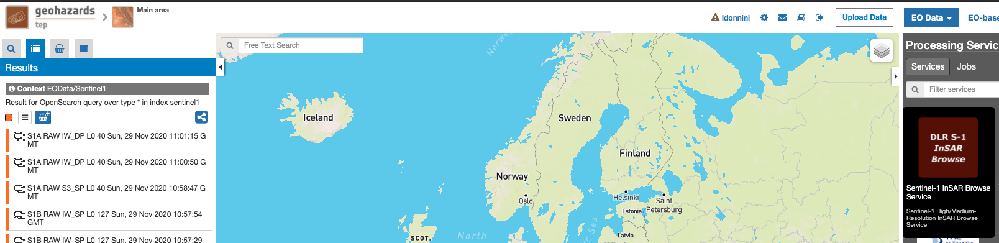

The "DLR Sentinel-1 InSAR Browse" panel is displayed with parameters values to be filled-in.

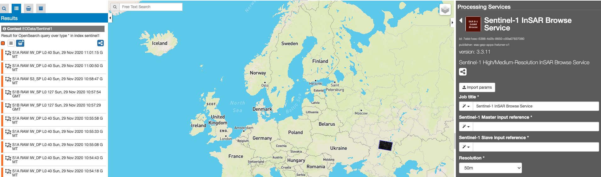

Fill the parameters
===================

Reference input
---------------

* Select the Sentinel-1 data collection in the EO Data button.

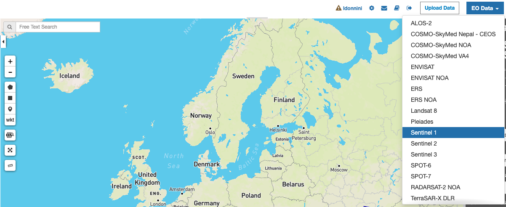

* Select the area for which you want to do an anlysis, e.g over Brasil.

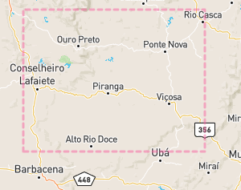

* Click on the lens icon to open the Search Panel
* Select **SLC** as Product Type

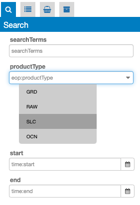

* Drag and Drop two items with the same tile, one for each of the fields: **Sentinel-1 Master input reference** and **Sentinel-1 Slave input reference**:

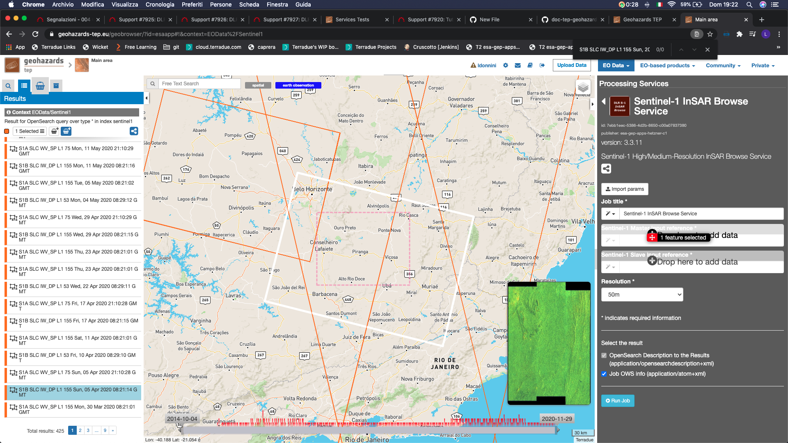
	
* Select one of the two possible choices for the **Resolution** field.

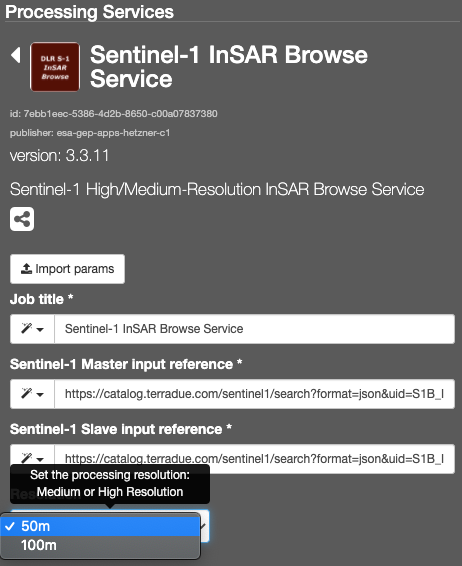

Run the job
===========

* Click on the button Run Job and see the Running Job

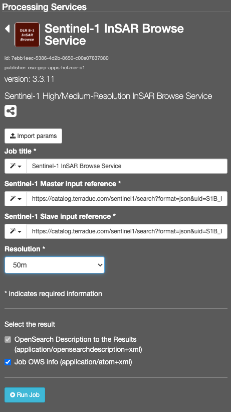
	
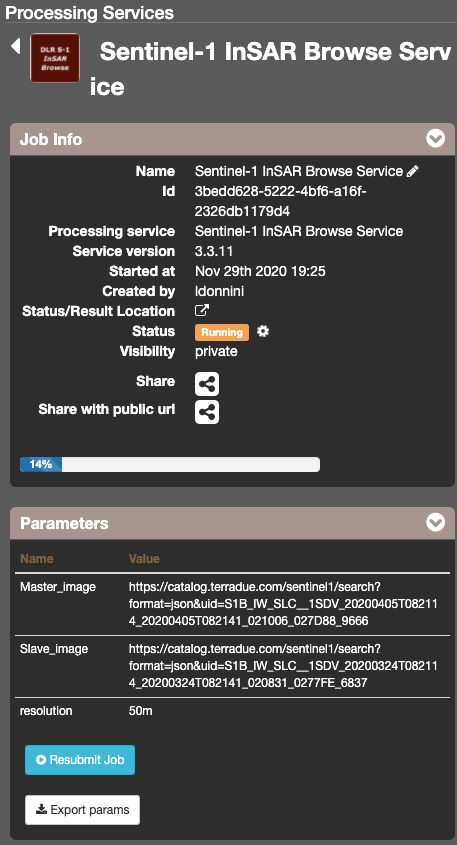

* After about 3 hours, see the Successful Job:

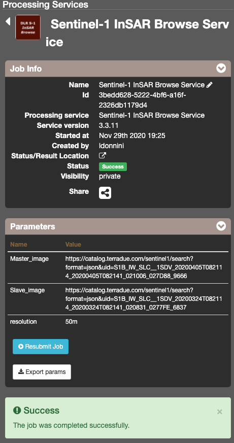

Results: download and visualization
===================================

* Click on the button *Show results*

* See the result on map:

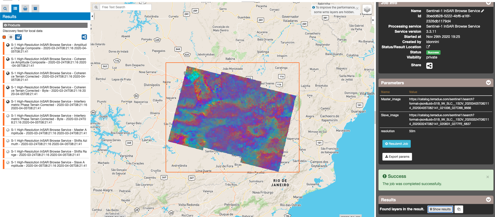

* The following files are produced:

    - **S-1 High-Resolution InSAR Browse Service - Amplitude Change Composite - 2019-07-04T08:21:14 2019-07-16T08:21:40 - product GeoTIFF**
    - **S-1 High-Resolution InSAR Browse Service - Coherence Amplitude Composite - 2019-07-04T08:21:14 2019-07-16T08:21:40 - product GeoTIFF**
    - **S-1 High-Resolution InSAR Browse Service - Coherence Terrain Corrected - 2019-07-04T08:21:14 2019-07-16T08:21:40 - product GeoTIFF**
    - **S-1 High-Resolution InSAR Browse Service - Coherence Terrain Corrected - Byte - 2019-07-04T08:21:14 2019-07-16T08:21:40 - product GeoTIFF** 
    - **S-1 High-Resolution InSAR Browse Service - Interferometric Phase Terrain Corrected - 2019-07-04T08:21:14 2019-07-16T08:21:40 - product GeoTIFF**
    - **S-1 High-Resolution InSAR Browse Service - Interferometric Phase Terrain Corrected - Byte - 2019-07-04T08:21:14 2019-07-16T08:21:40 - product GeoTIFF**
    - **S-1 High-Resolution InSAR Browse Service - Master Amplitude - 2019-07-04T08:21:14 2019-07-04T08:21:39 - product GeoTIFF**
    - **S-1 High-Resolution InSAR Browse Service - Shifts Azimuth - 2019-07-04T08:21:14 2019-07-16T08:21:40 - product GeoTIFF**
    - **S-1 High-Resolution InSAR Browse Service - Shifts Range - 2019-07-04T08:21:14 2019-07-16T08:21:40 - product GeoTIFF**
    - **S-1 High-Resolution InSAR Browse Service - Slave Amplitude - 2019-07-16T08:21:15 2019-07-16T08:21:40 - product GeoTIFF**
