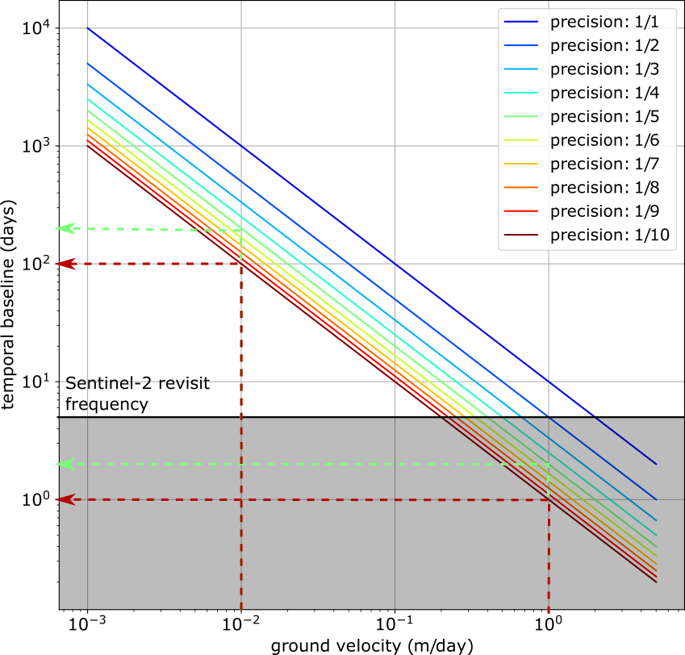
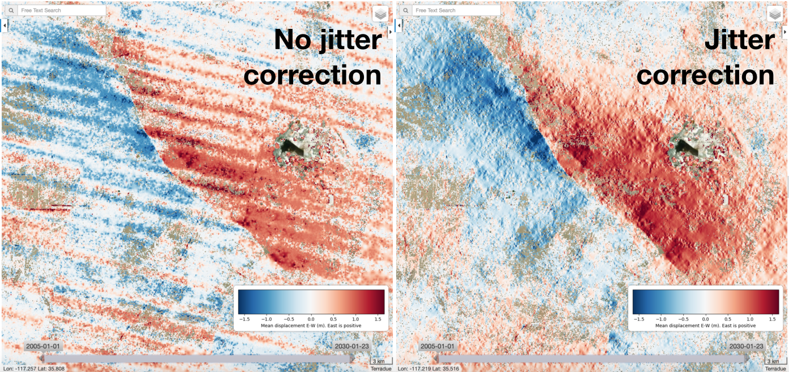

Frequently Asked Questions about GDM-OPT
~~~~~~~~~~~~~~~~~~~~~~~~~~~~~~~~~~~~~~~~

This page is answering the frequently Asked Questions about the GDM-OPT services. It explains briefly the principle of Image Matching techniques and the influence of the main parameters. For more detailed information on each of the GDM-OPT services (i.e. -ETQ, -ICE and -SLIDE) the user can read their respective tutorial. For more information, the user is referred to the litterature. This guide provides some help and advises about certain parameters. However, the user is responsible for his/her choice and No warranty is provided on the processors and results of the services.

The questions addressed in this FAQ are:

1) What is the principle behind the GDM-OPT? 
2) How is the measure performed?
3) What kind of movement can be measured?
4) How to select the input images?
5) How to set the minimum and maximum matching range parameters?
6) How to chose the band?
7) What algorithm to chose between MicMac and GeFolki?
8) How to set the threshold for the correlation in the MicMac algorithm?
9) What masking option are available and how to chose them?
10) When setting the across-track (or jitter) correction?
11) How to set up the inversion parameters?

1) What is the principle behind the GDM-OPT?
=============================================

GDM-OPT stands for Ground Deformation Monitoring with OPtical image Time series and is the current name for the former MPIC-OPT service (Multi-Pairwise Image Correlation for OPTical images). The output of the GDM-OPT services is to measure the displacement of the pixels within a satellite image. To do so, GDM-OPT uses Image matching or Optical Flow techniques to find similar patterns within different images. Two main approaches exist to compute the offsets between pair(s) of images: a) the image matching approach that computes a similarity function over a sliding window to determine the new position of an object and b) the optical flow approach that consists in retrieving the object motion by solving the brightness consistency equation for the whole image.
The displacement of the pixel is computed for numerous pairs of images allowing to retrieve an estimation of the mean velocity, to detect persistent motion and to invert the displacement time series of each pixel.

2) How is the measure performed?
================================

The GDM-OPT services offer the possibility to use two different algorithms to measure the pixel motion for each pair of image:
  * the **MicMac** algorithm [1]_ that follows a hierarchical matching scheme using normalized cross-correlation (NCC) with a non-linear cost function and spatial regularization to eliminate outliers. Sub-pixel resolution is achieved through step-wise interpolation of the input images which is computationally expensive but also more precise [2]_.
  * the **GeFolki** algorithm [3]_ allows the registration of images in a non-parametric and dense way using an Optical Flow approach. The main assumption of Optical Flow is that pixel intensity remains constant from one image to another one: I1(x) = I2(x+u(x)). The algorithm consists in solving this equation. The main limitations of optical flow remain on its sensitivity to strong changes in the images that prevents the technique to retrieve the motion associated to large displacement or to images with strong illumination differences (e.g. winter vs. summer acquisitions).

Figure: Definition of the Optical Flow variables (from [3]).

3) What kind of movement can be measured?
=========================================

These approaches can measured the pixel motion in the two dimensions of the images. In the case of optical images acquired by space-borne sensor such as the Copernicus Sentinel-2 satellites, the images (Level L1C) are coregistered and collocated in the geographical reference. The MPIC-OPT service can hence measure the **displacement of the pixels in the North-South and East-West directions**. **No vertical motion** is provided by the MPIC-OPT services. Moreover, Image Matching precision is usually of 1/10th to 1/5th of pixel meaning it can detect motion of this magnitude (or larger). In the case of Sentinel-2, the pixel size is 10 meters so the precision is around 1 to 2 meters. Hence, **only movement equal or larger than 1 or 2 meters between two dates of Sentinel-2 acquisition can be measure by the MPIC-OPT services**. 

4) How to select the input images?
==================================

The user can visualize which tile of the Sentinel-2 acquisitions encompasses the better his Area of Interest (AOI). Only **Sentinel-2 L1C images** are ingested by GDM-OPT so the user should set the proper filter to retrieve the full archive of L1C acquisitions. 

.. image:: assets/tuto_faq_mpic_Figure2.png

In order to reduce the computing time and resources used, it is strongly advised that the user filter out images with a large density of clouds (> 20% for instance). 

.. image:: assets/tuto_faq_mpic_Figure3.png

Moreover, it is advised to select images of the same relative orbit by filtering the « track » of interest to reduce systemic shift between Sentinel-2 acquisitions of different relative orbits and increase the noise in the displacement estimation.

5) How to set the minimum and maximum matching range parameters?
================================================================

The definition of these parameters, especially the minimum matching range, is critical to retrieve the correct magnitude of the ground velocity. One can see the influence of these parameters over the European Alps (Figure below) where short temporal baselines (0-100 days) provide a measure of fast motion (> 200 m/year) on the upper part of several glaciers while long temporal baselines (500-1500 days) provide a measure of slow motion (< 50 m/year) on the lower part of some glaciers.

.. image:: assets/tuto_faq_mpic_Figure4.png

The minimum matching (i.e. the minimum temporal duration to compare two images) is particularly important in the case of slow movement. Indeed, pairs with short temporal baseline are likely to provide no estimation of slow movement and hence will add up noise into the estimation of the ground displacement. Conversely, in the case of fast motion creating pairs with long temporal baselines may introduce noise because of the rapid change of the ground texture preventing a good correlation or constant intensity. 

Of course, « slow » and « fast » are relative terms. If the user knows approximately the range of velocity he/she is trying to measure the temporal baseline can be computed as: T = s*p/v where T stands for the temporal baseline, s for the image matching precision, p for the pixel size and v for the velocity of the ground. For Sentinel-2, the pixel size is 10 m and the precision of most algorithms range from 1/5th to 1/10th of pixel and highly depends on the chosen parameters/filters [4]. The temporal baseline can hence be retrieved from the a priori knowledge of the ground velocity.

.. Note:: *Practical example: The ground velocity is expected to range from 1cm/day to 1m/day. If the parameters are set so that the precision is 1/10th of a pixel, the temporal baseline should range from 1 to 100 days to capture the ground motion (red lines). If the precision is 1/5th of pixel, the temporal baselines should range from 2 to 200 days (green lines).*

It is difficult to guess in advance the precision of the results so it is strongly advised to consider scenarii with worse precision. Moreover, [4] observed seasonal variations of the precision with a decrease of the precision for pairs of different season that should be taken into account in the computation. 

Finally, if the user has no a priori idea of the ground velocity, it is advised to run a first processing with the option « acquisitions » for the parameter « matching mode ». So the pairing will consider successive acquisitions of different cycle lengths to estimate the ground motion. Eventually, a second run will be necessary to improve the SNR of the outputs.

6) How to chose the band?
=========================

There are three bands accessible for Sentinel-2 inputs: B02 (Blue), B03 (Green), B04 (Red) and B08 (infra-red). The displacement is computed for one of these four bands. As these bands are sensitive to different ground color, the GDM-OPT outputs may differ using one band or another. It is of the user’s interests to check which motion pattern is visible (or not) using the different bands. By default, band 04 is user as it is the band the Sentinel-2 geometry is calibrated on. For different application other band may be preferable (for instance, glacier studies often use the infra-red band).

7) What algorithm to chose between MicMac and GeFolki?
======================================================

As mentioned in question 2, the two algorithms use different assumptions and computational strategies to measure the ground displacement within images. 

.. image:: assets/tuto_faq_mpic_Figure7.png

The figure shows the outputs of the two algorithms for the Slumgullion landslide. As one can see the results are slightly noisier for the GeFolki algorithm in comparison with the MicMac algorithm. In general, [4] found that the GeFolki performs less good than the MicMac algorithm in term of sub-pixel precision. However, the GeFolki algorithm offer a very efficient and quick solution that can be interesting in the case the user needs a fast results or wants to process many tests at a low cost (i.e. using few computing time and resources).

8) How to set the threshold for the correlation in the MicMac algorithm?
========================================================================

.. image:: assets/tuto_faq_mpic_Figure8.png

Another important parameter in the case the user uses the MicMac algorithm is the choice of the correlation threshold. This parameter controls the quality of the correlation and pixel whose Normalize Cross-Correlation values are lower than the threshold will be discarded in the next steps of the processing. The figure shows the influence of this parameter on the mean velocity estimation over the European glaciers. One can observed that setting a high threshold improves the quality of the results by reducing the noise on stable areas (outside glaciers). Moreover, this parameter can be used as an efficient strategy to remove the noise due to the presence of clouds in certain images (see Question 9). However, it should be noted that if the time series inversion (TIO) is computed, setting a high correlation threshold may lead to underestimated displacement time series [4].

9) What masking option are available and how to chose them?
===========================================================

Different masks are performed during the GDM-OPT processing: some are done by default while some other can be activated or not by the user. 

The first masking strategy is done using the *Fmask* algorithm [6] that classifies all pixel of the image into five categories: clear land pixel, clear water pixel, cloud, cloud shadow, snow. By default, the clear water surfaces are masked out. The user can chose to mask (or not) cloud (and cloud shadow) and snow. 
The automatic detection of cloud areas may be inaccurate leading to mask areas of interest.  For instance, new and fresh outcrop on certain landslide may be classified as cloud. Another strategy to remove cloudy areas in the processing is to increase the correlation threshold as cloudy areas are likely to be uncorrelated (see Question 8 for details on the correlation threshold).

The second masking strategy is based on the correlation threshold that discards pixel with low correlation values. Then, once the displacement fields are computed, filters can be set up to remove unrealistic large magnitude displacements or to filter out displacement in unrealistic direction (e.g. up slope).

10) When setting the across-track (or jitter) correction?
=========================================================

The across-track correction (also called jitter correction) removes the high frequency undulation caused by the platform vibrations during the acquisition. These undulations are visible in certain pairs of Sentinel-2 images and decrease the accuracy of the measure. The filter integrated in GDM-OPT is based on a wavelet filter that efficiently removes the undulation allowing a better estimate of the ground displacement as can be seen on the Ridgecrest example: 

The filter is a directional filter meaning that it removes all ground deformation pattern of a certain frequency (~2 km) in the East-West direction. Consequently, it is not recommended to activate this filter for landslide or glaciers studies located in mountainous areas as the filter may strongly affect the estimation of the ground velocity. More information on the filter can be found in [4].

11) How to set up the inversion parameters?
===========================================

The inversion is performed by the Time seris Inversion for Optical images (TIO) algorithm [5]. There are three parameters for the inversion: the type of weight, the possibility to discard pairs with a certain amount of masked pixels and the possibility to weight the inversion with values of the correlation grids. In case of fast motion, it is recommended to set up the weight to « short temporal baseline » to give more importance to pairs with very short temporal baselines. Conversely, it is recommended to chose « long temporal baseline » for slow-moving movements. In case, the user is not sure if the motion is either « slow » or « fast », it should be set to « none ». The second parameter discard the pairs that contains too many pixel with no information while the correlation weighting will give less importance to pixels and acquisitions with low correlation values. Overall, the inversion results may be very sensitive to the chosen parameters (for the inversion and for the other modules of the code). It is up to the user to test and configure these parameters and validate their results with in-situ data.

Disclaimer
----------

The GDM-OPT services are scientific softwares provided at the best CNRS/ForM@Ter (EOST/A2S) knowledge according to state-of-the-art image matching algorithms. No warranty is provided on the processors and results of the services. CNRS/ForM@Ter (EOST/A2S) is not responsible for any software inaccuracies, bugs, errors and misuse. Generated results have a defined accuracy according to the relevant scientific publications available in the literature. Result accuracy is estimated on a statistical basis. Provided results are not validated by CNRS/ForM@Ter  and, indeed, it is user responsibility to validate them. CNRS/ForM@Ter  is not responsible for the use, quality, accuracy and interpretation of results and products that are generated by using the processors and services provided within the platform. CNRS/ForM@Ter  is not responsible for the use, quality, accuracy and interpretation of third party results, products and services derived from the use of the  processors and services. CNRS/ForM@Ter  is not responsible of possible outages of the provided services. CNRS/ForM@Ter   is not responsible of any kind of third party loss derived from service outage, result inaccuracies, software errors of the provided services and products. The maintenance, update and user support are provided by EOST/A2S free of charge and at best effort. EOST/A2S is not responsible for any consequence derived from delays on replies to user requests or support inaccuracies.
 
* **CNRS**: Centre National de la Recherche Scientifique / French National Research Council
* **ForM@Ter**: Pôle Terre Solide / Solid Earth Centre
* **EOST**: Ecole et Observatoire des Sciences de la Terre / School and Observatory of Earth Sciences
* **A2S**: Application de Surveillance par Satellite / Application Satellite Survey

References
==========

.. [1] Rosu, A. M., Pierrot-Deseilligny, M., Delorme, A., Binet, R., & Klinger, Y. (2015). Measurement of ground displacement from optical satellite image correlation using the free open-source software MicMac. ISPRS Journal of Photogrammetry and Remote Sensing, 100, 48-59.
.. [2] Stumpf, A., Malet, J.-P. and Delacourt, C. (2017). Correlation of satellite image time-series for the detection and monitoring of slow-moving landslides. Remote Sensing of Environment, 189: 40-55. DOI:10.1016/j.rse.2016.11.007
.. [3] Brigot, G., Colin-Koeniguer, E., Plyer, A., & Janez, F. (2016). Adaptation and evaluation of an optical flow method applied to coregistration of forest remote sensing images. IEEE Journal of Selected Topics in Applied Earth Observations and Remote Sensing, 9(7), 2923-2939.
.. [4] Provost, F., Michéa, D., Malet J.-P., Boissier, E., Pointal, E., Stumpf, A., Pacini F., Doin M.-P., Lacroix, P., Proy, C., Bally, P. Terrain deformation measurements from optical satellite imagery: the MPIC-OPT processing services for geohazards monitoring. Remote Sensing of Environment.Volume 274, 2022, 112949, ISSN 0034-4257, https://doi.org/10.1016/j.rse.2022.112949.
.. [5] Bontemps, N., Lacroix, P., & Doin, M. P. (2018). Inversion of deformation fields time-series from optical images, and application to the long term kinematics of slow-moving landslides in Peru. Remote Sensing of Environment, 210, 144-158.
.. [6] Qiu, S., Zhu, Z., & He, B. (2019). Fmask 4.0: Improved cloud and cloud shadow detection in Landsats 4–8 and Sentinel-2 imagery. Remote sensing of environment, 231, 111205.
