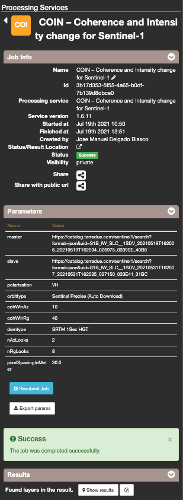
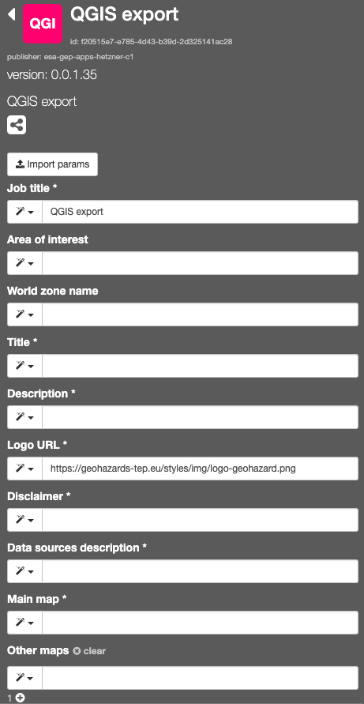
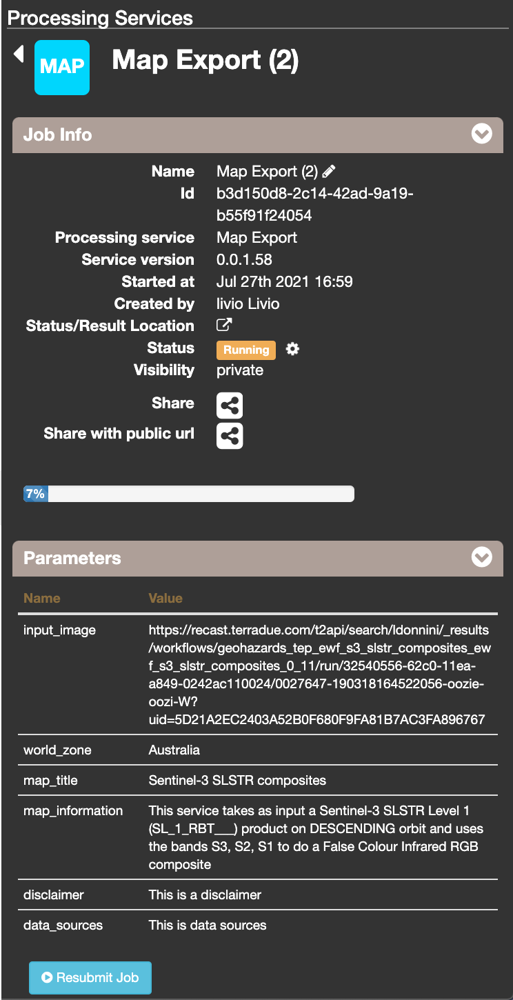
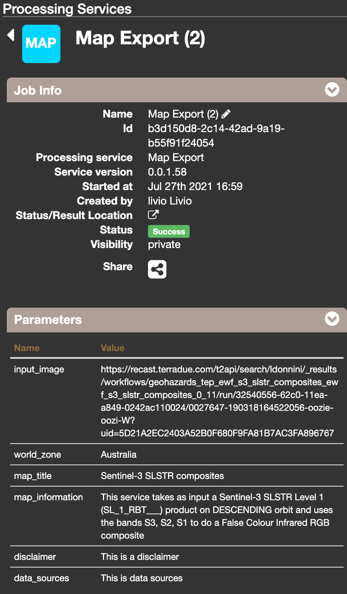
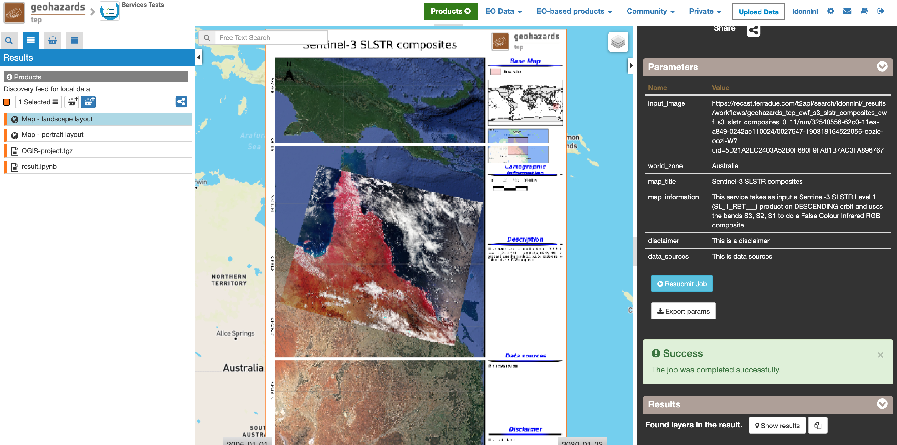
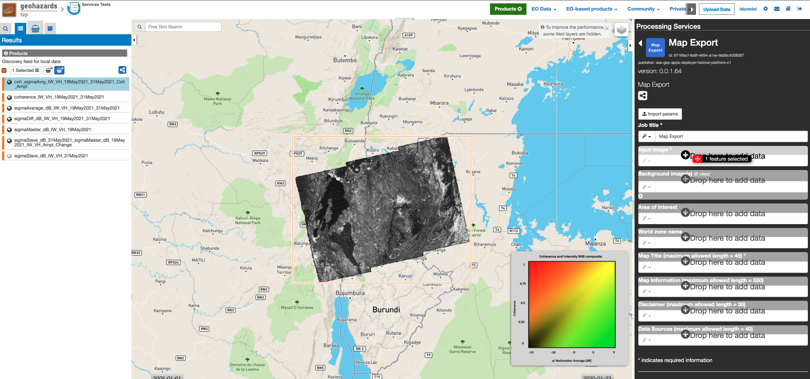
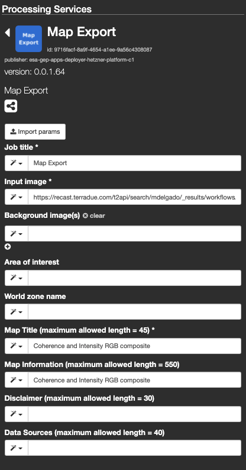
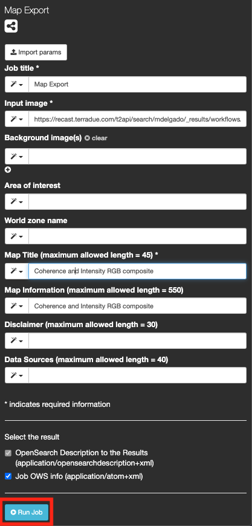
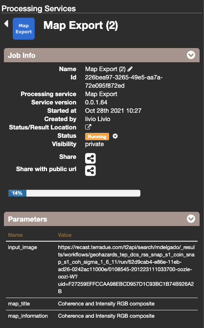
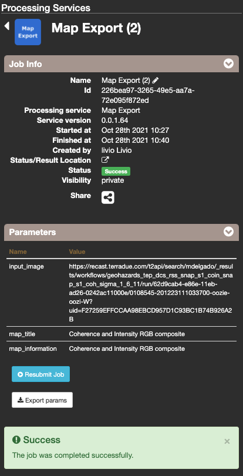

QGIS USER MANUAL
~~~~~~~~~~~~~~~~~~~~~~~~~~~~~~~~~~~~~~~~~~~

This service allows to export images/results generated on the GEP as a high resolution map for a publication, promotion activities or work on a GIS desktop software. The input image must be in geoTIFF format. The output map is generated on a templated document with the dataset juxtaposed on the background map in the order of inputs for the defined extent and shows the specified title, description, credits, logo  and copyright. The service generates as output:

	- a map in PNG format (including a PNG world file)
	- a map in PDF format 
 	- a compressed archive with a QGIS project

-----

**EO sources supported**

This service supports as input the main result of the other service, such as for example: Sentinel-3 SLSTR composite (https://recast.terradue.com/t2api/search/ldonnini/_results/workflows/geohazards_tep_ewf_s3_slstr_composites_ewf_s3_slstr_composites_0_11/run/32540556-62c0-11ea-a849-0242ac110024/0027647-190318164522056-oozie-oozi-W?uid=5D21A2EC2403A52B0F680F9FA81B7AC3FA896767), where the main map is the pixels that represent the fire. It must be put as Main map otherwise the result would be overlaid with the others and would no longer be seen in the final .pdf file.

**Output specifications**

The service provides the following output product. To see the example and description of the other outputs scroll down at the end of the tutorial.

+-------------------------------+---------------------------------------------------------------------------------------------------------------+
| Output – Map - portrait layout 														|
+===============================+===============================================================================================================+
| **Correspondent file**        | Map - portrait layout                                                                                         |
+-------------------------------+---------------------------------------------------------------------------------------------------------------+
| **Raster format**             | PNG or PDF                                                                                                    |
+-------------------------------+---------------------------------------------------------------------------------------------------------------+
| **Output Filename example**   | Map - portrait layout 					                                                |    
+-------------------------------+---------------------------------------------------------------------------------------------------------------+

+-------------------------------+---------------------------------------------------------------------------------------------------------------+
| Output – Map - landscape layout 														|
+===============================+===============================================================================================================+
| **Correspondent file**        | Map - landscape layout                                                                                        |
+-------------------------------+---------------------------------------------------------------------------------------------------------------+
| **Raster format**             | PNG or PDF                                                                                                    |
+-------------------------------+---------------------------------------------------------------------------------------------------------------+
| **Output Filename example**   | Map - landscape layout 					                                                |    
+-------------------------------+---------------------------------------------------------------------------------------------------------------+

+-------------------------------+---------------------------------------------------------------------------------------------------------------+
| Output – QGIS-project																|
+===============================+===============================================================================================================+
| **Correspondent file**        | QGIS-project	                	                                                                        |
+-------------------------------+---------------------------------------------------------------------------------------------------------------+
| **Raster format**             | GNU Zip (gzip) compression on a TAR archive                                                                   |
+-------------------------------+---------------------------------------------------------------------------------------------------------------+
| **Output Filename example**   | QGIS-project		 					                                                |    
+-------------------------------+---------------------------------------------------------------------------------------------------------------+

Select the processing
=====================

* Login to the platform (see :doc:`user <../community-guide/user>` section)

* Select the processing service “MAP Export”:

The "MAP Export" panel is displayed with parameters values to be filled-in.

.. figure:: assets/QGIS_1.png
	:figclass: align-center
        :width: 750px
        :align: center

Fill the parameters
===================

The input parameters to provide are:

  - Input image (mandatory): represents the main result of the service that is used as input, such as for example: Sentinel-3 SLSTR composite, where the main map is the pixels that represent a False Colour Infrared RGB composite. It must be put as Main map otherwise the result would be overlaid with the others and would no longer be seen in the final .pdf file.
  - Background image(s) (not mandatory): secondary results of the service that are used as input
  - Area of interest (not mandatory): specify the AOI of the service.
  - World zone name (not mandatory): name of the AOI that, if specified, appears in the legend of the final results. If not specified, the field will be filled in by the string: “Area of interest”.
  - Map Title ( mandatory): field where the title of the final result is specified. The length of the string must be  less than or equal to 45 characters.
  - Map Information (mandatory): description of the service that is used as input for the QGIS service. The length of the string must be  less than or equal to 550 characters.
  - Disclaimer (mandatory): 
  - Data source description (mandatory): description of the products used as input (Sentinel-1, Sentinel-2, etc.). Example: https://emergency.copernicus.eu/mapping/system/files/components/EMSN074_01ZAGREB_P09RCMON_00OVERVIEW_v2.pdf
  
  

        
Once downloaded and extracted, the QGIS project can be opened with QGIS.

Run the job
===========

* Click on the button Run Job and see the Running Job

* After about 20 minutes, see the Successful Job:

Discovering the contents of the project
===================

In this project we integrated the QGIS software among our services. 

* Click on the button *Show results*

* See the result on map:

* The following files are produced:

  - **PDF file for each layout**
  - **PNG file for each layout**
  - **QGIS file that must be opened directly with QGIS**
  
        
Adding a background layer
===================

There is an input parameters: Other map, whose purpose is to add a background layer. If this parameter is empty, google maps will be the background layer.

Working with the generated QGIS project locally
===================

To access the layouts, you need to download the QGIS project and open it with QGIS. 
Once opened QGIS, click on Project, open.

Select the .qgs file located in the previously downloaded folder.

        
Therefore, to visualize the layouts click on Project, Layout and choose one of the two layouts available.

        

To change the layout, open, for example, the GEP landscape layout window.

Then, to modify the layout click on one of the contents of the layout and at the bottom right a window will open with all the features.

        
Therefore, you can now make all the changes and then save them.      
