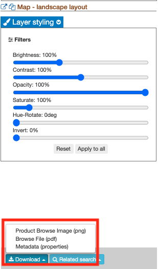

Map Export
~~~~~~~~~~~~~~~~~~~~~~~~~~~~~~~~~~~~~~~~~~~

This service allows to export images/results generated on the GEP as a high resolution map for a publication, promotion activities or work on a GIS desktop software. The input image must be in geoTIFF format. The output map is generated on a templated document with the dataset juxtaposed on the background map in the order of inputs provided, for the defined extent and shows the specified title, description, credits, logo  and copyright. The service generates as output:

	- a map in PNG format (including a PNG world file)
	- a map in PDF format 
 	- a compressed archive with a QGIS project

-----

**Inputs supported**

This service supports as input the outputs of other GEP services (e.g. the entries listed when using the “show results” button in the job info panel), provided these are generated in geoTIFF format.
The image that is the subject of the map must be passed as the Input image parameter.

**Output specifications**

The service provides the following output products:

+-------------------------------+---------------------------------------------------------------------------------------------------------------+
| Output – Map - portrait layout 														|
+===============================+===============================================================================================================+
| **Information type**        	| Map in portrait layout                                                                                        |
+-------------------------------+---------------------------------------------------------------------------------------------------------------+
| **Format**             	| PNG and PDF                                                                                                   |
+-------------------------------+---------------------------------------------------------------------------------------------------------------+
| **Output Filename example**   | Map - portrait layout 					                                                |    
+-------------------------------+---------------------------------------------------------------------------------------------------------------+

+-------------------------------+---------------------------------------------------------------------------------------------------------------+
| Output – Map - landscape layout 														|
+===============================+===============================================================================================================+
| **Information type**        	| Map in landscape layout                                                                                       |
+-------------------------------+---------------------------------------------------------------------------------------------------------------+
| **Format**             	| PNG and PDF                                                                                                   |
+-------------------------------+---------------------------------------------------------------------------------------------------------------+
| **Output Filename example**   | Map - landscape layout 					                                                |    
+-------------------------------+---------------------------------------------------------------------------------------------------------------+

+-------------------------------+---------------------------------------------------------------------------------------------------------------+
| Output – QGIS-project																|
+===============================+===============================================================================================================+
| **Information type**        	| QGIS zip file	                	                                                                        |
+-------------------------------+---------------------------------------------------------------------------------------------------------------+
| **Format**             	| GNU Zip (gzip) compression on a TAR archive                                                                   |
+-------------------------------+---------------------------------------------------------------------------------------------------------------+
| **Output Filename example**   | QGIS-project		 					                                                |    
+-------------------------------+---------------------------------------------------------------------------------------------------------------+

Select the processing
=====================

* Login to the platform (see :doc:`user <../community-guide/user>` section)

* To choose the **Input image** parameter for the Map Export service, click on the **show results** button of the service job from which you want to create a QGIS map (e.g. a COIN job in this example).

.. figure:: assets/QGIS.png
	:figclass: align-center
        :width: 350px
        :align: center
	
* Then, on the left side of the geobrowser the ouputs of the chosen job will appear in the results panel.

.. figure:: assets/QGIS_1.png
	:figclass: align-center
        :width: 750px
        :align: center

* Go in the Processing Services panel on the right of the geobrowser and select the processing service “Map Export”:

.. figure:: assets/QGIS_2.png
	:figclass: align-center
        :width: 750px
        :align: center

* The "Map Export" panel is displayed with parameters values to be filled-in.

.. figure:: assets/QGIS_3.png
	:figclass: align-center
        :width: 750px
        :align: center
	
* Drag and drop the chosen job output to the **Input image** parameter.

.. figure:: assets/QGIS_4.png
	:figclass: align-center
        :width: 750px
        :align: center
	

Fill the parameters
===================

The input parameters to provide are:

  - Input image (mandatory): represents the output of the job that is the main subject of the map to be generated. In the tutorial exmaple with the COIN service, it is the Coherence and Intensity RGB composite.
  - Background image(s) (not mandatory): secondary results of the job that are used as input.
  - Area of interest (not mandatory): specify the AOI of the input image considered for the genration of the map.
  - World zone name (not mandatory): name of the geographical area of the map that, if specified, appears in the legend of the final results. If not specified, the field will be filled in by the string: “Area of interest”.
  - Map Title (mandatory): the title of the generated map. 
  
  
  .. NOTE:: The length of the string must be  less than or equal to 45 characters.
  
  - Map Information (not mandatory): description of the service that is used as input for the QGIS service. 
  
  
  .. NOTE:: The length of the string must be  less than or equal to 550 characters.
  
  - Disclaimer (not mandatory): a formal statement saying that you are not legally responsible for something
  
  
  .. NOTE:: The length of the string must be  less than or equal to 30 characters.
  
  - Data source description (not mandatory): description of the products used as input (Sentinel-1, Sentinel-2, etc.)
  
  
  .. NOTE:: The length of the string must be  less than or equal to 40 characters.
  
.. figure:: assets/QGIS_5.png
	:figclass: align-center
        :width: 350px
        :align: center
        
Once downloaded and extracted, the QGIS project can be opened with QGIS.

Run the job
===========

* Click on the button *Run Job* and see the Running Job

.. figure:: assets/QGIS_6.png
	:figclass: align-center
        :width: 350px
        :align: center
	
.. figure:: assets/QGIS_7.png
	:figclass: align-center
        :width: 350px
        :align: center	

* After some time, see the Successful Job:

.. figure:: assets/QGIS_8.png
	:figclass: align-center
        :width: 350px
        :align: center

Discovering the contents of the project
===================

In this project we integrated the QGIS software among our services. 

* Click on the button *Show results*

* See the result on map:

.. figure:: assets/QGIS_9.png
	:figclass: align-center
        :width: 750px
        :align: center

* The following files are produced:

  - **PDF file for each layout**
  - **PNG file for each layout**
  - **QGIS file that must be opened directly with QGIS**
  
* To download the results, double click on the item of your interest and then, click on *Download* button. Finally, choose the preferred file format

  
        
Adding a background layer
===================

The Background image(s) input parameter allows adding a background layer to the map. If this parameter is left empty, google maps will be used as the background layer.

Working with the generated QGIS project locally
===================

To access the layouts, you need to download the QGIS project and open it with QGIS. 

* Once opened QGIS, click on *Project*, *open*.

.. figure:: assets/QGIS_11.png
	:figclass: align-center
        :width: 750px
        :align: center

* Select the .qgs file located in the previously downloaded folder.

.. figure:: assets/QGIS_12.png
	:figclass: align-center
        :width: 450px
        :align: center
        
* Therefore, to visualize the layouts click on *Project*, *Layout* and choose one of the two layouts available.

.. figure:: assets/QGIS_13.png
	:figclass: align-center
        :width: 750px
        :align: center
        

* To change the layout, open, for example, the GEP landscape layout window.

.. figure:: assets/QGIS_14.png
	:figclass: align-center
        :width: 750px
        :align: center

* Then, to modify the layout click on one of the contents of the layout and at the bottom right a window will open with all the features.

.. figure:: assets/QGIS_15.png
	:figclass: align-center
        :width: 750px
        :align: center
        
Therefore, you can now make all the changes and then save them.      
