Sentinel-1 GRD RGB composite
~~~~~~~~~~~~~~~~~~~~~~~~~~~~~~~~~~~~~~~~~~~

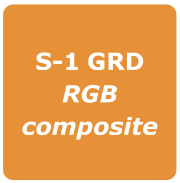

**Sentinel-1 GRD RGB composite**

This service takes as input one or up to two consecutive Sentinel-1 GRD acquisitions (in the same day) to create an RGB composite. It provides a single date polarization RGB composite taking as input one or up to two consecutive Sentinel-1 GRD data products along an acquisition segment (same track).

-----

Select the processing
=====================

* Login to the platform (see :doc:`user <../community-guide/user>` section)

* Go to the Geobrowser, expand the panel “Processing services” on the right hand side and select the processing service “Sentinel-1 GRD RGB composite”:

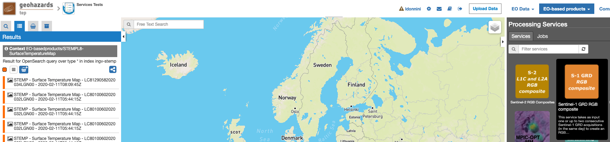

This will display the "Sentinel-1 GRD RGB composite" service panel including several pre-defined parameters values to be filled-in.

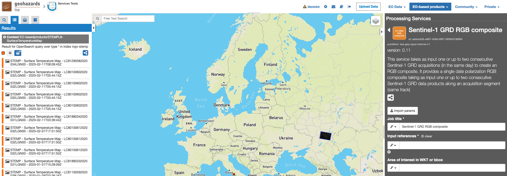
        
Fill the parameters
===================

Reference input
---------------

* Select the Sentinel-1 data collection in the EO Data button.

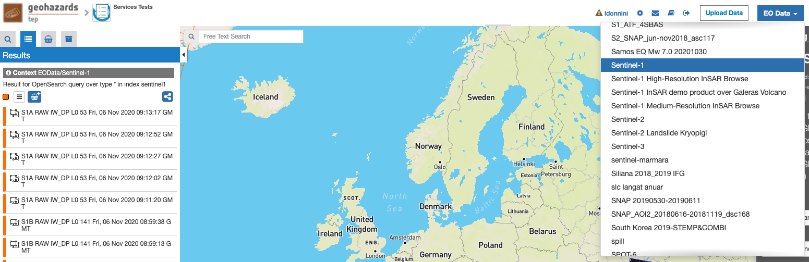
        
* Select the area for which you want to do an analysis, e.g over Madrid (Spain).

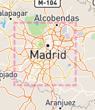

* Click on the lens icon to open the Search Panel
* Select **GRD** as Product Type
* Apply the date value, for example **2020-09-01** in **time:start** field and **2020-09-08** in **time:end** field.

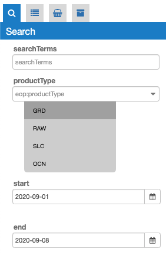
        
* Drag and Drop the selected item in the *Input references* field:

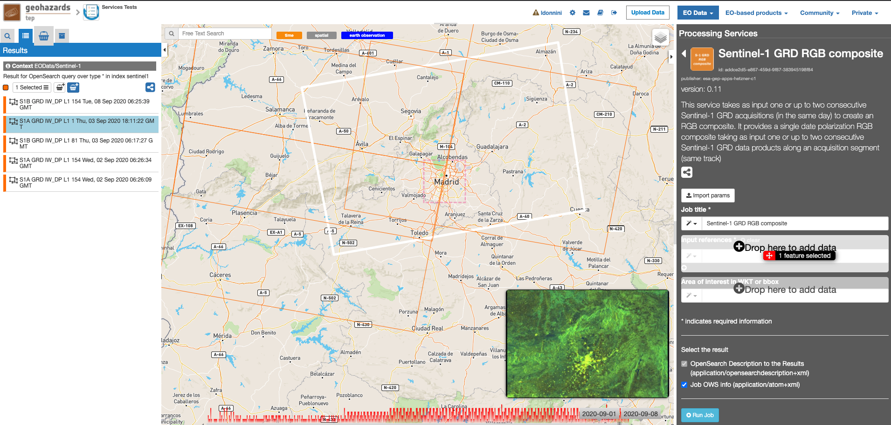

Area Of Interest in WKT
-----------------------

* Click on the *Magic tool wizard* and select **AOI**. The input parameter is automatically filled with the WKT representing the area selected.

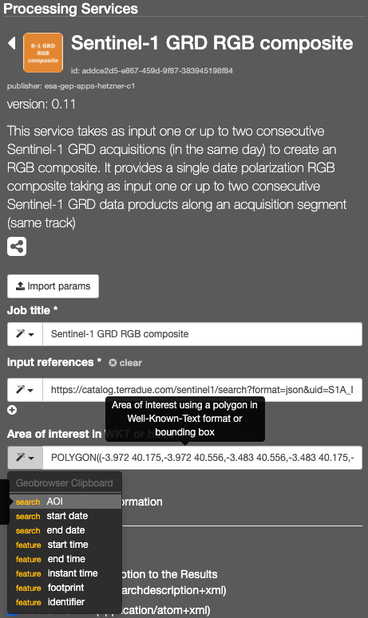

.. NOTE:: you can also specify manually a different AOI in WKT format, or draw a new area on the map using the search tool and get its value from the *Magic tool wizard*.

Run the job
===========

* Click on the button Run Job and see the Running Job

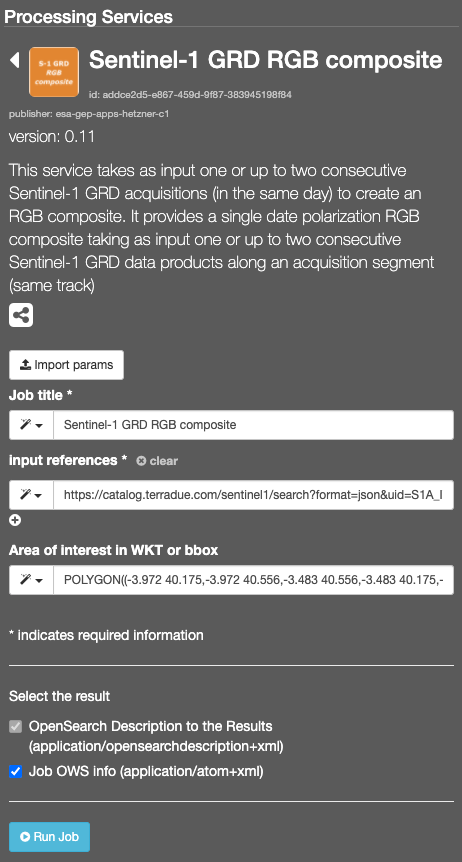

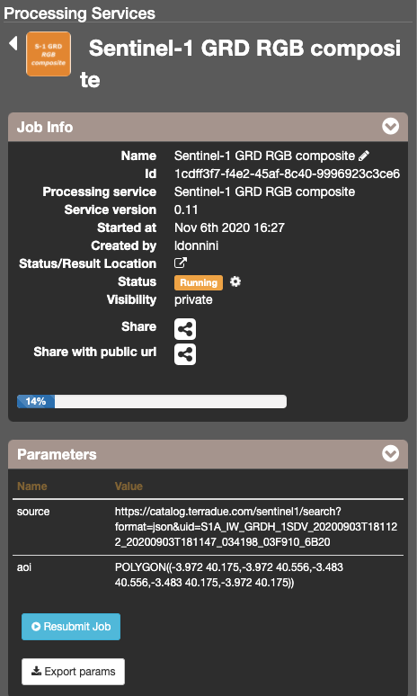

* After about 20 minutes, see the Successful Job:

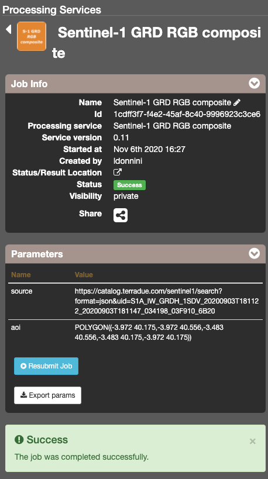

Results: download and visualization
===================================

* Click on the button *Show results*

* See the result on map:

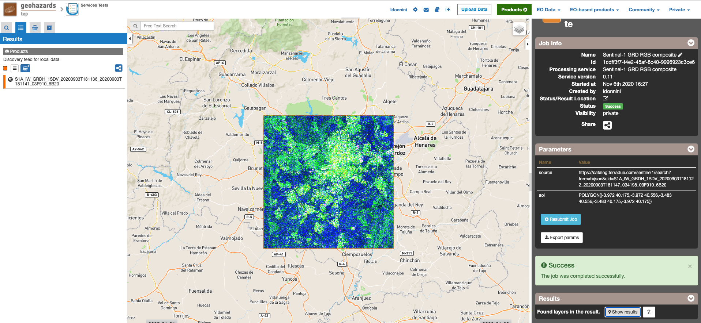

* The following files are produced:

    - **S1A_IW_GRDH_1SDV_20200903T181136_20200903T181141_03F910_6B20 - GeoTIFF**
   
