Sentinel-2 Multitemporal RGB composite with Gefolki coregistration
~~~~~~~~~~~~~~~~~~~~~~~~~~~~~~~~~~~~~~~~~~~

**Sentinel-2 Multitemporal RGB composite with Gefolki coregistration**

This service takes three Sentinel-2 MSI Level 1C or Level 2A acquisitions to generate a multitemporal RGB composite including a coregistration step with GEFOLKI. The three input products must have the same Level. 
The output of the service is a EO data product in GeoTIFF format. The product is a multitemporal RGB composite GeoTiff file obtained through the composition of bands B04, B03, B02 (Natural colours) or bands B08, B04, B03 (false colour Infrared).
bands. The output GeoTiff is displayed in geobrowser with the possibility to access product metadata.

-----

This tutorial will describe the processing of three Sentinel-2 acquisitions to generate a multitemporal RGB composite including a coregistration step with GEFOLKI.

Select the processing
=====================

* Login to the platform (see :doc:`user <../community-guide/user>` section)

* Go to the Geobrowser, expand the panel “Processing services” on the right hand side and select the processing service “Sentinel-2 Multitemporal RGB composite with Gefolki coregistration”:

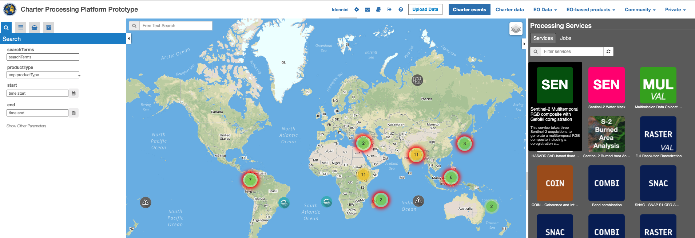

This will display the "Sentinel-2 Multitemporal RGB composite with Gefolki coregistration" service panel including several pre-defined parameters values to be filled-in.

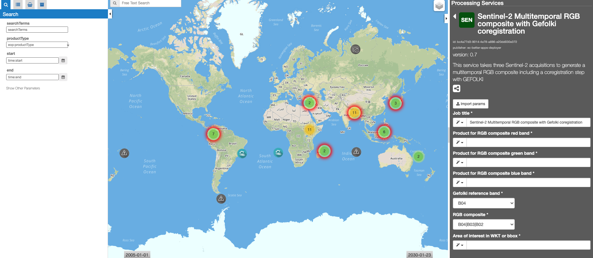
        
Fill the parameters
===================

Reference input
---------------

* Select the Sentinel-2 data collection in the EO Data button.

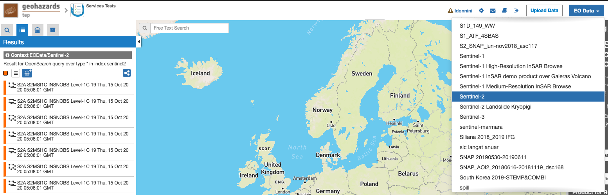
        
* Select the area for which you want to do an anlysis, e.g over Napoli (Italy).

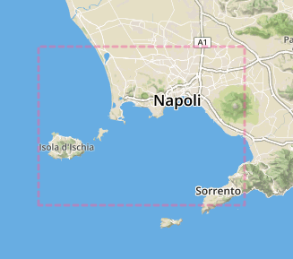

* Click on the lens icon to open the Search Panel
* Select **S2MSI1C** or **S2MSI2A** as Product Type. The three products must have the same Product Type.
* Apply the date value, for example **2019-08-01** in **time:start** field and **2019-08-11** in **time:end** field

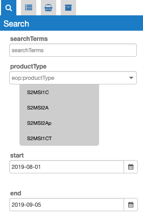
        

* Drag and Drop three items, one for each of the fields: *Product for RGB composite red band* , *Product for RGB composite green band* , *Product for RGB composite blu band*:

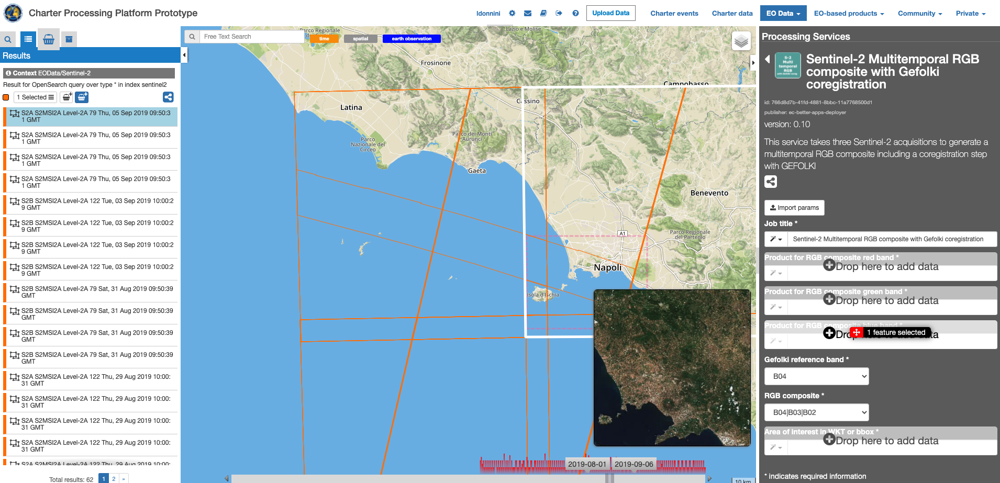

* Select one of the two possible choices for the RGB composite: **B04, B03, B02** or **B08, B04, B03**

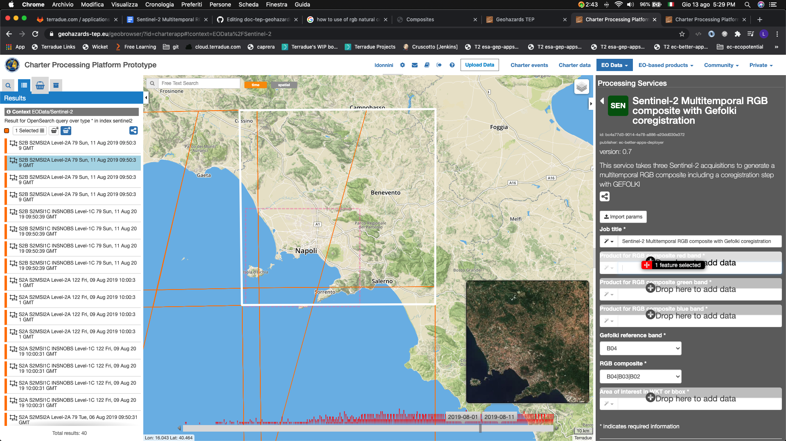
        
Area Of Interest in WKT
-----------------------

* Click on the *Magic tool wizard* and select **AOI**. The input parameter is automatically filled with the WKT representing the area selected.

.. figure:: assets/s2-multitemporal-RGB-Gefolki-7.png
	:figclass: align-center
        :width: 350px
        :align: center

.. NOTE:: you can also specify manually a different AOI in WKT format, or draw a new area on the map using the search tool and get its value from the *Magic tool wizard*.

Run the job
===========

* Click on the button Run Job and see the Running Job

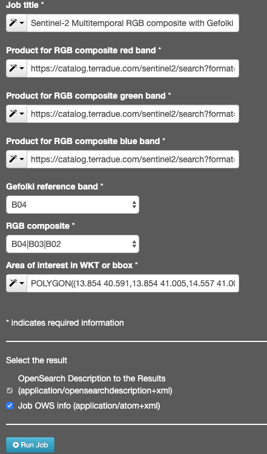

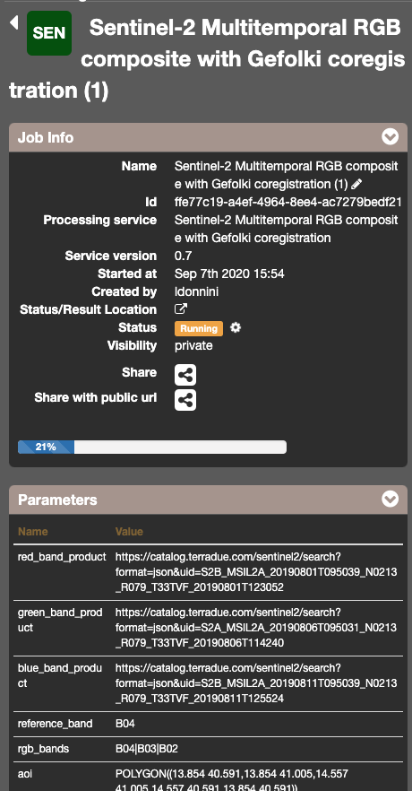

* After about 45 minutes, see the Successful Job:

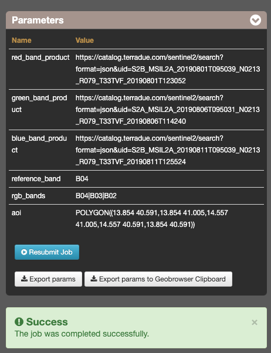

Results: download and visualization
===================================

* Click on the button *Show results*

* See the result on map:

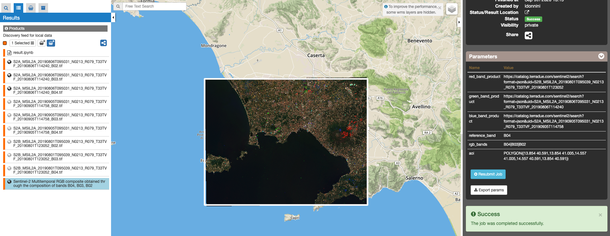

* The following files are produced:

    - **Sentinel-2 Multitemporal RGB composite - product GeoTIFF RGB**
    - **Input Product + selected bands - product GeoTIFF**
    
Reference
==================================
- Plyer, A., et al. (2015). A New Coregistration Algorithm for Recent Applications on Urban SAR Images. Geoscience and Remote Sensing Letters, IEEE, 12(11), 2198-2202.
- Brigot, G., et al. (2016)  Adaptation and Evaluation of an optical flow method applied to co-registration of forest remote sensing images, accepted with modifications in  IEEE Journal of Selected Topics in Applied Earth Observations and Remote Sensing,  Volume: 9, Issue7, July 2016

Further reading
==================================
- The Coregistration Swiss Army Knife: GeFolki - `link <https://w3.onera.fr/medusa/gefolki>`_.
