Sentinel-2 Watermask
~~~~~~~~~~~~~~~~~~~~~~~~~~~~~~~~~~~~~~~~~~~

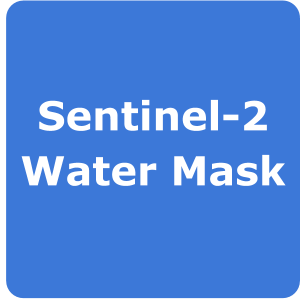

**Sentinel-2 Watermask**

This service takes as input a Sentinel-2 product to generate a water mask using then NDWI the SWM.
The output of the service is a EO data product in GeoTIFF format. The output GeoTiff is displayed in geobrowser with the possibility to access product metadata.

**Relevance to the Charter**:
  - Wildfire: mask out the water as water may impact the burned area delineation product 
  - Flood: mask out the water “normally” found in the flooded areas.
The NDWI index is most appropriate for water body mapping. The water body has strong absorbability and low radiation in the range from visible to infrared wavelengths. 
The index uses the green and Near Infra-red bands of remote sensing images based on this phenomenon. The NDWI can enhance the water information effectively in most cases. It is sensitive to built-up land and often results in over-estimated water bodies.

**Values description**: Values of water bodies are larger than 0.5. Vegetation has much smaller values, which results in distinguishing vegetation from water bodies easier. Built-up features have positive values between zero and 0.2.

-----

This service takes as input a Sentinel-2 product to generate a water mask using then NDWI the SWM.

Select the processing
=====================

* Login to the platform (see :doc:`user <../community-guide/user>` section)

* Go to the Geobrowser, expand the panel “Processing services” on the right hand side and select the processing service “Sentinel-2 Water Mask”:

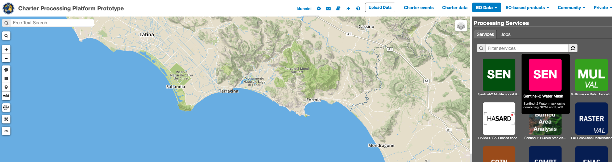

This will display the "Sentinel-2 Water Mask" service panel including several pre-defined parameters values to be filled-in.

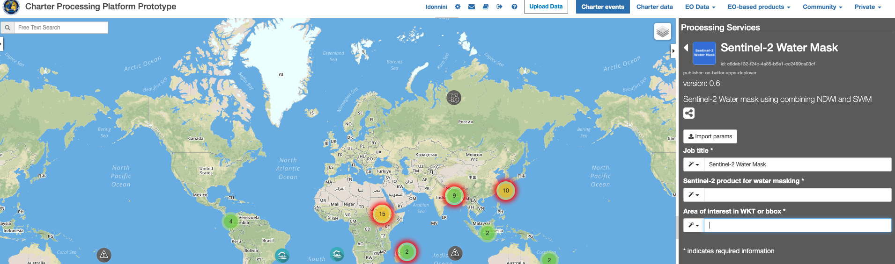
        
Fill the parameters
===================

Reference input
---------------

* Select the Sentinel-2 data collection in the EO Data button.

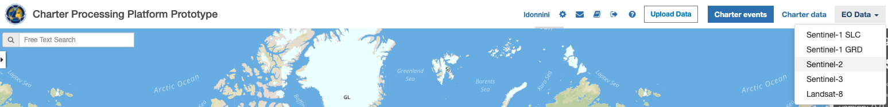
        
* Select the area for which you want to do an anlysis, e.g over Terracina (Italy).

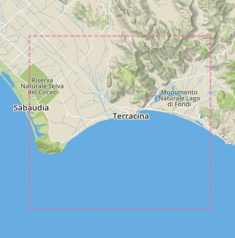

* Click on the lens icon to open the Search Panel
* Select **S2MSI1C** or **S2MSI2A** as Product Type
* Apply the date value, for example **2020-07-09**, in both **time:start** and **time:end** fields.

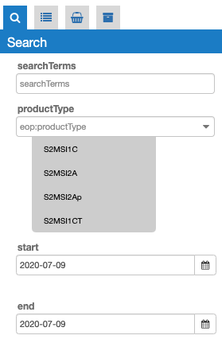
        
* Drag and Drop the selected item in the *Sentinel-2 product for water masking* field:

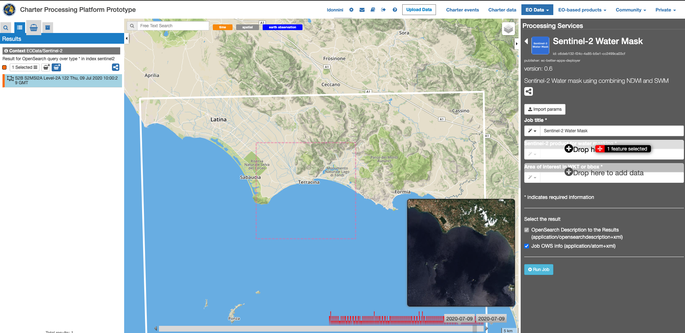

Area Of Interest in WKT
-----------------------

* Click on the *Magic tool wizard* and select **AOI**. The input parameter is automatically filled with the WKT representing the area selected.

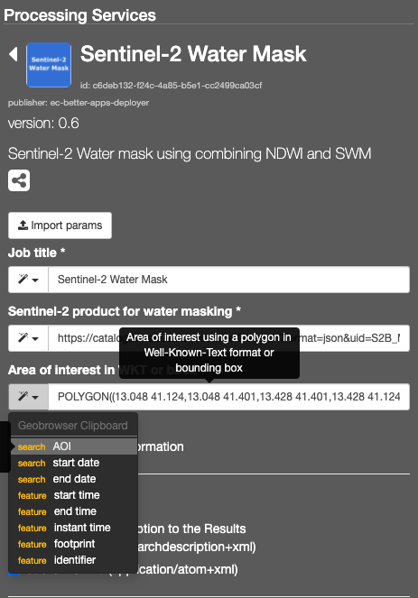

.. NOTE:: you can also specify manually a different AOI in WKT format, or draw a new area on the map using the search tool and get its value from the *Magic tool wizard*.

Run the job
===========

* Click on the button Run Job and see the Running Job

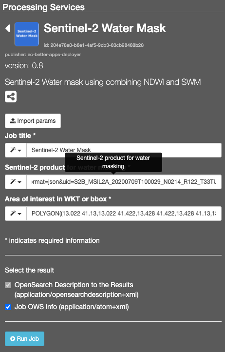

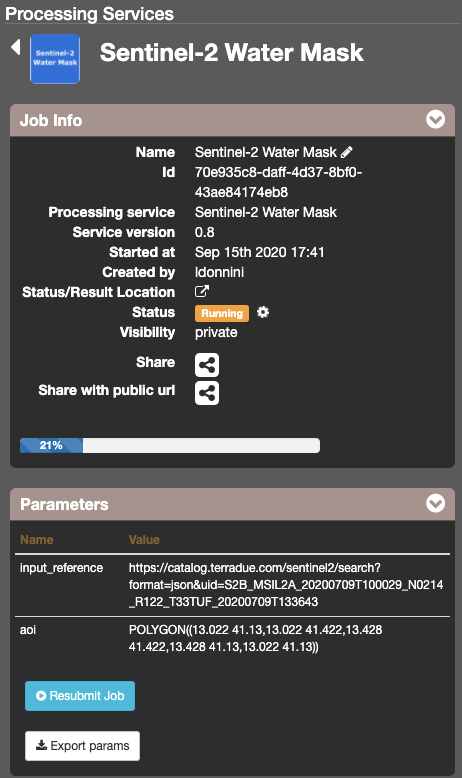

* After about 20 minutes, see the Successful Job:

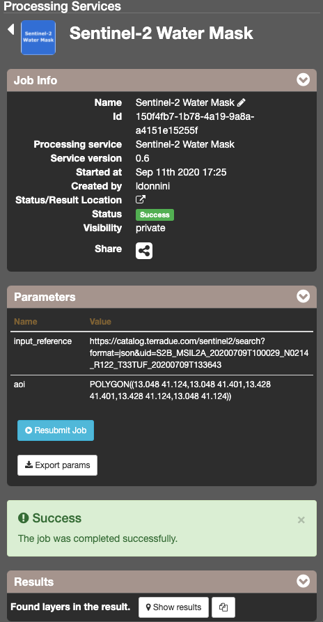

Results: download and visualization
===================================

* Click on the button *Show results*

* See the result on map:

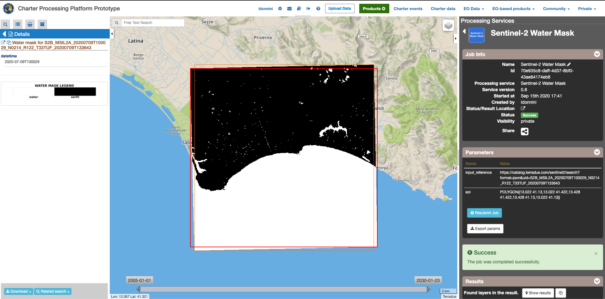

* The following files are produced:

    - **Water mask and Json file for S2B_MSIL2A_20200709T100029_N0214_R122_T33TUF_20200709T133643 - GeoTIFF**
    - **S2B_MSIL2A_20200709T100029_N0214_R122_T33TUF_20200709T133643.tif - GeoTIFF**
    
Further reading
==================================
- NDWI Normalized Difference Water Index - `link <https://custom-scripts.sentinel-hub.com/sentinel-2/ndwi/>`_.

