Sentinel-2 L1C and L2A RGB composite
~~~~~~~~~~~~~~~~~~~~~~~~~~~~~~~~~~~~

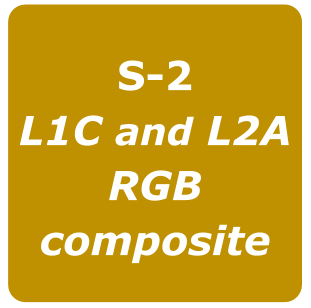

**Sentinel-2 L1C and L2A RGB composite**

This service performs RGB band combination from user defined bands of the Sentinel-2 MSI L1C or L2A products (up to 4 - full tiles) provided as input.
The goal is to give a composite RGB using the Sentinel-2 L1C or L2A product.

-----

**EO sources supported**

This service supports as input the **Sentinel-2 L1A** and **Sentinel-2 L2A** products.

**Output specifications**

The service provides the following output product. To see the example and description of the other outputs scroll down at the end of the tutorial. [1]_

+-------------------------------+---------------------------------------------------------------------------------------------------------------+
| Output – Sentinel-2 L1C and L2A RGB composite 												|
+===============================+===============================================================================================================+
| **Correspondent file**        | Sentinel-2 RGB composite                                                                                      |
+-------------------------------+---------------------------------------------------------------------------------------------------------------+
| **Raster format**             | GeoTIFF                                                                                                       |
+-------------------------------+---------------------------------------------------------------------------------------------------------------+
| **resolution**                | Native		                                                                                        |
+-------------------------------+---------------------------------------------------------------------------------------------------------------+
| **Projection types**          | EPSG:3857 - WGS84 – Pseudo Mercator                                                                           |
+-------------------------------+---------------------------------------------------------------------------------------------------------------+
| **Output Filename example**   | Natural Colors - Quicklook (2020-08-13T10:08:31/2020-08-13T10:08:31)                                          |    
+-------------------------------+---------------------------------------------------------------------------------------------------------------+

Select the processing
=====================

* Login to the platform (see :doc:`user <../community-guide/user>` section)

* Go to the Geobrowser, expand the panel “Processing services” on the right hand side and select the processing service “Sentinel-2 RGB Composites”:

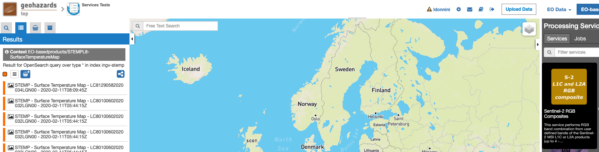

This will display the "Sentinel-2 RGB Composites" service panel including several pre-defined parameters values to be filled-in.

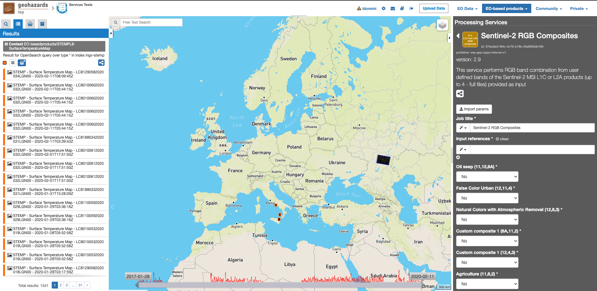
        
Fill the parameters
===================

Reference input
---------------

* Select the Sentinel-2 data collection in the EO Data button.

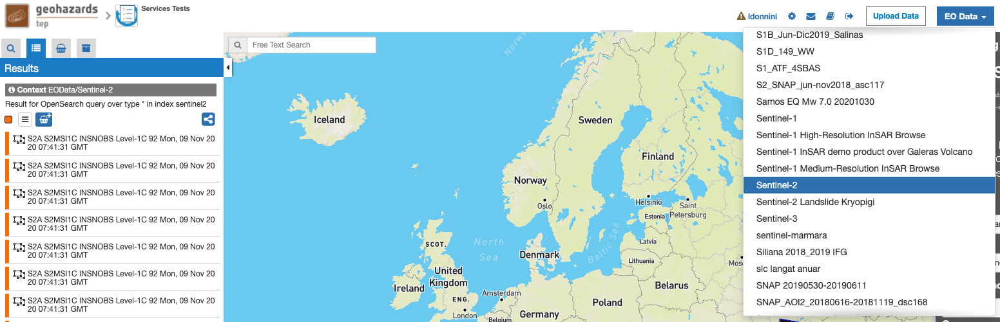
        
* Select the area for which you want to do an anlysis, e.g over Roma (Italy).

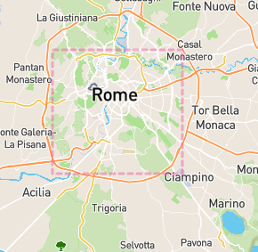

* Click on the lens icon to open the Search Panel
* Select **S2MSI1C** or **S2MSI2A** as Product Type. The three products must have the same Product Type and Level.
* Apply the date value, for example **2020-08-01** in **time:start** field and **2020-08-15** in **time:end** field

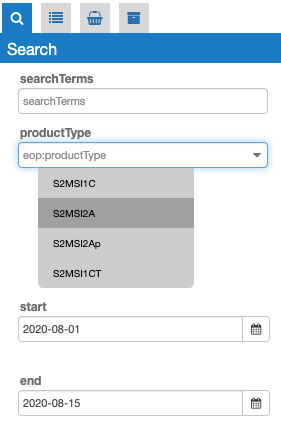
        

* Drag and Drop the selected item in the *Input references* field:

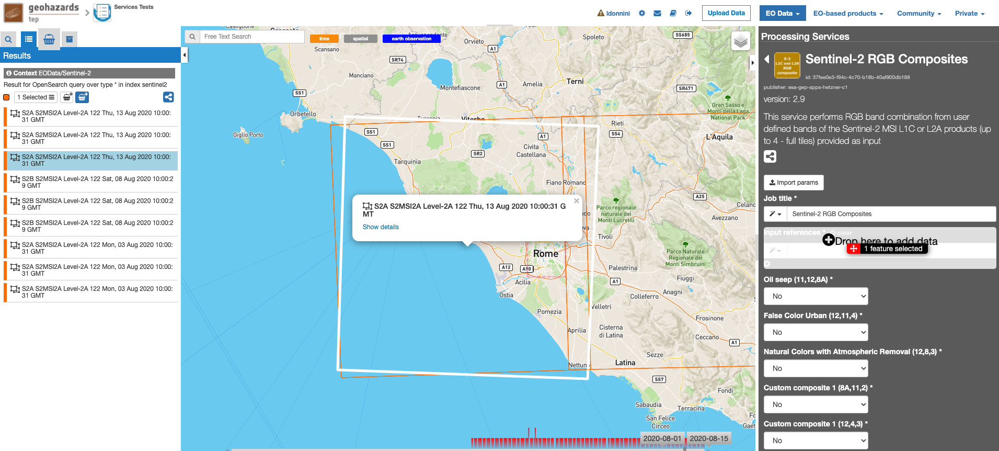

Run the job
===========

* Click on the button Run Job and see the Running Job

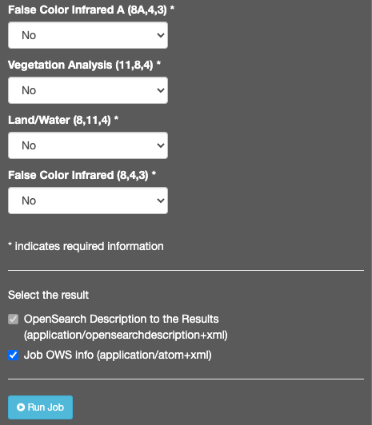

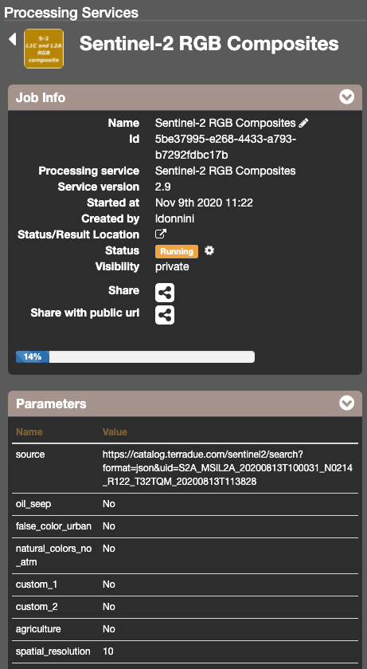

* After about 45 minutes, see the Successful Job:

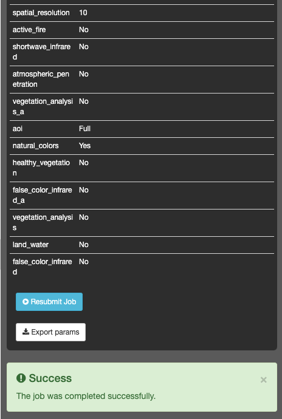

Results: download and visualization
===================================

* Click on the button *Show results*

* See the result on map:

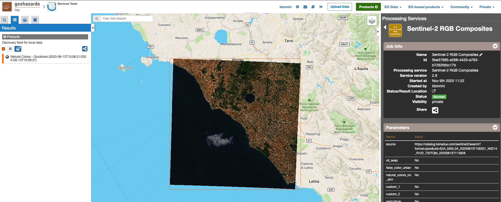

* The following output files are produced:

.. [1]
    - **Natural Colors - Quicklook (2020-08-13T10:08:31/2020-08-13T10:08:31) - product GeoTIFF RGB**

    - **False color Urban - Quicklook (2020-08-13T10:08:31/2020-08-13T10:08:31) - product GeoTIFF RGB**
      - Obtained through the combination of bands: B12, B11, B04.
    
    .. figure:: assets/S2-RGB-false_color_urban.png
      	:figclass: align-center
        :width: 750px
        :align: center

    - **Natural Colors with Atmospheric Removal - Quicklook (2020-08-13T10:08:31/2020-08-13T10:08:31) - product GeoTIFF RGB**
      - Obtained through the combination of bands: B12, B8, B03.
    
    .. figure:: assets/S2-RGB-natural_colors-atmospheric-removal.png
      	:figclass: align-center
        :width: 750px
        :align: center
    
    - **Oil seep - Quicklook (2020-08-13T10:08:31/2020-08-13T10:08:31) - product GeoTIFF RGB**
      - Obtained through the combination of bands: B11, B12, B8A.
    
    .. figure:: assets/S2-RGB-oil_seep.png
      	:figclass: align-center
        :width: 750px
        :align: center
	
    - **Agriculture - Quicklook (2020-08-13T10:08:31/2020-08-13T10:08:31) - product GeoTIFF RGB**
      - Obtained through the combination of bands: B11, B08, B02.
    
    .. figure:: assets/S2-RGB-agricolture.png
      	:figclass: align-center
        :width: 750px
        :align: center	
	
    - **Custom 1 B8A B11 B2 - Quicklook (2020-08-13T10:08:31/2020-08-13T10:08:31) - product GeoTIFF RGB**
      - Obtained through the combination of bands: B8A, B11, B02.
    
    .. figure:: assets/S2-RGB-custom-1.png
      	:figclass: align-center
        :width: 750px
        :align: center	
	
    - **Custom 2 B12 B4 B3 - Quicklook (2020-08-13T10:08:31/2020-08-13T10:08:31) - product GeoTIFF RGB**
      - Obtained through the combination of bands: B12, B04, B03.
    
    .. figure:: assets/S2-RGB-custom-2.png
      	:figclass: align-center
        :width: 750px
        :align: center	
	
    - **Active fire - Quicklook (2020-08-13T10:08:31/2020-08-13T10:08:31) - product GeoTIFF RGB**
      - Obtained through the combination of bands: B12, B8A, B04.
    
    .. figure:: assets/S2-RGB-active_fire.png
      	:figclass: align-center
        :width: 750px
        :align: center
	
    - **Atmospheric penetration - Quicklook (2020-08-13T10:08:31/2020-08-13T10:08:31) - product GeoTIFF RGB**
      - Obtained through the combination of bands: B12, B11, B8A.
    
    .. figure:: assets/S2-RGB-atmospheric_penetration.png
      	:figclass: align-center
        :width: 750px
        :align: center
	
    - **Shortwave Infrared - Quicklook (2020-08-13T10:08:31/2020-08-13T10:08:31) - product GeoTIFF RGB**
      - Obtained through the combination of bands: B12, B08, B04.
    
    .. figure:: assets/S2-RGB-shortwave_infrared.png
      	:figclass: align-center
        :width: 750px
        :align: center
	
    - **Vegetation Analysis - Quicklook (2020-08-13T10:08:31/2020-08-13T10:08:31) - product GeoTIFF RGB**
      - Obtained through the combination of bands: B11, B08, B04.
    
    .. figure:: assets/S2-RGB-vegetation_analysis.png
      	:figclass: align-center
        :width: 750px
        :align: center
	
    - **Vegetation Analysis A - Quicklook (2020-08-13T10:08:31/2020-08-13T10:08:31) - product GeoTIFF RGB**
      - Obtained through the combination of bands: B11, B8A, B04.
    
    .. figure:: assets/S2-RGB-vegetation_analysis_A.png
      	:figclass: align-center
        :width: 750px
        :align: center

    - **False color Infrared - Quicklook (2020-08-13T10:08:31/2020-08-13T10:08:31) - product GeoTIFF RGB**
      - Obtained through the combination of bands: B08, B04, B03.
    
    .. figure:: assets/S2-RGB-false_color_infrared.png
      	:figclass: align-center
        :width: 750px
        :align: center

    - **False color Infrared A - Quicklook (2020-08-13T10:08:31/2020-08-13T10:08:31) - product GeoTIFF RGB**
      - Obtained through the combination of bands: B8A, B04, B03.
    
    .. figure:: assets/S2-RGB-false_color_infrared_A.png
      	:figclass: align-center
        :width: 750px
        :align: center

    - **Healthy vegetation - Quicklook (2020-08-13T10:08:31/2020-08-13T10:08:31) - product GeoTIFF RGB**
      - Obtained through the combination of bands: B08, B11, B02.
    
    .. figure:: assets/S2-RGB-healthy_vegetation.png
      	:figclass: align-center
        :width: 750px
        :align: center
	
    - **Land Water - Quicklook (2020-08-13T10:08:31/2020-08-13T10:08:31) - product GeoTIFF RGB**
      - Obtained through the combination of bands: B08, B11, B04.
    
    .. figure:: assets/S2-RGB-land_water.png
      	:figclass: align-center
        :width: 750px
        :align: center
