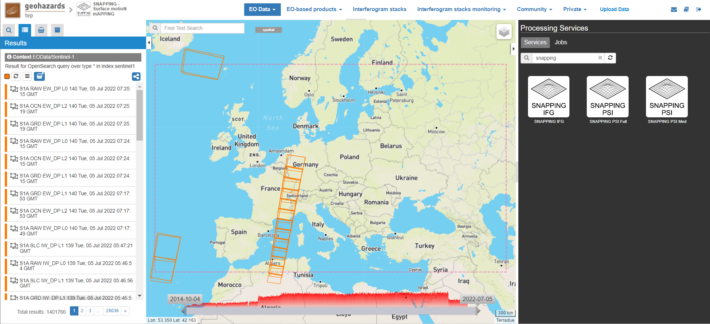
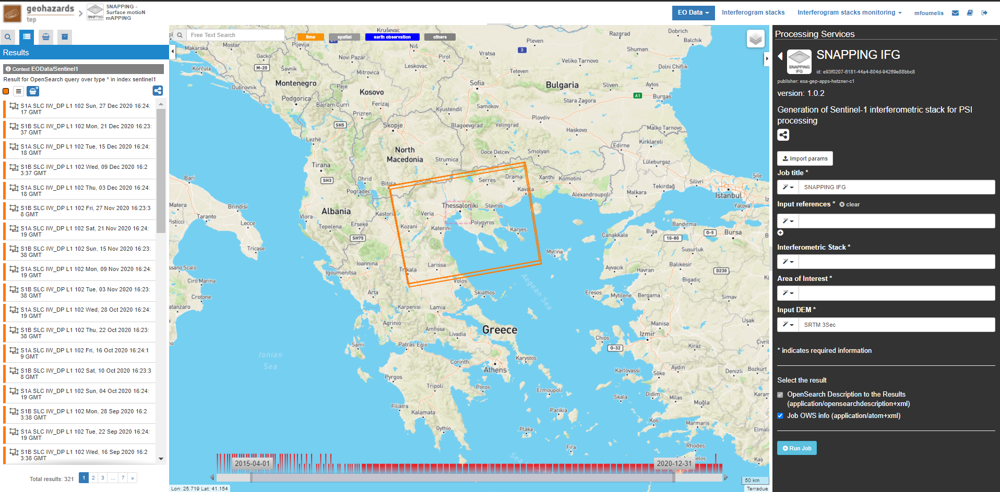
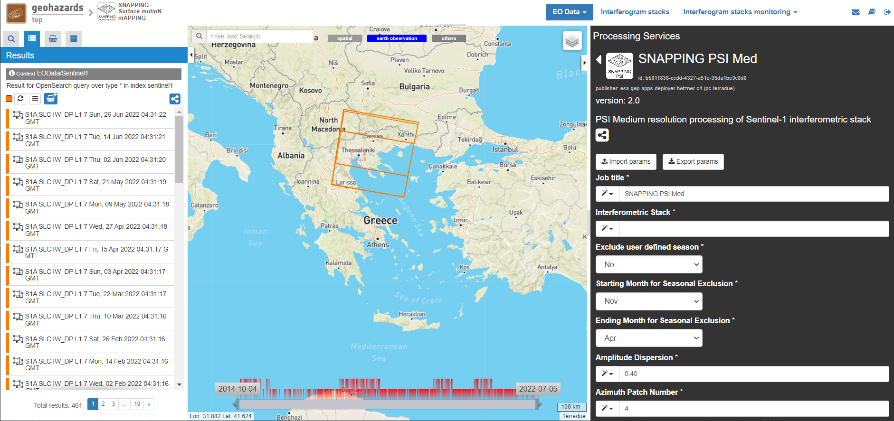
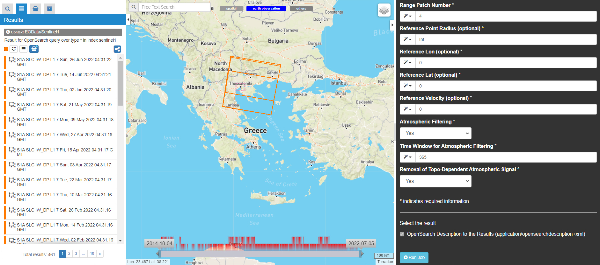

SNAPPING – Surface motioN mAPPING Sentinel-1 on-demand processing service 
~~~~~~~~~~~~~~~~~~~~~~~~~~~~~~~~~~~~~~~~~~~

by AUTh & MJaen

.. figure:: assets/snapping_icon.png
        :width: 250px

1. Introduction
=====================

SNAPPING stands for Surface motioN mAPPING, an on-demand service for Sentinel-1 Multi-Temporal DInSAR processing based on integrated SNAP and StaMPS chain. The service was developed by the `Aristotle University of Thessaloniki <https://www.auth.gr/en/>`_ and the `Microgeodesia Jaen <https://www.ujaen.es/investigacion-y-transferencia/grupos-de-investigacion/microgeodesia-jaen>`_ with the support of `Terradue s.r.l. <https://www.terradue.com>`_ for the implementation on the platform. 

Inputs for the service are Sentinel-1 IW TOPS Single Look Complex (SLC) data, while outputs are Line-of-Sight (LoS) displacement rates (average velocity), their uncertainties and the corresponding displacement time series. 

.. figure:: assets/snapping_1.png
	:figclass: align-center
        :width: 750px
        :align: center

**EO sources supported**

- Sentinel-1 IW SLC

**Output specifications**

- (Default) Average LoS displacement rates; displacement rates uncertainties; temporal coherence; LoS incidence angles; LoS displacement time series. Format: standard Comma-Separated Values (CSV) format in geographic coordinates. 

This tutorial describes a step-by-step procedure to submit a job for SNAPPING Sentinel-1 (S1) on-demand processing service on the Geohazards Exploitation Platform (GEP).

The tutorial is addressed to users already familiar with basic InSAR principles and products and gives some hints and recommendations for the best user experience.

The chain is split into three separate services:

- **SNAPPING IFG** for the generation of Sentinel-1 interferometric stack, which is then used in
- **SNAPPING PSI** Med for multi-temporal time series analysis at medium resolution. 
- **SNAPPING PSI** Full for multi-temporal time series analysis at full (sensor) resolution.

Note that both SNAPPING IFG and PSI services **should be run subsequently** for the retrieval of the surface motion measurements. Following the completion of SNAPPING IFG the user may run SNAPPING PSI Med or SNAPPING PSI Full depending on the output required. 

	

The main user steps for the generation of the interferometric stack based on the SNAPPING IFG service are the following:

- select the input SAR SLC data to be processed;
- define the area of SAR data to be processed;
- set input parameters for SNAPPING IFG processing;
- obtain an Interferometric Stack (stored on the platform) that includes all generated differential interferograms

For the subsequent time series analysis based on the SNAPPING PSI (Med or Full) service user steps are the following: 

- select the input Interferometric Stack to be processed;
- set input parameters/threshold (e.g. reference point) for SNAPPING PSI processing;
- obtain SNAPPING results, such as LoS Displacement time series, Mean LoS Velocity, Uncertainty of Mean LoS Velocity

Users are encouraged to use the SNAPPING service here described for scientific purposes. The results (including products, maps, time series, files and everything generated by the processors) of the service are available under the CC-BY license. See the “Terms and Conditions” section below for more details.  

Accordingly, please recognize the effort made by the authors by citing the following publications in relevant talks, documents and publications prepared using SNAPPING results generated by this service.

- Foumelis, M. et al., **"ESA SNAP - StaMPS Integrated Processing for Sentinel-1 Persistent Scatterer Interferometry,"** IGARSS 2018 - 2018 IEEE International Geoscience and Remote Sensing Symposium, 2018, pp. 1364-1367, https://doi.org/10.1109/IGARSS.2018.8519545
- Delgado Blasco, J.M.; Foumelis, M.; Stewart, C.; Hooper, **"A. Measuring Urban Subsidence in the Rome Metropolitan Area (Italy) with Sentinel-1 SNAP-StaMPS Persistent Scatterer Interferometry,"** Remote Sens., 2019, 11, 129, https://doi.org/10.3390/rs11020129.

The Aristotle University of Thessaloniki (AUTh), the research group Microgeodesia Jaén (MJaen) and Terradue s.r.l. declare no responsibility of any kind regarding quality, use and interpretation of the SNAPPING results.

2. SNAPPING IFG – Interferogram Generation
=====================

	
**Service inputs**

- Sentinel-1 IW SLC (level 1) data

**Service outputs**

- Interferometric Stack; a repository where all interferometric pairs generated by SNAPPING IFG are stored for subsequent processing. These are intermediate products not available for visualization. 

2.1 Select the processing app 
------------------

- Sign-in on the Portal https://geohazards-tep.eu/
- Access the “SNAPPING – Surface Motion Mapping” Thematic App.
- Open the tab “Processing services” from the right of the map, and then select the processing service “SNAPPING IFG”.

        
2.2 Select images to process
------------------

Input SAR data selection must be carried out with particular care since a wrong data selection can result in unfeasible processing.

- The algorithm accepts as inputs Sentinel-1 IW SLC (level 1) data. 
- The user must select only images acquired along the same track.
- The system automatically discards duplicated (reprocessed) images and correctly assembles image slices acquired on the same date belonging to a common relative orbit. In the case of reprocessed images, the newest one is selected by the processor.

.. NOTE:: To ensure measurements’ accuracy users are prompted to select at least 80 dates for time series analysis. For reliable surface motion measurements, especially for regions exhibiting low motion rates, it is strongly recommended to expand the observation period to a minimum of three (3) years. 
Although the service is not affected by temporal gaps in the data set selection, it is suggested to avoid large temporal gaps as they may introduce uncertainties, especially over low coherence areas and for regions of high surface motion rates (e.g. landslides). For the period corresponding to the temporal gap motion is assumed as linear. 

.. NOTE:: Sentinel-1 SLC products acquired before April 2015 should not be considered in SNAPPING as this will lead to interferometric phase variation in range. For scenes acquired after April 2015 a compensation for the Elevation Antenna Pattern (EAP) phase was applied to predict with great accuracy the gain and phase patterns. 

For selecting a data set to process please follow the steps below:

- Surf on the geobrowser map to the Area of Interest (e.g. Thessaloniki, Greece).
- Use the Draw tools in the geobrowser to define your area of interest or the WTK tool to provide it in Well-Known Text (WKT) format.  

.. NOTE:: An accepted WKT should have the following format: POLYGON((LonMIN LatMIN, LonMIN LatMAX, LonMAX LatMAX, LonMAX LatMIN, LonMIN LatMIN))

- Insert values in the various fields of the Search panel to constrain the search based on the required period of observation, platform etc. Press the Search button at the lower part of the panel. Search results are automatically shown in the Results panel. 

.. figure:: assets/snapping_ifg_1.png
	:figclass: align-center
        :width: 750px
        :align: center
        

        
	
- Users can store their search results for later use by adding them to the Features Basket, then saving them as a Data Package. 

.. NOTE:: Users can also use pre-defined data sets within the Data Packages catalogue. This involves browsing for previously stored data packages by name and uploading them by clicking on the load button.  

2.3 Define IFG processing parameters
------------------

Please note that the co-pol VV polarization is used by default in SNAPPING. 

- Set the **Job Title** with a meaningful name (e.g. indicative of the service, the data set and the area of interest).

	SNAPPING IFG Thessaloniki S1 A102 201504-202012

- Push the select all button in the Results panel or Features Basket panel. Drag and drop the selected data within the **Input Sentinel-1 SLC** field on the right panel. Links to the images will be automatically inserted and numbered. Repeat for all products on the different pages of the Results panel (each page contains 50 products).

	https://catalog.terradue.com/sentinel1/search?format=json&uid=S1A_IW_SLC__1SDV_20160123T162334_20160123T162401_009624_00E049_893F
 
	https://catalog.terradue.com/sentinel1/search?format=json&uid=S1A_IW_SLC__1SDV_20151230T162359_20151230T162427_009274_00D62E_E310
 
	...
	
.. figure:: assets/snapping_ifg_3.png
	:figclass: align-center
        :width: 750px
        :align: center
        
.. figure:: assets/snapping_ifg_4.png
	:figclass: align-center
        :width: 750px
        :align: center
     
     
- Set the **Interferometric Stack** with a meaningful name (e.g. indicative of the service, the data set and the area of interest).

	thessaloniki_snapping_s1_a102_201504_202012
	

.. NOTE:: Avoid inserting special characters in the **Interferometric Stack** name (e.g. instead of spaces “ ” please insert underscore “_” as a separator between words). Please note that any special character is automatically replaced by a underscore during job execution. 

- Click on the select button in the **Area of Interest** field and select the AOI option to automatically insert based on the region defined in the geobrowser:

	POLYGON((22.456 40.208,22.456 40.938,23.28 40.938,23.28 40.208,22.456 40.208))

.. figure:: assets/snapping_ifg_5.png
	:figclass: align-center
        :width: 100px
        :align: center
	

.. NOTE:: You may directly insert the AOI in WKT format. SNAPPING processing area is limited to 60x60 sq. km. For larger AOIs, please contact the Operations Support team at Terradue (support at terradue.com).

- Fill the **Input DEM** parameter according to the heights to be used during interferometric processing:

	SRTM 1Sec HGT

.. NOTE:: Currently, SRTM 3 arc-second and 1 arc-second (default) are available for processing. The use of higher spatial resolution DEM is preferable both in terms of topographic phase correction and for accurate terrain geocoding.

- Set **AOI-based Coregistration** option to define whether coregistration shall be performed over the entire Sentinel-1 swath or only considering bursts covering the AOI (Yes or No):

	Yes
	
	
.. NOTE:: Selecting AOI-based coregistration will speed up processing time, however, over relatively small AOIs (i.e. islands) dominated by vegetation or affected by abrupt motion (e.g. earthquakes), coregistration using the entire S-1 swath (option set to ‘No’) should avoid erroneous results.  
When AOI is bound within a single Sentinel-1 burst, the service automatically adjusts the interferometric processing scheme. 

- Set the **Minimum Overlap Area [%]** to ensure proper spatial coverage of each individual Sentinel-1 acquisition to the defined AOI (default 90%):

	90
	
	
.. NOTE:: Acquisition dates not meeting the defined percent of spatial coverage shall be omitted. This parameter ensures later the extraction of PSI measurements over the entire AOI, as during processing only the common/overlapping part of the interferometric stack is considered. 

- Set the Exclude User-defined Season option for excluding some period of the year and processing only the remaining time span of the year (for each year in scope) (optional; No or Yes):

	No
	
	
.. NOTE:: This option is applicable for regions affected on a yearly basis by snow. This constraint can be applied in SNAPPING IFG or afterwards during the PSI processing step. 

- Set **Starting Month for Seasonal Exclusion** to define the season for which acquisitions are not to be used during processing: 

	Nov
	
- Set **Ending Month for Seasonal Exclusion** to define the season for which acquisitions are not to be used during processing: 

	Apr
	
	
.. NOTE:: The starting and ending months are considered only when the relevant option for seasonal  exclusion is activated (option “Exclude User-defined Season” set to Yes). If starting and ending months are set to Nov and Apr, respectively, each period from November till April over the entire observation period shall not be processed.

2.4 Run the job
------------------

Following the selection of images and definition of processing parameters, the launch of the service is done by clicking on the button **Run Job** at the bottom of the SNAPPING IFG processor tab and monitor the progress of the running Job.

.. NOTE:: The duration of the job depends mainly on the extent of the area of interest, the percentage of water bodies within the AOI, the number of the acquisition dates processed and the platform allocated resources. 
The progress bar of the SNAPPING IFG service relates to the activation trigger for assigning all the Sentinel-1 image pairs to the IFG processing and not the actual completion of the submitted job. Please check Section 2.5 for more details on the monitoring of interferogram stacks progress.
 

2.5 Interferogram stacks monitoring
------------------

This section explains how users can monitor the generation of interferograms by SNAPPING IFG. It is important to note that the progress bar of a SNAPPING IFG job refers to the preparation of all the Sentinel-1 pairs to be assigned to IFG processing, and not the completion of the actual IFG processing and not the completion of the actual processing. 

For checking the progress of the SNAPPING IFG processing (generation of interferograms), use the **Interferogram stacks monitoring** button at the top right of the geobrowser interface. Submitted interferometric pairs appear as Queued, On-going, Completed or Failed, based on their status. Each pair initially appears as **Queued**, during processing as **On-going** and finally depending on the processing outcome as **Completed** or **Failed**. 

.. figure:: assets/snapping_ifg_6.png
	:figclass: align-center
        :width: 750px
        :align: center
        
.. figure:: assets/snapping_ifg_7.png
	:figclass: align-center
        :width: 750px
        :align: center
        
*Users should refrain from executing SNAPPING PSI (Med or Full) services before all interferometric pairs submitted under SNAPPING IFG are completed (no Queued or On-going pairs).*

The information provided under **Interferogram stacks monitoring** tab refers to the entire jobs run by each user. You may check the status of each **Interferometric Stack** by inserting its name under the **Free Text Search** field in the top left part of the geobrowser map. 

.. figure:: assets/snapping_ifg_8.png
	:figclass: align-center
        :width: 750px
        :align: center
	

3. SNAPPING PSI – Persistent Scatterers Interferometric processing
=====================

	
**Service inputs**

- Interferometric Stack identifier as generated previously by SNAPPING IFG 

**Service outputs**

- (Default) Average LoS displacement rates; displacement rates uncertainties; Temporal coherence; LoS incidence angles; LoS displacement time series. Format: standard Comma-Separated Values (CSV) format in geographic coordinates (EPSG 4326).

3.1 Select the processing app
------------------

- Sign-in on the Portal https://geohazards-tep.eu/
- Access the “SNAPPING – Surface Motion Mapping” Thematic App.
- Open the tab “Processing services” from the right of the map, and then select the processing service “SNAPPING PSI Med” or “SNAPPING PSI Full”. Note that processing parameters for both services are identical. 

        

               

The offering of SNAPPING PSI service at different spatial resolution is intended as a flexible solution for diverse surface motion mapping and monitoring requirements. While SNAPPING PSI Med is a cost-effective tool for wide area investigation and overview, the SNAPPING PSI Full provides the necessary resolution for detailed analysis at local to regional scales.

        
3.2 Input interferometric stack to process
------------------

The input for the Interferometric Stack name must be based on the same name given by the user in the corresponding IFG run.

- Users should insert manually the name of the **Interferometric Stack** to be processed. Beware a wrongly inserted input name can result in unfeasible processing. 

.. NOTE:: For SNAPPING PSI, the inputs are the Interferometric Stacks previously generated using SNAPPING IFG (i.e. not any other Sentinel-1 SLC data).  

3.3 Define PSI processing parameters
------------------

Please note that parameters controlling the extent of the processing **Area of Interest** and the heights considered in the interferometric analysis **Input DEM** are both defined in the interferogram generation step (SNAPPING IFG).

- Set the **Job Title** with a meaningful name (e.g. indicative of the service, the data set and the area of interest). 

	SNAPPING PSI Thessaloniki S1 A102 201504-202012

- Set manually the **Interferometric Stack** following the same name provided in the SNAPPING IFG part. 

	thessaloniki_snapping_s1_a102_201504_202012
	

.. NOTE:: It is critical to keep the same name for the **Interferometric Stack** in both SNAPPING IFG and SNAPPING PSI services. 

- Set the Exclude User-defined Season option for excluding some period of the year and processing only the remaining time span of the year (for each year in scope) (optional; No or Yes):

	No
	
	
.. NOTE:: This option is applicable for regions affected on a yearly basis by snow.

- Set **Starting Month for Seasonal Exclusion** to define the season for which acquisitions are not to be used during processing:

	Nov
	
- Set **Ending Month for Seasonal Exclusion** to define the season for which acquisitions are not to be used during processing: 

	Apr

.. NOTE:: The starting and ending months are considered only when the relevant option for seasonal  exclusion is activated (option “Exclude User-defined Season” set to Yes). If starting and ending months are set to Nov and Apr, respectively, each period from November till April over the entire observation period shall not be processed. 

- Set the **Amplitude Dispersion** value used for the detection of Point Scatterers (default 0.40):

	0.40

.. NOTE::  By increasing the value of the amplitude dispersion more point candidates will be accepted as Persistent Scatterers (PS) targets. However, care should be taken to avoid the inclusion of poor quality points since this might affect the PSI solution. A significant decrease of amplitude dispersion value shall reduce the number of points in the PSI results.

- Set the **Range Patch Number** value to define the number of patches in the range direction (default 4).

	4

- Set the **Azimuth Patch Number** value to define the number of patches in the azimuth direction (default 4).

	4
	

.. NOTE:: By increasing the number of range and azimuth patches higher parallelization is achieved, beneficial in reducing the processing time of a wide area. By setting both patch numbers to 1, the entire AOI is processed as a single patch.  

- Set the **Reference Radius** value to define radius (in meters) around the reference point coordinates (default Inf). 

	Inf
	

.. NOTE:: By using the default value (set to infinite), the entire area is considered when referencing the PSI measurements. In that case, the average motion over the whole AOI is set to zero. This avoids dependencies to a single point and mitigates the effect of the reference point atmospheric noise. Please note that if the **Reference Radius** is kept to default, the selection of reference point coordinates (Reference Lon and Reference Lat parameters) is not affecting the PSI results. 
If a radius value is inserted (in meters), processing shall succeed only when at least one PS point is identified within the defined extent.  

- Set the **Reference Lon** value to define the longitude centre coordinates of a specific reference point to be considered in the interferometric processing (optional; in decimal degrees):

	0

- Set the **Reference Lat** value to define the latitude centre coordinates of a specific reference point to be considered in the interferometric processing (optional; in decimal degrees):  

	0
	

.. NOTE:: **Reference Lon** and **Reference Lat** are the longitude and latitude coordinates (in decimal degrees) of the reference point for the SNAPPING PSI measurements. It should be located in a relatively stable area or its deformation behavior shall be known. In any case, the user should verify that **input longitude and latitude coordinates are on land and included within defined AOI**. As a suggestion, urbanized areas are usually well suited to locate the reference point. It is in general good practice to put the reference point in the deformation far field. 
By using the default value of zero for both coordinates, no reference point is considered and the algorithm implements an average reference for the whole AOI. 

- Set the **Reference Velocity** value to define the motion rate of the selected reference area (optional; in mm/year):

	0

.. NOTE:: The default value of zero is used when no reference velocity is imposed during interferometric processing. 

- Set the **Atmospheric Filtering** option to apply atmospheric spatio-temporal filtering of the time series (optional; Yes or No): 

	Yes
	
	
.. NOTE:: It is recommended to apply atmospheric filtering for optimal PSI time series results. However, in the case of abrupt events (e.g. earthquakes), filtering should be avoided. 

- Set the **Time Window for Atmospheric Filtering** option to define the temporal dimension of the spatio-temporal atmospheric filter (in days): 

	365

.. NOTE:: Considered only if the *“Atmospheric Filtering”* option is considered. 

- Set the Removal of **Topo-Dependent Atmospheric Signal** option to compensate for the topography related atmospheric component (optional; Yes or No): 

	Yes

.. NOTE::  Optional correction for regions with high relief. Not necessary when there is low variability of heights within the area of interest. 

3.4 Run the job
------------------

- Click on the button **Run Job** at the bottom of the SNAPPING processor tab, and monitor the progress of the running Job.

4. Results: download and visualization
=====================

**Download**

The SNAPPING results are available in the geobrowser after the successful completion of the processing. Scroll down the right panel and push the **Show results** button.

To download the SNAPPING processing results once the Job is completed just double click on the SNAPPING outputs in the left panel, then, on the **Download** button in the pop-up window of the identified product. Each of the service outputs is downloaded separately. 

.. figure:: assets/snapping_psi_3.png
	:figclass: align-center
        :width: 750px
        :align: center
        
.. figure:: assets/snapping_psi_4.png
	:figclass: align-center
        :width: 750px
        :align: center
        
        
**Conventions and assumptions**

Results are provided in the satellite Line of Sight (LoS). Positive values indicate that the target is uplifting or moves toward the satellite, while negative values indicate subsidence or motion away from the satellite. 

**Published Results**

The main outputs of the SNAPPING service are the following:

- **Metadata (Properties)**

  Processing information including details on the version of the service used, production date, EO sensor, start/end of the measurements, number of images etc. as a standard plain text file. *<Filename>.txt*
  
- **Product File (CSV)**

  Tabulated terrain motion measurements, in standard Comma-Separated Values (CSV) format. *<Filename>.csv*

- **Product File (GZ)**

  Standard ESRI vector file (ESRI shapefile) to be accessed with proprietary or other open source software (e.g. QGIS) (in compressed GZ format). *<Filename>_shp.tar.gz*
  
- **Standalone Visualizer (HTML)**

  Standard HTML file containing terrain motion rate measurements designed for display in common web browsers. *<Filename>.html*

- **Browse GeoTIFF**

  Low resolution geocoded browse image in standard GeoTIFF format. *<Filename>.rgb.tif*

- **Browse Legend (PNG)**

  Colour scale (as raster image) corresponding to browse image file (i.e. Filename.rgb.tif), in standard Portable Network Graphics (PNG) format. *<Filename>.legend.png*

SNAPPING geocoded outputs are provided in WGS 1984 coordinates (EPGS 4326). 

Provided attributes within the CSV file consist of:

- Unique pixel identifier (code);
- WGS84 Latitude coordinates in decimal degrees (latitude);
- WGS84 Longitude coordinates in decimal degrees (longitude);
- Mean velocity (in mm/year), as linear regression of the displacement time series (vel);
- Mean velocity uncertainty (in mm/year) (vs);
- Temporal Coherence estimate (coh);
- LoS incidence angle (in radians) (inc_angle);
- LoS displacement time-series in millimeters (DYYYYMMDD): the naming of this field corresponds to the date as years (YYYY), months (MM) and days (DD) of each acquisition in the time series. The count of these fields depends on the number of acquisitions used in the time series analysis.

.. figure:: assets/snapping_psi_5.png
	:figclass: align-center
        :width: 750px
        :align: center

Provided attributes within the ESRI shapefile consist of the unique pixel identifier (id), latitude (latitude) and longitude (longitude) coordinates,  mean velocity (vel) and corresponding uncertainty (vs). LoS displacement time-series are omitted from ESRI shapefile output. 

The general <Filename> convention is defined as follows:

	snapping_psi_<Job_ID>.<file_extension>

where: <Job_ID> : is the job name as provided by the user

A typical name should contain an identifier for the AOI, the satellite track and the period of observation (e.g. snapping_psi_thessaloniki_a102_201504_202012.csv).

**Visualization**

SNAPPING outputs, specifically the low-resolution browse image, are directly visualized within the GEP geobrowser. By clicking on the displayed product the corresponding colour scale appears at the lower right corner of the geobrowser. 

The standalone HTML file generated by the SNAPPING service allows off-line visualization of the obtained mean velocities without the need for using any external geospatial visualization tool.

.. figure:: assets/snapping_3.png
	:figclass: align-center
        :width: 750px
        :align: center
        

        
SNAPPING ESRI shapefiles, containing only mean velocities and corresponding uncertainties, can be directly read in any Geographic Information System (GIS). SNAPPING CSV files can also be ingested into a GIS environment for visualization and further analysis. An example is provided below using the open-source QGIS software. 

*From the main QGIS toolbar go to Layer 🡪 Data Source Manager. Then, select Delimited Text from the left panel and navigate to the SNAPPING CSV file. Define input parameters as shown in the figure below.*

	
	
The visualization of SNAPPING time series is possible within QGIS using the open source “PS Time Series Viewer” (https://plugins.qgis.org/plugins/pstimeseries/) toolbox available on the QGIS Python Plugins Repository. Please note that the original CSV file containing time series measurements needs to be first inserted to QGIS and then converted to ESRI shapefile. The specific tool has been successfully tested on QGIS version 3.16.12-Hannover. 

        
5. Service Advantages and Processing Restrictions
=====================

Below mentioned service advantages and restrictions refer to the implementation on the GEP platform and not to the PSI technique itself. In principle, SNAPPING service, being a PSI chain, is not adequate for the investigation of large magnitude abrupt motion (e.g. earthquakes) or regions of high motion gradients (e.g. fast-moving landslides). 

Advantages of SNAPPING service

- No limitations in the number of Sentinel-1 acquisitions selected for processing. 
- Automatic ingestion of latest available orbit state vectors (precise or restituted).
- Automatic assembly of multiple data takes (same orbit pass) covering the defined AOI.
- No requirement for selecting a priori a reference area to perform the processing. 
- Automatic selection of the most recently processed SAR image (IPR version) when multiple Sentinel-1 products exist (re-processed data takes).
- Exclusion of scenes/dates spatially not covering AOI based on user defined % of overlap. 
- The independent triggering of each interferometric pair in SNAPPING IFG ensures that unexpected failures won’t affect the entire processing job. Failed pairs are not stored in the “Interferometric Stack”, and thus, not considered in the subsequent SNAPPING PSI run. 
- Capability to expand the “Interferometric Stack” by processing newly acquired Sentinel-1 scenes and then updating the corresponding PSI solution. This facilitates an improved monitoring scheme, reducing considerably processing time and relevant costs. 
 

Current restriction of SNAPPING service

- No option for user defined reference date.
- No option for automatic selection of optimum reference date based on perpendicular baseline information.
- Generated IFG pairs not visualized on the platform.
- Single CSV files for wide area processing, especially for SNAPPING PSI Full service, might be difficult to handle due to large size.
- Geolocation of point measurement based on input DEM heights.
 
6. Release Notes
=====================

**Version 2.0** (released June 2022; current)

- Multiple sources for Copernicus Sentinel-1 IW SLC mission data
- Handling of duplicate S-1 data takes (different IPF) and usage of most recently generated product
- Usage of locally stored SRTM DEM collections 
- Option to coregister based on entire S-1 scene or based on user defined AOI
- Automatic adaptation of processing for small AOI (burst-level processing)
- Exclusion of interferometric pairs based on user defined seasonal constraints 
- Definition of minimum AOI overlap for the generation of interferometric pairs (exclude dates with limited spatial coverage)
- Utilization of global SRTM 3 arc-seconds and 1 arc-second heights
- Improved overall stability and performance of the service

**Version 1.0** (released Feb 2021)
- Processing of Sentinel-1 VV polarization band 
- Seamless processing of Sentinel-1 IW sub-swaths
- Concatenation of consecutive acquisitions of the same date
- Automatic ingestion (multiple sources) of precise or restituted orbits 
- Reference scene automatically selected as the oldest acquisition date  
- Coregistration based on entire S1 scene
- ESD coregistration enhancement applied by default
- Minimum size AOI larger than single S-1 burst
- Utilization of global SRTM 3 arc-seconds heights

7. Feedbacks
=====================

Users are kindly invited to report any issue and problem encountered during the use of the SNAPPING service:

- For GEP on-boarded users, by issuing a ticket from their project support space on https://helpdesk.terradue.com/ or sending an email to support@terradue.com

Suggestions and comments about the GEP service delivery are warmly welcomed on **contact@geohazards-tep.eu** to keep the service delivery on GEP as much as possible appealing, effective and efficient.

8. Terms and Conditions
=====================

**IPR** | The Intellectual Property Right (IPR) of the SNAPPING service is with the SNAPPING development team, if not differently specified.

**Use** | SNAPPING services are available to all the GEP users according to a CC-BY license. There is the possibility that users participate in the cost of service maintenance and operation: these costs are defined case-by-case among the SNAPPING development team, the platform operator and ESA.

**Results** | The results of the SNAPPING service, including products, maps, time series, files and everything generated by the processors, are made available under the CC-BY license.

**Warranty and liability** | SNAPPING service is based on the open-source ESA SentiNel Application Platform (SNAP) V8 and StaMPS v4.1b (University of Leeds) software packages as well as the TRAIN toolbox (https://agupubs.onlinelibrary.wiley.com/doi/full/10.1002/2014JB011558). No warranty is provided on the SNAPPING service. The SNAPPING development team is not responsible for any software inaccuracies, bugs, errors and misuse. Generated results have a defined accuracy according to the relevant scientific publications available in the literature. Result accuracy is estimated on a statistical basis. Provided results are not validated by the SNAPPING development team and, indeed, it is the user responsibility to validate them. The SNAPPING development team is not responsible for the use, quality, accuracy and interpretation of results and products that are generated by using the processors and services provided within the platform. The SNAPPING development team is not responsible for the use, quality, accuracy and interpretation of third party results, products and services derived from the use of SNAPPING service. The SNAPPING development team is not responsible for possible outages of the provided services. SNAPPING development team is not responsible for any kind of third party loss derived from service outages, result inaccuracies, software errors of the provided services and products. The maintenance, update and user support are provided by the SNAPPING development team free 

