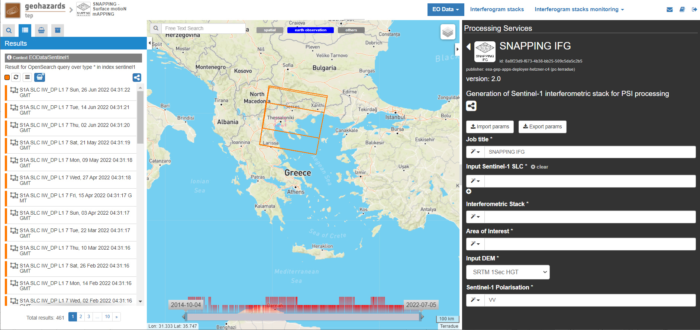
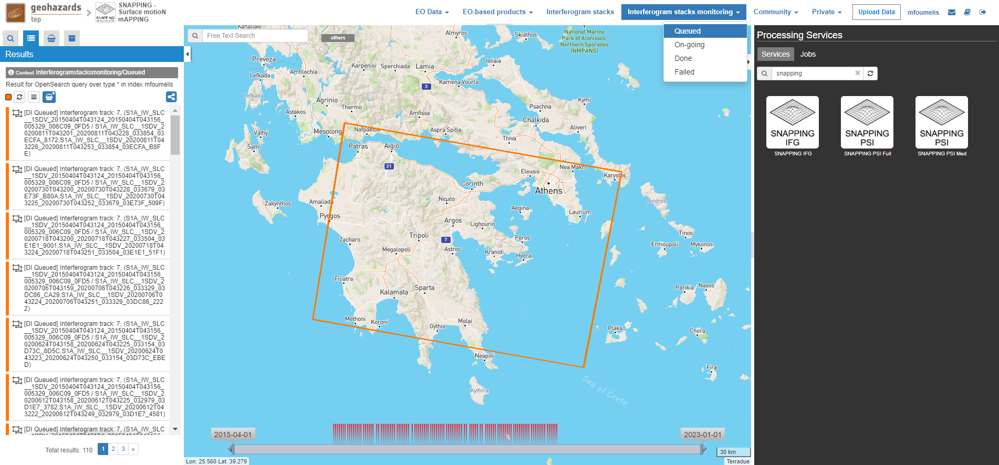
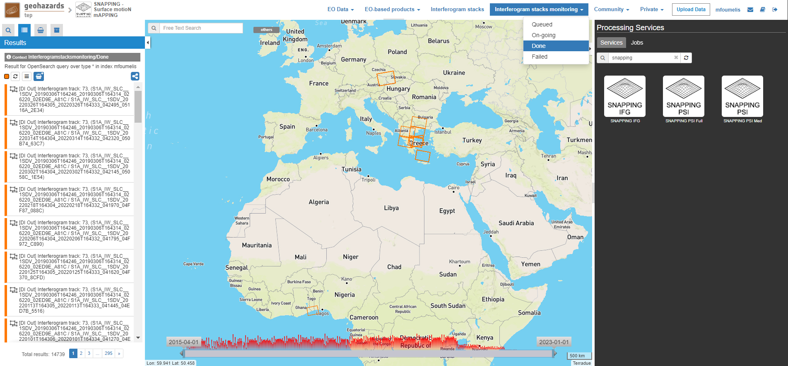
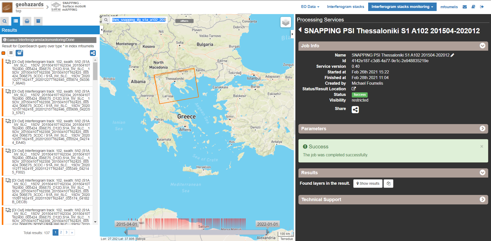
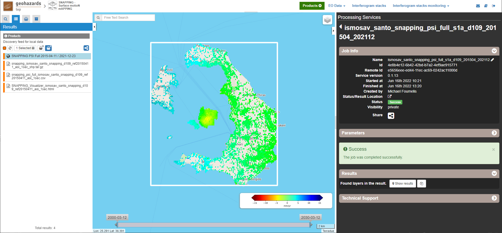
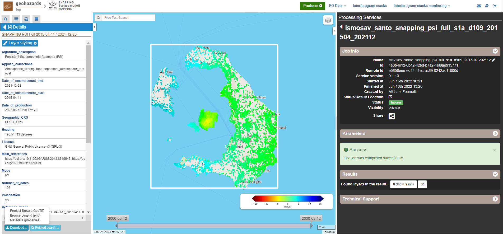
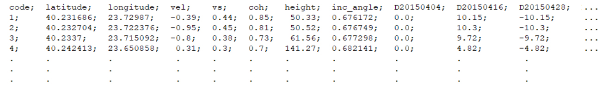

SNAPPING – Surface motioN mAPPING Sentinel-1 on-demand processing service
~~~~~~~~~~~~~~~~~~~~~~~~~~~~~~~~~~~~~~~~~~~

by AUTh, MJaen & Terradue 

1. Introduction
=====================

SNAPPING stands for Surface motioN mAPPING, an on-demand service for Sentinel-1 Multi-Temporal DInSAR processing based on integrated SNAP and StaMPS chain. The service was developed by the Aristotle University of Thessaloniki (AUTh, GR) and the Microgeodesia Jaen (MJaen, ES) with the support of Terradue s.r.l. (T2, IT). 

Inputs for the service are Sentinel-1 IW TOPS Single Look Complex (SLC) data, while outputs are Line-of-Sight (LoS) displacement rates (average velocity), their uncertainties and the corresponding displacement time series. 

.. figure:: assets/snapping_1.png
	:figclass: align-center
        :width: 750px
        :align: center

**EO sources supported**

- Sentinel-1 IW SLC

**Output specifications**

- (Default) Average LoS displacement rates; displacement rates uncertainties; LoS incidence angles; LoS displacement time series. Format: standard Comma-Separated Values (CSV) format in geographic coordinates. 

This tutorial describes a step-by-step procedure to submit a job for SNAPPING Sentinel-1 (S1) on-demand processing service on the Geohazards Exploitation Platform (GEP). 

The tutorial is addressed to users already familiar with basic InSAR principles and products and gives some hints and recommendations for the best service user experience.

The chain is split into two separate services:

- **SNAPPING IFG** for the generation of Sentinel-1 interferometric stack, which is then used in
- **SNAPPING PSI** for multi-temporal time series analysis. 

Note that both SNAPPING IFG and PSI services **should be run subsequently** for the retrieval of the surface motion measurements. 

The main user steps for the generation of the interferometric stack based on the SNAPPING IFG service are the following:

- select the input SAR SLC data to be processed;
- define the area of SAR data to be processed;
- set input parameters for SNAPPING IFG processing;
- obtain an Interferometric Stack (stored on the platform) that includes all generated differential interferograms

For the subsequent time series analysis based on the SNAPPING PSI service user steps are the following: 

- select the input Interferometric Stack to be processed;
- set input parameters/threshold (e.g. reference point) for SNAPPING PSI processing;
- obtain SNAPPING results, such as LoS Displacement time series; Mean LoS Velocity; Uncertainty of Mean LoS Velocity

Users are encouraged to use the SNAPPING service here described for scientific purposes. The results (including products, maps, time series, files and everything generated by the processors) of the service are available under the CC-BY license. See the “Terms and Conditions” section below for more details. 

Accordingly, please recognize the effort made by the authors by citing the following publications in relevant talks, documents and publications prepared using SNAPPING results generated by this service. The Aristotle University of Thessaloniki (AUTh), the research group Microgeodesia Jaén (MJaen) and Terradue s.r.l. declare no responsibility of any kind regarding quality, use and interpretation of the SNAPPING results. 

- Foumelis M., Delgado Blasco J.M., Brito F., Pacini F. & Pishehvar P., 2021. **"SNAPPING for Sentinel-1 mission on Geohazards Exploitation Platform: An online medium resolution surface motion mapping service"**. IEEE International Geoscience and Remote Sensing Symposium (IGARSS), Brussels, Belgium, 11-16 July, 2021.

2. SNAPPING IFG – Interferogram Generation
=====================

.. figure:: assets/snapping_ifg_icon.png
        :width: 150px
	
**Service inputs**

- Sentinel-1 IW SLC (level 1) data

**Service outputs**

- Interferometric Stack; a repository where all interferometric pairs generated by SNAPPING IFG are stored for subsequent processing. This is an intermediate product not available for visualization. 

2.1 Select the processing app 
------------------

- Sign-in on the Portal https://geohazards-tep.eu/
- Access the “SNAPPING – Surface Motion Mapping” Thematic App.
- Open the tab “Processing services” from the right of the map, and then select the processing service “SNAPPING IFG”.

        
.. figure:: assets/snapping_ifg_2.png
	:figclass: align-center
        :width: 750px
        :align: center
        
2.2 Select images to process
------------------

Input SAR data selection must be carried out with particular care since a wrong data selection can result in unfeasible processing.

- The algorithm accepts as inputs **Sentinel-1 IW SLC (level 1) data**. 
- The user must select **only images acquired along the same track**.
- The system automatically discards duplicated (reprocessed) images and correctly assembles image slices acquired on the same date belonging to a common relative orbit. In the case of reprocessed images, the newest one is selected by the processor.

.. NOTE:: To avoid processing failures users are prompted to select at least 20-25 dates for time series analysis. For reliable surface motion measurements, especially for regions exhibiting low motion rates, it is strongly recommended to expand the observation period to a minimum of three (3) years.  Although the service is not affected by temporal gaps in the data set selection, it is suggested to avoid large temporal gaps as they may introduce uncertainties, especially over low coherence areas and for regions of high surface motion rates (e.g. landslides). The period corresponding to the temporal gap motion is assumed as linear. Sentinel-1 SLC products acquired before April 2015 should not be considered in SNAPPING as this will lead to interferometric phase variation in range. For scenes acquired after April 2015 a compensation for the Elevation Antenna Pattern (EAP) phase was applied to predict with great accuracy the gain and phase patterns.

For selecting a data set to process please follow the steps below:

- Surf on the geobrowser map to the Area of Interest (e.g. Thessaloniki, Greece).
- Use the Draw tools in the geobrowser to define your area of interest or the WTK tool to provide it in Well-Known Text (WKT) format. 

        

.. NOTE:: An accepted WKT should have the following format: POLYGON((LonMIN LatMIN, LonMIN LatMAX, LonMAX LatMAX, LonMAX LatMIN, LonMIN LatMIN))

- Insert values in the various fields of the Search panel to constrain the search based on the required period of observation, platform etc. Press the Search button at the lower part of the panel. Search results are automatically shown in the Results panel. 

        

        
	
- Users can store their search results for later use by adding them to the Features Basket, then saving them as a Data Package. 

.. NOTE:: Users can also use pre-defined data sets within the Data Packages catalogue. This involves browsing for previously stored data packages by name and uploading them by clicking on the load button. 

2.3 Define IFG processing parameters
------------------

Please note that the co-pol VV polarization is used by default in SNAPPING. 

- Set the **Job Title** with a meaningful name (e.g. indicative of the service, the data set and the area of interest).

	SNAPPING IFG Thessaloniki S1 A102 201504-202012

- Push the select all button in the Results panel or Features Basket panel. Drag and drop the selected data within the **Input References** field on the right panel. Links to the images will be automatically inserted and numbered. Repeat for all products on the different pages of the Results panel (each page contains 50 products). 

	https://catalog.terradue.com/sentinel1/search?format=json&uid=S1A_IW_SLC__1SDV_20160123T162334_20160123T162401_009624_00E049_893F
 
	https://catalog.terradue.com/sentinel1/search?format=json&uid=S1A_IW_SLC__1SDV_20151230T162359_20151230T162427_009274_00D62E_E310
 
	https://catalog.terradue.com/sentinel1/search?format=json&uid=S1A_IW_SLC__1SDV_20151230T162335_20151230T162401_009274_00D62E_7B7E

        

     
     
- Set the **Interferometric Stack** with a meaningful name (e.g. indicative of the service, the data set and the area of interest).

	thessaloniki_snapping_s1_a102_201504_202012
	

.. NOTE:: Avoid inserting special characters in the Interferometric Stack name (e.g. instead of spaces “ ” please insert backslashes “_” as a separator between words).

- Click on the select button in the **Area of Interest** field and select the AOI option to automatically insert based on the region defined in the geobrowser

	POLYGON((22.456 40.208,22.456 40.938,23.28 40.938,23.28 40.208,22.456 40.208))

.. figure:: assets/snapping_ifg_9.png
	:figclass: align-center
        :width: 100px
        :align: center
	

.. NOTE:: You may directly insert the AOI in WKT format

- Fill the Input DEM parameter according to the heights to be used during interferometric processing:

	SRTM 3Sec

.. NOTE:: Currently, only SRTM 3 arc-second is available for processing

2.4 Run the job
------------------

Following the selection of images and definition of processing parameters, the launch of the service is done by clicking on the button Run Job at the bottom of the SNAPPING IFG processor tab and monitor the progress of the running Job.

.. NOTE:: The duration of the job depends mainly on the extent of the area of interest, the percentage of water bodies within the AOI, the number of the acquisition dates processed and the platform allocated resources. 

.. NOTE:: The progress bar of the SNAPPING IFG service indicates the preparation of the trigger for processing of Sentinel-1 image pairs and not the actual completion of the submitted job. Please check Section 2.5 for more details on the monitoring of interferogram stacks progress.

2.5 Interferogram stacks monitoring
------------------

This section explains how users can monitor the generation of interferograms by SNAPPING IFG. 

It is important to note that the progress bar of SNAPPING IFG refers to the preparation of Sentinel-1 pairs trigger and not the completion of the processing. For checking the progress of the SNAPPING IFG processing (generation of interferogram pairs), use the **Interferogram stacks monitoring** button at the top right of the geobrowser interface. 

Submitted interferometric pairs appear as Queued, On-going, Completed or Failed, based on their status. Each pair initially appears as **Queued**, during processing as **On-going** and finally depending on the processing outcome as **Completed** or **Failed**. 

.. figure:: assets/snapping_ifg_10.png
	:figclass: align-center
        :width: 750px
        :align: center
        
.. figure:: assets/snapping_ifg_11.png
	:figclass: align-center
        :width: 750px
        :align: center
        
The information provided under **Interferogram stacks monitoring** tab refers to the entire jobs run by each user. You may check the status of each **Interferometric Stack** by inserting its name under the **Free Text Search** field in the top right part of the geobrowser. 

.. figure:: assets/snapping_ifg_12.png
	:figclass: align-center
        :width: 750px
        :align: center

3. SNAPPING PSI – Persistent Scatterers Interferometric processing
=====================

.. figure:: assets/snapping_psi_icon.png
        :width: 150px
	
**Service inputs**

- Interferometric Stack identifier as generated previously by SNAPPING IFG 

**Service outputs**

- (Default) Average LoS displacement rates; displacement rates uncertainties; LoS incidence angles; LoS displacement time series. Format: standard Comma-Separated Values (CSV) format in geographic coordinates (EPSG 4326).

3.1 Select the processing app
------------------

- Sign-in on the Portal https://geohazards-tep.eu/
- Access the “SNAPPING – Surface Motion Mapping” Thematic App.
- Open the tab “Processing services” from the right of the map, and then select the processing service “SNAPPING PSI”.

.. figure:: assets/snapping_psi_1.png
	:figclass: align-center
        :width: 750px
        :align: center
        
.. figure:: assets/snapping_psi_2.png
	:figclass: align-center
        :width: 750px
        :align: center
               

        
        
3.2 Input interferometric stack to process
------------------

The input for the Interferometric Stack name must be based on the same name given by the user in the corresponding IFG run since a wrong input can result in unfeasible processing.

- Users should insert manually the name of the Interferometric Stack to be processed. 

.. NOTE:: For SNAPPING PSI inputs are previously generated Interferometric Stacks using SNAPPING IFG and not Sentinel-1 SLC data. 

3.3 Define PSI processing parameters
------------------

Please note that parameters controlling the extent of the processing **Area of Interest** and the heights considered in the interferometric analysis **Input DEM** are both defined in the interferogram generation step (SNAPPING IFG).

- Set the **Job Title** with a meaningful name (e.g. indicative of the service, the data set and the area of interest). 

	SNAPPING PSI Thessaloniki S1 A102 201504-202012

- Set manually the **Interferometric Stack** following the same name provided in the SNAPPING IFG part. 

	thessaloniki_snapping_s1_a102_201504_202012
	

.. NOTE:: It is critical to keep the same name for the Interferometric Stack in both SNAPPING IFG and SNAPPING PSI services. 

- Set the **Amplitude Dispersion** value used for the detection of Point Scatterers (default 0.35)

	0.35
	

.. NOTE:: By increasing the value of the amplitude dispersion more point candidates will be accepted as Persistent Scatterers (PS) targets. However, care should be taken to avoid the inclusion of poor quality points since this might affect the PSI solution. A significant decrease of amplitude dispersion value shall reduce the number of points in the PSI results. 

- Set the **Range Patch Number** value to define the number of patches in the range direction (default 4).

	4

- Set the **Azimuth Patch Number** value to define the number of patches in the azimuth direction (default 4).

	4
	

.. NOTE:: By increasing the number of range and azimuth patches higher parallelization is achieved, beneficial in reducing the processing time of a wide area. By setting both patch numbers to 1, the entire AOI is processed as a single patch.  

- Set the **Reference Radius** value to define radius (in meters) around the reference point coordinates (default Inf). 

	Inf
	

.. NOTE:: By using the default value (set to infinite), the entire area is considered when referencing the PSI measurements. In that case, the average motion over the whole AOI is set to zero. This avoids dependencies to a single point and mitigates the effect of the reference point atmospheric noise. Please note that if the **Reference Radius** is kept to default, the selection of reference point coordinates (Reference Lon and Reference Lat parameters) is not affecting the PSI results. 
If a radius value is inserted (in meters), processing shall succeed only when at least one PS point is identified within the defined extent. 

- Set the **Reference Lon** value to define the longitude centre coordinates of a specific reference point to be considered in the interferometric processing (optional; in decimal degrees).

	0

- Set the **Reference Lat** value to define the latitude centre coordinates of a specific reference point to be considered in the interferometric processing (optional; in decimal degrees). 

	0
	

.. NOTE:: **Reference Lon** and **Reference Lat** are the longitude and latitude coordinates (in decimal degrees) of the reference point for the SNAPPING PSI measurements. It should be located in a relatively stable area or its deformation behaviour shall be known. In any case, the user should verify that input **longitude and latitude coordinates are on land and included within defined AOI**. As a suggestion, urbanized areas are usually well suited to locate the reference point. It is in general good practice to put the reference point in the deformation far field. 
By using the default value of zero for both coordinates, no reference point is considered and the algorithm implements an average reference for the whole AOI. 

- Set the **Compensation for SCLA Error** option to estimate and subtract the reference atmospheric, orbital and DEM related errors (optional; Y or N). 

	Y

- Set the **Atmospheric filtering** option to apply atmospheric spatio-temporal filtering of the time series (optional; Y or N). 

	Y
	

.. NOTE:: It is highly recommended to apply both SCLA Error removal and atmospheric filtering for optimal PSI time series results. Please note that atmospheric filtering is fixed to a temporal window of one year. 

        

3.4 Run the job
------------------

- Click on the button **Run Job** at the bottom of the SNAPPING processor tab, and monitor the progress of the running Job.

4. Results: download and visualization
=====================

**Download**

The SNAPPING results are available in the geobrowser after the successful completion of the processing. Scroll down the right panel and push the **Show results** button.

To download the SNAPPING processing results once the Job is completed just double click on the SNAPPING outputs in the left panel, then, on the **Download** button in the pop-up window of the identified product. Each of the service outputs is downloaded separately.

.. figure:: assets/snapping_psi_6.png
	:figclass: align-center
        :width: 750px
        :align: center
        
.. figure:: assets/snapping_psi_7.png
	:figclass: align-center
        :width: 750px
        :align: center
        
.. figure:: assets/snapping_psi_8.png
	:figclass: align-center
        :width: 750px
        :align: center
        
**Conventions and assumptions**

Results are provided in the satellite Line of Sight (LoS). Positive values indicate that the target is uplifting or moves toward the satellite, while negative values subsidence or motion away from the satellite. 

**Published Results**

The main outputs of the SNAPPING service are the following:

- **Metadata (Properties)**

  Processing information including details on the version of the service used, production date, EO sensor, start/end of the measurements, number of images etc. as a standard plain text file. *<Filename>.txt*
  
- **Product File (CSV)**

  Tabulated terrain motion measurements, in standard Comma-Separated Values (CSV) format. *<Filename>.csv*

- **Product File (GZ)**

  Standard ESRI vector file (ESRI shapefile) to be accessed with proprietary or other open source software (e.g. QGIS) (in compressed GZ format). *<Filename>_shp.tar.gz*

- **Browse GeoTIFF**

  Low resolution geocoded browse image in standard GeoTIFF format. *<Filename>.rgb.tif*

- **Browse Legend (PNG)**

  Colour scale (as raster image) corresponding to browse image file (i.e. Filename.rgb.tif), in standard Portable Network Graphics (PNG) format. *<Filename>.legend.png*

SNAPPING geocoded outputs are provided in WGS 1984 coordinates (EPGS 4326). 

Provided attributes within the CSV file consist of:

- Unique pixel identifier (id);
- WGS84 Latitude coordinates in decimal degrees (latitude);
- WGS84 Longitude coordinates in decimal degrees (longitude);
- Mean Velocity (in mm/year), as linear regression of the displacement time series (vel);
- Mean velocity uncertainty (in mm/year) (vs);
- LoS incidence angle (in radians) (inc_angle);
- LoS displacement time-series in millimeters (YYYYMMDD): the naming of this field corresponds to the date as years (YYYY), months (MM) and days (DD) of each acquisition in the time series. The count of these fields depends on the number of acquisitions used in the time series analysis.

.. figure:: assets/snapping_psi_9.png
	:figclass: align-center
        :width: 750px
        :align: center

Provided attributes within the ESRI shapefile consist of the unique pixel identifier (id), latitude (latitude) and longitude (longitude) coordinates,  mean velocity (vel) and corresponding uncertainty (vs). LoS displacement time-series are omitted from ESRI shapefile output. 

- File name convention is as follows:

	snapping_psi_<Job_ID>.csv

	where: <Job_ID> : is the job name as provided by the user

A typical name should contain an identifier for the AOI, the satellite track and the period of observation (e.g. snapping_psi_thessaloniki_a102_201504_202012.csv).

**Visualization**

SNAPPING outputs, specifically the low-resolution browse image, are directly visualized within the GEP geobrowser. By clicking on the displayed product the corresponding colour scale appears at the lower right corner of the geobrowser. 

The standalone HTML file generated by the SNAPPING service allows off-line visualization of the obtained mean velocities without the need for using any external geospatial visualization tool.

.. figure:: assets/snapping_2.png
	:figclass: align-center
        :width: 750px
        :align: center
        

        
SNAPPING ESRI shapefiles, containing only mean velocities, can be directly read in any Geographic Information System (GIS). SNAPPING CSV files can also be ingested into a GIS environment for visualization and further analysis. An example is provided below using the open-source QGIS software. 

*From the main QGIS toolbar go to Layer 🡪 Data Source Manager. Then, select Delimited Text from the left panel and navigate to the SNAPPING CSV file. Define input parameters as shown in the figure below.*

.. figure:: assets/snapping_4.png
	:figclass: align-center
        :width: 750px
        :align: center
        
5. Service Advantages and Processing Restrictions
=====================

Below mentioned service advantages and restrictions refer to the implementation on the GEP platform and not to the PSI technique itself. In principle, SNAPPING service, being a PSI chain, is not adequate for the investigation of large magnitude abrupt motion (e.g. earthquakes) or regions of high motion gradients (e.g. fast-moving landslides). 

Advantages of SNAPPING service

- No limitations in the number of Sentinel-1 acquisitions selected for processing. 
- Automatic ingestion of latest available orbit state vectors (precise or restituted).
- Automatic assembly of multiple data takes (same orbit pass) covering the defined AOI.
- No requirement for selecting a priori a reference area to perform the processing. 
- The independent triggering of each interferometric pair in SNAPPING IFG ensures that unexpected failures won’t affect the entire processing job. Failed pairs are not stored in the “Interferometric Stack”, and thus, not considered in the subsequent SNAPPING PSI run. 
- Capability to expand the “Interferometric Stack” by processing newly acquired Sentinel-1 scenes and then updating the corresponding PSI solution. This facilitates an improved monitoring scheme, reducing considerably processing time and relevant costs. 

Current restriction of SNAPPING service

- SNAPPING is a medium resolution service. PS point locations, especially over densely urbanized areas, might not correspond to the actual location of the human structures. Each point measurement is representing the average motion of the surrounding 100x100 meters area. 
- The user-defined AOI should be larger than a single Sentinel-1 TOPS burst along the satellite flight direction (roughly 20 km in N-S) for the processing to proceed. 

6. Feedbacks
=====================

Users are kindly invited to report any issue and problem encountered during the use of the SNAPPING service:

- For GEP on-boarded users, by issuing a ticket from their project support space on https://helpdesk.terradue.com/ or sending an email to support@terradue.com

Suggestions and comments about the GEP service delivery are warmly welcomed on **contact@geohazards-tep.eu** to keep the service delivery on GEP as much as possible appealing, effective and efficient.

7. Terms and Conditions
=====================

**IPR** | The Intellectual Property Right (IPR) of the SNAPPING service is with the SNAPPING development team, if not differently specified.

**Use** | SNAPPING services are available to all the GEP users according to a CC-BY license. There is the possibility that users participate in the cost of service maintenance and operation: these costs are defined case-by-case among the SNAPPING development team, the platform operator and ESA.

**Results** | The results of the SNAPPING service, including products, maps, time series, files and everything generated by the processors, are made available under the CC-BY license.

**Warranty and liability** | SNAPPING service is based on the open-source ESA SentiNel Application Platform (SNAP) V6 and StaMPS v4.1b (University of Leeds) software packages. No warranty is provided on the SNAPPING service. The SNAPPING development team is not responsible for any software inaccuracies, bugs, errors and misuse. Generated results have a defined accuracy according to the relevant scientific publications available in the literature. Result accuracy is estimated on a statistical basis. Provided results are not validated by the SNAPPING development team and, indeed, it is the user responsibility to validate them. The SNAPPING development team is not responsible for the use, quality, accuracy and interpretation of results and products that are generated by using the processors and services provided within the platform. The SNAPPING development team is not responsible for the use, quality, accuracy and interpretation of third party results, products and services derived from the use of SNAPPING service. The SNAPPING development team is not responsible for possible outages of the provided services. SNAPPING development team is not responsible for any kind of third party loss derived from service outages, result inaccuracies, software errors of the provided services and products. The maintenance, update and user support are provided by the SNAPPING development team free of charge and at best effort. The SNAPPING development team is not responsible for any consequence derived from delays on replies to user requests or support inaccuracies.

