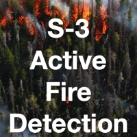
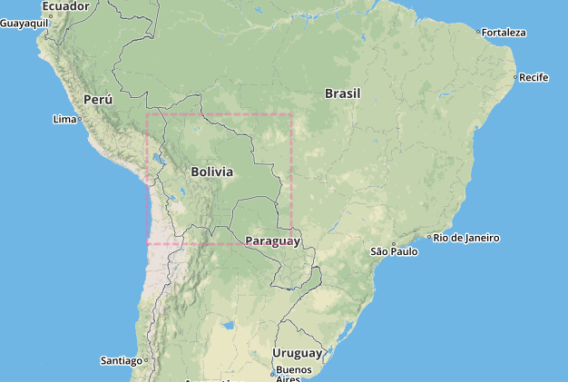
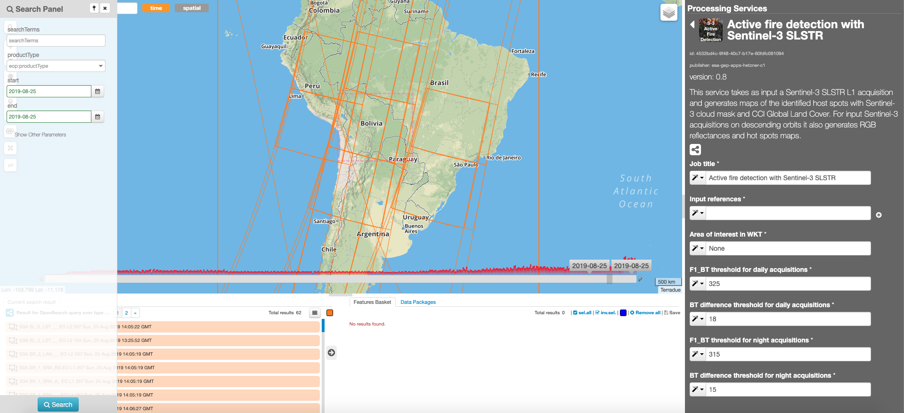
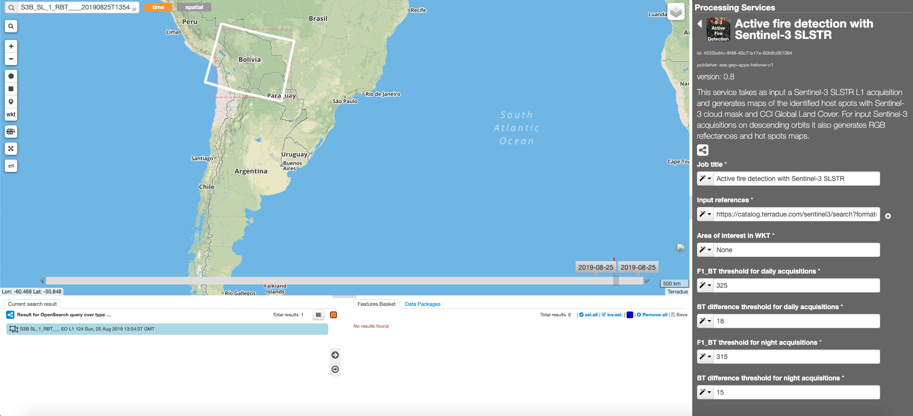
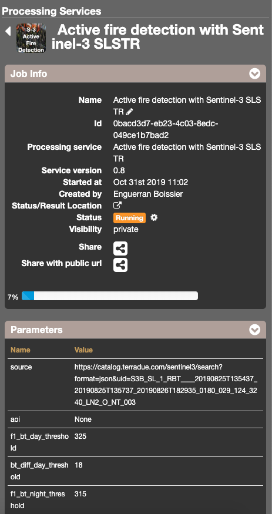
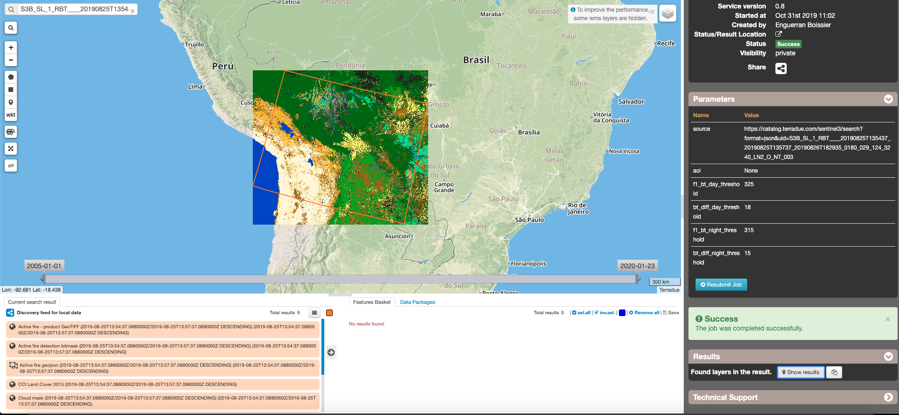

Active fire detection with Sentinel-3 SLSTR
~~~~~~~~~~~~~~~~~~~~~~~~~~~~~~~~~~~~~~~~~~~

**Active fire detection with Sentinel-3 SLSTR**

This service takes as input a Sentinel-3 SLSTR L1 acquisition and generates maps of the identified hot spots with Sentinel-3 cloud mask and CCI Global Land Cover. For input Sentinel-3 acquisitions on descending orbits it also generates RGB reflectances and hot spots maps.

**EO sources supported**

    - Sentinel-3 SLSTR L1

**Output specifications**

    - Hot spots map
    - RGB reflectances (DESCENDING orbits only)

-----

This tutorial will describe the processing of Sentinel-3 SLSTR L1 images to generate a Hot spot map for the two input Sentinel-3 acquisitions on the GEP.

Select the processing
=====================

* Login to the platform (see :doc:`user <../community-guide/user>` section)

* Select the processing service “Active fire detection with Sentinel-3 SLSTR”:

.. figure:: assets/tuto_active-fire-detect_1.png
	:figclass: align-center
        :width: 750px
        :align: center

The "Active fire detection with Sentinel-3 SLSTR" panel is displayed with parameters values to be filled-in.

Fill the parameters
===================

Reference input
---------------

* Select the Sentinel-3 data collection in the EO Data button.
* Select the area for which you want to do an anlysis, e.g over Bolivia.

* Click on the lens icon to open the Search Panel
* Select **SL_1_RBT___** as Product Type
* Apply the date value **2019-08-25** in both **time:start** and **time:end** fields

* Drag and Drop the selected item in the first *Input reference* field:

.. NOTE:: input can be picked up directly by using the following text filter: S3B_SL_1_RBT____20190825T135437_20190825T135737_20190826T182935_0180_029_124_3240_LN2_O_NT_003

Area Of Interest in WKT
-----------------------

* Use the default value **None**

.. NOTE:: you can also specify manually an AOI in WKT format, or draw an area on the map using the search tool and get its value from the *Magic tool wizard*

F1_BT threshold for daily acquisitions
--------------------------------------

F1_BT (Fire Band 1 Brightness Temperature) threshold in Kelvin degrees for daily acquisitions (descending passes)

* Use the default value **325**

BT difference threshold for daily acquisitions
----------------------------------------------

BT (Brightness Temperature) difference threshold in Kelvin degrees for daily acquisitions (descending passes)

* Use the default value **18**

F1_BT threshold for night acquisitions
--------------------------------------

F1_BT (Fire Band 1 Brightness Temperature) threshold in Kelvin degrees for night acquisitions (ascending passes)

* Use the default value **315**

BT difference threshold for night acquisitions
----------------------------------------------

BT (Brightness Temperature) difference threshold for night acquisitions

* Use the default value **15**

Run the job
===========

* Click on the button Run Job and see the Running Job

* After about 20 minutes, see the Successful Job:

.. figure:: assets/tuto_active-fire-detect_5.png
	:figclass: align-center
        :width: 750px
        :align: center

Results: download and visualization
===================================

* Click on the button *Show results*

* See the result on map:

* The following files are produced:

    - **Active fire - product GeoTIFF**
    - **Active fire detection bitmask**
    - **Active fire geojson**
    - **CCI Land Cover 2015** 
    - **Cloud mask**
    - **Reflectances composite**
    - **Reflectances composite and bitmask**
