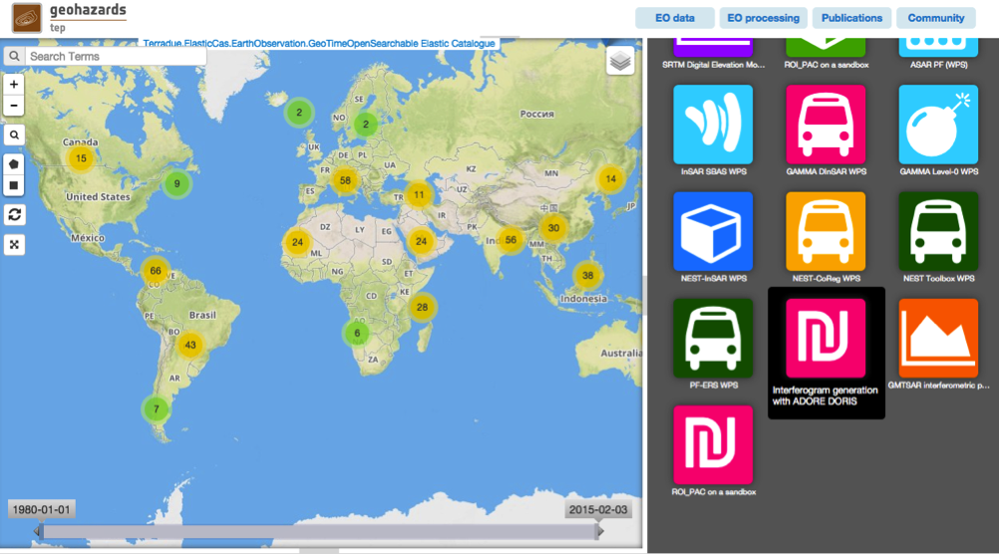

Interferogram generation with ADORE DORIS
~~~~~~~~~~~~~~~~~~~~~~~~~~~~~~~~~~~~~~~~~

Select the processing
=====================

Login to the platform (see :doc:`user <../community-guide/user>`)

Select the “Interferogram generation with ADORE DORIS” processor

Fill the parameters
===================

Slave product reference
-----------------------

Type **ASA_IM_1P** in the Search Terms field (1) and then click on lens icon (2).

.. figure:: ../includes/tuto_adore_2.png
	:figclass: img-border

Click on Show Other Parameters.

.. figure:: ../includes/tuto_adore_3.png
	:figclass: img-border

Type in the **time:start** field the value **2008-03-26** and in the **time:end** field the value **2008-03-26**, then click on the button **Search**.

.. figure:: ../includes/tuto_adore_4.png
	:figclass: img-border

Drag and Drop the first result (the one with **Track 129**) in the *Slave product reference* field.

.. figure:: ../includes/tuto_adore_5.png
	:figclass: img-border

.. figure:: ../includes/tuto_adore_6.png
	:figclass: img-border

Master product reference
------------------------

Perform the same procedure described previsouly (`Slave product reference`_), using as values **2009-03-11** in the **time:start** field and in the **time:end** field.

.. figure:: ../includes/tuto_adore_7.png
	:figclass: img-border

Drag and drop the result in the *Master product reference* field.

.. figure:: ../includes/tuto_adore_8.png
	:figclass: img-border

Point of Interest
-----------------

Type **POINT(13.4 42.35)** in the *Point of Interest* field.

Extend
------

Type **2000,2000** in the *Extend*.

Settings for ADORE Doris separated by comma
-------------------------------------------

Type **cc_winsize="128 128",fc_acc="8 8",int_multilook="4 4",coh_multilook="4 4",dumpbaseline="15 10"** in the *Settings for ADORE Doris separated by comma* field.

.. figure:: ../includes/tuto_adore_9.png
	:figclass: img-border

Run the job
===========

Click on the button Run Job.

.. figure:: ../includes/tuto_adore_10.png
	:figclass: img-border

See the Running Job.

.. figure:: ../includes/tuto_adore_11.png
	:figclass: img-border

After about 20 minutes, see the Successful Job.

.. figure:: ../includes/tuto_adore_12.png
	:figclass: img-border

