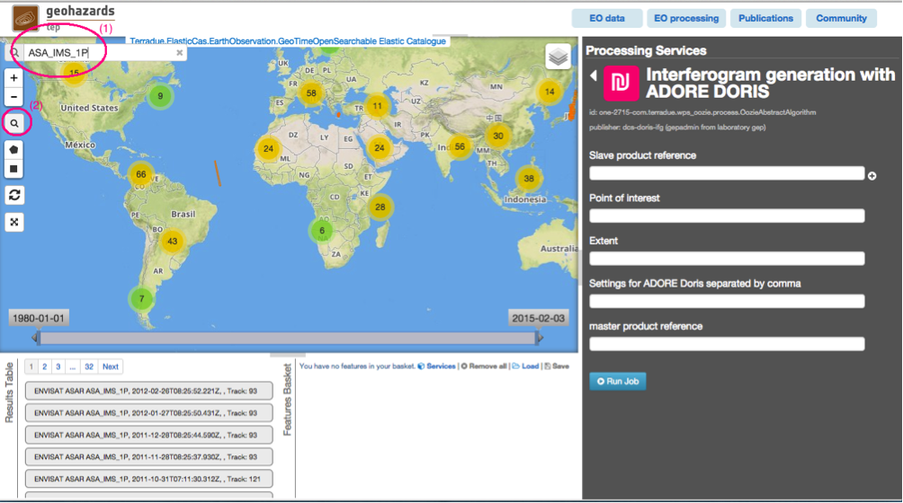
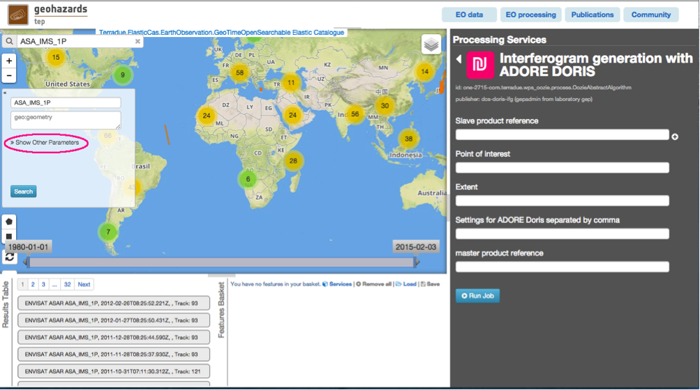
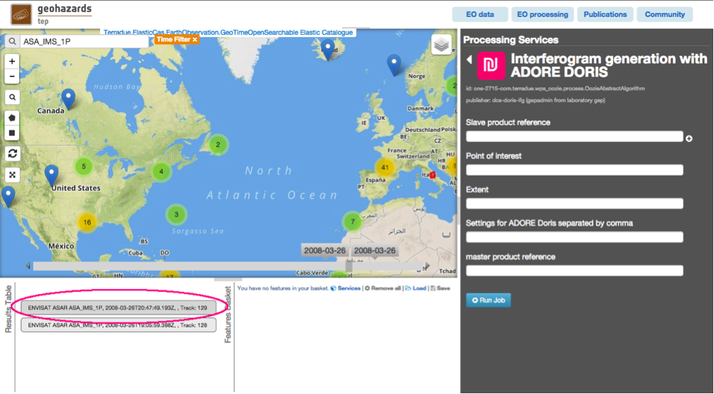
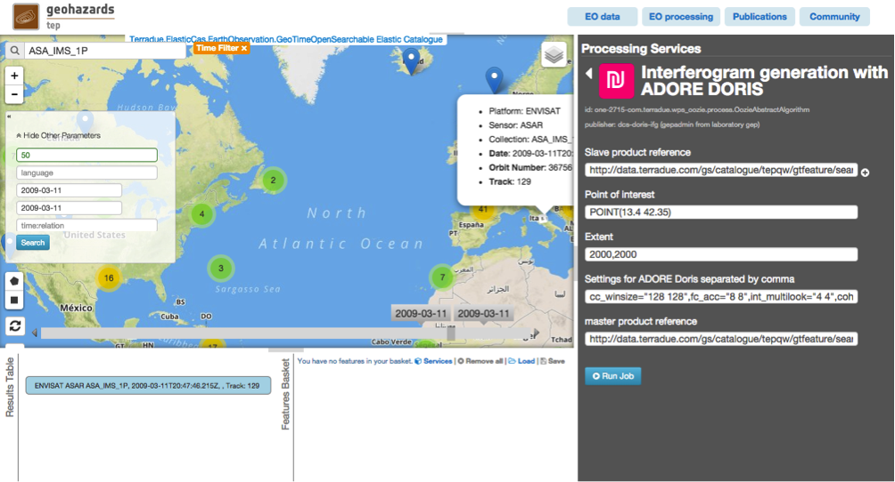
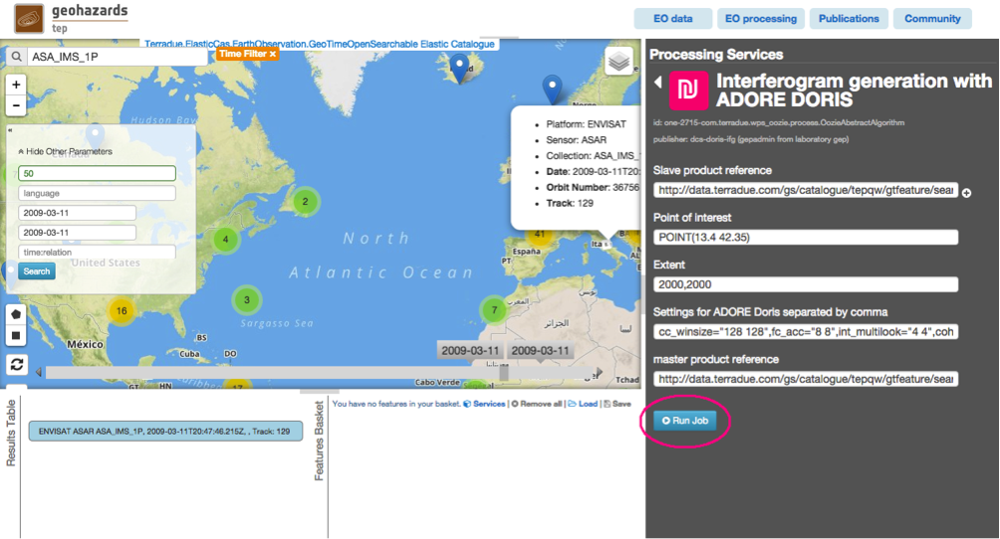
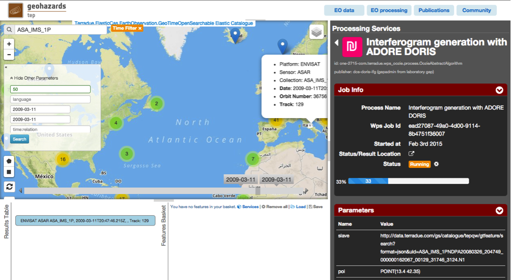
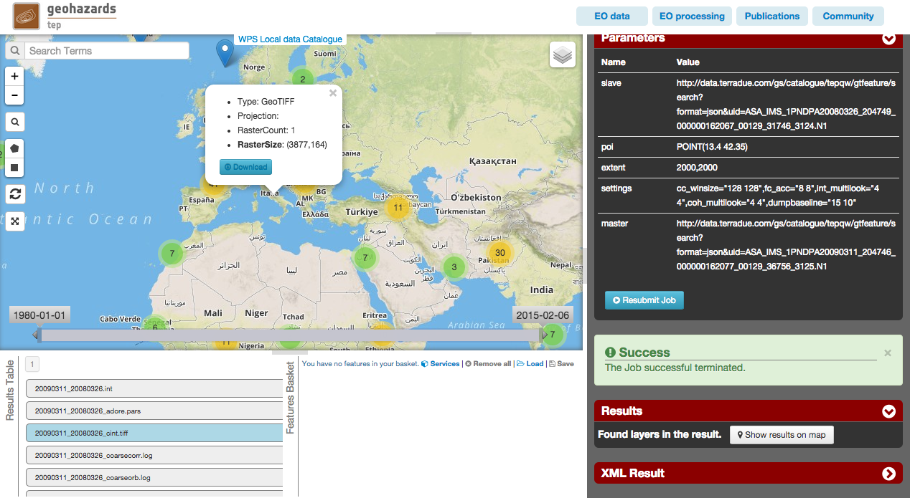

Interferogram generation with ADORE DORIS
~~~~~~~~~~~~~~~~~~~~~~~~~~~~~~~~~~~~~~~~~

Select the processing
=====================

* Login to the platform (see :doc:`user <../community-guide/user>`)

* Select the “Interferogram generation with ADORE DORIS” processor:

.. figure:: assets/tuto_adore_1.png
	:figclass: align-center
        :width: 750px
        :align: center

Fill the parameters
===================

Slave product reference
-----------------------

* Type **ASA_IMS_1P** in the Search Terms field (1) and then click on lens icon (2):



* Click on Show Other Parameters:



* Type in the **time:start** field the value **2008-03-26** and in the **time:end** field the value **2008-03-26**, then click on the button **Search**:

.. figure:: assets/tuto_adore_4.png
	:figclass: align-center
        :width: 750px
        :align: center

* Drag and Drop the first result (the one with **Track 129**) in the *Slave product reference* field:



.. figure:: assets/tuto_adore_6.png
	:figclass: align-center
        :width: 750px
        :align: center

Master product reference
------------------------

* Perform the same procedure described previously (`Slave product reference`_), using as values **2009-03-11** in the **time:start** field and in the **time:end** field:

.. figure:: assets/tuto_adore_7.png
	:figclass: align-center
        :width: 750px
        :align: center

* Drag and drop the result in the *Master product reference* field:

.. figure:: assets/tuto_adore_8.png
	:figclass: align-center
        :width: 750px
        :align: center

Point of Interest
-----------------

* Type
  
.. code-block:: bash
  
  POINT(13.4 42.35)
  
in the *Point of Interest* field:

Extent
------

* Type
  
.. code-block:: bash
 
  2000,2000

in the *Extend*:

Settings for ADORE Doris separated by comma
-------------------------------------------

* Type
  
```
  cc_winsize="128 128",fc_acc="8 8",int_multilook="4 4",coh_multilook="4 4",dumpbaseline="15 10"
```

in the *Settings for ADORE Doris separated by comma* field:



Run the job
===========

* Click on the button Run Job:



* See the Running Job:



* After about 20 minutes, see the Successful Job:

.. figure:: assets/tuto_adore_12.png
	:figclass: align-center
        :width: 750px
        :align: center

* Click on the button *Show results on map*, then on the *20090311_20080326_cint.tiff* result on the *Results Table* in the bottom left side

* See the result on map: 


