ALADIM-HR: Automatic LAndslide Detection and Inventory Mapping from multispectral HR (S2 or L8) data
~~~~~~~~~~~~~~~~~~~~~~~~~~~~~~~~~~~~~~~~~~~~~~~~~~~~~~~~~~~~~~~~~~~~~~~~~~~~~~~~~~~~~~~~~~~~~~~~~~~~

.. image:: assets/tuto_aladim_icon.png 

**ALADIM**

ALADIM-HR is developed by CNRS-EOST (Strasbourg, France). It allows to detect and map new landslides triggered by large forcing events (earthquake, heavy rains) from the analysis of pre- (Date 1) and post-event (Date 2) imagery. The service is based on change detection methods and machine learning. It allows the processing of High Resolution multispectral data (ALADIM-HR; Sentinel-2 SAFE files or Landsat-8 files) and Very-High Resolution multispectral data (ALADIM-VHR; typically Pléiades, Spot 6/7, Geo-Eye, Planet). A training dataset of manually mapped landslides (digitalization), the extent of the training areas and the extent of the area of interest (aoi) are provided as inputs (shape file-format). The outputs consist in a database of landslide polygons than can be assimilated to an Earth Observation derived landslide inventory. ALADIM builds on the change detection methodology described in [1]_ and [2]_.

**EO sources supported**:

    - Sentinel-2 MSI LIC (SAFE file format),
    - Landsat-8
    
**Output specifications**

    - A shapefile (*.shp files) containing the landslides detected at an F2 optimal threshold.
    - An image (geotiff file format) containing all landslides detected at an F2 optimal threshold.
    - Two documents (*.pdf files) presenting the cross-validation quality control (precision-recall curves and acurracies of the parameters).

-----

This tutorial introduces to the use of the service for the detection and the mapping of landslides from HR multispectral images (`Job example`_). To this end, we will process a couple of Sentinel-2 images acquired before and after the `Idai Cyclone`_ which hit Mozambique on 14 March 2019.

.. _`Idai Cyclone`: https://en.wikipedia.org/wiki/Cyclone_Idai

Select the processing service
=============================

* Login to the platform (see :doc:`user <../community-guide/user>` section)

* Go to the Geobrowser, expand the panel “Processing services” on the right hand side and select the processing service “ALADIM-HR”:

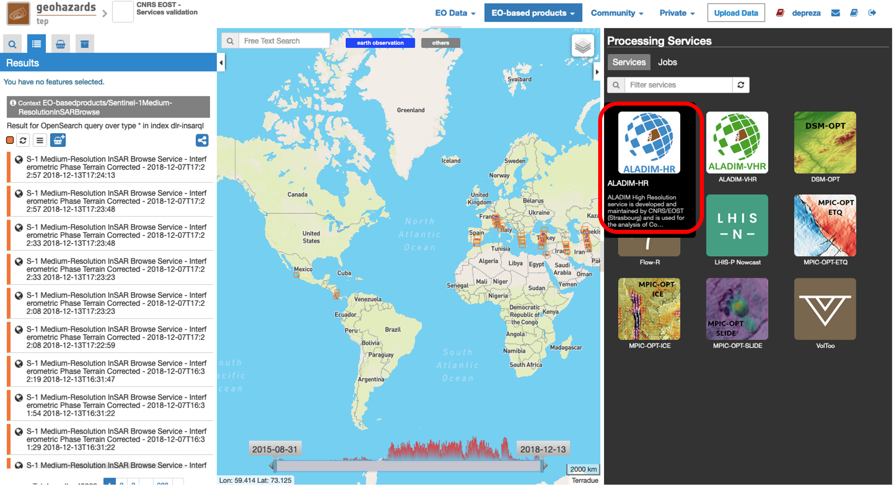

This will display the service panel including several pre-defined parameters which can be adapted.

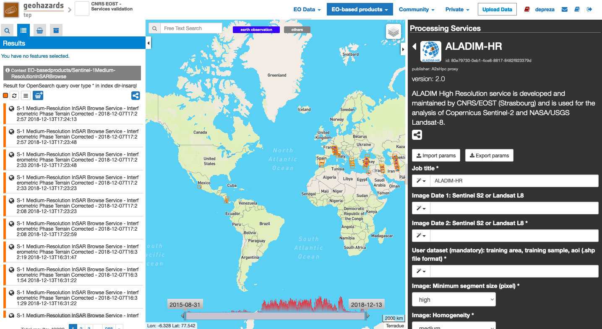

Use case: Landslide detection and mapping from HR multispectral data
====================================================================

Select input data
-----------------

The Geobrowser offers multiple ways to search Sentinel 2 dataset with spatial and temporal filters. The interested reader should refer to the :doc:`Geobrowser <../community-guide/platform/geobrowser>` section for a general introduction. 
For this tutorial we will show the example of a research of a pair of Sentinel 2 images which encompass the area of interest around Chimanimani (Mozambique). The first image was search before the Cyclone and the second after the event.   

Select Sentinel-2 from the EO Data pulldown menu:

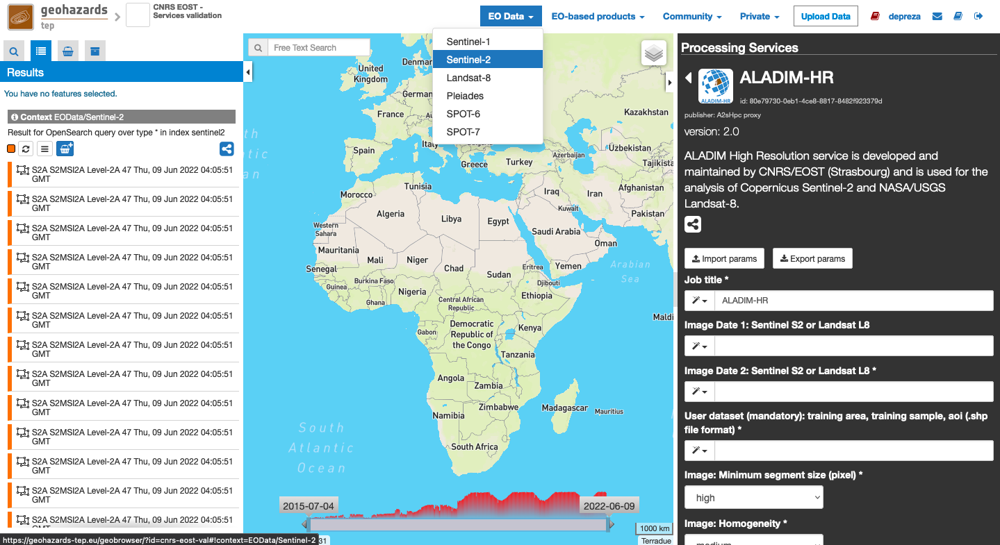

Draw a polygon on the map around your area of interest and reduce the time extend thanks to the timeline at the bottom of the map:

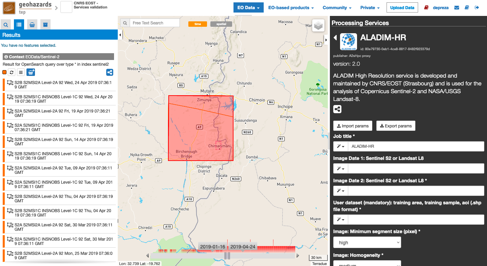

Drag and drop the images of your choice in the fields of the service panel associated with the pre-event and the post-event Sentinel-2 images:

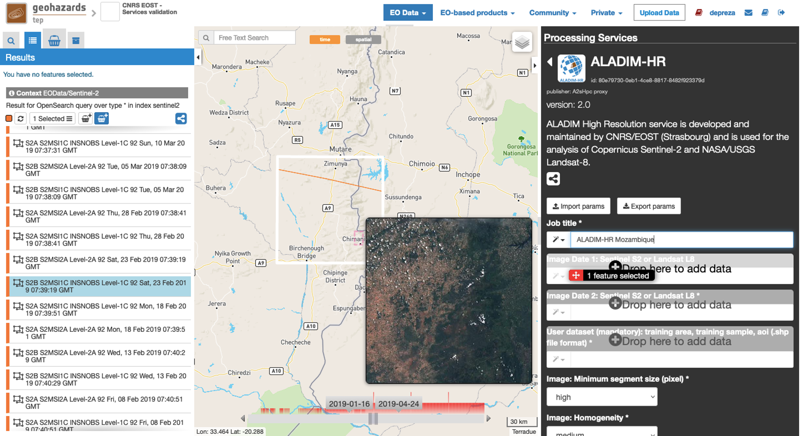

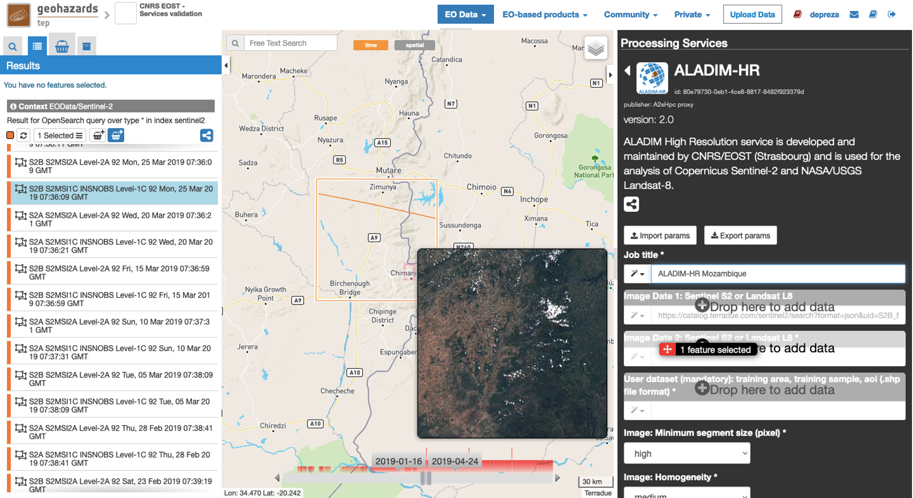

Create an archive for the ensemble of your input shapefiles (training_areas.shp, training_samples.shp and aoi.shp). The framework requires a flat .tar.gz format (i.e. the contents of the archive file must not include folders). 
A tutorial about the input dataset creation can be found here :doc:`tutorial <aladim_input_dataset_preparation>`

Upload the archive:

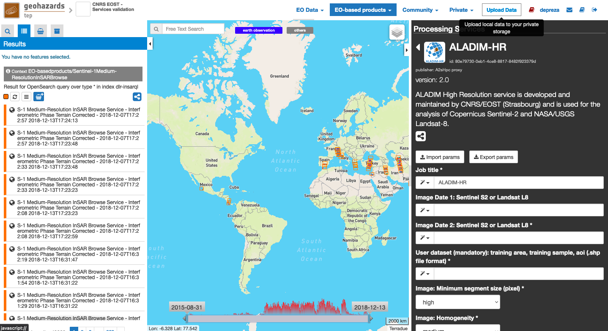

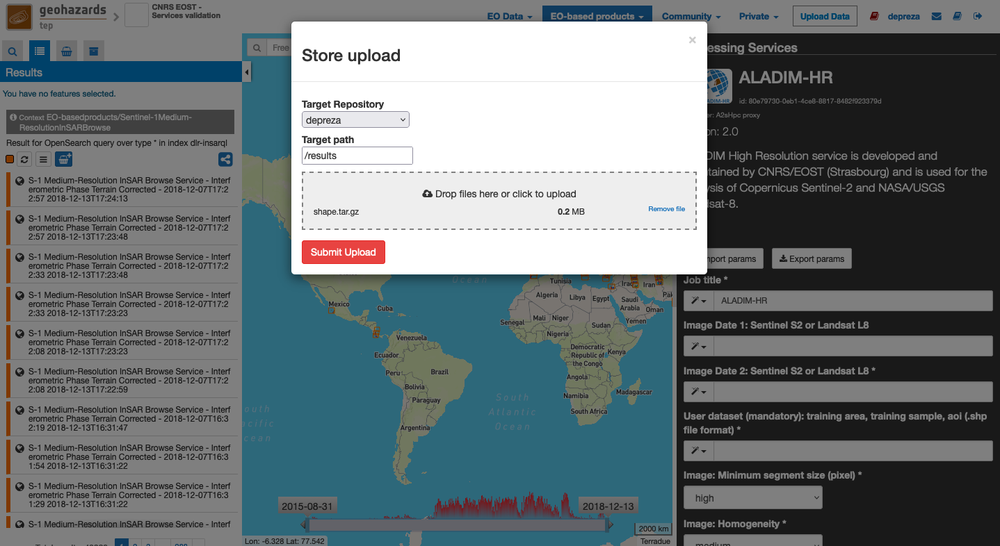

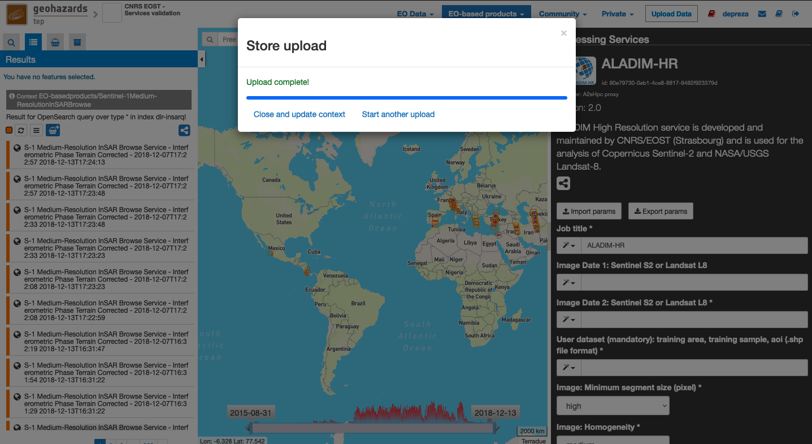
	
Select My store from the Private pulldown menu:

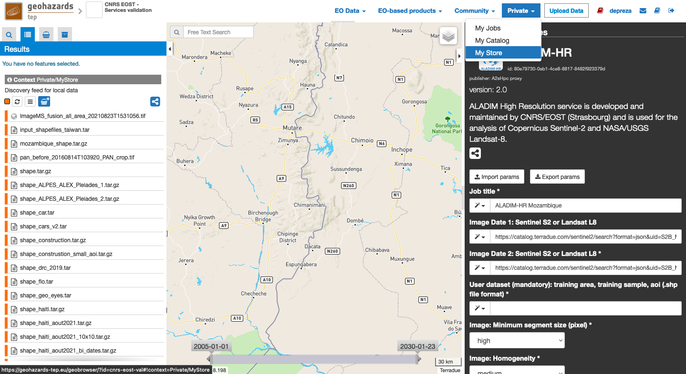
	

Drop the archive in the field of the service panel named "shapes files uri":

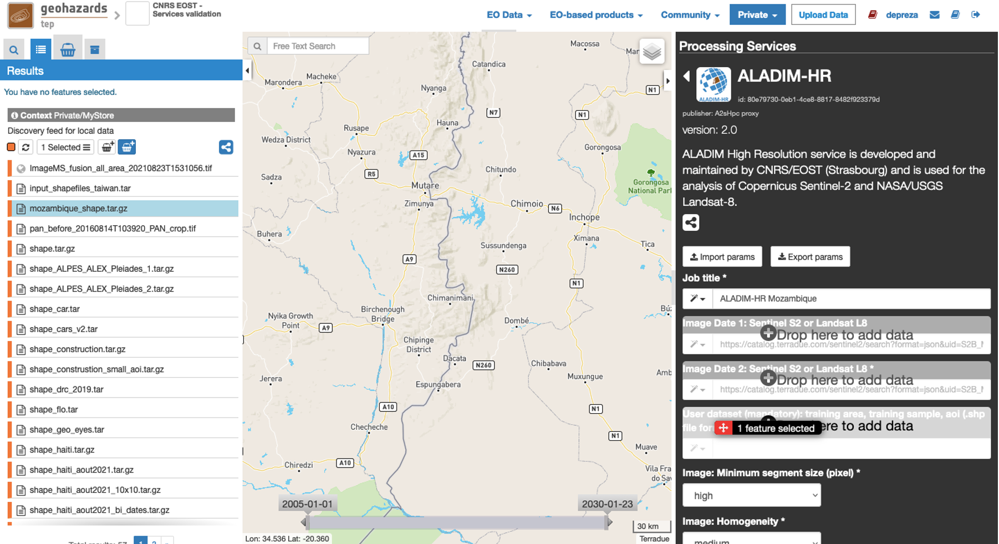

Set the processing parameters 
-----------------------------

There is a total of 7 processing parameters that can be adjusted. When hovering over the parameter fields, you will see a short explanation for each of the parameters.

* **Image: Homogeneity:** Defines the homogeneity (low) or diversity (high) of the segment radiometry (see examples below).
* **Image: Minimum segment size (pixel):** Defines the minimal size of the segments (to be merged with their most similar neighbors or to be deleted if isolated).

    - A very low value corresponds to 10 pixels, e.g. 1 000 m2 for a 10m pixel resolution (Sentinel-2)
    - A low value corresponds to 100 pixels, e.g. 10 000 m2 for a 10m pixel resolution (Sentinel-2)
    - High and very high are not recommended for input images with 10m pixel resolution (Sentinel-2)

* **Use cloud mask:** If set to *True* the FMASK algorithm [4]_ will be used to detect clouds, snow, and water and mask them from the segmentation.
* **Spectral indice set used:** If set to basic, the main spectral indices (17) will be computed and integrated in the classification. If set to advanced a large number (30) of spectral indices will be computed and integrated in the classification. The indices integrate with the advanced choice and not the basic one are dedicated to vegetation puropses. The advanced choice will increase the computation time.
* **Use DEM derivated attributes:** If set to True the DEM derivated attributes will be computed and integrated in the classification
* **Use textural attributes:** If set to True the textural attributes will be computed and integrated in the classification
* **Use morphometric attributes:** If set to True the morphometric attributes will be computed and integrated in the classification

The figure below summarizes the parameter settings for this test.

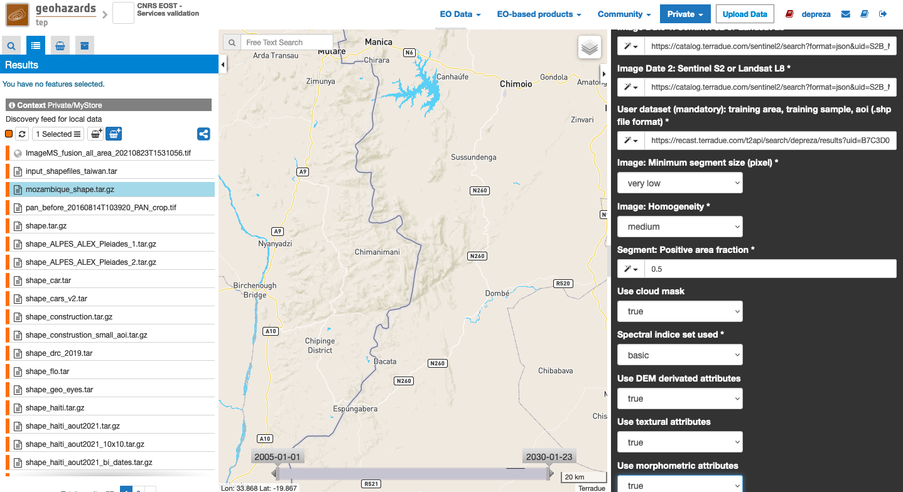

Run the job
-----------

* You are good to go. Click on the button *Run Job* at the bottom of the right panel. Depending on the allocated resources the execution will require a few hours to terminate.

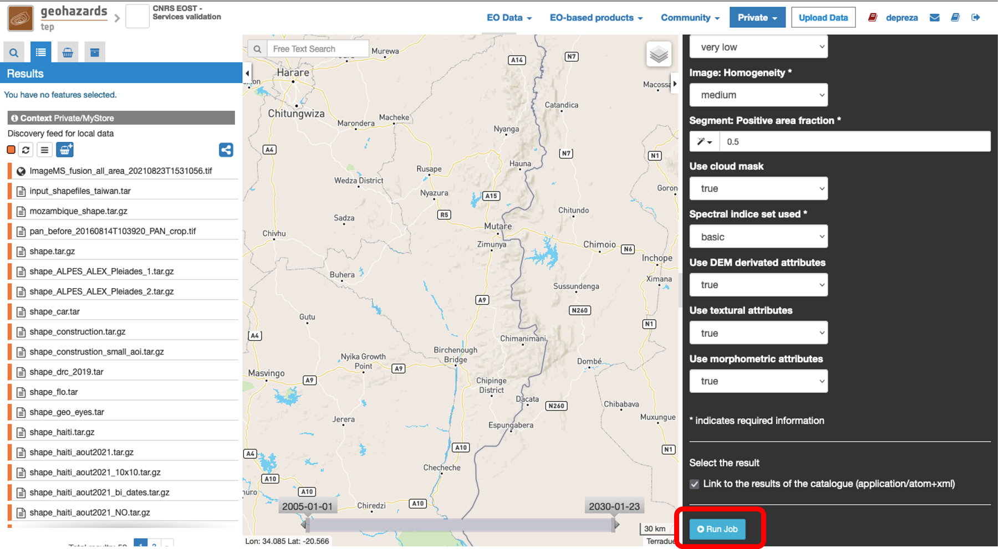

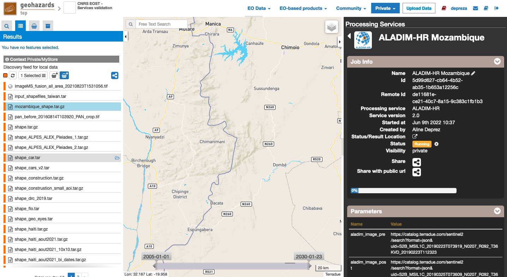
	
* Once the job has finished, click on the *Show results* button to get a list and a pre-visualization of the results (`Job example`_).

.. note:: The pre-visualization in the *Geobrowser* is just a preview and the user is encouraged to download the results for further analysis and post-processing.

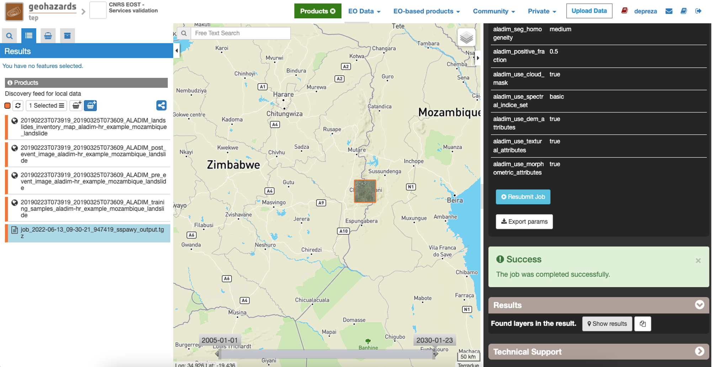
	
	
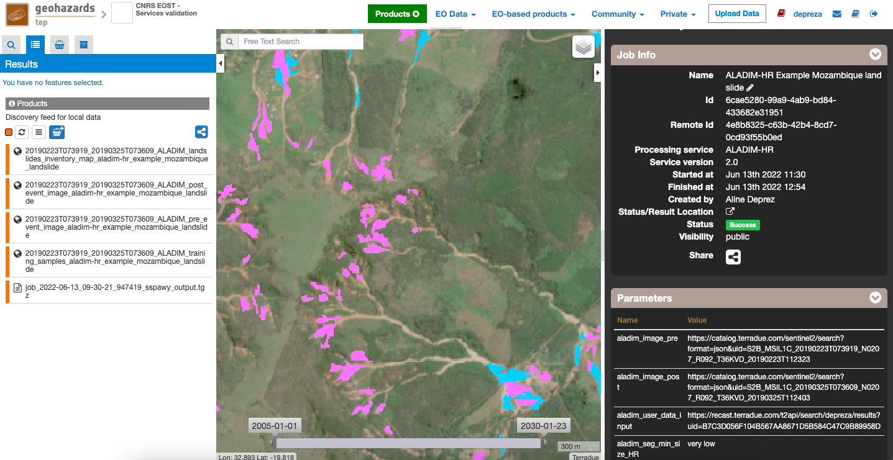

.. _`Job example`: https://geohazards-tep.eu/t2api/share?url=https%3A%2F%2Fgeohazards-tep.eu%2Ft2api%2Fjob%2Fwps%2Fsearch%3Fid%3D6228aaf0-b00d-414c-b68e-4246d8044b4f%26key%3D2ecc8ba1-b7e2-4612-9292-549e5abbc040
References
==========

.. [1] Stumppf, A., Kerle, N. 20110. Object-oriented mapping of landslides using Random Forests. Remote Sensing of Environment, 115(10): 2564-2577.
.. [2] Stumpf, A., Lachiche, N., Malet, J.-P., Puissant, A., Kerle, N. 2014. Active learning in the spatial domain for remote sensing image classification. IEEE Transactions on Geoscience and Remote Sensing, 52(5): 2492-2507.
.. [3] Lassalle, P., Inglada, J. Michel, J., Grizonnet, M., Malik, P. 2015. A scalable tile-based framework for region-merging segmentation. IEEE Transactions on Geoscience and Remote Sensing, 53(10): 5473-5485.
.. [4] Zhu, Z., Wang, S., Woodcock, C.E. 2015. Improvement and expansion of the Fmask algorithm: cloud, cloud shadow, and snow detection for Landsats 4-7, 8, and Sentinel 2 images. Remote Sensing of Environment, 159: 269-277.
