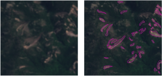
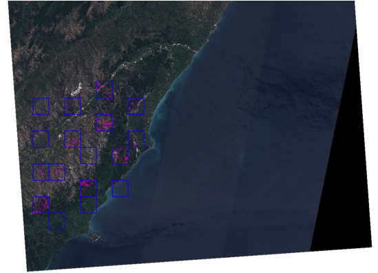

ALADIM-S2 and ALADIM-VHR: Preparation of input datasets
~~~~~~~~~~~~~~~~~~~~~~~~~~~~~~~~~~~~~~~~~~~~~~~~~~~~~~~

Landslide inventory maps are important documents to describe mass movement spatial distribution in a region and to prepare susceptibility, hazard and risk maps. They are also useful to investigate the distribution, types and patterns of landslides in relation to geomorphology, lithology, land cover, tectonic settings and hydrogeological conditions.
Landslide inventories have traditionally been prepared combining the visual interpretation of aerial photographs and field work, which to date remains the most frequently followed approach.  Despite its time consuming and labor intensive nature, however, results still include a large degree of subjectivity and incur the risk of omissions due to limited site access or aerial survey campaigns only being mounted with some delay, when landslide traces are starting to disappear.
Large events with thousands of individual landslides triggerred by large earthquakes or heavy rains illustrate the immense challenges posed for any non-automated mapping approach.
The large fleet of existing multispectral high-resolution (S2) and very-high resolution  (Pléiades, Spot) allows to record inexpensive imagery within days or even hours after a given landslide event using automated techniques. The automated techniques are based on the application of change detection methods between the pre-event imagery and the post-event imagery. It includes the creation of a training sample, the calculation of relevant features derived from the multispectral images, and the use of machine learning models.

The performance (accuracy, errors) of the Aladim service will mostly depend on the quality of the training data.

**All provided shapefiles must share the same CRS as the the post-event image!**

Creation of the landslide initial training samples: training_samples.shp
========================================================================
The first mandatory shape file is composed of the **training samples**. 
The landslide training samples should be :

  - Digitized (image interpretation) on the post-event imagery;
  - Representative of the distribution of landslide sizes (with the digitalization of small, medium and large landslide sizes);
  - Digitized over the complete range of landscape properties (e.g. low, medium and high slope gradients; low, medium and high image reflectance values). 

The training samples should comprise a minimum number of landslide events (e.g. typically 5%) of the expected total number of landslide events over the study areas. 

The training samples should be recorded in *.shp file format, and created out of the GEP Platform. 
The training samples should be presented as a polygon shapefile with one single layer. It is typically a good starting point to divide the study area with a grid and select about 10 grid cells in which all
landslides are mapped to construct the training sample. 
**Please assure that the training samples shapefile does not contain NULL geometries or other geometry problems.** 

Name the shapefile like this:  **training_samples.shp**

An example of training samples is presented in the Figure below.

Creation of the training areas: training_areas.shp
==================================================
The second mandatory shape file delineates the **training areas**; it is required to inform the service which areas have been revised during the mapping. This shapefile must contain at least two polygons, corresponding to the individual images patches that were revised. It is **very important** that the polygons outline only areas that have been revised
during the creation of the training samples since all areas that are covered by polygons in **training areas** but not by polygons in **training samples** will be considered as negative examples 
(i.e. non landslides). 

Name the shapefile like this: **training_areas.shp**

Creation of the AOI – Area of Interest: aoi.shp
================================================
The third (optional) shapefile is the **area of interest** file (polygon). It allows cropping the input images and to select only the region of interest for the processing. 

Name the shapefile like this: **aoi.shp**

.. figure:: assets/tuto_prepare_dataset_aladim_3.png
    :figclass: align-center
        :width: 750px
        :align: center

Creation of the archive containing the ALADIM shapefile inputs 
==============================================================
The shapefiles created as decribed above must be packaged in a **flat** archive in order to correspond to the expected format for ALADIM input. 
The framework requires a flat .tar.gz, the contents of the file must not include folders
To create a flat tar.gz you have to run the following commands (in a directory containing your shapefiles) : 

tar -cvf shape.tar *

gzip shape.tar

The file **shape.tar.gz** that you obtain is now ready to be used as ALADIM input.

