ALADIM-VHR: Automatic LAndslide Detection and Inventory Mapping from multispectral Very-High Resolution images
~~~~~~~~~~~~~~~~~~~~~~~~~~~~~~~~~~~~~~~~~~~~~~~~~~~~~~~~~~~~~~~~~~~~~~~~~~~~~~~~~~~~~~~~~~~~~~~~~~~~~~~~~~~~~~

**ALADIM-VHR**

ALADIM-VHR is developed by CNRS-EOST (Strasbourg, France). It allows to detect and map new landslides triggered by large forcing events (earthquake, heavy rains) from the analysis of pre- (Date 1) and post-event (Date 2) imagery. The service is based on change detection methods and machine learning. It allows the processing of High Resolution multispectral data (ALADIM-HR; Sentinel-2 SAFE files or Landsat-8 files) and Very-High Resolution multispectral data (ALADIM-VHR; typically Pléiades, Spot 6/7, Geo-Eye, Planet). A training dataset of manually mapped landslides (digitalization), the extent of the training areas and the extent of the area of interest (aoi) are provided as inputs (shape file-format). The outputs consist in a database of landslide polygons than can be assimilated to an Earth Observation derived landslide inventory. ALADIM builds on the change detection methodology described in [1]_ and [2]_.

**EO sources supported**:

    - Mandatory: A couple of ortho-rectified multispectral (MS) images (typically Pléiades, Spot6/7, Geo-Eye and Planets), including 4 bands (B, G, R and NIR)
    - Optional: A couple of ortho-rectified panchromatic (P) images

Beside the service parameters an archive folder containing the training set, the training areas (and aoi) in shapefile format is needed. See the tutorial (:doc:`tutorial <aladim_input_dataset_preparation>`) to create these inputs.

**Output specifications**

    - A shapefile (*.shp file format) containing the landslides detected at an F1 and at an F2 optimal threshold (binary classification).
    - A shapefile (*.shp file format) containing all the segments with the associated probability to be a landslide.
    - An image (geotiff file format) containing all landslides detected at an F1 and at an F2 optimal thresholds (binary classification).
    - One report (*.pdf file) presenting in a first part the cross-validation quality of the detection and in a second part the probability density and the frequency density of landslide areas.
    
-----

This tutorial introduces to the use of the ALADIM-VHR service from VHR multispectral images. To this end, we will process a couple of Spot6/Spot7 images acquired before and after `Hurricane Matthew`_ which hit Haiti in October 2016. The images are available through the CEOS Recovery Observatory Haïti.

.. _`Matthew Hurricane`: https://en.wikipedia.org/wiki/Hurricane_Matthew
.. _`CEOS Recovery Observatory`: http://ceos.org/ourwork/workinggroups/disasters/recovery-observatory/

Select the processing service
==============================

* Login to the platform (see :doc:`user <../community-guide/user>` section)

* Go to the Geobrowser, expand the panel “Processing services” on the right hand side and select the processing service “ALADIM-VHR”:

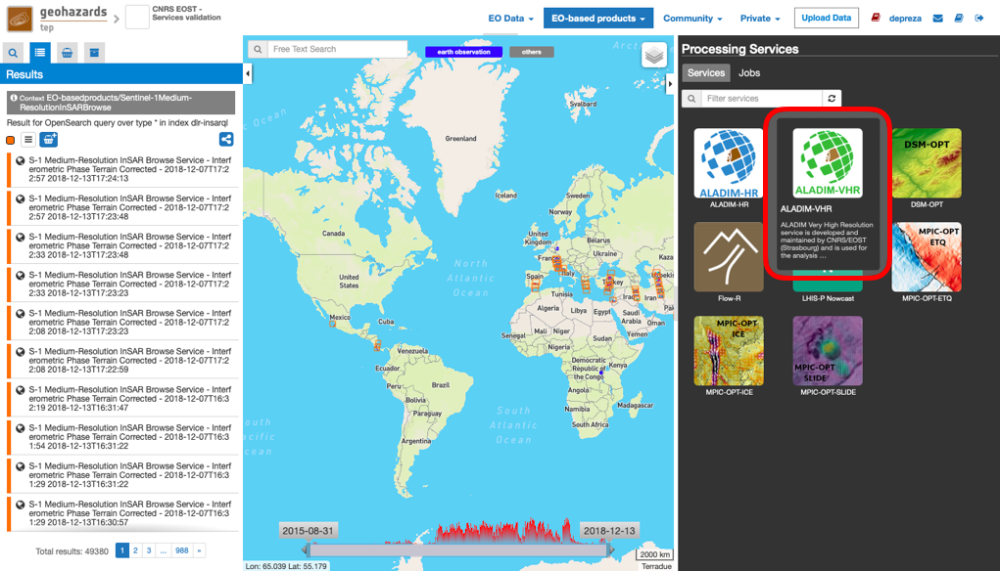

This will display the service panel including several pre-defined parameters which can be adapted.

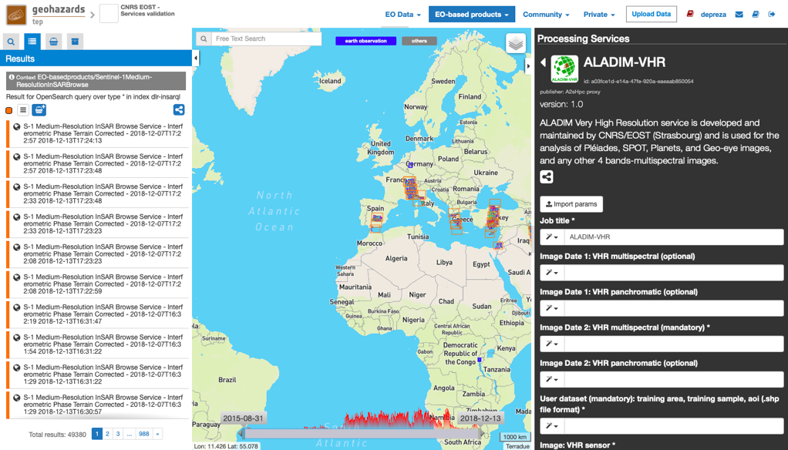

Use case: Landslide detection and mapping from Spot6-Spot7 multispectral data
=============================================================================

Upload input data
-----------------

The input images must be uploaded by the user. The image file names must contain the date and the time of the acquisition in the format YYYYMMDDTHHMMSS.
For this tutorial we present the example of a couple of multispectral images and a couple of panchromatic images from Spot6 and Spot7 satellites.
The first image was acquired before Hurricane Matthew on 14-04-2016 and the second after the event on 04-04-2017. Ideally, images acquired at the same season should be used to obtain similar radiometric signatures.

Upload your data:

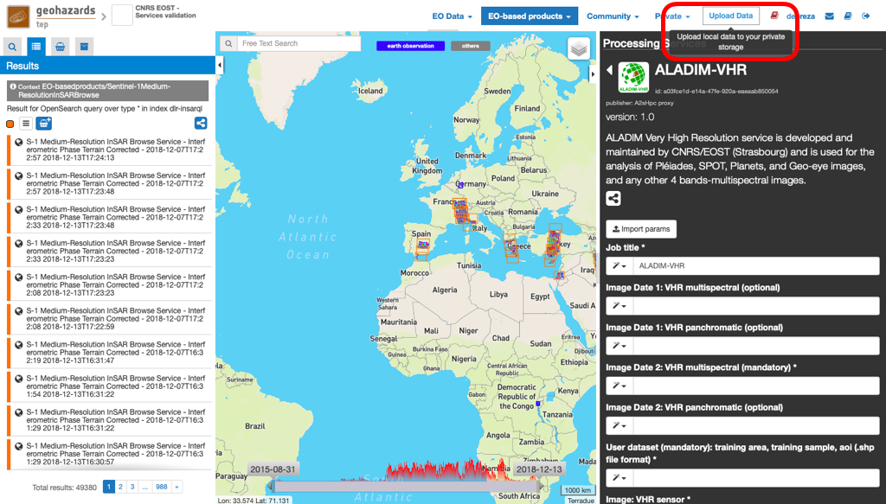

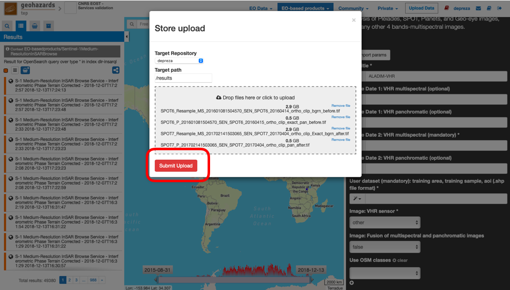

Drag and drop your images in the fields of the service panel:

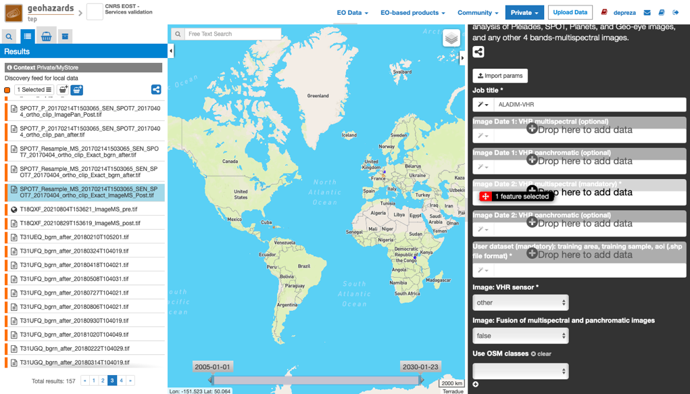

Create an archive for the ensemble of your input shapefiles (training_areas.shp, training_samples.shp and aoi.shp). The framework requires a flat .tar.gz format (i.e. the contents of the archive file must not include folders).
A tutorial about the input dataset creation is available here: doc:`tutorial <aladim_input_dataset_preparation>`

Upload the archive:

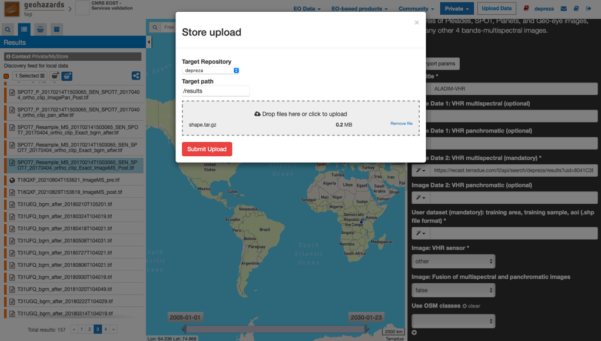

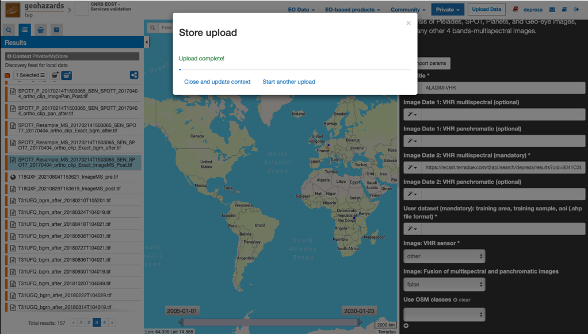

Drop the archive in the field of the service panel "shape files uri":

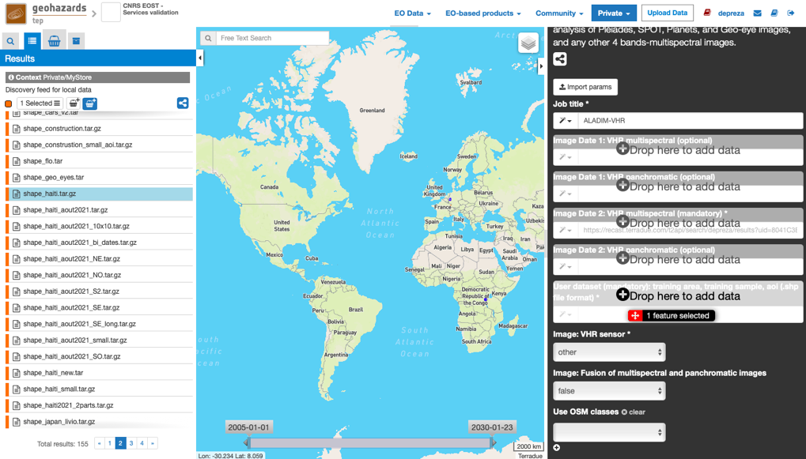

Set the processing parameters
-----------------------------

There is a total of 6 processing parameters. When hovering over the parameter fields, you will see a short explanation for each of the parameters.

The figure below summarizes the parameter settings for this test.

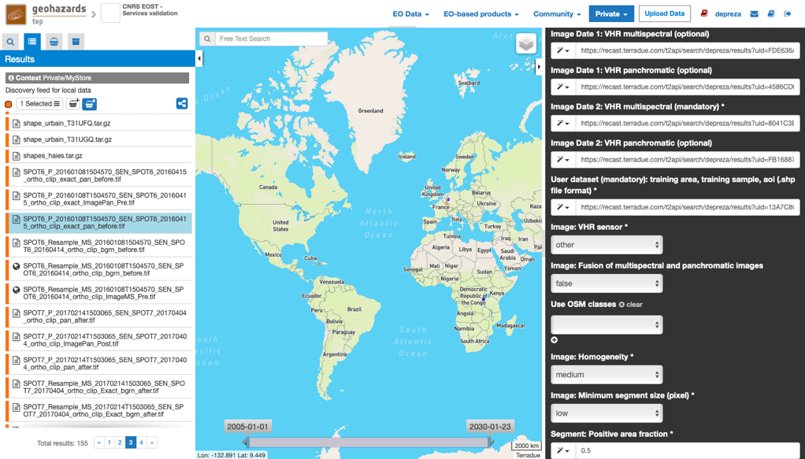

* **Image: VHR sensor:** The types of VHR sensors currently supported are Pléiades, SPOT6/7, Planets (Dove) and Geo-Eye). If none of this sensor type is recognized, the 4 bands of the image have to be ordered with Band1=Blue, Band2=Green, Band3=Red, Band4=NIR.
* **Image: Fusion of multispectral and panchromatic images:** If set True, a fusion between the multispectral and the panchromatic images is performed (using a meanshift pansharpening approach).
* **Use OSM classes:** Open Street Maps (OSM) classes used to exclude areas from the classification. The choice is defined by the user with the “OSM Tags” (see www.geofabrik.de/data/geofabrik-osm-gis-standard-0.7.pdf, pages 25-26).
* **Image: Homogeneity:** Defines the homogeneity (low) or diversity (high) of the segment radiometry (see examples below).
* **Image: Minimum segment size (pixel):** Defines the minimal size of the segments (to be merged with their most similar neighbors or to be deleted if isolated).

    - A very low value corresponds to 10 pixels, e.g. 2.5 m2 for a 0.5m pixel resolution (Pleiades P+MS)
    - A low value corresponds to 100 pixels, e.g. 25 m2 for a 0.5m pixel resolution (Pleiades P+MS)
    - A high value corresponds to 1000 pixels, e.g. 250 m2 for a 0.5m pixel resolution (Pleiades P+MS)
    - A very high value corresponds to 5000 pixels, e.g. 1250 m2 for a 0.5m pixel resolution (Pleiades P+MS)

See examples of segment sizes and shapes for several parameter settings applied to Pleiades (P+MS) images.

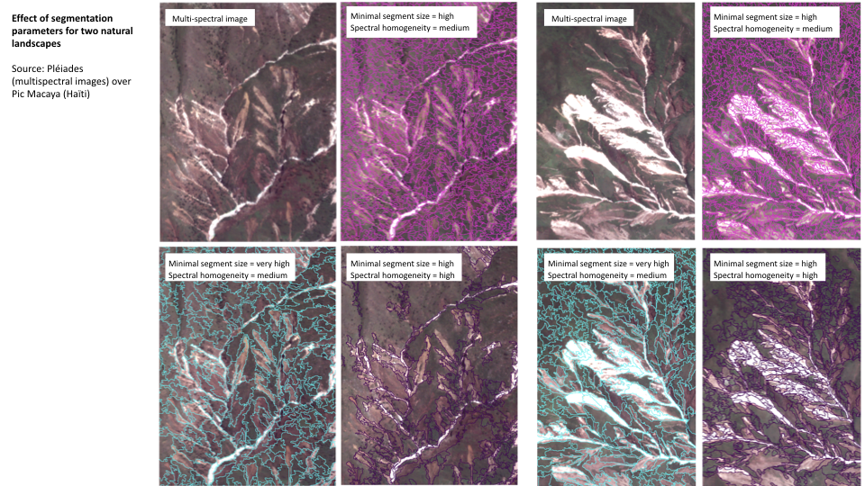

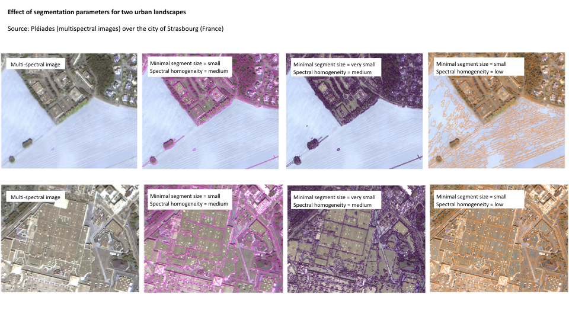

Run the job
-----------

* You are good to go. Click on the button *Run Job* at the bottom of the right panel. Depending on the allocated resources the execution will require a few hours to terminate.

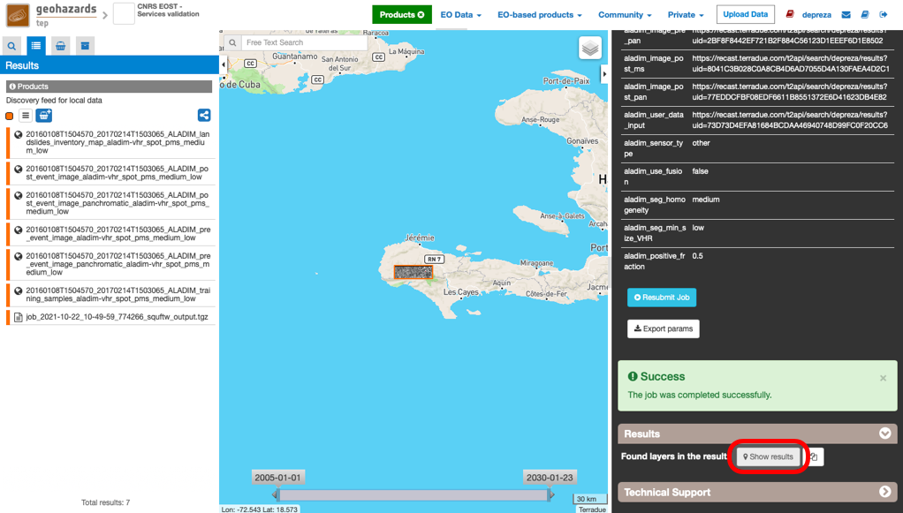

* Once the job has finished, click on the *Show results* button to get a list and a preview of the results.

.. note:: The preview in the *Geobrowser* is a degraded image and the user is encouraged to download the results for further analysis and post-processing.

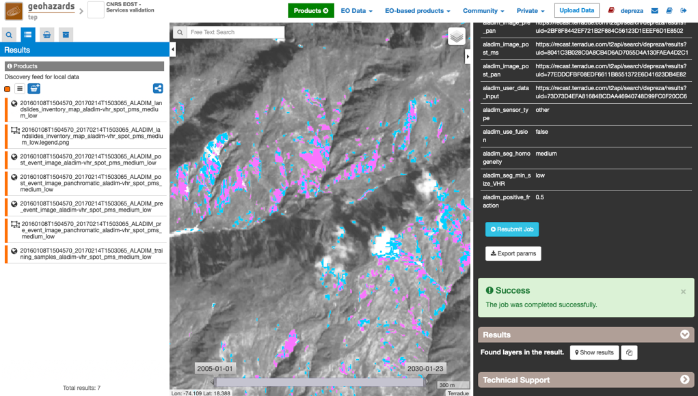

References
==========

.. [1] Stumppf, A., Kerle, N. 2010. Object-oriented mapping of landslides using Random Forests. Remote Sensing of Environment, 115(10): 2564-2577. https://doi.org/10.1016/j.rse.2011.05.013
.. [2] Stumpf, A., Lachiche, N., Malet, J.-P., Puissant, A., Kerle, N. 2014. Active learning in the spatial domain for remote sensing image classification. IEEE Transactions on Geoscience and Remote Sensing, 52(5): 2492-2507. https://doi.org/10.1109/TGRS.2013.2262052

