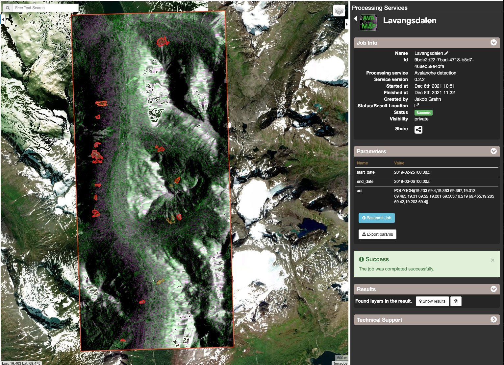

AVAMAP - Snow Avalanche mapping from Sentinel-1 data
~~~~~~~~~~~~~~~~~~~~~~~~~~~~~~~~~~~~~~~~~~~~~~~~~~~~~~~~~~~~~~~~~~~~~~~~~
by NORCE AS

1. Introduction
===============

**AVAMAP** is a tool for mapping snow avalanches from Sentinel-1 data. The tool has been developed by the Norwegian Research Center - NORCE AS. It is based on change detection between pairs of repeat-pass SAR aquisitions [1]. 

2. Running AVAMAP
=================

2.1 Select the Processing Service
---------------------------------

* Sign-in on the GEP portal: https://geohazards-tep.eu/
* Access the Thematic App containing the **AVAMAP** service.
* Open the tab *Processing services* from the right of the map and select the processing service **AVAMAP**.

2.2 Visualize preprocessed masks
--------------------------------

The detection algorithm is restricted by a set of masks, including: 
* **Radar mask**: indicating lack of data due to radar shadow and layover (one mask for each relative orbit of Sentinel-1)
* **Runout mask**: indicating avalanche runout zones based on the local topography
* **Land mask**: Indicate land (vs ocean)

The detection algorithm will only detect snow avalanches where these three masks are non-zero. The masks has been prepared on the GEP plarform, and can be visualized by selecting *Masks* on the top pane: 

The masks are prepared in terms of tiles, which appear as bounding boxes on the map: Select a tile and click *Show details*, followed by *Show results* at the bottom left to visualize the masks: 

Here, for instance, is the avalanche runout mask highlighted. White areas indicate where avalanches can potentially be found given the local topography: 

 
2.3 User inputs
---------------

Apart from a **Job title**, the tool only requires three inputs from the user: 
* **Start date**: ISO8601-formatted time (UTC)
* **End date**: ISO8601-formatted time (UTC)
* **Area of interest**: Polygon as WKT-string

The **Area of interest** must be a polygon, and inputted either as a WKT, or can be imported from a polygon drawn on the map: 

 
To run the job, simply click *Run Job*.

.. NOTE:: Since the revisit time of the Sentinel-1 satellites is typically 6-12 days, the time separation between **Start date** and **End date** should be at least this long in order include pairs of repeat-pass aquisitions. 

.. NOTE:: Depending on the size of your area of interst, the time separation between start and end date, and processing capability of the GEP platform, the processing can take several hours. 

2.4 Visualize results
---------------------

Open the finished job, and click *Show results* on the Results pane to show the results. The results consists: 

* **Detections**: Formatted as GeoJSON files, each containing a single detection as a polygon
* **RGB composites**: Constructed by a repeat-pass image pair, highlighting where the co-polarised backscatter has increased (green) or decreased (purple). 

Here, results are shown for Lavangsdalen in Northern Norway

.. NOTE:: Lavangsdalen is particlulary sensitive to snow avalanches since the main road to the city of Tromsø goes through the valley. 

.. NOTE:: The file naming convention for detections is: avaldet_[GRID_ID]_[RELATIVE_ORBIT_NUMBER]_[DATE_FIRST_PASS]_[DATE_SECOND_PASS]_[IMAGE_COUNT]_[TOTAL_COUNT].geojson
.. NOTE:: The file naming convention for detections is: rgb_[GRID_ID]_[RELATIVE_ORBIT_NUMBER]_[DATE_FIRST_PASS]_[DATE_SECOND_PASS].geojson

3. References
=============

.. [1] Eckerstorfer M, Vickers H, Malnes E, Grahn J. Near-Real Time Automatic Snow Avalanche Activity Monitoring System Using Sentinel-1 SAR Data in Norway. Remote Sensing. 2019; 11(23):2863. https://doi.org/10.3390/rs11232863
