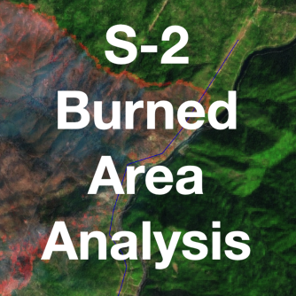
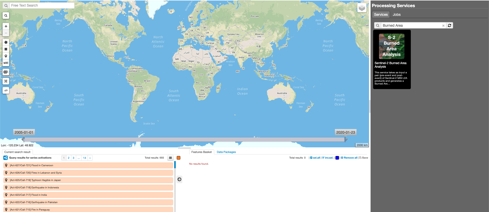
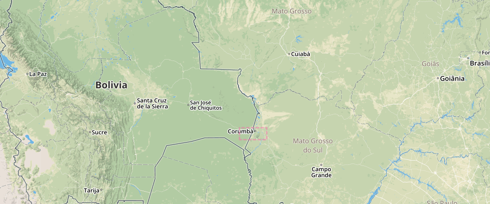
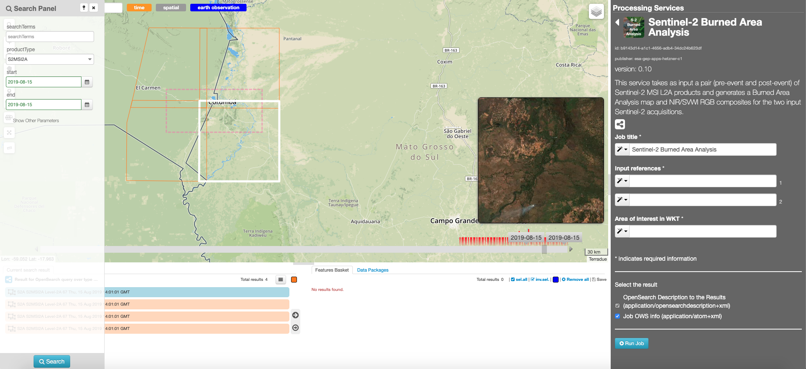
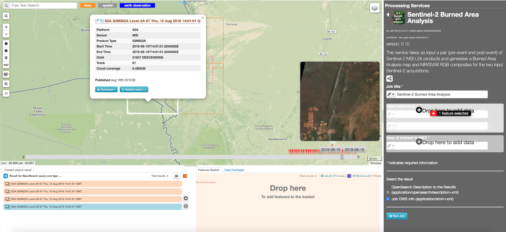
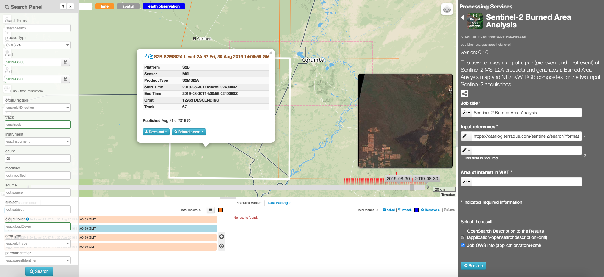
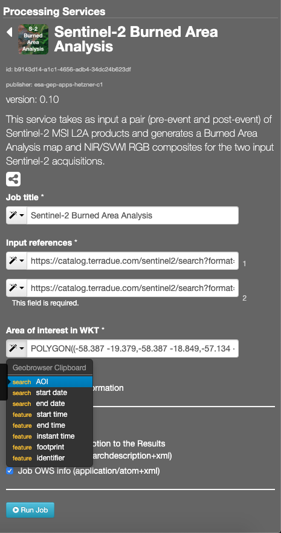

Sentinel-2 Burned Area Analysis
~~~~~~~~~~~~~~~~~~~~~~~~~~~~~~~

**Sentinel-2 Burned Area Analysis**

This service takes as input a pair (pre-event and post-event) of Sentinel-2 MSI L2A products and generates a Burned Area Analysis map and NIR/SVWI RGB composites for the two input Sentinel-2 acquisitions.

**EO sources supported**

    - Sentinel-2 MSI L2A

**Output specifications**

    - Burned Area Analysis map
    - NIR/SVWI RGB composites
    - Reproducibility notebooks

-----

This tutorial will describe the processing of a pair of Sentinel-2 MSI images to generate a Burned Area Analysis map and NIR/SVWI RGB composites for the two input Sentinel-2 acquisitions on the GEP.

Select the processing
=====================

* Login to the platform (see :doc:`user <../community-guide/user>` section)

* Select the processing service “Sentinel-2 Burned Area Analysis”:

The "Sentinel-2 Burned Area Analysis" panel is displayed with parameters values to be filled-in.

Fill the parameters
===================

Pre-event product reference
---------------------------

* Select the Sentinel-2 data collection in the EO Data button.
* Select the area for which you want to do an anlysis, e.g Corumba in Brasil.

* Click on the lens icon and select **S2MSI2A** as Product Type in the Search Panel
* Apply the date value **2019-08-15** in both **time:start** and **time:end** fields

* Drag and Drop the selected item in the first *Input reference* field:

.. NOTE:: pre-event input can be picked up directly by using the following text filter: S2A_MSIL2A_20190815T140101_N0213_R067_T21KUU_20190815T214633

Post-event product reference
----------------------------

* Perform the same procedure described previously (`Master product reference`_), using the value **2019-08-30**.
Pick one of the results having the same track, then drag and drop one of the results in the *Input reference* field:

.. NOTE:: post-event input can be picked up directly by using the following text filter: S2B_MSIL2A_20190830T140059_N0213_R067_T21KUU_20190830T180923

Area Of Interest in WKT
-----------------------

* Click on the *Magic tool wizard* and select **AOI**. The input parameter is automatically filled with the WKT representing the area selected.

.. NOTE:: you can also specify manually a different AOI in WKT format, or draw a new area on the map using the search tool and get its value from the *Magic tool wizard*

Run the job
===========

* Click on the button Run Job and see the Running Job

.. figure:: assets/tuto_burned-area_6.png
	:figclass: align-center
        :width: 750px
        :align: center

* After about 20 minutes, see the Successful Job

Results: download and visualization
===================================

* Click on the button *Show results*

* See the result on map:

.. figure:: assets/tuto_burned-area_7.png
    :figclass: align-center
        :width: 750px
        :align: center

* The following files are produced:

    - **Burned area analysis (2019-08-15T14:01:01.0240000Z/2019-08-30T14:00:59.0240000Z)**: Burned area analysis map
    - **NIR/SVWI RGB composite (2019-08-15T14:01:01.0240000Z/2019-08-15T14:01:01.0240000Z)**: NIR/SVWI RGB composite of the pre-event input
    - **NIR/SVWI RGB composite (2019-08-30T14:00:59.0240000Z/2019-08-30T14:00:59.0240000Z)**: NIR/SVWI RGB composite of the post-event input
