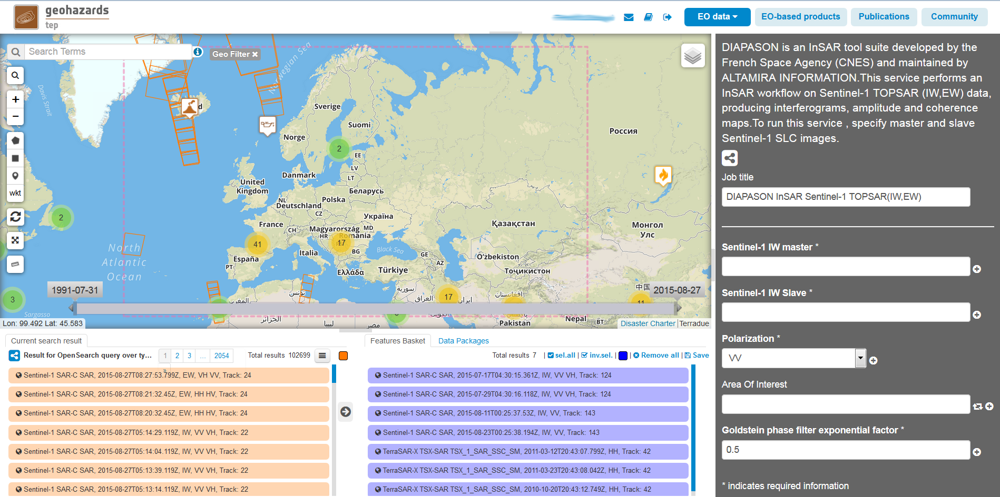
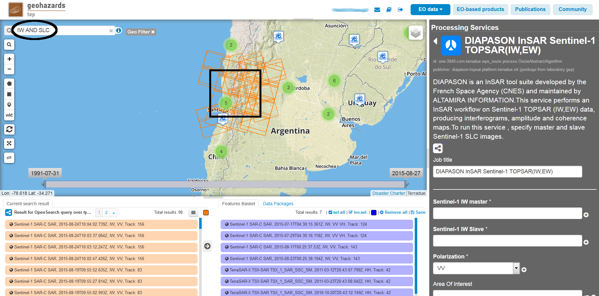

Sentinel-1 IW mode Interferogram generation with DIAPASON
~~~~~~~~~~~~~~~~~~~~~~~~~~~~~~~~~~~~~~~~~~~~~~~~~~~~~~~~~

.. figure:: assets/tuto_diapiw_icon.png
        :width: 100px
        :align: left

**DIAPASON InSAR Sentinel-1 TOPSAR(IW,EW)**

DIAPASON is an InSAR tool suite developed by the French Space Agency (CNES) and maintained by TRE Altamira. This service performs an InSAR workflow on Sentinel-1 TOPSAR (IW,EW) data, producing interferograms, amplitude and coherence maps. To run this service, specify master and slave Sentinel-1 SLC images.

**EO sources supported**:

    - Sentinel-1 TOPSAR IW SLC

**Output specifications**

    - Interferometric Amplitude
    - Interferometric Coherence
    - Interferometric Phase

None

-----

This tutorial will describe the processing of interferograms from pairs of Sentinel-1 IW images on the GEP.

Processor configuration
=======================
* The user shall login on the GEP and in the "Processing Services" section , select the "DIAPASON InSAR Sentinel-1 TOPSAR" service from the "services" tab.

* Select an area on the map . In the "Search Terms" field , you may type "IW AND SLC NOT GRD" to search for the correct product type covering the area 

* Choose the image pair to be processed from the "Current search result" pane. Drag and Drop the image to be used as master  into the "Sentinel-1 IW master" field, then select the slave image into the "Sentinel-1 IW slave" field.

The images shall be from the same track.

.. NOTE:: slave and master can be picked up by using the following data package (alternatively to the search steps described): **ChileTrack156**

* Set the polarization to process from the "polarization" drop-down list

The available polarizations for the images appear on the list from the "Current search result" pane.
The selected polarization should be available on each of the two images. 

* Optionally you may choose to process an area of interest.

You may set this option in order to process an area  smaller than the coverage of the two images by using a spatial filter from the left geo panel over the area. This will set the current area selected on the map as area of interest for the processing. 
When left blank , the area processed is the intersection between the two input images.

* Set the Goldstein filter factor

The value for the Goldstein filter exponential factor shall be a floating point value between 0 and 1.
Higher values will result in more filtering of the output interferogram  phase.You may disable the Goldstein filter by setting the exponential factor to 0.

* Set the Phase Unwrapping flag

To enable the phase unwrapping of the interferogram select "true" on the drop down list. By default , the phase unwrapping is disabled. 

 

 

Running the job
===============

* Click on "Run Job" button from the processor configuration panel and wait for the job to complete.

View results on the map
=======================

* Click on the *Show results on map* button after the job is completed.

After successful completion of the job , the following elements shall appear on the *Results Table*:
            * The interferometric amplitude. 
            * The interferometric coherence.
            * The interferometric phase. This the output interferogram as an RGB image ready to be displayed on the GeoBrowser map.
            * A zip file products.zip containing the DIAPASON geocoded results in geotiff format ,without additionnal processing.
            * An RGB image showing the unwrapped phase (in case the phase unwrapping processing was activated).

The products.zip file contains :
           * The interferometric amplitude in geotiff format. This is the modulus of the complex product of the master SLC image and the coregistered slave SLC image.
           * The interferometric coherence. This is a floating point geotiff image with values within [0.0  255.0]. Pixel values of 255.0 are equivalent to a coherence value of 1 
           * The interferometric phase. This is a grayscale geotiff image with phase values within [0 255].  
           * The unwrapped phase. This is the raw unwrapped phase in radians.

It is possible to download the result files , first by selecting them on the *Results Table*  , a descriptive window about the file shall appear on the map . Clicking on the "download" button retrieves the file.

