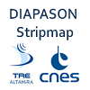
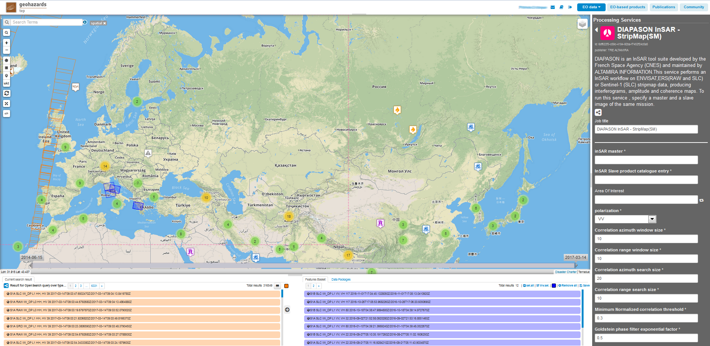
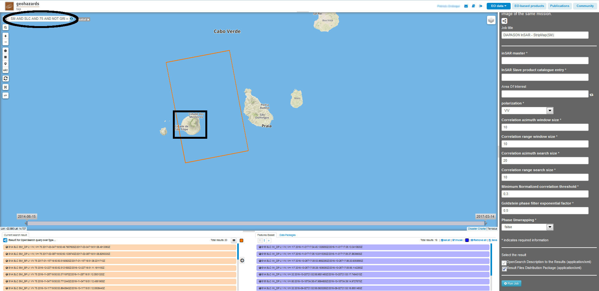
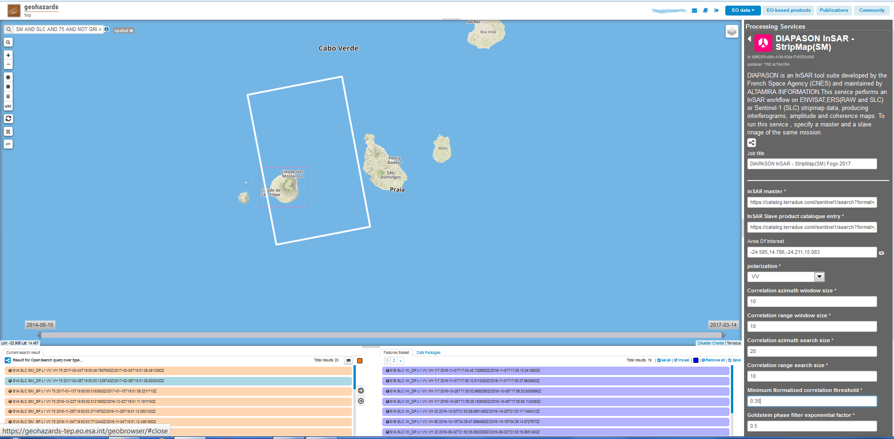
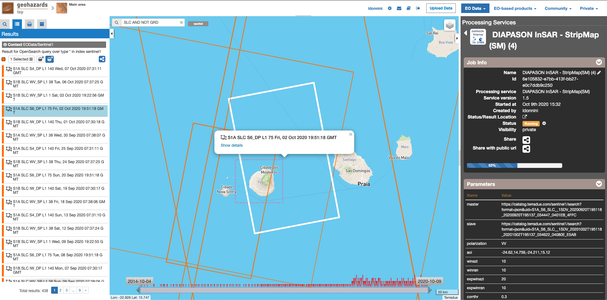
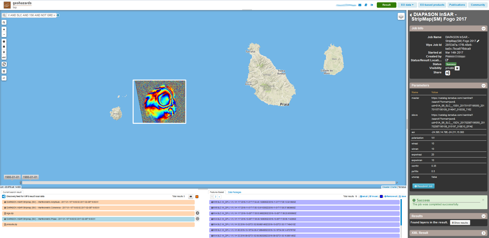
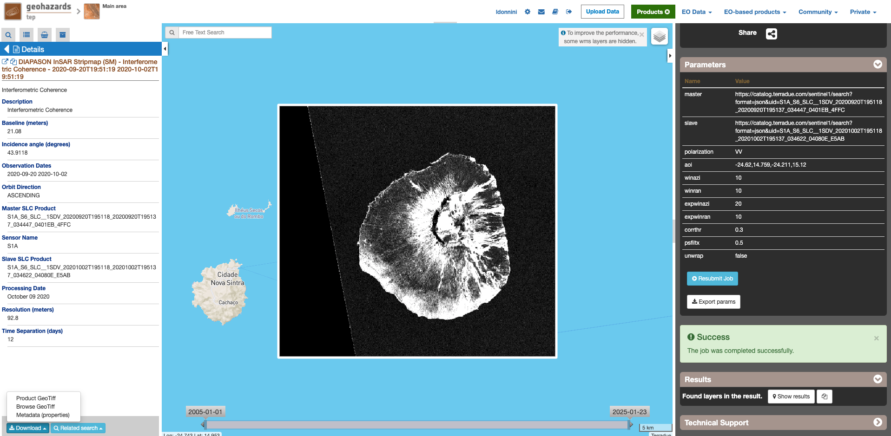

DIAPASON InSAR - StripMap(SM)
~~~~~~~~~~~~~~~~~~~~~~~~~~~~~
Stripmap mode Interferogram generation with DIAPASON

**DIAPASON InSAR - StripMap(SM)**

DIAPASON is an InSAR tool suite developed by the French Space Agency (CNES) and maintained by ALTAMIRA INFORMATION.This service performs an InSAR workflow on ENVISAT,ERS(RAW and SLC) or Sentinel-1 (SLC) stripmap data, producing interferograms, amplitude and coherence maps. To run this service , specify a master and a slave image of the same mission.

**EO sources supported**:

    - Envisat ASAR
    - ERS (RAW and SLC)
    - Sentinel-1 StripMap SLC

**Output specifications**

    - Interferometric Amplitude
    - Interferometric Coherence
    - Interferometric Phase

-----

In this tutorial we will use the GEP service DIAPASON InSAR StripMap(SM) to generate an interferogram from two Sentinel-1 images.

Processor configuration
=======================
* Log in on the GEP portal and in the "services" tab , select the "DIAPASON InSAR Stripmap(SM)" service.

* In the "EO data" menu select "Sentinel-1". For the purpose of this tutorial Sentinel-1 images will be used ,but this processor may work on ERS pairs or on ASAR pairs as well.

* Select an area on the map. 

When processing Sentinel-1 data , it is important to select the correct data type for this processor.  For this , in the "Search Terms" field you may
type "SM AND SLC AND NOT GRD" in order to filter Sentinel-1 Stripmap SLC scenes. If you know the track number of the images you want to process , you
may add this track number as an additionnal filter.
When processing ERS or ASAR data , you may filter with the "Search Terms" field according to the track number.

* Choose the image pair to be processed from the "Current search result" pane.

Select the image to be used as master and Drag and Drop the entry into the "InSAR master" filed, then select the slave image into the "InSAR slave" field.
Make sure the images are from the same track , and from the same mission (i.e process  Sentinel-1 with Sentinel-1 , ASAR with ASAR ,ERS with ERS).

* Set the polarization to process from the "polarization" drop-down list

This option has an effect only when processing Sentinel-1 data.The selected polarization should be available on each of the two images. 
This option is ignored when processing ASAR or ERS data.

* Optionally you may choose to process an area of interest.

You may set this option in order to process an area  smaller than the coverage of the two images by using a spatial filter from the left geo panel over the area. This will set the current area selected on the map as area of interest for the processing. 
When left blank , the area processed is the intersection between the two input images.

* Optionally tweak the parameters

The coregistration procedure implemented in DIAPASON for stripmap data includes a cross-correlation of the images.
A multilook is applied on the SLC images (For Sentinel-1 the multilook factors are 8x4 , 10x2 otherwise) ,and the cross-correlation is applied on the multilook images.

The following cross-correlation parameters may be set by the user (window sizes are given in multilook pixels): 
  * Correlation azimuth window size          : this is the number of rows of the cross-correlation template
  * Correlation range window size            : this is the number of columns of the cross-correlation template
  * Correlation range search size            : this is the number of columns of the cross-correlation search window size 
  * Correlation azimuth search size          : this is the number of rows of the cross-correlation search window size  
  * Minimum normalized correlation threshold : this parameter sets the minimum normalized cross correlation coefficient value (this value should be a floating-point value in the interval [0.0 and 1.0[).

* Set the Goldstein filter factor

The value for the Goldstein filter exponential factor shall be a floating point value between 0 and 1.
Higher values will result in more filtering of the output interferogram  phase.You may disable the Goldstein filter by setting the exponential factor to 0.

* Set the Phase Unwrapping flag

To enable the phase unwrapping of the interferogram select "true" on the drop down list. By default , the phase unwrapping is disabled. 

Running the job
===============

* Click on "Run Job" button from the processor configuration panel and wait for the job to complete.

View results on the map
=======================

* Click on the *Show results on map* button after the job is completed.

After successful completion of the job , the following elements shall appear on the *Results Table*:
            * The interferometric amplitude. 
            * The interferometric coherence.
            * The interferometric phase. This the output interferogram as an RGB image ready to be displayed on the GeoBrowser map.
            * A zip file products.zip containing the DIAPASON geocoded results in geotiff format ,without additionnal processing.
            * An RGB image showing the unwrapped phase (in case the phase unwrapping processing was activated).

The products.zip file contains :
           * The interferometric amplitude in geotiff format. This is the modulus of the complex product of the master SLC image and the coregistered slave SLC image.
           * The interferometric coherence. This is a floating point geotiff image with values within [0.0  255.0]. Pixel values of 255.0 are equivalent to a coherence value of 1 
           * The interferometric phase. This is a grayscale geotiff image with phase values within [0 255].  
           * The unwrapped phase. This is the raw unwrapped phase in radians.

It is possible to download the result files , first by selecting them on the *Results Table*  , a descriptive window about the file shall appear on the map . Clicking on the "download" button retrieves the file.

