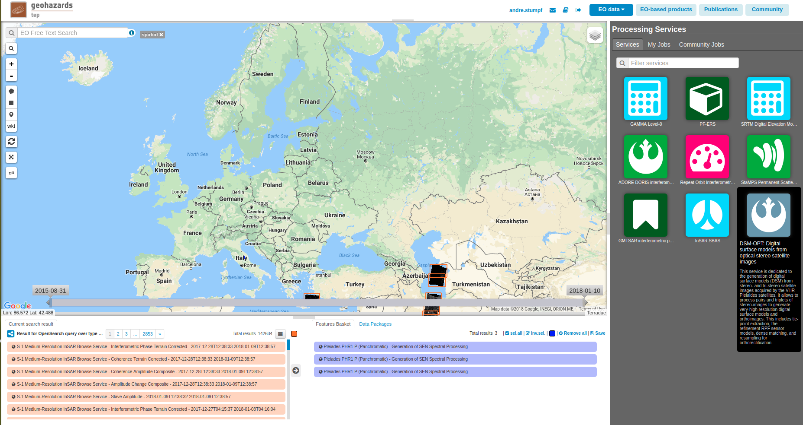
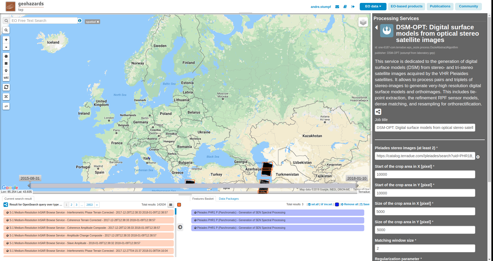
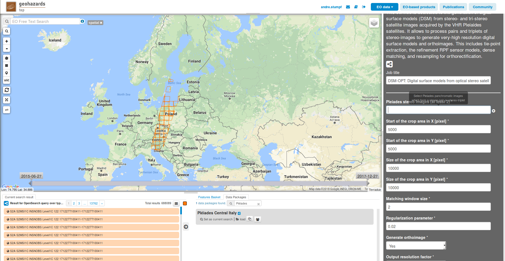
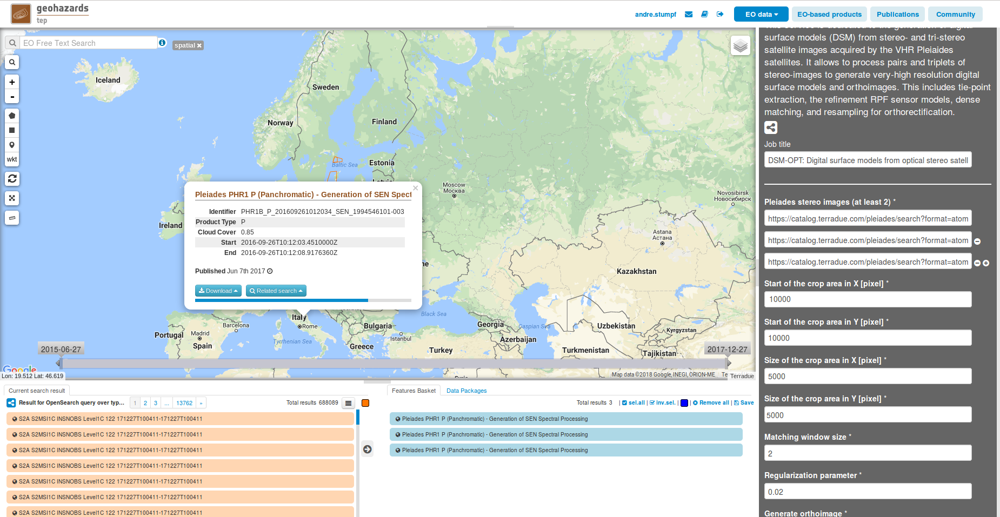
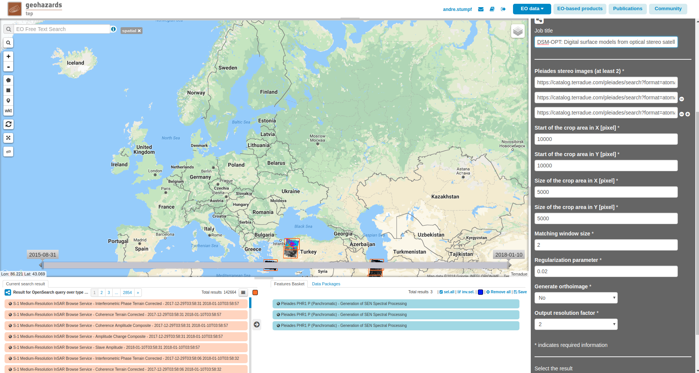
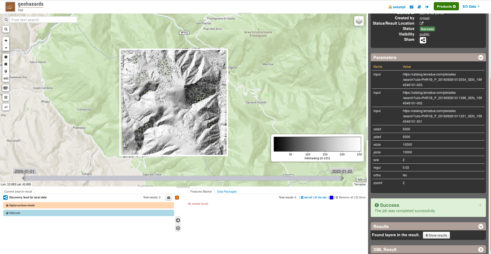

DSM-OPT: Digital surface models from optical stereo satellite images
~~~~~~~~~~~~~~~~~~~~~~~~~~~~~~~~~~~~~~~~~~~~~~~~~~~~~~~~~~~~~~~~~~~~

This service is dedicated to the generation of digital surface models (DSM) from stereo- and tri-stereo satellite images acquired by the VHR Pléaides satellites. It allows to process pairs and triplets of stereo-images to generate very-high resolution digital surface models and orthoimages. This includes tie-point extraction, the refinement RPF sensor models, dense matching, and resampling for orthorectification. The processing chain is based on the MicMac open source project [1]_ and specifically the bundle adjustment methods presented in [2]_.

.. The service is one of three services implemented by CNRS-EOST on the Geohazards Exploitation platform which are mainly dedicated the detection and monitoring of landslides and measurements of surface deformation. This includes the generation of surface models and orthoimages from very-high resolution (VHR) Pléiades images (DSM-OPT), the detection and measurement of surface motion (e.g. landslides and co-seismic slip) from time-series of Sentinel-2 images (MPIC-OPT), and the rapid mapping of newly triggered landslides using Sentinel-2 or VHR orthoimages from before and after major triggering events such as earthquakes or heavy rainstorms.

Select the processing service
=============================

* Login to the platform (see :doc:`user <../community-guide/user>` section)

* Go to the Geobrowser, expand the panel “Processing services” on the right hand side and select the processing service “DSM-OPT”:

This will display the service panel including several pre-defined parameters which can be adapted.

Generate a digital surface model
================================

Select input data
-----------------

The Geobrowser offers multiple ways to search and discover a large variety of EO-based dataset and the interested reader should refer to the :doc:`Geobrowser <../community-guide/platform/geobrowser>` section for a general introduction. 
For this tutorial we will rely on readily prepared data packages which are accessible through the "Data Packages" tab on the lower right of the screen. If you type "Pléiades" into the search box you should be able to find a data package named "Pléiades Central Italy". Alternatively you can access the  
`Pléiades Central Italy data package`_ also directly by clicking on the provided link:

.. _`Pléiades Central Italy data package`: https://geohazards-tep-ref.terradue.com/t2api/share?url=https%3A%2F%2Fgeohazards-tep-ref.terradue.com%2Ft2api%2Fdata%2Fpackage%2Fsearch%3Fid%3DPl%C3%A9iadesCentralItaly&id=landslide-dm

.. caution:: Pléiades data is subject to strict licensing terms and you have to assure that you have the proper rights to access (and process) the data. In addition there are some cases in which images belonging to the same stereo acquisition do not share the same unique identifier (e.g. *IMG_PHR1A_P_datetime_SEN_uniqueIdentifier-003_R1C1.JP2*). In such cases it is necessary to rename the image files to assure that all images share the same unique identifier. 

Click on the data package, hold shift and Drag and Drop all three results in the *Pleiades stereo images* field in the service panel on the right:

Set the processing parameters
-----------------------------

There are 8 processing parameters in total that can be adjusted and when hovering over the parameter fields you will see a short explanation for each of the parameters.

The first 4 parameters allow to set a bounding box to process only a subset of the dataset. The crop area should be defined in terms of pixels starting from the upper left corner of the first input image. For this test we will define a small test area of 5000x5000 pixel at the center of the scene.

* **Start of the crop area in X [pixel]:** Define an area of interest in pixel coordinates of the first input image. Set it to *10000*
* **Start of the crop area in Y [pixel]:** Define an area of interest in pixel coordinates of the first input image. Set it to *10000*
* **Size of the crop area in X [pixel]:** Define an area of interest in pixel coordinates of the first input image. Set it to *5000*
* **Size of the crop area in Y [pixel]:** Define an area of interest in pixel coordinates of the first input image. Set it to *5000*

* **Matching window size:** This parameter controls the size of the template used for matching among the input images. More specifically it controls the neighborhood around the central pixel so that the default value of 2 results in a 5x5 window size. The minimum value is 1 (3x3 pixel) and the recommended maximum is 7 (15x15 pixel). A smaller window will allow to better reconstruct small scale variations (e.g. in urban landscapes) while at the same time leading to more noise. Vice versa larger window sizes will lead to greater robustness against noise while smoothing small scale details. Leave the value at its default of *2*.
* **Regularization parameter:** Similar to the window size the regularization parameter controls the smootheness of the expected output surface. Increasing the regularization parameter is putting greater emphasize on a smooth surface where neighboring pixels will have similar elevation values. For very rougged terrain and urban landscapes we recommend values between 0.01 and 0.05. For smoother landscapes with limited or difficult texture (e.g. vegetation, snow cover) it can be helpful to increase the parameter to up to 0.1 or 0.2. The parameter will also depend on the input data with older 8bit imagery favouring stronger regularization and more recent 16bit imagery favouring rather lower regularization. Leave it at its default value of *0.02*.
* **Generate orthoimage:** If the option is set to Yes high resolution orthoimages will be generated from each of the input images. To run this test more quickly set the option to *No*.
* **Output resolution factor:** The factor controls the final resolution of the output DEM which is the resolution of the input image times the output resolution factor. The default is set to 2 since DSMs at the full resolution of input images tend to comprise a lot of high frequency noise. Increasing this factor can speed up computation considerably.To run this test more quickly leave it at its default of *2*.

The figure below summarizes the parameter settings for this test.

Run the job
-----------

* You are good to go. Click on the button *Run Job* at the bottom of the right panel. Depending on the allocated resources the execution will require at least few hours to terminate.

.. figure:: assets/tuto_dsmopt_6.png
	:figclass: align-center
        :width: 750px
        :align: center

Once the job has finished click on the *Show results* button to get a list and pre-visualization of the output DSM and its corresponding hillshade. An example output can be accessed `here`_ .

.. _`here`: https://geohazards-tep-ref.terradue.com/t2api/share?url=https%3A%2F%2Fgeohazards-tep-ref.terradue.com%2Ft2api%2Fjob%2Fwps%2Fsearch%3Fid%3Da26b6302-0fef-4309-a816-7e18ed19feb5%26key%3D9aa2df4c-b3e0-439f-9128-7a8b4c4c8c62&id=landslide-dm

.. note:: The visualization in the *Geobrowser* is just a preview and the user is encouraged to download the results for further processing and analysis.

References
==========

.. [1] Pierrot-Deseilligny, M.; Jouin, D.; Belvaux, J.; Maillet, G.; Girod, L.; Rupnik, E.; Muller, J.; Daakir, M.; Choqueux, G.; Deveau, M. MicMac: Apero, Pastis and Other Beverages in a Nutshell! https://github.com/micmacIGN/Documentation/blob/master/DocMicMac.pdf. Accessed: 2017-03-30.

.. [2] Rupnik, E., Pierrot Deseilligny, M., Delorme, A., and Klinger, Y.: REFINED SATELLITE IMAGE ORIENTATION IN THE FREE OPEN-SOURCE PHOTOGRAMMETRIC TOOLS APERO/MICMAC, ISPRS Ann. Photogramm. Remote Sens. Spatial Inf. Sci., III-1, 83-90, https://doi.org/10.5194/isprs-annals-III-1-83-2016, 2016. 
