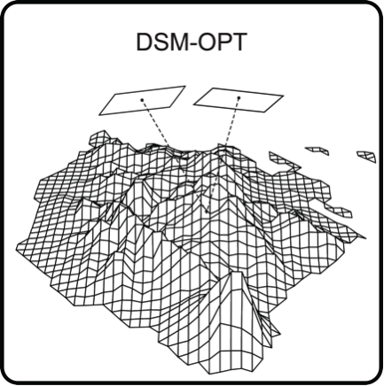

DSM-OPT: Digital surface models from optical stereo satellite images
~~~~~~~~~~~~~~~~~~~~~~~~~~~~~~~~~~~~~~~~~~~~~~~~~~~~~~~~~~~~~~~~~~~~

**DSM OPT**

This service is developped by CNRS-EOST (Strasbourg, France). It allows to generate Digital Surface Models (DSM) and orthoimages from stereo- and tri-stereo satellite images acquired by the VHR Pléiades satellite constellation.

**EO sources supported**:

    - Pleiades stereo and tri-stereo, Primary

**Output specifications**

    - Digital surface model (A metric Digital Surface Model with the following naming convention Z_Num${iteration_number}_DeZoom${resolution}_STD-MALT_metric_georef_despeck.tif in GeoTiff file format)
    - Hillshade (A hillshade representation of the surface with the following naming convention Z_Num${iteration_number}_DeZoom${resolution}_STD-MALT_metric_georef_despeck_hilshade.tif in GeoTiff file format)
    - OrthoImages [if Generate orthoimage is set to Yes]: An orthorectified image with the following naming convention ${name_of_the_input_image}_ortho.tif in GeoTiff format

-----

The service is dedicated to the generation of Digital Surface Models (DSM) from stereo- and tri-stereo satellite images acquired by the VHR Pléiades satellite constellation. It allows to process pairs and triplets of stereo-images to generate very-high resolution digital surface models and orthoimages. It includes tie-point extraction, the refinement RPF sensor models, dense matching, and resampling for orthorectification. The processing chain is based on the open source MicMac project [1]_ and specifically on the bundle adjustment methods presented in [2]_. For further information, see: https://micmac.ensg.eu/index.php/Accueil

.. NOTE::
The DSM-OPT service can only be used for specific Pleiades acquisitions (stereo-, tri-stereo-) where the convergence angle between the images is below 20°. For images with a convergence angle higher than 20°, no homologous points can be detected. Ideally, the convergence angle should be in the range 5° to 15° for a soft use of the service.

Select the processing service
=============================

* Login to the platform (see :doc:`user <../community-guide/user>` section)

* Go to the Geobrowser, expand the panel “Processing services” on the right hand side and select the processing service “DSM-OPT”:

.. figure:: assets/tuto_dsmopt_1.png
	:figclass: align-center
        :width: 750px
        :align: center

This will display the service panel including several pre-defined parameters which can be adapted.

.. figure:: assets/tuto_dsmopt_2.png
	:figclass: align-center
        :width: 750px
        :align: center

Generate a Digital Surface Model
================================

Select input data
-----------------

The Geobrowser offers multiple ways to search and discover a large variety of EO-based dataset and the interested reader should refer to the :doc:`Geobrowser <../community-guide/platform/geobrowser>` section for a general introduction. 
For this tutorial we will rely on readily prepared data packages which are accessible through the "Data Packages" tab on the lower right of the screen. If you type "Pléiades" into the search box, you should be able to find a data package named "Pléiades Central Italy". Alternatively you can access the  
`Pléiades Central Italy data package`_ also directly by clicking on the provided link:

.. _`Pléiades Central Italy data package`: https://geohazards-tep.eu/t2api/share?url=https%3A%2F%2Fgeohazards-tep.eu%2Ft2api%2Fdata%2Fpackage%2Fsearch%3Fid%3DPleiadesCentralItaly&id=landslide-dm

.. caution:: Pléiades data is subject to strict licensing terms and you have to isssure that you have the proper rights to access (and process) the data. In addition there are some cases in which images belonging to the same stereo acquisition do not share the same unique identifier (e.g. *IMG_PHR1A_P_datetime_SEN_uniqueIdentifier-003_R1C1.JP2*). In such cases it is necessary to rename the image files to insure that all images share the same unique identifier. The Pléiades data used for the tutorial were made available to the science community by the CEOS WG Disaster as part of the Seismic Pilot activity. 

.. figure:: assets/tuto_dsmopt_3.png
	:figclass: align-center
        :width: 750px
        :align: center

Click on the data package, hold shift and Drag and Drop all three results in the *Pléiades stereo images* field in the service panel on the right:

.. figure:: assets/tuto_dsmopt_4.png
	:figclass: align-center
        :width: 750px
        :align: center

Set the processing parameters
-----------------------------

There are 8 processing parameters in total that can be adjusted. When hovering over the parameter fields, you will see a short explanation for each of the parameters.

The first 4 parameters allow to set a bounding box to process only a subset of the dataset. The crop area should be defined in terms of pixels starting from the upper left corner of the first input image. For this test we will define a small test area of 5000x5000 pixel at the center of the scene.

* **Start of the crop area in X [pixel]:** Define an area of interest in pixel coordinates of the first input image. Set it to *10000*
* **Start of the crop area in Y [pixel]:** Define an area of interest in pixel coordinates of the first input image. Set it to *10000*
* **Size of the crop area in X [pixel]:** Define an area of interest in pixel coordinates of the first input image. Set it to *5000*
* **Size of the crop area in Y [pixel]:** Define an area of interest in pixel coordinates of the first input image. Set it to *5000*

* **Matching window size:** This parameter controls the size of the template used for matching among the input images. More specifically it controls the neighborhood around the central pixel so that the default value of 2 results in a 5x5 window size. The minimum value is 1 (3x3 pixel) and the recommended maximum is 7 (15x15 pixel). A smaller window will allow to better reconstruct small scale variations (e.g. in urban landscapes) while at the same time leading to more noise. Vice versa, larger window sizes will lead to greater robustness against noise while smoothing small scale details. Leave the value at its default of *2*.
* **Regularization parameter:** The regularization parameter controls the smootheness of the expected output surface. Increasing the regularization parameter is putting greater emphasize on a smooth surface where neighboring pixels will have similar elevation values. For very roughed terrains (mountains) and urban landscapes we recommend values between 0.01 and 0.05. For smoother landscapes with limited or difficult texture (e.g. vegetation, snow cover) it can be helpful to increase the parameter to up to 0.1 or 0.2. The parameter will also depend on the input data with older 8bit imagery favouring stronger regularization and more recent 16bit imagery favouring rather lower regularization. Leave it at its default value of *0.02*.
* **Generate orthoimage:** If the option is set to Yes high resolution orthoimages will be generated from each of the input images. To run this test more quickly set the option to *No*.
* **Output resolution factor:** The factor controls the final resolution of the output DSM which is the resolution of the input image times the output resolution factor. The default is set to 2 since DSMs at the full resolution of input images tend to comprise a lot of high frequency noise. Increasing this factor can speed up computation considerably.To run this test more quickly leave it at its default of *2*.

The figure below summarizes the parameter settings for this test.

.. figure:: assets/tuto_dsmopt_5.png
	:figclass: align-center
        :width: 750px
        :align: center

Run the job
-----------

* Once all parameters set, click on the button *Run Job* at the bottom of the right panel. Depending on the allocated resources, the execution will require at least few hours to terminate.

.. figure:: assets/tuto_dsmopt_6.png
	:figclass: align-center
        :width: 750px
        :align: center

Once the job has finished, click on the *Show results* button to get a list and pre-visualization of the output DSM and its corresponding hillshade. An example output can be accessed `here`_ .

.. _`here`: https://geohazards-tep.eu/t2api/share?url=https%3A%2F%2Fgeohazards-tep.eu%2Ft2api%2Fjob%2Fwps%2Fsearch%3Fid%3D6896b336-0ad5-49a4-95b9-b049259a2e1e%26key%3Dc2d5cf72-0781-41e8-99af-012729b0dab1&id=cnrs-eost

.. Note:: The visualization in the *Geobrowser* is just a preview and the user is encouraged to download the results for further processing and analysis.

.. figure:: assets/tuto_dsmopt_7.png
	:figclass: align-center
        :width: 750px
        :align: center

References
==========

.. [1] Pierrot-Deseilligny, M.; Jouin, D.; Belvaux, J.; Maillet, G.; Girod, L.; Rupnik, E.; Muller, J.; Daakir, M.; Choqueux, G.; Deveau, M. MicMac: Apero, Pastis and Other Beverages in a Nutshell! https://github.com/micmacIGN/Documentation/blob/master/DocMicMac.pdf. Accessed: 2017-03-30.

.. [2] Rupnik, E., Pierrot Deseilligny, M., Delorme, A., and Klinger, Y.: Refined Satellite Image Orientation in the FreeE Open-Souce Photogrammetric Tools APERO/MICMAC, ISPRS Ann. Photogramm. Remote Sens. Spatial Inf. Sci., III-1, 83-90, https://doi.org/10.5194/isprs-annals-III-1-83-2016, 2016. 
