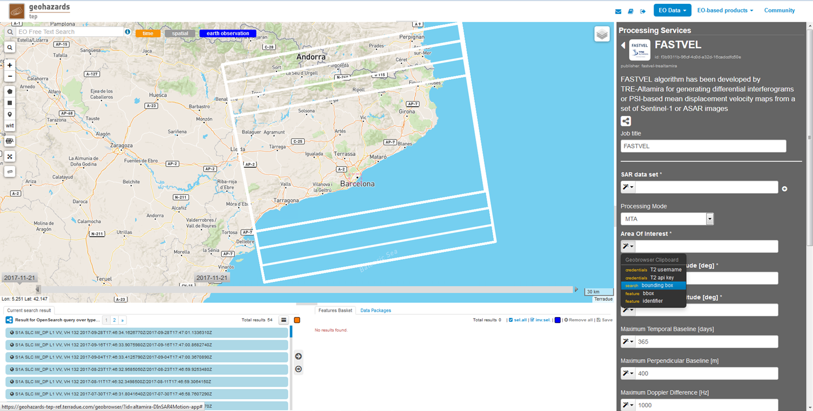
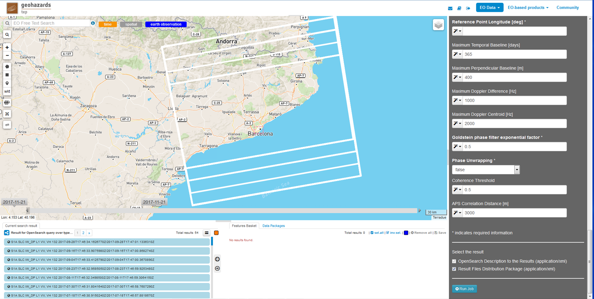
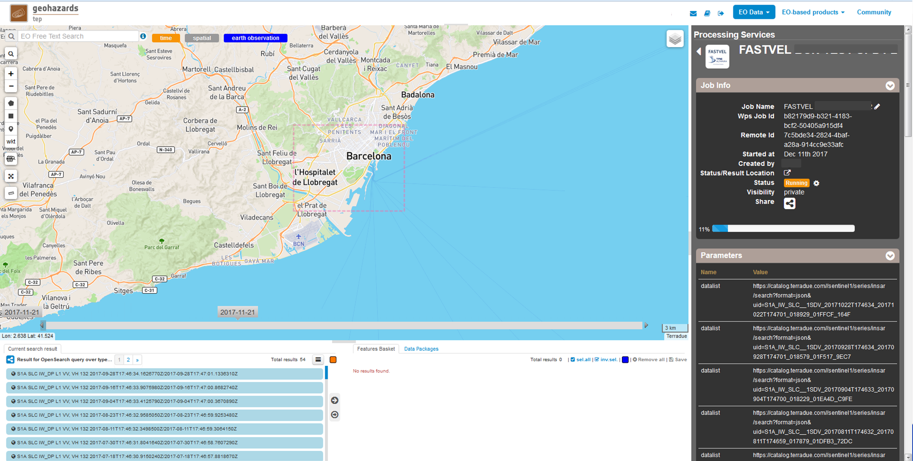
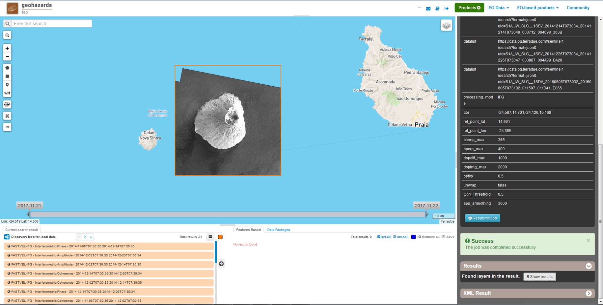
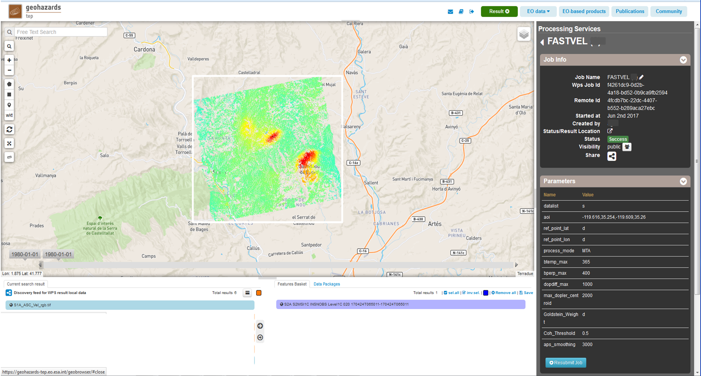
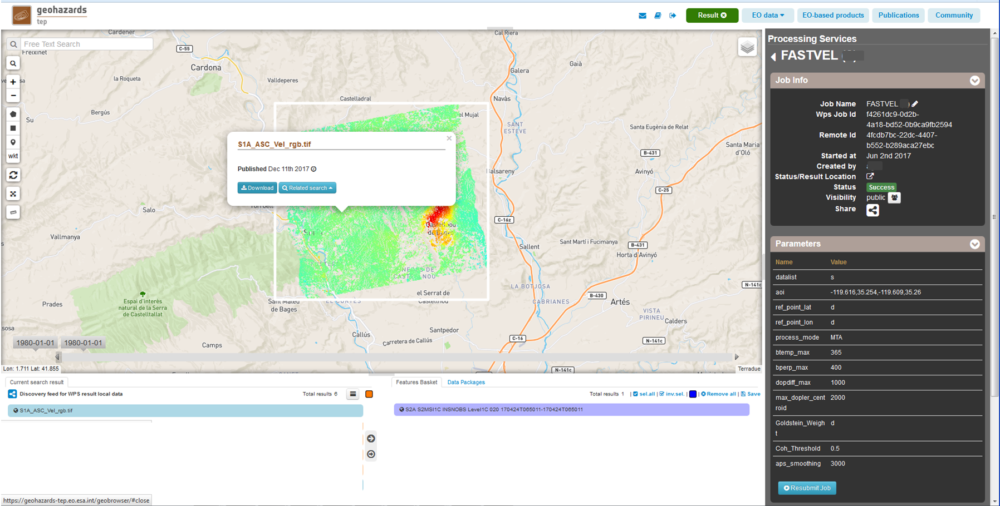

FASTVEL for displacement velocity map generation
~~~~~~~~~~~~~~~~~~~~~~~~~~~~~~~~~~~~~~~~~~~~~~~~

**FASTVEL**

FASTVEL algorithm has been developed by TRE-Altamira for generating differential interferograms or PSI-based mean displacement velocity maps from a set of Sentinel-1 or ASAR images

**EO sources supported**

    - Envisat ASAR Image Mode Level 0 (RAW)
    - Envisat ASAR Image Mode Level 1 (SLC)
    - ERS 1/2 Level 0 (RAW)
    - ERS 1/2 Level 1 (SLC)
    - Sentinel-1 Level 1 (SLC IW/EW modes)

**Output specifications**

 In IFG mode:
    - Differential interferograms
        - Interferometric Amplitude (browse png/GeoTIFF, product GeoTIFF)
        - Interferometric Coherence (browse png/GeoTIFF, product GeoTIFF)
        - Interferometric Phase (browse png/GeoTIFF, product GeoTIFF)
 
 In MTA mode: 
    - Ground displacement velocity map (browse png/GeoTIFF, product GeoTIFF)
    - Updated topography [reference DEM + height error] (browse png/GeoTIFF, product GeoTIFF)
    - CSV file with the main information of PSI products in the LOS (Line Of Sight)

-----

This tutorial will describe the processing of a set of ASAR or Sentinel-1 IW images to generate a set of differential interferograms (IFG mode) or a mean displacement velocity map (MTA mode) on the GEP.

.. NOTE:: Processing parameters example for reproducing a succesful job are described in the end of this tutorial.

Processor configuration
=======================

The user shall login on the GEP to the EO services provided by TRE ALTAMIRA and in the Processing Services section, select the FASTVEL service.

First step consists in selecting the area of interest and the stack of images covering it to be processed. To do so:

* Select the data collection to be addressed in the EO Data button (InSAR Search, Sentinel-1, ERS, ENVISAT).
* Select the area on the map by using the polygon or square buttons. In the "Search Form" (loupe button) a temporal selection and specification about other search parameters can be done. The images must have the same "Orbit Direction" and the same track. It is important to select those images who present a significant degree of frame overlapping being sure that the AOI is fully covered by all of them.
* Choose the set of images to be processed on the "Current search result" section. A minimum number of 25 images are required. The selected list of images can be drop to the "Feature Basket" section and be saved as a "Data Package". This option is recommended in order to avoid performing the same image search again.

.. figure:: assets/tuto_fastvel_1.png
    :figclass: align-center
        :width: 750px
        :align: center

Complete the following list of processing parameters:

**Job title**: Job name as it will be labelled an it will appear in the Job list.

**SAR data set**: set of SLC images to be processed. A minimum number of 25 images are required. **Drag 
and drop the selected images on the search result (or in the "Feature Basket" section once the Data Package is loaded) to this field**. Note that depending on: the Maximum Temporal Baseline [days], the Maximum Perpendicular Baseline [m], the Maximum Doppler Difference [Hz] and the Maximum Doppler Centroid [Hz], this number could be reduced by the service causing the stop of the processing. To that matter it is recommended to put a number of images larger than 25. In the same way, at least to do initial tests, it is recommended to keep the images temporal sampling equal or grater than 12 days (ex: 24 days).

.. figure:: assets/tuto_fastvel_2.png
    :figclass: align-center
        :width: 750px
        :align: center
 
 
.. figure:: assets/tuto_fastvel_3.png
    :figclass: align-center
        :width: 750px
        :align: center

**Processing Mode**:

* **IFG**: generation of a set of differential interferograms. If this mode is selected, the parameters to be considered are: Area Of Interest, Maximum Temporal Baseline [days], Maximum Perpendicular Baseline [m], Maximum Doppler Difference [Hz], Maximum Doppler Centroid [Hz], Goldstein phase filter exponential factor, Phase Unwrapping.

* **MTA**: generation of the displacement velocity and updated topography maps. If this mode is selected, the parameters to be considered are: Area Of Interest, Reference Point Latitude [deg], Reference Point Longitude [deg], Maximum Temporal Baseline [days], Maximum Perpendicular Baseline [m], Maximum Doppler Difference [Hz], Maximum Doppler Centroid [Hz], Coherence Threshold, APS Correlation Distance [m].

**Area Of Interest**: definition of the results area. The polygon on the map can be imported as AOI. 
It can be also specified by [minlon, minlat, maxlon, maxlat]. *Example: 1.717,41.778,1.916,41.878*

**Reference Point Latitude [deg]**: (MTA mode) Latitude of the point (zero motion) to whom reference the velocity map points values. It has to be inside the AOI. An automatic check is done. *Example: 41.830858*

**Reference Point Longitude [deg]**: (MTA mode) Longitude of the point (zero motion) to whom reference the velocity map points values. It has to be inside the AOI. An automatic check is done. *Example: 1.753163*

**Maximum Temporal Baseline [days]**: (IFG and MTA mode) Maximum Temporal Baseline in days between images to allow the corresponding interferogram generation. *Default value: 365.*

**Maximum Perpendicular Baseline [m]**: (IFG and MTA mode) Maximum Spatial Baseline in meters between images to allow the corresponding interferogram generation. *Default value: 400.*

**Maximum Doppler Difference [Hz]**: (IFG and MTA mode) Maximum Doppler Centroid differences in Herzts between images to allow the corresponding interferogram generation. 
*Default value: 1000.*

**Maximum Doppler Centroid [Hz]**: (IFG and MTA mode) Maximum Image Doppler Centroid in Herzts for considering that image to be part of the dataset to process. *Default value: 2000.*

**Goldstein phase filter exponential factor**: (IFG mode) filter power factor [0,1]. *Default value: 0.5*

**Phase Unwrapping**: (IFG mode) selection of the phase unwrapping of the differential interferograms. *Default mode: false.*

**Coherence Threshold**: (MTA mode) mean interferometric coherence threshold for considering a pixel to be processed in the 
generation of the velocity and corrected topography maps. *Default value: 0.5.*

**APS Correlation Distance [m]**: (MTA mode) Atmospheric Phase Screen Correlation distance, i.e., 
maximum distance in meters allowed for connecting neighboring pixels in the process to generate the velocity and DEM error maps. *Default value: 3000.*

Running the job
===============

Click on "Run Job" button from the processor configuration panel. After that the processing status of the job is displayed along with its parameters. Wait for the job to complete. The job can be
accessed from the "Jobs" area presenting the processing percentage. When it succesfully ends it will present a green "success" status.

View results on the map
=======================

Once the job is completed, access to it from the "Jobs" area and click on the "Show results" button. The following elements will appear on the *Results Table*:

**In IFG mode**:

* The interferometric amplitude in geotiff format. This is the modulus of the complex product of the master SLC image and the coregistered slave SLC image. *Name: FASTVEL-IFG - Interferometric Amplitude Master Date Slave Date*
* The interferometric coherence in geotiff format. This is a floating point geotiff image with values within [0.0 255.0]. Pixel values of 255.0 are equivalent to a coherence value of 1. *Name: FASTVEL-IFG - Interferometric Coherence Master Date Slave Date*
* The interferometric phase in geotiff format. This is an integer geotiff image with phase values within [0 255]. *Name: FASTVEL-IFG - Interferometric Phase Master Date Slave Date*
* The interferometric phase in in geotiff format RGBA format. *Name: FASTVEL-IFG - Interferometric Phase Preview Master Date Slave Date*
* The unwrapped interferometric phase (if unwrapping selected) in geotiff format. This is the raw unwrapped phase in radians. *Name: FASTVEL-IFG - Interferometric Phase Unw Master Date Slave Date*
* The unwrapped interferometric phase (if unwrapping selected) in geotiff format RGBA format. *Name: FASTVEL-IFG - Interferometric Phase Unw Preview Master Date Slave Date*
* A zip file for every interferogram containing all geocoded results in geotiff format. *Name: FASTVEL-IFG - Results Archive Master Date Slave Date.zip*

The product's pixel size is approximately 40 m x 40 m.

In order to download the results, firstly select them on the Results Table and a metadata window about the file appears on the map. Click on the "download" button and select "Product GeoTiff".
Its corresponding png file can be downloaded selecting "Image (png)".

.. figure:: assets/tuto_fastvel_8.png
    :figclass: align-center
        :width: 750px
        :align: center

On the IFG mode, this metadata is composed of the following fields:

 - Title (name of the tiff file).
 - Baseline (meters).
 - Description (Interferometric Phase/Interferometric Coherence/ Interferometric Amplitude).
 - Incidence angle (degrees).
 - Master SLC Product (name).
 - Observation Dates (master date slave date).
 - Orbit Direction (DESCENDING/ASCENDING).
 - Processing Date (date).
 - Resolution (meters).
 - Sensor Name (S1A/S1B/ERS/ENV).
 - Slave SLC Product (name).
 - Time Separation (days).
 - Geometry (POLYGON)

To download the corresponding text file (with the .properties extension), click on the Download button and select "Metadata (properties)".

**In MTA mode**:

* Mean displacement velocity (cm/y) map in geotiff format. *Name: FASTVEL_MTA_<S1/ERS/ENV>_<ASC/DSC>_Vel.tif*
* RGB Mean displacement velocity map. *Name: FASTVEL_MTA_<S1/ERS/ENV>_<ASC/DSC>_Vel.rgb.tif*
* Corrected topography (DEM error + reference DEM (meters)) map in geotiff format. *Name: FASTVEL_MTA_<S1/ERS/ENV>_<ASC/DSC>_Erh.tif*
* RGB Corrected topography map. *Name: FASTVEL_MTA_<S1/ERS/ENV>_<ASC/DSC>_Erh.rgb.tif*
* CSV files with the main information of PSI products, in the LOS (Line Of Sight), in which each line of the database will represent one measurement point. *Name: FASTVEL_MTA_<S1/ERS/ENV>_<ASC/DSC>.csv.*

The list of fields in the csv (corresponding to the columns of the database) is the following:
 
 - ID: Unique identifier label for each measurement point.
 - Lon: Geographical Longitude position [decimal degrees over WGS84]. 
 - Lat: Geographical Latitude position [decimal degrees over WGS84]. 
 - Topo: Corrected Height error (reference DEM + error height) [meters].
 - Coer: Mean Interferometric  Coherence [0,1].
 - cosN, cosE, cosU: North, East and Up LOS unitary vector components.
 - Vel: LOS ground displacement mean velocity value measured for the observation period [cm/year].
 - Erh: Height error [meters].

The product's pixel size is approximately 40 m x 40 m.
A colorbar is displayed for the velocity (cm/y) and the corrected topography map (m) respectively. Minimum and maximum values are calculated considering the maps histograms.

In order to download the results, firstly select them on the Results Table and a metadata window about the file appears on the map. Click on the "download" button and select "Product GeoTiff".
Its corresponding png file can be downloaded selecting "Image (png)".

On the MTA mode, this metadata is composed of the following fields:

- Title (name of the tiff file).
- Description (Velocity map (cm/y) / Updated Topography map (meters)).
- Incidence angle (degrees).
- Orbit Direction (DESCENDING/ASCENDING).
- Resolution (meters).
- Sensor Name (S1A/S1B/ERS/ENV corresponding to the Super-master image).
- Observation Dates (first image date last image date).
- Processing Date (date).
- Geometry (POLYGON).

To download the corresponding text file (with the .properties extension), click on the "Download" button and select "Metadata (properties)".

The Job can be resubmited by clicking on the "Resubmit Job" button. After that, the FASTVEL form will appear allowing the modification of the parameters.

The visibility of the Job can be changed by selecting "Share with anyone" or "Restricted sharing" to make it visible to the rest of users.

An xml file including processing information is generated and can be visualized by clicking the XML Result button. 

On the "Support" button two options appear after clicking on it:

- Contact Support. Text form with the Job's processing parameter and a leave blank space to insert any comment/support issue to be adressed to the service provider.
- Contact Provider. Text form with the Job's processing parameter and a leave blank space to insert a quotation demand description for an SqueeSAR :sup:`TM` analysis to the TRE-Altamira sales department.

Processing parameters example for reproducing a succesful job
=============================================================

**IFG Mode**

The Job to reproduce corresponds to an stack of 5 Sentinel-1 Descending Track 140 images over the island of Fogo (Cape Verde). The Job name is FASTVEL IFG FOGO.
The SAR data set is available as a data package named FASTVEL_IFG_FOGO_T140_DSC (type this string in the data package filter box) 
(https://geohazards-tep-ref.terradue.com/t2api/share?url=https%3A%2F%2Fgeohazards-tep-ref.terradue.com%2Ft2api%2Fdata%2Fpackage%2Fsearch%3Fid%3DFASTVEL_IFG_FOGO_T140_DSC&id=esaapp)

The values of the rest of parameters are the following:

- Processing Mode: IFG
- Area Of Interest: -24.587,14.701,-24.126,15.168
- Reference Point Latitude [deg]: *(leave it blank)*
- Reference Point Longitude [deg]: *(leave it blank)*
- Maximum Temporal Baseline [days]: 365
- Maximum Perpendicular Baseline [m]: 400
- Maximum Doppler Difference [Hz]: 1000
- Maximum Doppler Centroid [Hz]: 2000
- Goldstein phase filter exponential factor: 0.5
- Phase Unwrapping: false
- Coherence Threshold: 0.5 *(leave default)* 
- APS Correlation Distance [m]: 2000 *(leave default)*

**MTA mode**

The Job to reproduce corresponds to an stack of 29 Sentinel-1 Descending Track 110 images over the area of Suria in Catalonia (Spain). The job name is FASTVEL MTA SURIA TEST DESC.
The SAR data set is available as a data package named S1A_DSC_110_CAT (type this string in the data package filter box)
(https://geohazards-tep-ref.terradue.com/t2api/share?url=https%3A%2F%2Fgeohazards-tep-ref.terradue.com%2Ft2api%2Fdata%2Fpackage%2Fsearch%3Fid%3DS1A_DSC_110_CAT&id=esaapp)

The values of the rest of parameters are the following:

- Processing Mode: MTA
- Area Of Interest: 1.717,41.778,1.916,41.878
- Reference Point Latitude [deg]: 41.830858
- Reference Point Longitude [deg]: 1.753163
- Maximum Temporal Baseline [days]: 250
- Maximum Perpendicular Baseline [m]: 200
- Maximum Doppler Difference [Hz]: 1000
- Maximum Doppler Centroid [Hz]: 2000
- Goldstein phase filter exponential factor: 0.5 *(leave default)*
- Phase Unwrapping: false *(leave default)*
- Coherence Threshold: 0.5
- APS Correlation Distance [m]: 2000
