CNR-IREA P-SBAS Sentinel-1 processing on-demand
~~~~~~~~~~~~~~~~~~~~~~~~~~~~~~~~~~~~~~~~~~~~~~~

        
**"P-SBAS InSAR Sentinel-1 TOPS (GEP)"**

P-SBAS stands for Parallel Small BAseline Subset and it is a DInSAR processing chain for the generation of Earth deformation time series and mean velocity maps. Input: SLC (Level-1) Sentinel-1 data. Output: LOS Displacement time series; Mean LOS Velocity; Temporal Coherence; Average scatterer elevation (Topography). Output Format: CSV. (The service can also generate wrapped and unwrapped interferograms that are delivered in geoTiff format). 

**EO sources supported**:

    - Sentinel-1 TOPSAR IW SLC

**Output specifications**

    - (Default) LOS Displacement time series; Mean LOS Velocity; Temporal Coherence; Average scatterer elevation (Topography). Format: CSV.
    - (Upon request) Wrapped Interferograms; Unwrapped Interferograms; Spatial coherence; Map of LOS vector. Format: GeoTIFF.

-----

This tutorial describes how to submit a job for the CNR-IREA P-SBAS Sentinel-1 (S1) processing on-demand service to obtain a ground displacement time series from S1 SLAC (Level-1) data. 
P-SBAS stands for Parallel Small BAseline Subset and it is a DInSAR processing chain for the generation of Earth deformation time series and mean velocity maps
The tutorial is addressed to users already familiar with InSAR processing, analysis and products, and gives some hints and recommendation for the best service usage experience.

The provided service performs the full P-SBAS DInSAR chain from SLC data (Level 1) retrieval to displacement time series generation, upon the **Multi Temporal Analysis (MTA)** processing mode.

The main user actions are the following:

*	select the Input SAR SLC data to be processed;
*	optionally define the area of SAR data to be processed;
*	set input parameters/threshold (e.g. reference point, polarization, …) for P-SBAS DInSAR processing;
*	obtain P-SBAS DInSAR geocoded (Lat/Lon WGS84) results, such as: LOS Displacement time series; Mean LOS Velocity; Temporal Coherence; Average scatterer elevation (Topography).

As additional feature, the possibility to generate single or stack of interferograms co-registered to a single master geometry is also available, within the **Interferogram Generation (IFG)** processing mode.

Users are encouraged to use the P-SBAS DInSAR service here described for scientific purposes. 
The results (including products, maps, time series, files and everything generated by the processors) of the service are available under the `CC-BY license`_. See "Terms and Conditions" section below for more details.
Accordingly, please recognize the effort made by the authors by citing:

**Casu, F., Elefante, E., Imperatore, P., Zinno, I., Manunta, M., De Luca, C., Lanari, R. (2014) “SBAS-DInSAR Parallel Processing for Deformation Time Series Computation”, IEEE JSTARS, doi: 10.1109/JSTARS.2014.2322671**

**De Luca, C., Cuccu, R., Elefante, S., Zinno, I., Manunta, M., Casola, V., Rivolta, G., Lanari, R., Casu, F. (2015) “An On-Demand Web Tool for the Unsupervised Retrieval of Earth’s Surface Deformation from SAR Data: The P-SBAS Service within the ESA G-POD Environment”, Remote Sens. 2015, 7(11), 15630-15650; doi:10.3390/rs71115630**

in relevant talks, documents and publications prepared by using P-SBAS DInSAR results generated by this service.
CNR-IREA and ESA do not respond in any case for the use, interpretation, and quality of the obtained measurements.

In the following, two service runs related to the two different processing modes (MTA and IFG) are provided.

.. _`CC-BY license`: https://creativecommons.org/licenses/by/4.0/

1 Multi Temporal Analysis (MTA) Mode
==================================== 

1.1 Select the processing
-------------------------

* Sign-in on the Portal https://geohazards-tep.eo.esa.int/

* Access the "CNR IREA SBAS Ground Motion Services" Thematic App.

* Open the tab "Processing services" from the right of the map, and then select the processing service “CNR-IREA P-SBAS Sentinel-1 processing on-demand”.

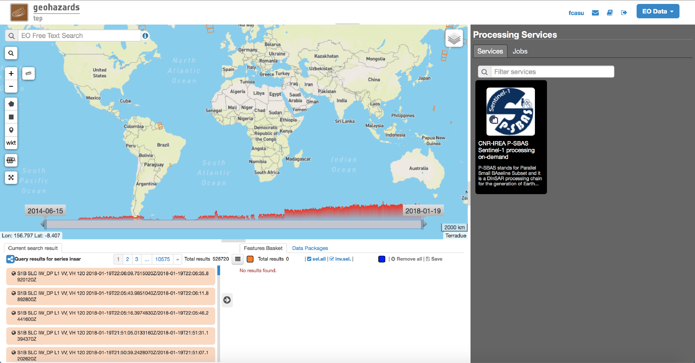

1.2 Select the files to process
-------------------------------

Input SAR data selection must be carried out with particular care, since a wrong data selection can result to an unfeasible processing.

* The algorithm accepts as inputs **IW Sentinel-1**  **SLC (level 1) data**. RAW data cannot be processed.
* It is very important that the user selects **images related to the same track only** which must be aquired with the same mode (the IW one).
* The system automatically discards duplicated (reprocessed) images and correctly mosaicks SAR data belonging to different “portions” (slices) of the same strip. In case of reprocessed (duplicated) images the newest one is selected.
* **Note that to obtain reliable displacement measurements and to avoid processing failures, it is strongly suggested to select a number of epochs greater then 20 in the case of time series generation mode**.

For this tutorial, a `pre-defined data set`_ has been prepared to speed up the data selection step .

.. _`pre-defined data set`: https://geohazards-tep-ref.terradue.com/t2api/share?url=https%3A%2F%2Fgeohazards-tep-ref.terradue.com%2Ft2api%2Fdata%2Fpackage%2Fsearch%3Fid%3DNapoliS1T222017&id=insarquake

* Browse the Data Packages looking for *Napoli S1 T22 2017* package and click on the load button to upload it.

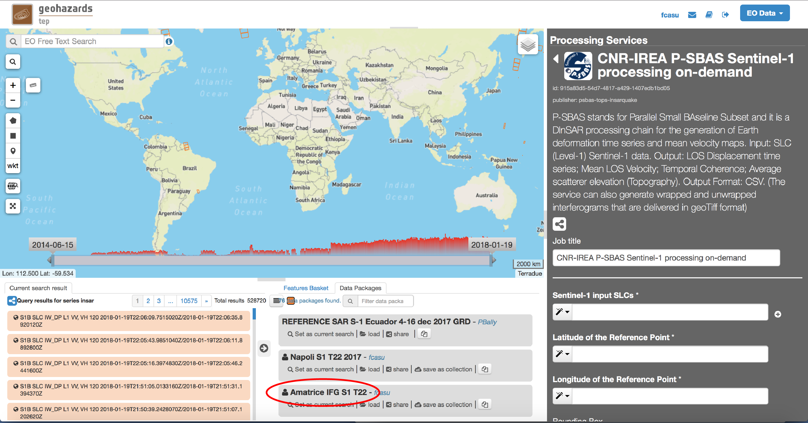

* Surf the map to the Napoli (Italy) Area of Interest: the browser page should appear as depicted in the next figure.

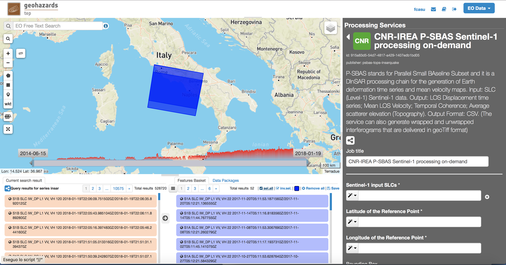

        
* Set the *Job Title* with a meaningful name (e.g. *CNR-IREA P-SBAS S1 Napoli T22 2017 - v1.0.9*) and push the *sel. all* button in the Feature Basket. 
      
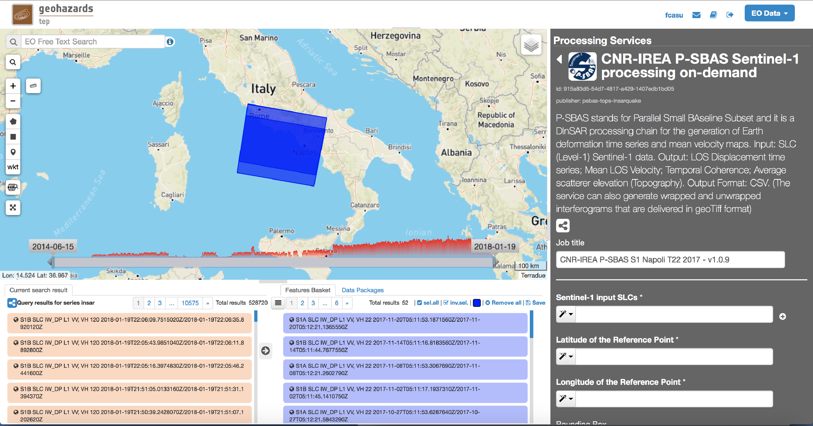

                
* Drag all the selected data and drop them within the *Sentinel-1 input SLCs* field on the right panel.                
                
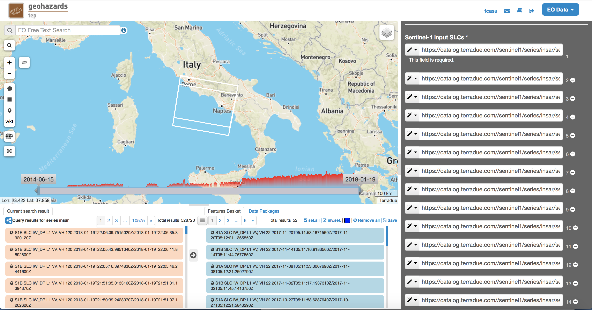

        
1.3 Fill the parameter values
-----------------------------

* Fill the parameters according to the following figure:

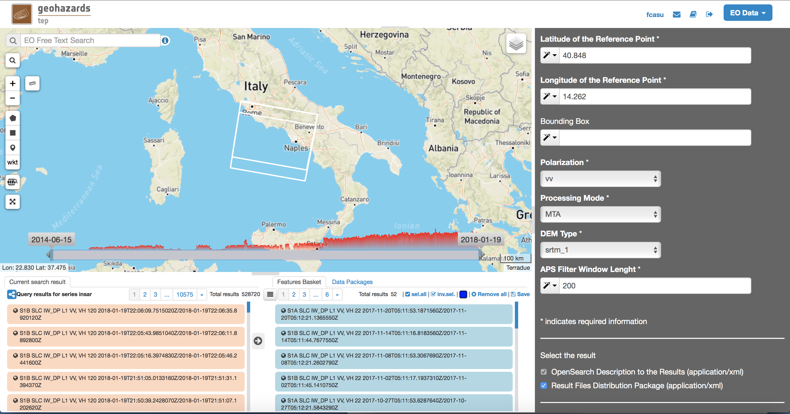

In particular:

* As *Latitude of the Reference Point*, type:

.. code-block:: sbas-parameter
  
  40.848

* As *Longitude of the Reference Point*, type:

.. code-block:: sbas-parameter
  
  14.262
 
.. note:: *Latitude of the Reference Point* and *Longitude of the Reference Point* are the Latitude and Longitude coordinates (in decimal degrees) of the **reference point** for the P-SBAS DInSAR measurement. It should be located in a stable area or its deformation behaviour shall be known. In any case, the user shall verify that input Latitude and Longitude coordinates are on **land** and included **within the selected Area of Interest** (if any). As a suggestion, urbanized areas are usually well suitable to locate the reference point. The *Magic Wand* button can be used to automatically fill these fields with the coordinate values of a Marker placed on the map.

* Leave the *Bounding Box* untouched (Area of Interest empty). 

.. note:: If set, the system automatically processes the identified AoI. Format: LL-Lon, LL-Lat, UR-Lon, UR-Lat. The *Magic Wand* button can be used to automatically fill this field with the bounding coordinate values of a rectangle drawn on the map. Different slices covering the AoI are automatically merged. It is recommended to avoid processing very small areas to allow the system to correctly estimate the co-registration shifts needed by the TOPS mode. The suggested smallest area spans at least 4 S1 bursts, which approximately corresponds to about 80 km along azimuth.

 
* As *Polarization* type:

.. code-block:: sbas-parameter

  vv

.. note:: Possible values are: *vv*, *vh*, *hv*, *hh*. The user shall select the correct polarization according to the selected SLC input data. Default value is *vv*, being the default S1 polarization for data acquired over land.

* As *Processing Mode*, select:

.. code-block:: sbas-parameter
  
	MTA
        
.. note:: Possible values: *MTA* (Multi-Temporal Analysis); *IFG* (Interferogram Generation). Default value is *MTA*. For *IFG* description see Section 2_.

.. _2: `2 Interferogram Generation (IFG) Mode`_

* As *DEM*, select:

.. code-block:: sbas-parameter
  
	srtm_1
       
.. note:: Possible values are: *srtm_1* (1 arcsec SRTM DEM), *srtm_3* (3 arcsec SRTM DEM). User is kindly advised to check the `EarthExplorer`_ web site for actual data coverage.

.. _`EarthExplorer`: https://earthexplorer.usgs.gov

* As *APS Filter Window Length*, insert:

.. code-block:: sbas-parameter
  
	200
       
.. note:: This is the temporal window width (in days) for the APS filter on the resulting time series.

1.4 Run the job
---------------

* Click on the button "Run Job" at the bottom of the P-SBAS DInSAR processor tab, and monitor the progress of the running Job:

* After about 48 hours of processing time, the job status should be "Success".

1.5 Results: download and visualization
---------------------------------------

**Download**

The P-SBAS DInSAR results are available in the Geobrowser after the processing. Scroll down the right panel and push the "Show results" button. Tutorial results are accessible `here`_.

.. _`here`: https://geohazards-tep-ref.terradue.com/t2api/share?url=https%3A%2F%2Fgeohazards-tep-ref.terradue.com%2Ft2api%2Fjob%2Fwps%2Fsearch%3Fid%3D7cc6d9bb-5ad6-48f8-bb7c-e798a9f871be%26key%3Dd6e534cb-7196-4074-b07c-390a7c6f5b30&id=insarquake

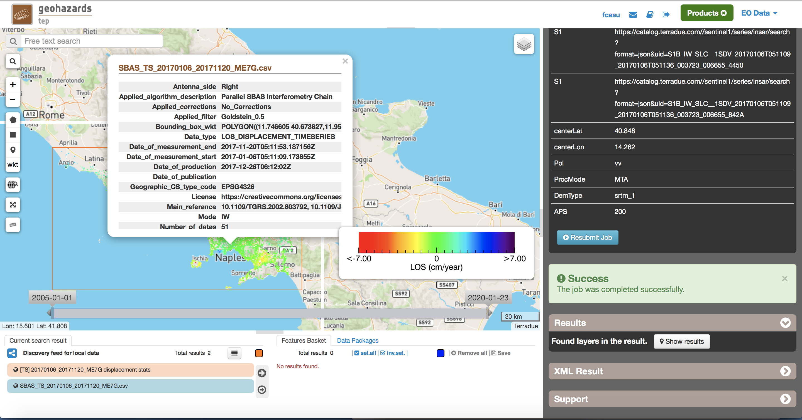

To download the P-SBAS DInSAR processing results once the Job is completed just click on the *Download* button in the pop-up window of the identified product:

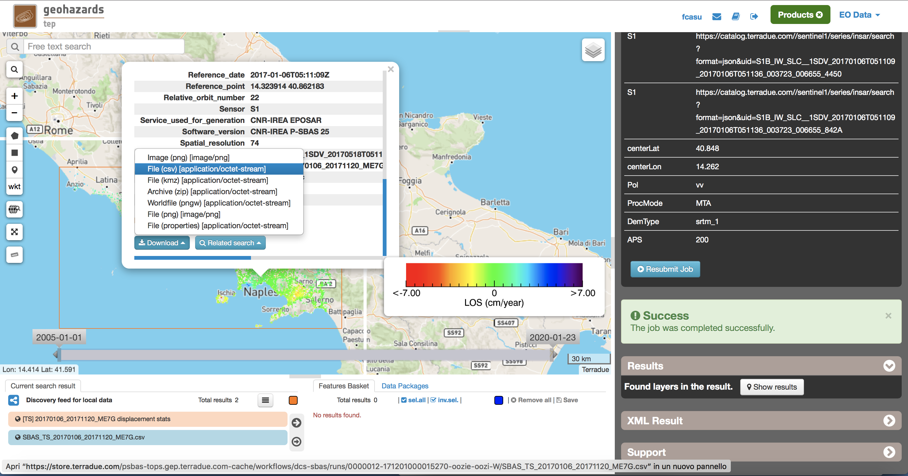

.. note:: Single files can be downloaded separately. To download the full result archive, please select the zip file.

**Visualization**

Time series can be directly visualized via the Geobrowser. After setting a satisfactory zoom, put a Placemark on the pixel for which the time series shold be displayed. Then click the "plot" icon in the TS collection.

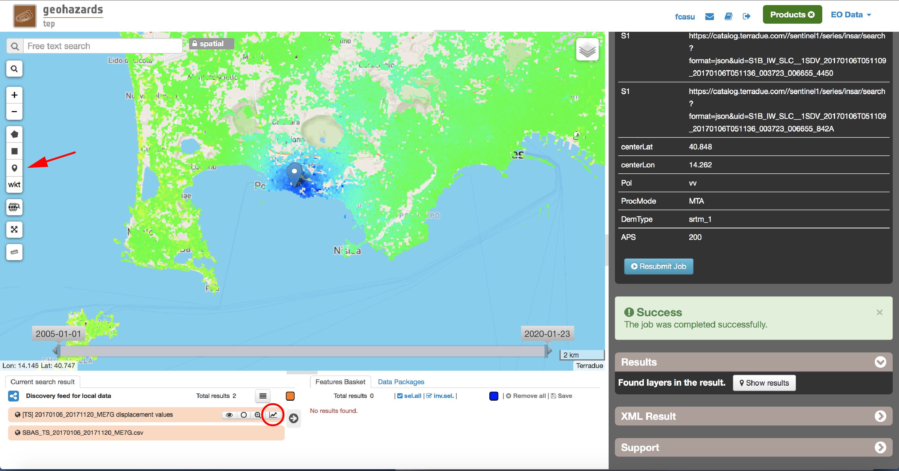

A pop-up window should appear showing the Time series of the selected pixel.

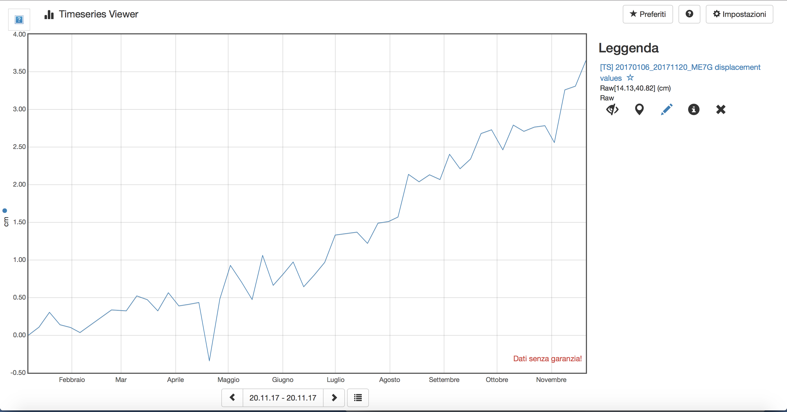

        
**Conventions and assumptions**
	
Results are provided in the satellite Line Of Sight (LOS). Positive values indicate that the target moves toward the satellite.
Processing results are provided according to the `EPOS-IP project`_ specifications along with the corresponding metadata.

.. _`EPOS-IP project`: http://epos-ip.org

**Published Results**

The main outputs of the MTA mode are the:

+ Displacement Time series in LOS;
+ Mean LOS velocity;
+ Temporal coherence;
+ Pixel location (coordinates);
+ LOS unit vectors.

Information is organized in a **CSV ASCII** table according to the following figure. 

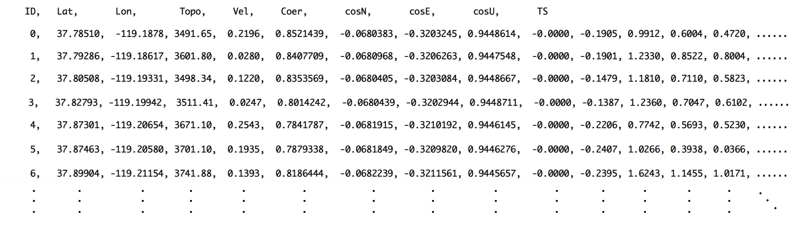

	
Provided information consists, per each pixel considered reliable, in:

+ Unique pixel identifier (``ID``);
+ WGS84 Latitude in degree (``Lat``);
+ WGS84 Longitude in degree (``Lon``);
+ Topography above the ellipsoid (``Topo``);
+ Mean Velocity in cm/year, as linear regression of the displacement Time series (``Vel``);
+ Temporal coherence (``Coer``);
+ Components of LOS unit vector along the North, East and Vertical directions (``cosN``, ``cosE``, ``cosU``);
+ LOS displacement time-series in cm (``TS``): the length of this field depends on the number of acquisitions used in the time series generation.

File name convention is as follows::

  SBAS_TS_<FirstAcqDate>_<LastAcqDate>_<UniqueCode>.csv

where:

+ ``<FirstAcqDate>``: is the first acquisition of the time series;
+ ``<LastAcqDate>`` : is the last acquisition of the time series.
+ ``<UniqueCode>``  : is a unique code identifier.

A typical name sample is: ``SBAS_TS_20170106_20171120_ME7G.csv``

Additional provided outputs are:
		
+ A .kmz file containing the Quick-look of the retrieved mean LOS velocity importable in Google Earth;
+ A .png file (together with its .pngw file) containing the raster bitmap image of the mean LOS velocity;
+ A .properties file containing the Metadata associated to the main results and displayed in the Geobrowser pop-up window;
+ A .png file representing the mean LOS velocity legend, i.e. the color code associated to the LOS Mean Velocity values;
+ A .zip archive that contains all the mentioned result files.

1.6 Metadata
------------

Metadata are provided according to the EPOS specifications.

============================= ======================================================================== =================================================================================
Tag                           Example                                                                  Notes
============================= ======================================================================== =================================================================================
Data_Type                     LOS_DISPLACEMENT_TIMESERIES                                              Type of data (according to the EPOS categories)
----------------------------- ------------------------------------------------------------------------ ---------------------------------------------------------------------------------
Title                         SBAS_TS_20170106_20171120_ME7G.csv                                       Title of the pop-up window (it corresponds to the file name)
----------------------------- ------------------------------------------------------------------------ ---------------------------------------------------------------------------------
Product_format                ASCII                                                                    Format of the product (geoTiff or CSV)
----------------------------- ------------------------------------------------------------------------ ---------------------------------------------------------------------------------
Product_size                  23249970                                                                 In byte
----------------------------- ------------------------------------------------------------------------ ---------------------------------------------------------------------------------
Product_url                                                                                            The url to locate the file
----------------------------- ------------------------------------------------------------------------ ---------------------------------------------------------------------------------
Bounding_box                                                                                           The polygon relevant to the processed area
----------------------------- ------------------------------------------------------------------------ ---------------------------------------------------------------------------------
License                       https://creativecommons.org/licenses/by/4.0                              Applicable license for the product
----------------------------- ------------------------------------------------------------------------ ---------------------------------------------------------------------------------
User_ID                       mapred                                                                   User that generated the product
----------------------------- ------------------------------------------------------------------------ ---------------------------------------------------------------------------------
Software_version              CNR-IREA P-SBAS 25
----------------------------- ------------------------------------------------------------------------ ---------------------------------------------------------------------------------
Applied_algorithm_description Parallel SBAS Interferometry Chain                                       Short description of the algorithm used to generate the product
----------------------------- ------------------------------------------------------------------------ ---------------------------------------------------------------------------------
Main_reference                10.1109/TGRS.2002.803792                                                 DOIs of the main publications describing the used algorithms
                              10.1109/JSTARS.2014.232267
----------------------------- ------------------------------------------------------------------------ ---------------------------------------------------------------------------------
Date_of_measurement_start     2017-11-07T02:53:48.378740Z
----------------------------- ------------------------------------------------------------------------ ---------------------------------------------------------------------------------
Date_of_measurement_end       2017-11-19T02:53:48.215234Z
----------------------------- ------------------------------------------------------------------------ ---------------------------------------------------------------------------------
Date_of_production            2017-12-01T23:51:09Z
----------------------------- ------------------------------------------------------------------------ ---------------------------------------------------------------------------------
Date_of_publication           2017-12-01T23:51:09Z
----------------------------- ------------------------------------------------------------------------ ---------------------------------------------------------------------------------
Service_used_for_generation   CNR-IREA EPOSAR                                                                
----------------------------- ------------------------------------------------------------------------ ---------------------------------------------------------------------------------
Geographic_CS_type_code       EPSG4326
----------------------------- ------------------------------------------------------------------------ ---------------------------------------------------------------------------------
Used_DEM                      SRTM_3arcsec                                                             DEM used within the interferometri processing
----------------------------- ------------------------------------------------------------------------ ---------------------------------------------------------------------------------
Super_master_SAR_image_ID     S1A_IW_SLC__1SDV_20171107T025348_20171107T025415_019153_02069A_D2C6.SAFE Reference SAR geometry
----------------------------- ------------------------------------------------------------------------ ---------------------------------------------------------------------------------
Master_SAR_image_ID           S1A_IW_SLC__1SDV_20171107T025348_20171107T025415_019153_02069A_D2C6.SAFE Master Image (only for IFG products)
----------------------------- ------------------------------------------------------------------------ ---------------------------------------------------------------------------------
Slave_SAR_image_ID            S1A_IW_SLC__1SDV_20171119T025348_20171119T025415_019328_020C14_14AF.SAFE Slave Image (only for IFG products)
----------------------------- ------------------------------------------------------------------------ ---------------------------------------------------------------------------------
Perpendicular_baseline        -14.7667                                                                 In meters (only for IFG products)
----------------------------- ------------------------------------------------------------------------ ---------------------------------------------------------------------------------
Parallel_baseline             -4.35838                                                                 In meters (only for IFG products)
----------------------------- ------------------------------------------------------------------------ ---------------------------------------------------------------------------------
Along_track_baseline          -0.389812                                                                In meters (only for IFG products)
----------------------------- ------------------------------------------------------------------------ ---------------------------------------------------------------------------------
Spatial_resolution            73                                                                       Ground resolution, in meters
----------------------------- ------------------------------------------------------------------------ ---------------------------------------------------------------------------------
Sensor                        S1                                                                       Used sensor
----------------------------- ------------------------------------------------------------------------ ---------------------------------------------------------------------------------
Mode                          IW                                                                       Acquisition mode
----------------------------- ------------------------------------------------------------------------ ---------------------------------------------------------------------------------
Antenna_side                  Right                                                                    Right/Left
----------------------------- ------------------------------------------------------------------------ ---------------------------------------------------------------------------------
Relative_orbit_number         6                                                                        Satellite Track
----------------------------- ------------------------------------------------------------------------ ---------------------------------------------------------------------------------
Wavelength                    0.055465760                                                              In meters
----------------------------- ------------------------------------------------------------------------ ---------------------------------------------------------------------------------
Number_of_looks_azimuth       5                                                                        Applied multilook along azimuth
----------------------------- ------------------------------------------------------------------------ ---------------------------------------------------------------------------------
Number_of_looks_range         20                                                                       Applied multilook along range
----------------------------- ------------------------------------------------------------------------ ---------------------------------------------------------------------------------
Number_of_dates               51                                                                       Number of used acquisitions (only for MTA products)
----------------------------- ------------------------------------------------------------------------ ---------------------------------------------------------------------------------
Reference_date                2017-01-06T05:11:09Z                                                     Acquisition used as temporal reference in the time series (only for MTA products)
----------------------------- ------------------------------------------------------------------------ ---------------------------------------------------------------------------------
Reference_point               14.323914 40.862183                                                      Lon Lat format. For MTA and InU products
----------------------------- ------------------------------------------------------------------------ ---------------------------------------------------------------------------------
Applied_corrections           No_Corrections                                                           Description of possible correction applied to the interferograms or time series
----------------------------- ------------------------------------------------------------------------ ---------------------------------------------------------------------------------
Applied_filter                Goldstein_0.5                                                            Possible spatial filter applied to the interferogram
============================= ======================================================================== =================================================================================

      
2 Interferogram Generation (IFG) Mode
===================================== 

2.1 Select the processing
-------------------------

* Follow the steps described in Section 1.1_.

.. _1.1: `1.1 Select the processing`_

2.2 Select the files to process
-------------------------------

Input SAR data selection must be carried out with particular care, since a wrong data selection can result to an unfeasible processing.

* The algorithm accepts as inputs **IW Sentinel-1**  **SLC (level 1) data**. RAW data cannot be processed.
* It is very important that the user selects **images related to the same track only** which must be aquired with the same mode (the IW one).
* The system automatically discards duplicated (reprocessed) images and correctly mosaicks SAR data belonging to different “portions” (slices) of the same strip. In case of reprocessed (duplicated) images the newest one is selected.
* **Note that to obtain reliable displacement measurements and to avoid processing failures, it is strongly suggested to select a number of epochs greater then 20 in the case of time series generation mode**.

For this tutorial, a pre-defined `data set`_ has been prepared to speed up the data selection step.

.. _`data set`: https://geohazards-tep-ref.terradue.com/t2api/share?url=https%3A%2F%2Fgeohazards-tep-ref.terradue.com%2Ft2api%2Fdata%2Fpackage%2Fsearch%3Fid%3DAmatriceIFGS1T22&id=insarquake

* Browse the Data Packages looking for *Amatrice IFG S1 T22* package and click on the load button to upload it.

* Surf the map to the Central Italy Area of Interest: the browser page should appear as depicted in the next figure.

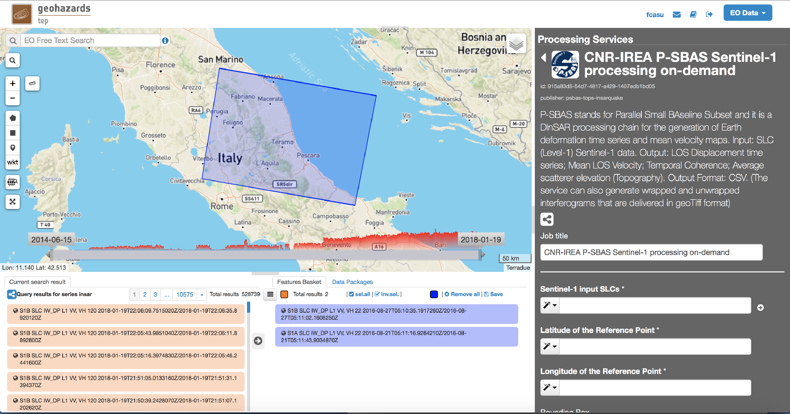

        
* Set the *Job Title* with a meaningful name (e.g. *CNR-IREA P-SBAS S1 on-demand Amatrice T22*) and push the *sel. all* button in the Feature Basket. 
                     
* Drag all the selected data and drop them within the *Sentinel-1 input SLCs* field on the right panel.                
                
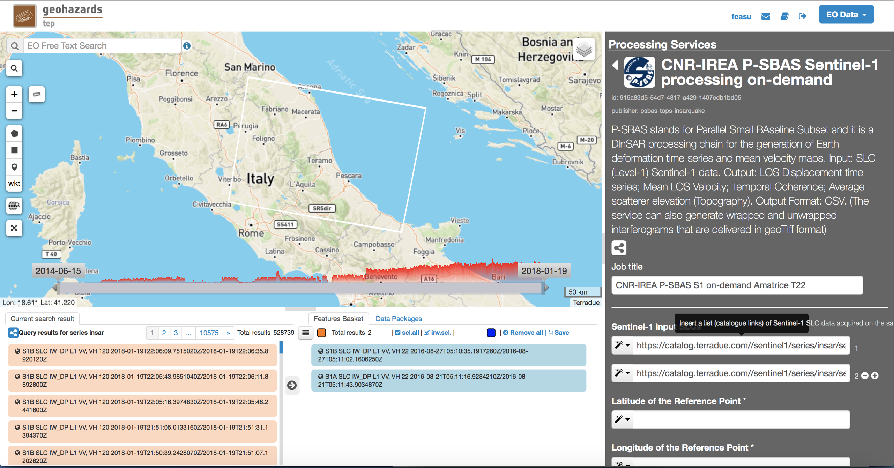
                
                
2.3 Fill the parameter values
-----------------------------

* Fill the parameters according to the following figure:

.. figure:: assets/tuto_psbas_ondem_ifg4.png
	:figclass: align-center
        :width: 750px
        :align: center

In particular:

* As *Latitude of the Reference Point*, type:

.. code-block:: sbas-parameter
  
  43.277

* As *Longitude of the Reference Point*, type:

.. code-block:: sbas-parameter
  
  13.733
 
.. note:: *Latitude of the Reference Point* and *Longitude of the Reference Point* are the Latitude and Longitude coordinates (in decimal degrees) of the **reference point** for the P-SBAS DInSAR measurement. Considerations as in Section 1.3_ are valid.

* Leave the *Bounding Box* untouched (Area of Interest empty). 

.. note:: Considerations as in Section 1.3_ are valid.

.. _1.3: `1.3 Fill the parameter values`_
 
* As *Polarization* type:

.. code-block:: sbas-parameter

  vv

.. note:: Possible values are: *vv*, *vh*, *hv*, *hh*. The user shall select the correct polarization according to the selected SLC input data. Default value is *vv*, being the default S1 polarization for data acquired over land.

* As *Processing Mode*, select:

.. code-block:: sbas-parameter
  
	IFG
       
.. note:: Possible values: *MTA* (Multi-Temporal Analysis); *IFG* (Interferogram Generation). Default value is *MTA*. For *MTA* description see Section 1_.

.. _1: `1 Multi Temporal Analysis (MTA) Mode`_

* As *DEM*, select:

.. code-block:: sbas-parameter
  
	srtm_1

.. note:: Possible values are: *srtm_1* (1 arcsec SRTM DEM), *srtm_3* (3 arcsec SRTM DEM). User is kindly advised to check the `EarthExplorer`_ web site for actual data coverage.

* Leave the *APS Filter Window Length* unchanged.
      
.. note:: This is the temporal window width (in days) for the APS filter on the resulting time series. **This parameter is not considered in the IFG mode**.

2.4 Run the job
---------------

* Click on the button "Run Job" at the bottom of the P-SBAS DInSAR processor tab, and monitor the progress of the running Job:

* After about 4 hours of processing time, the job status should be as "Success".

2.5 Results: download and visualization
---------------------------------------

The P-SBAS DInSAR results are available in the Geobrowser after the processing. Scroll down the right panel and push the "Show results" button. Tutorial results are `accessible`_ here.

.. _`accessible`: https://geohazards-tep-ref.terradue.com/t2api/share?url=https%3A%2F%2Fgeohazards-tep-ref.terradue.com%2Ft2api%2Fjob%2Fwps%2Fsearch%3Fid%3Dd08910f0-4b99-489b-b3be-d50bc5b165f3%26key%3D991d594a-a6a7-496e-b71f-8052f287fae6&id=insarquake

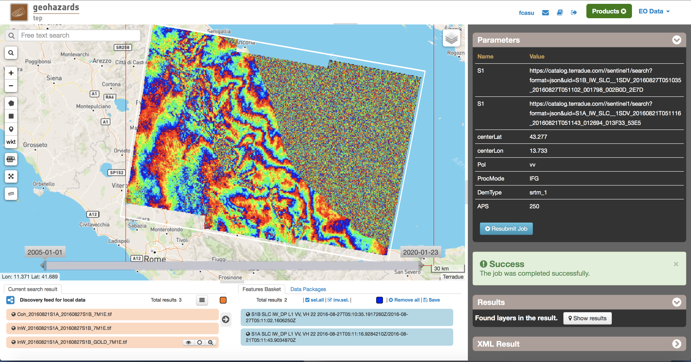

To download the P-SBAS DInSAR processing results once the Job is completed just click on the *Download* button in the pop-ip window of the identified product:

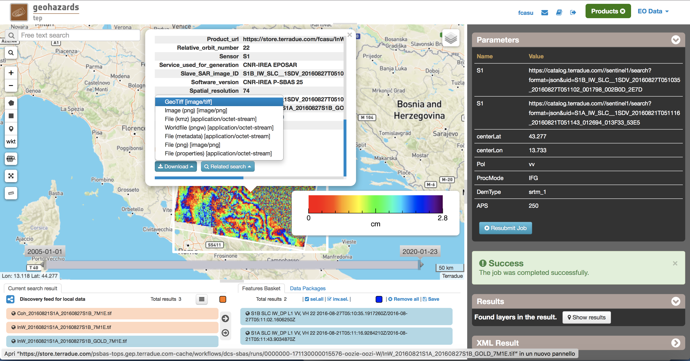

        
**Conventions and assumptions**
	
Results are provided in the satellite Line Of Sight (LOS). Positive values indicate that the target moves toward the satellite.
Processing results are provided according to the `EPOS-IP project`_ specifications along with the corresponding metadata.

**Published Results**

The IFG mode outputs are provided in **geoTiff** standard and consist in:

* geocoded interferograms (filtered and not filtered according to the Goldstein method);
* geocoded spatial coherence maps.

The spacing of the output depends on the DEM used for the processing. Results are provided in **WGS84** geographic projection.

File name convention is as follows::

  <DataType>_<MasterDate>_<SlaveDate>_<UniqueCode>.<FileExtension>

where:

* ``<DataType>`` can be: ``InW`` (Wrapped Interferogram), ``InU`` (Unwrapped Interferogram) (this feature will be available in a later release of the service), ``Coh`` (Spatial Coherence);
* ``<MasterDate>`` date of the Master acquisition in the format ``<yyyymmdd><SensorCode>``, where ``<SensorCode>`` is a 3-char code that identifies the sensor. For the Sentinel case the possible codes are: S1A and S1B.
* ``<SlaveDate>`` date of the Slave acquisition in the same ``<MasterDate>`` format;
* ``<UniqueCode>`` a unique code identifier;
* ``<FileExtension>`` possible values are:

  - ``tif``: the actual data in geoTiff;
  - ``properties``: the metadata displayed in the Geobrowser;
  - ``metadata``: the full metadata list according to the EPOS specifications;
  - ``png``: a quick-look raster image;
  - ``pngw``: the geocoding information for the png image;
  - ``kmz``: the google format overlay containing the quick-look image;
  - ``legend.png``: the color bar for the png image.

Typical name samples are::

  InW_20160821S1A_20160827S1B_7M1E.tif
  Coh_20160821S1A_20160827S1B_7M1E.tif

2.6 Metadata
------------

Metadata are provided according to the EPOS specifications.
See Table in Section 1.6_ for more details.

.. _1.6: `1.6 Metadata`_
  
  
3 Feedbacks
===========

Users are  kindly invited to report any issue and problem encountered during the use of the P-SBAS service:

* For GEP on-boarded users, by issuing a ticket from their project support space on https://support.terradue.com 
* For other signed-in GEP users, by sending an email to the SBAS support team **sbas-help@irea.cnr.it**

Moreover, suggestions and comments about the GEP service delivery are warmly welcomed on **geohazards-tep@esa.int** in order to keep the service delivery on GEP as much as possible appealing, effective and efficient.

4 Terms and Conditions
======================

**IPR**
The Intellectual Property Right (IPR) of the available software, tools and services developed are with CNR-IREA, if not differently specified.

**Use**
CNR-IREA services are available to all the GEP users according to a `CC-BY license`_ .
The access to CNR-IREA services is free of charge and users are not asked to pay any fee or subscription by CNR-IREA. There is the possibility that users participate to the cost of service maintenance and operation: these costs are defined case-by-case among CNR-IREA, the platform operator and ESA. No cost can be required to users for the CNR-IREA services without the approval of CNR-IREA.

**Results**
The results (including products, maps, time series, files and everything generated by the processors) of the services are available under the `CC-BY license`_ .

**Warranty and liability**
CNR-IREA software is a scientific software and it is provided at the best CNR-IREA knowledge according to the SAR interferometry state-of-the-art. No warranty is provided on the processors and services of CNR-IREA. CNR-IREA is not responsible for any software inaccuracies, bugs, errors and misuse.
Generated results have a defined accuracy according to the relevant scientific publications available in literature. Result accuracy is estimated on a statistical basis. Provided results are not validated by CNR-IREA and, indeed, it is user responsibility to validate them.
CNR-IREA is not responsible for the use, quality, accuracy and interpretation of results and products that are generated by using the processors and services provided within the platform. CNR-IREA is not responsible for the use, quality, accuracy and interpretation of third party results, products and services derived from the use of CNR-IREA’s processors and services. CNR-IREA is not responsible of possible outages of the provided services. CNR-IREA is not responsible of any kind of third party loss derived from service outage, result inaccuracies, software errors of the provided services and products.
The maintenance, update and user support are provided by CNR-IREA free of charge and at best effort. CNR-IREA is not responsible for any consequence derived from delays on replies to user requests or support inaccuracies 

