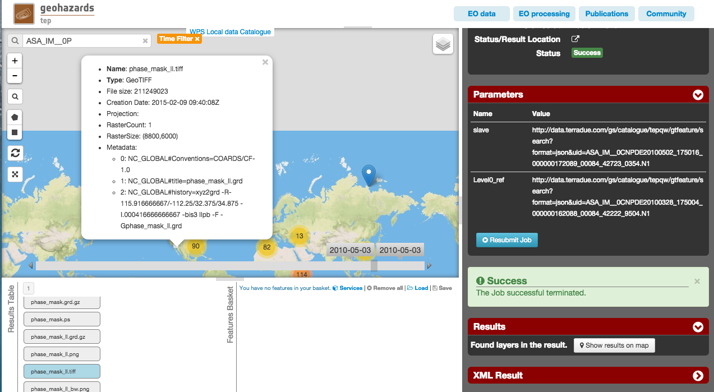

Interferogram generation with GMTSAR
~~~~~~~~~~~~~~~~~~~~~~~~~~~~~~~~~~~~

Select the processing
=====================

* Login to the platform (see :doc:`user <../community-guide/user>` section)

* Select the processing service “GMTSAR Interferometric Processor”:

.. figure:: assets/tuto_gmtsar_1.png
	:figclass: align-center
        :width: 750px
        :align: center

The "GMTSAR Interferometric Processor" panel is displayed with parameters values to be filled-in.

Fill the parameters
===================

Slave product reference
-----------------------

* Type **ASA_IM__0P** in the Search Terms field (1) and then click on the lens icon (2):

.. figure:: assets/tuto_gmtsar_2.png
	:figclass: align-center
        :width: 750px
        :align: center

* Click on Show Other Parameters, type in the **time:start** field the value **2010-05-02T17:50:16** and in the **time:end** field the value **2010-05-02T17:50:16**, then click on the button **Search**:

.. figure:: assets/tuto_gmtsar_3.png
	:figclass: align-center
        :width: 750px
        :align: center

* Drag and Drop the first result in the *Slave product reference* field:

.. figure:: assets/tuto_gmtsar_4.png
	:figclass: align-center
        :width: 750px
        :align: center

Master product reference
------------------------

* Perform the same procedure described previously (`Slave product reference`_), using the value **2010-03-28T17:50:04** in both the **time:start** field and the **time:end** field:

.. figure:: assets/tuto_gmtsar_5.png
	:figclass: align-center
        :width: 750px
        :align: center

* Drag and drop the first result in the *Master product reference* field:

.. figure:: assets/tuto_gmtsar_6.png
	:figclass: align-center
        :width: 750px
        :align: center

Run the job
===========

* Click on the button Run Job and see the Running Job

.. figure:: assets/tuto_gmtsar_7.png
	:figclass: align-center
        :width: 750px
        :align: center

* After about 25 minutes, see the Successful Job:

.. figure:: assets/tuto_gmtsar_8.png
	:figclass: align-center
        :width: 750px
        :align: center

* Click on the button *Show results on map*, then on the *phase_mask_ll.tiff* result on the *Results Table* in the bottom left side

* See the result on map: 

