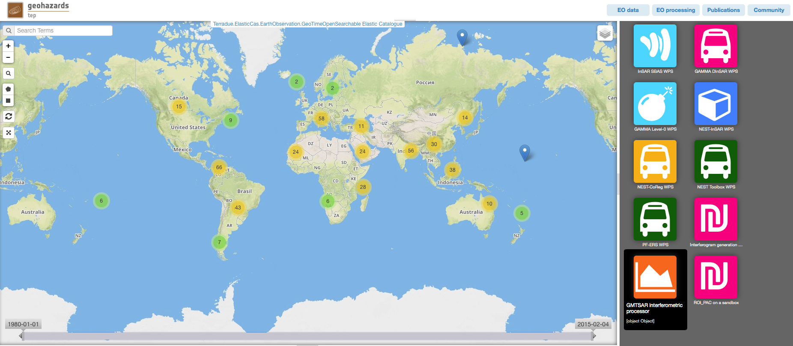
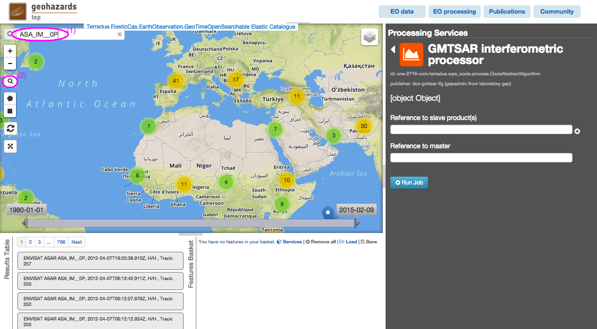
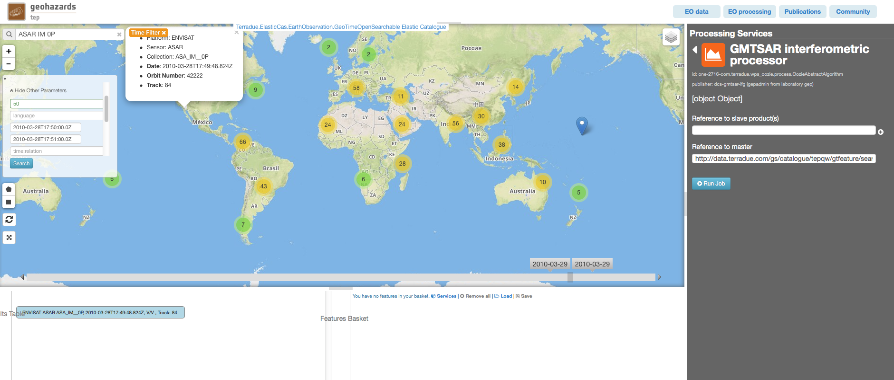
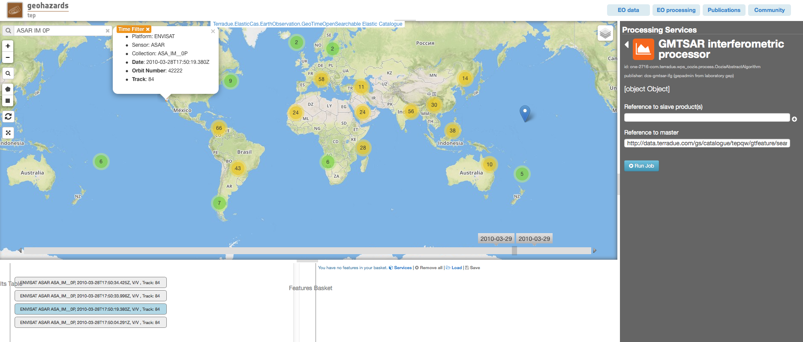
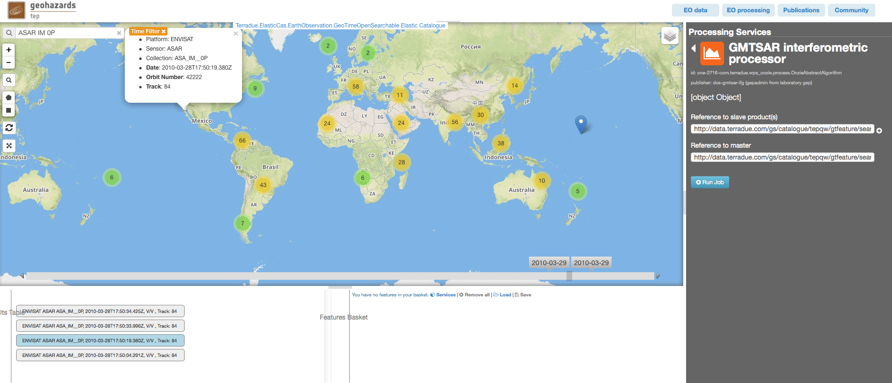
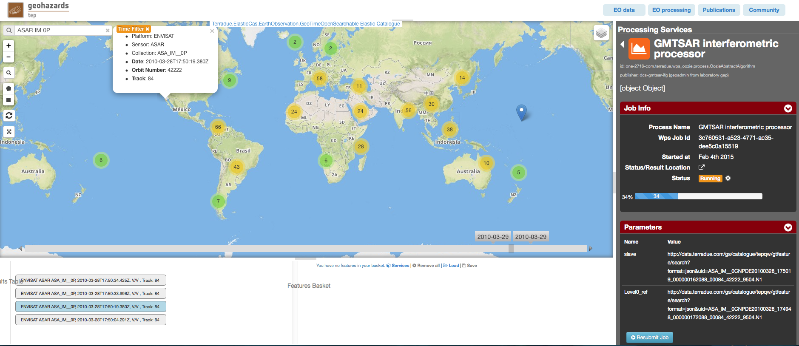
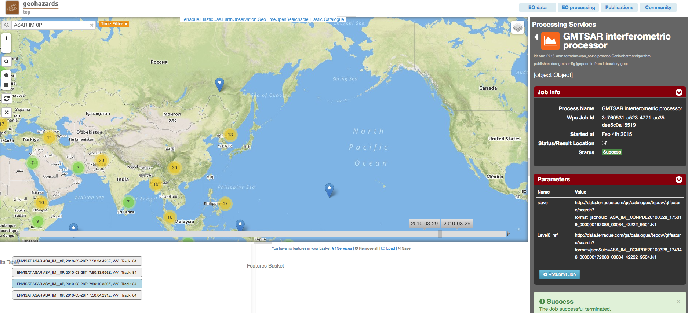
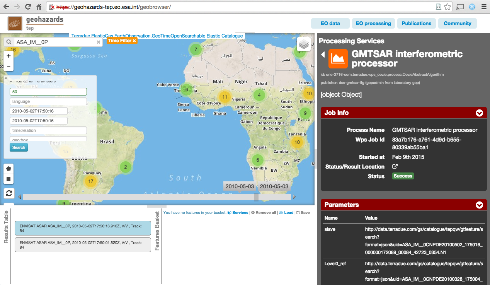

GMTSAR Interferometric Processor
~~~~~~~~~~~~~~~~~~~~~~~~~~~~~~~~

Select the processing
=====================

* Login to the platform (see :doc:`user <../community-guide/user>`)

* Select the “GMTSAR Interferometric Processor” processor:

Fill the parameters
===================

Slave product reference
-----------------------

* Type **ASAR IM 0P** in the Search Terms field (1) and then click on lens icon (2):

* Click on Show Other Parameters:

* Type in the **time:start** field the value **TBD** and in the **time:end** field the value **TBD**, then click on the button **Search**:

* Drag and Drop the result in the *Slave product reference* field:

Master product reference
------------------------

* Perform the same procedure described previously (`Slave product reference`_), using as values **2010-03-28T17:50:00.0Z** in the **time:start** field and in the **time:end** field:

* Drag and drop the result in the *Master product reference* field:

Run the job
===========

* Click on the button Run Job:

.. figure:: assets/tuto_gmtsar_10.png
	:figclass: align-center
        :width: 750px
        :align: center

* See the Running Job:

.. figure:: assets/tuto_gmtsar_11.png
	:figclass: align-center
        :width: 750px
        :align: center

* After about 25 minutes, see the Successful Job:

.. figure:: assets/tuto_gmtsar_12.png
	:figclass: align-center
        :width: 750px
        :align: center

* Click on the button *Show results on map*, then on the *20090311_20080326_cint.tiff* result on the *Results Table* in the bottom left side

* See the result on map: 

.. figure:: assets/tuto_gmtsar_13.png
	:figclass: align-center
        :width: 750px
        :align: center
